# Cardano Oracle Architecture

This document is the single architecture reference for the Cardano port of DIA's push-oracle contracts. It defines the contract set, UTxO model, datums, transaction shapes, deployment sequence, and open items pending DIA confirmation.

Reference inputs to this document:

- [Cardano Integration Requirement [PF]](../requirements/cardano-integration-requirement-pf.md)
- [Final Cardano Milestones](../milestones/final-cardano-milestones.md)

---

## 1. Contracts (scripts)

### 1.1 Scripts and compile-time parameters

| # | Script | Kind | Instances | Compile-time parameters |
|---|---|---|---|---|
| 1 | `config_state` | multivalidator (mint + spend) | 1 global | `bootstrap_ref_config: OutputReference`, `config_asset_name: AssetName` |
| 2 | `update_coordinator` | stake withdraw | 1 global | `config_policy_id: PolicyId`, `config_asset_name: AssetName` |
| 3 | `payment_hook` | multivalidator (mint + spend) | 1 global | `bootstrap_ref_hook: OutputReference`, `hook_asset_name: AssetName`, `config_policy_id`, `config_asset_name`, `coordinator_credential: Credential` |
| 4 | `receiver` | multivalidator (mint + spend) | 1 per client | `receiver_ref: OutputReference`, `receiver_asset_name: AssetName`, `config_policy_id`, `config_asset_name` |
| 5 | `pair_state` | multivalidator (mint + spend) | 1 per client | `config_policy_id`, `config_asset_name`, `receiver_hash: ScriptHash` |
| 6 | `reference_holder` | spend validator | 1 global | none |

Notes:

- The reusable global validators (`config_state` spend, `update_coordinator` withdraw, `payment_hook` spend) are published as reference scripts. One-shot minting policies are used only by their bootstrap transactions.
- `receiver` is recompiled every time DIA onboards a new client. A fresh `receiver_ref` per client yields a different script hash and therefore a different address. The client is not an admin of their Receiver: they only prepay ADA and consume prices off-chain, matching the EVM behaviour. Every privileged action on the Receiver is signed by DIA admin (the `config_admins`).
- `pair_state` is recompiled per client too, parametrized by that client's `receiver_hash`, so every client's pairs live in their own address, isolated from other clients' pairs.
- `update_coordinator` runs once per update transaction using the `withdraw 0` trigger. It centralizes the shared logic (DIA signature check, fee movement, continuity) so the per-UTxO validators do not duplicate those checks.
- `reference_holder` is used only as the address for reference-script UTxOs. It rejects spend attempts so these UTxOs are not spendable by the deploy wallet.

### 1.2 Compile-time dependency graph

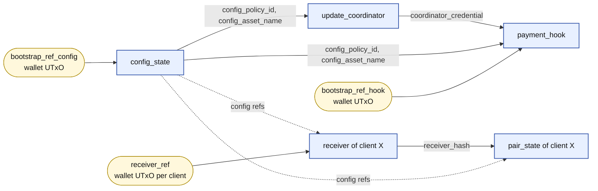

Solid arrows are compile-time inputs that change the script hash. Dashed arrows mark parameters that only pin the script to a given Config instance but follow directly from the global compilation.

### 1.3 Setup sequence

**Global setup, done once by DIA.**

1. Initialize the protocol artifact: record the deploy wallet, the `reference_holder` address, and empty protocol deployment slots.
2. Parameterize Config scripts: select an existing wallet UTxO as `bootstrap_ref_config`, compile `config_state`, compile `update_coordinator`, and record `config_policy_id` plus `coordinator_credential`.
3. Submit Config bootstrap: consume `bootstrap_ref_config`, mint the Config NFT, and create the Config UTxO with its initial datum.
4. Publish Config reference scripts: create ReferenceHolder UTxOs for `config_state` spend and `update_coordinator` withdraw.
5. Parameterize PaymentHook scripts: select an existing wallet UTxO as `bootstrap_ref_hook`, compile `payment_hook`, and record the Hook policy, validator hash, and address.
6. Submit PaymentHook bootstrap: consume `bootstrap_ref_hook`, mint the Hook NFT, update the Config datum to point at the Hook and the coordinator, and carry a stake-registration certificate for `coordinator_credential`.
7. Publish PaymentHook reference script: create the ReferenceHolder UTxO for `payment_hook` spend.

**Per-client onboarding, done once per client by DIA.**

1. Initialize the client artifact from the live protocol artifact.
2. Parameterize client Receiver scripts: select an existing wallet UTxO as `receiver_ref`, compile `receiver`, compile `pair_state`, and record the client's Receiver and Pair script metadata.
3. Submit Receiver bootstrap: consume `receiver_ref`, mint the Receiver NFT, and create the Receiver UTxO with `balance_lovelace = 0`.
4. Publish client reference scripts: create ReferenceHolder UTxOs for this client's `receiver` spend and `pair_state` spend scripts.
5. Top up the Receiver before live updates. The first update for each subscribed pair mints the Pair NFT and creates the Pair UTxO from the signed intent's real datum.

### 1.4 Reference-script deployment (global)

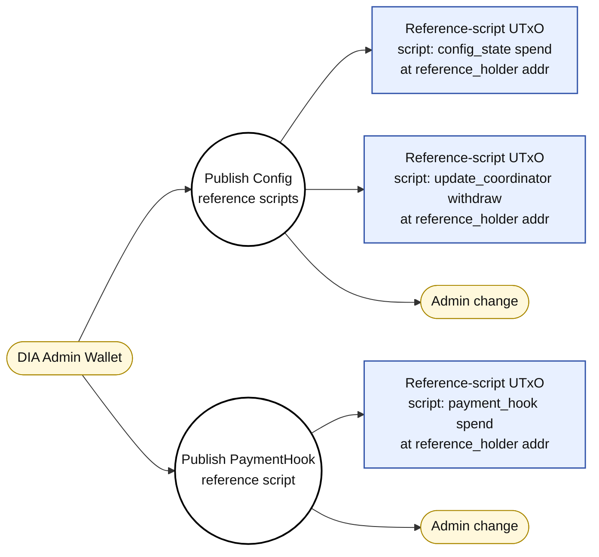

- **Frequency:** once per chain. Config and Coordinator reference scripts are published after Config bootstrap. PaymentHook reference script is published after PaymentHook bootstrap.
- **Inputs:** admin wallet UTxOs funding the min-UTxO of each reference-script output.
- **Outputs:** three reference-script UTxOs, each carrying the reusable compiled script binary in its `reference_script` field. No datum, no mint, no redeemer.
- **Address:** the `reference_holder` script address.
- **Minting policies:** Config and PaymentHook minting policies are one-shot bootstrap scripts and are not published as reference scripts.

### 1.5 Reference-script deployment (per client, per-client step 4 above)

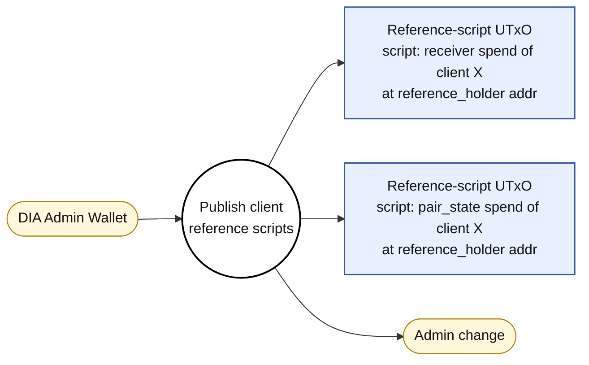

- **Frequency:** once per onboarded client, after Receiver bootstrap for that client.
- **Inputs:** admin wallet UTxOs.
- **Outputs:** two reference-script UTxOs carrying the client-specific `receiver` and `pair_state` binaries.
- **Isolation:** the binaries embed `receiver_ref` and `receiver_hash` respectively, so each client has its own pair of reference-script UTxOs with distinct hashes; they cannot be reused across clients.
- **Minting policies:** Receiver minting is one-shot/bootstrap. Pair minting is client-scoped and used by update transactions when a pair does not exist yet; the Pair spend validator is published as a reference script.

---

## 2. Identity tokens (state tokens)

All are NFTs (quantity 1, fixed asset name).

| Token | Minting policy | Minted on | Purpose |
|---|---|---|---|
| Config NFT | `config` | Config bootstrap | Marks the canonical Config UTxO |
| PaymentHook NFT | `payment_hook` | Hook bootstrap | Marks the canonical Hook UTxO |
| Receiver NFT | `receiver` | Receiver bootstrap (per client) | Marks the canonical Receiver UTxO for that client |
| Pair NFT | `pair_state` | First oracle update for that pair | Marks the canonical Pair UTxO for that client and pair |

Per DIA's request, these NFTs are not a "client identity" mechanism. They are state tokens required by the eUTxO model to identify the live UTxO of each state. Client identity remains the script hash of the client's Receiver (same principle as the EVM contract address being the client identifier).

---

## 3. UTxOs per script address

With `C` onboarded clients, client `i` subscribed to `N_i` pairs, the on-chain footprint is:

| Script address | State UTxOs at steady state | Reference-script UTxOs |
|---|---|---|
| `config_state` spend | 1 (Config UTxO) | 1 |
| `payment_hook` spend | 1 (PaymentHook UTxO) | 1 |
| `update_coordinator` | 0 (withdraw validator, no state UTxO) | 1 |
| `receiver` spend of client `i` | 1 (Receiver UTxO of client `i`) | 1 per client |
| `pair_state` spend of client `i` | `N_i` (one per subscribed pair) | 1 per client |

Totals:

- **ReferenceHolder UTxOs:** `3` global + `2` per client.
- **Global state UTxOs:** `1` Config + `1` Hook = `2`.
- **Per-client state UTxOs:** `1` Receiver + `N_i` Pairs for client `i`.
- **Total live state UTxOs on the chain:** `2 + sum_i (1 + N_i)`.
- **Reference-script UTxOs:** `3` global + `2` per client. These are one-off immutable UTxOs, not "live state"; they only exist so consumers can cite the script hash instead of embedding the binary in every tx.

Reference-script UTxOs are created at the `reference_holder` script address. The `reference_holder` validator rejects spend attempts, so these UTxOs are not spendable by the deploy wallet.

---

## 4. Datums

### 4.1 Config datum

```
{
  config_admins:              [PubKeyHash],          -- Cardano keys allowed to sign config changes and privileged Receiver actions
  authorized_dia_public_keys: [ByteArray(33)],       -- DIA secp256k1 compressed pubkeys that sign Intents
  domain: {
    name:               ByteArray,
    version:            ByteArray,
    source_chain_id:    Int,
    verifying_contract: ByteArray,
  },
  protocol_fee_lovelace:       Int,                  -- fee debited from Receiver balance on each update (accrued locally)
  payment_hook_ref:            ScriptHash,           -- active hook
  coordinator_cred:            Credential,           -- active update_coordinator stake credential
  min_utxo_lovelace:           Int,
  max_bootstrap_drift_seconds: Int,                  -- intent freshness window for bootstrap pair validation
}
```

Config does not carry a global pair allow-list.

### 4.2 PaymentHook datum

```
{
  withdraw_address:          Address,   -- payout target for withdrawals
  accrued_fees_lovelace:     Int,       -- current accumulated balance
  lifetime_collected_lovelace: Int,     -- historical collected
  lifetime_withdrawn_lovelace: Int,     -- historical withdrawn
  min_utxo_lovelace:         Int,
}
```

Invariant: `utxo.lovelace == min_utxo_lovelace + accrued_fees_lovelace`.

### 4.3 Receiver datum (per client)

```
{
  balance_lovelace:          Int,   -- prepaid pool (debited by protocol fees on each update)
  accrued_to_hook_lovelace:  Int,   -- pending fees awaiting Settle to PaymentHook
  min_utxo_lovelace:         Int,
}
```

Invariant: `utxo.lovelace == min_utxo_lovelace + balance_lovelace + accrued_to_hook_lovelace`.

Fee model (decoupled settlement):

1. **AccrueFee** (during each price update): `balance -= fee`, `accrued_to_hook += fee`. The Receiver UTxO's total lovelace does not change — ADA shifts between accounting buckets.
2. **Settle** (async, admin-initiated): drains `accrued_to_hook_lovelace → 0` and moves the ADA to the PaymentHook UTxO in a separate transaction.
3. **Withdraw** cannot drain `accrued_to_hook_lovelace` — it can only withdraw from `balance_lovelace`.

This design eliminates contention on the global PaymentHook UTxO during high-frequency updates.

Signers, fees and admins live in Config. The client has no on-chain representation inside the Receiver: their identity is the script address, derived from the bootstrap `OutputReference`. The `client → address` mapping is kept off-chain.

### 4.4 Pair datum (per client, per pair)

```
{
  pair_id:            ByteArray,          -- e.g. "BTC/USD"
  price:              Int,
  timestamp:          Int,
  nonce:              Int,
  last_intent_hash:   ByteArray(32),      -- EIP-712 digest of the last applied Intent
  last_signer:        ByteArray(20),      -- Ethereum-style address from the last applied Intent
  min_utxo_lovelace:  Int,
}
```

Replay protection: `new.timestamp > old.timestamp && new.nonce > old.nonce`.

Binding to the client's Receiver is enforced by the `pair_state` script being parametrized by `receiver_hash`. `pair_id` is kept in the datum for cheap off-chain indexing, since the Pair NFT asset name is a one-way hash of `pair_id`.

---

## 5. Transactions

For each tx: inputs, reference inputs, mint, outputs, redeemers, required signers, what it validates.

**Diagram conventions.**

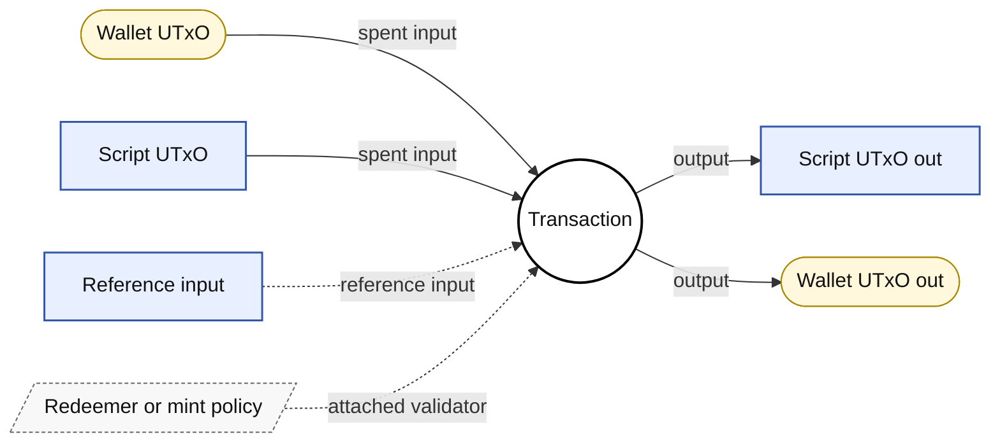

- Rounded nodes = wallet (PubKey) UTxOs.
- Sharp rectangles = script UTxOs (with datum).
- Parallelograms = redeemers / mint policies / withdraw scripts.
- Solid arrows = inputs being consumed or outputs being produced.
- Dashed arrows = reference inputs or attached validator / policy / withdrawal scripts.

### 5.1 Config bootstrap

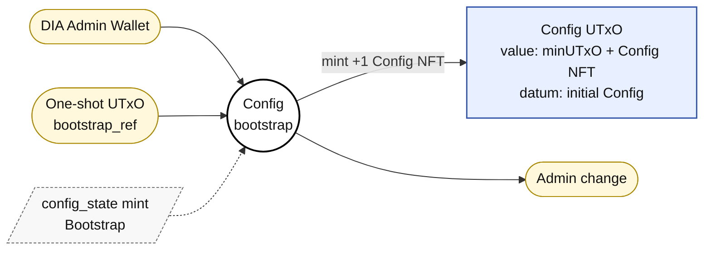

- **Frequency:** once per chain.
- **Inputs:**
  - DIA admin wallet (pays network fee + min UTxO).
  - The parameterized one-shot `bootstrap_ref` UTxO.
- **Reference inputs:** —
- **Mint:** `+1` Config NFT.
- **Outputs:**
  - Config UTxO at `Script(config_policy_id)`, value = `min_utxo_lovelace` + Config NFT, datum = initial `ConfigDatum`.
- **Signers:** the admin wallet that controls `bootstrap_ref` (no `extra_signatories` check at this step; admin authority comes from owning the one-shot input).

**Validators invoked**

1. **`config_state` mint** — redeemer `ConfigMintAction::Bootstrap`. Validates:
   - Mint redeemer is `Bootstrap`.
   - Tokens minted under this policy form exactly one `Pair(asset_name, qty)`; `asset_name == expected_asset_name`; `quantity == 1`.
   - Some input has `output_reference == bootstrap_ref` (one-shot).
   - Some output holds `(policy_id, expected_asset_name) qty 1` with inline `ConfigDatum` and payment credential `Script(policy_id)`.
   - `valid_config_state(config_datum)` ⇒ `config_admins` non-empty; `authorized_dia_public_keys` non-empty, unique, all entries non-empty; `valid_domain` (non-empty `name`/`version`, `source_chain_id ≥ 0`, `verifying_contract` is 20 bytes); `protocol_fee_lovelace ≥ 0`; `hook_and_coordinator_are_consistent` (both `None` or both `Some` with non-empty hook asset name); `max_bootstrap_drift_seconds ≥ 0`; `min_utxo_lovelace ≥ 0`.
   - Config output ADA equals `config_datum.min_utxo_lovelace`.

No other protocol script fires in this tx.

### 5.2 PaymentHook bootstrap

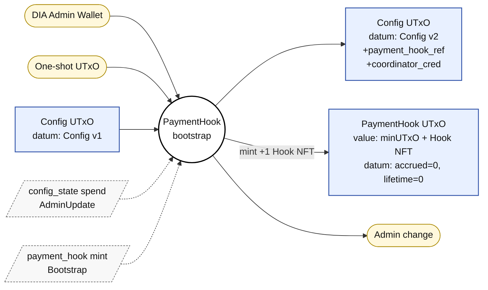

Side effect: the same tx carries a stake registration certificate for `update_coordinator`.

- **Frequency:** once per chain.
- **Inputs:**
  - DIA admin wallet (network fee).
  - Hook one-shot `bootstrap_ref` UTxO.
  - Config UTxO.
- **Reference inputs:** —
- **Mint:** `+1` PaymentHook NFT.
- **Outputs:**
  - Config UTxO recreated (same NFT, datum now embeds `payment_hook_ref` and `update_coordinator_credential`).
  - PaymentHook UTxO with initialized datum (`accrued_fees = 0`, `lifetime_collected = 0`, `lifetime_withdrawn = 0`).
- **Signers:** `config_admins`.

**Validators invoked**

1. **`payment_hook` mint** — redeemer `PaymentHookMintAction::Bootstrap`. Validates:
   - Mint redeemer is `Bootstrap`.
   - Tokens minted under this hook policy form exactly one `Pair(asset_name, qty)`; `asset_name == expected_asset_name`; `quantity == 1`.
   - Some input has `output_reference == bootstrap_ref` (one-shot).
   - An input AND an output carry the Config NFT `qty 1`; both decode as inline `ConfigDatum` (`previous_config`, `next_config`).
   - `valid_config_state(previous_config)` AND `valid_config_state(next_config)`.
   - `previous_config.payment_hook_ref == None` AND `previous_config.update_coordinator_credential == None` (rejects double-bootstrap).
   - `next_config.payment_hook_ref == Some(PaymentHookRef { policy_id = own_policy_id, asset_name = expected_asset_name })`.
   - `next_config.update_coordinator_credential == Some(coordinator_credential)` (parameter wired at compile time).
   - `has_config_signer(previous_config, tx)` ⇒ at least one `config_admins` key in `extra_signatories`.
   - `has_valid_payment_hook_output`: an output holds the Hook NFT `qty 1` and inline `PaymentHookDatum`; output payment credential is `Script(hook_policy_id)`; `valid_payment_hook_state` (all four lovelace fields ≥ 0); `exact_locked_lovelace` ⇒ `lovelace == min_utxo + accrued_fees`.

2. **`config_state` spend** — redeemer `ConfigRedeemer::AdminUpdate`. Same checks as §5.3 below (the spend ensures the Config NFT is continuous and `min_utxo_lovelace` is frozen; the hook mint above pins the new datum's `payment_hook_ref` and `update_coordinator_credential`).

3. **Stake registration certificate** for `coordinator_credential` — witnessed by the admin signature.

**Cross-script invariant.** The hook mint pins the new Config datum (this exact hook policy/asset, this exact coordinator credential), and the Config spend enforces that the Config UTxO is recreated under admin signature with `valid_config_state` and `min_utxo_lovelace` frozen. The two together force Config v1 (no hook, no coordinator) → Config v2 with both fields set, signed by an admin. Neither alone is enough.

### 5.3 Config update

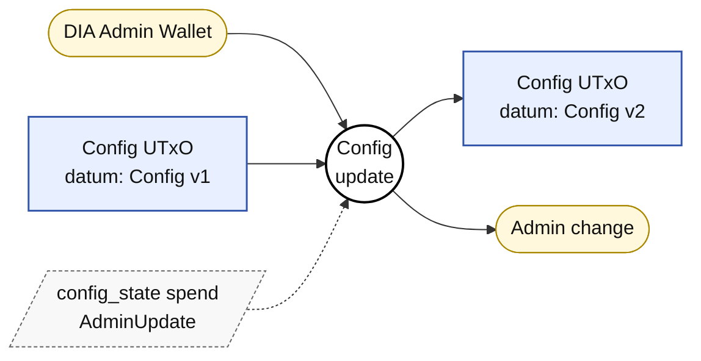

- **Frequency:** rare (rotate signers, change fee, change domain, set/replace `payment_hook_ref` or `update_coordinator_credential`).
- **Inputs:**
  - Config UTxO.
  - Admin wallet (network fee).
- **Reference inputs:** —
- **Mint:** —
- **Outputs:**
  - Config UTxO recreated with the new datum.
- **Signers:** `config_admins`.

**Validators invoked**

1. **`config_state` spend** — redeemer `ConfigRedeemer::AdminUpdate`. Validates:
   - Datum is `Some(current_datum)`; redeemer is `AdminUpdate`.
   - Own input found at `own_ref`; payment credential is `Script(own_policy_id)`.
   - Some output holds the Config NFT `qty 1` with inline `next_datum`; payment credential remains `Script(own_policy_id)`.
   - NFT `qty 1` on consumed input AND on continuation output.
   - `valid_config_state(current_datum)` AND `valid_config_state(next_datum)`.
   - `has_config_signer(current_datum, tx)` (admin authorization is read from the datum being CONSUMED, so an attacker cannot rotate admins and self-authorize in the same tx).
   - `lovelace_of(own_input.value) == current_datum.min_utxo_lovelace`; `lovelace_of(continuation.value) == next_datum.min_utxo_lovelace`.
   - `admin_update_transition` ⇒ `previous.min_utxo_lovelace == next.min_utxo_lovelace` (this field is effectively immutable post-bootstrap).

No other protocol script fires.

### 5.4 Receiver bootstrap (per client)

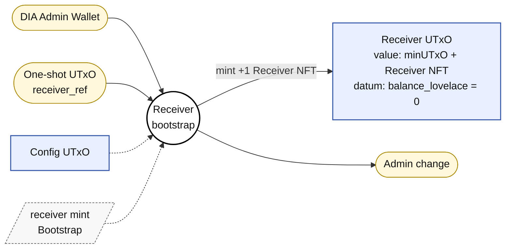

- **Frequency:** once per client.
- **Inputs:**
  - DIA admin wallet (network fee + min UTxO).
  - Receiver one-shot `bootstrap_ref` UTxO.
- **Reference inputs:**
  - Config UTxO.
- **Mint:** `+1` Receiver NFT (policy = `receiver` parametrized for this client).
- **Outputs:**
  - Receiver UTxO at `Script(receiver_policy_id)` with `balance_lovelace = 0`, `accrued_to_hook_lovelace = 0`.
- **Signers:** `config_admins`.

**Validators invoked**

1. **`receiver` mint** — redeemer `ReceiverMintAction::Bootstrap`. Validates:
   - Mint redeemer is `Bootstrap`.
   - Tokens minted under this policy form exactly one `Pair(asset_name, qty)`; `asset_name == expected_asset_name`; `quantity == 1`.
   - Some input has `output_reference == bootstrap_ref` (one-shot).
   - The Config NFT is visible (input or reference input) via `find_visible_config_input`; decodes as `ConfigDatum`; `valid_config_state(config_datum)` holds.
   - `has_config_signer(config_datum, tx)` ⇒ at least one admin signed.
   - `has_valid_receiver_output`: an output holds the Receiver NFT `qty 1` and inline `ReceiverDatum`; output payment credential is `Script(receiver_policy_id)`; `valid_receiver_state` (all three lovelace fields ≥ 0); `exact_locked_lovelace` ⇒ `lovelace == min_utxo + balance + accrued_to_hook`.

No other protocol script fires.

### 5.5 Receiver top-up

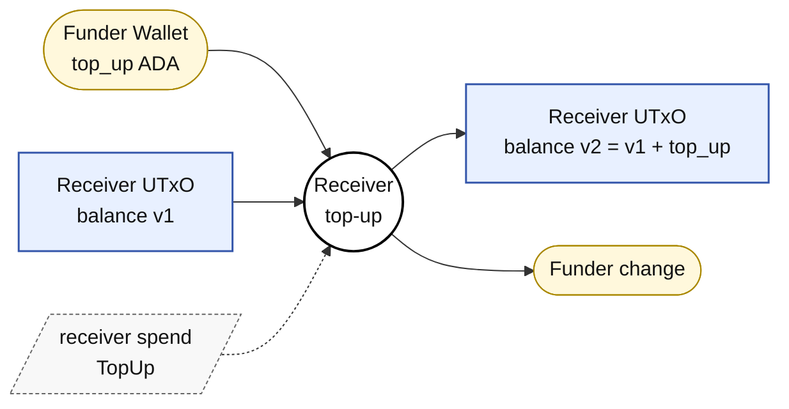

- **Frequency:** ad-hoc, permissionless (matches EVM `receive()`).
- **Inputs:**
  - Receiver UTxO.
  - Funder wallet (anyone).
- **Reference inputs:** —
- **Mint:** —
- **Outputs:**
  - Receiver UTxO recreated with `balance += top_up`.
- **Signers:** none required by the validator (the tx is signed by whoever provides the funding input).

**Validators invoked**

1. **`receiver` spend** — redeemer `ReceiverRedeemer::TopUp` (index 0). Validates:
   - Datum is `Some(current_datum)`; own input is `Script(own_policy_id)`; `own_policy_id == expected_receiver_hash(own_input)` (defends against impostor receivers).
   - Continuation output holds the Receiver NFT `qty 1` and inline `next_datum`; payment credential `Script(own_policy_id)`.
   - NFT `qty 1` on input AND on continuation.
   - `valid_receiver_state` for both `current_datum` and `next_datum`.
   - `exact_locked_lovelace` on input AND on output.
   - `top_up_transition` ⇒ `added = next_lovelace - prev_lovelace > 0` (rejects zero-add churn); `next.balance == previous.balance + added`; `next.accrued_to_hook == previous.accrued_to_hook` (frozen); `next.min_utxo == previous.min_utxo` (frozen).

No Config visibility, no coordinator witness, no admin signer required: the TopUp branch is fully self-contained and permissionless.

### 5.6 Receiver withdraw (equivalent to EVM `retrieveLostTokens`)

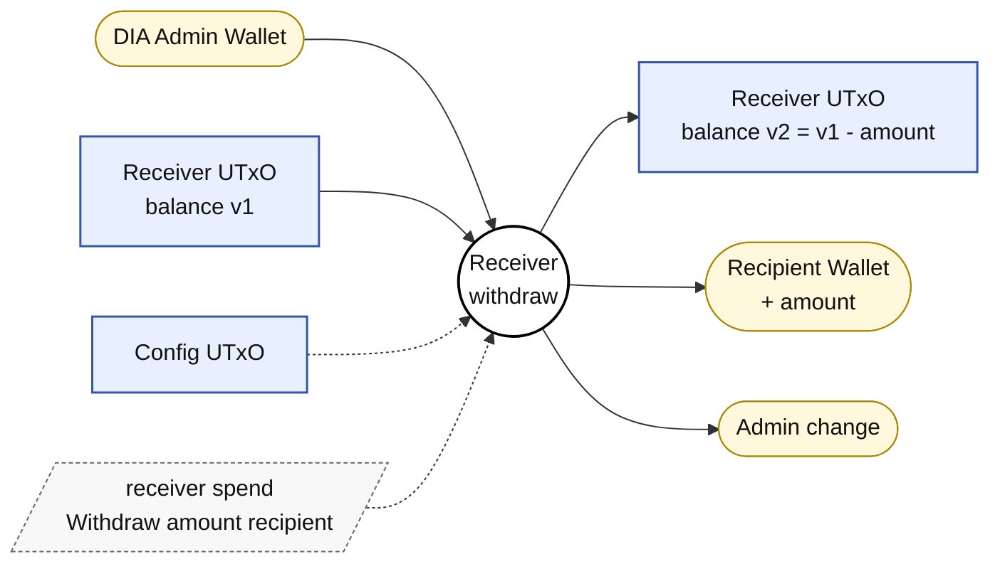

- **Frequency:** rare, admin-initiated.
- **Inputs:**
  - Receiver UTxO.
  - DIA admin wallet (network fee).
- **Reference inputs:**
  - Config UTxO.
- **Mint:** —
- **Outputs:**
  - Receiver UTxO recreated with smaller `balance`.
  - Recipient wallet receiving `amount` lovelace.
- **Signers:** `config_admins`.

**Validators invoked**

1. **`receiver` spend** — redeemer `ReceiverRedeemer::Withdraw { amount, recipient }` (index 3). Validates:
   - All §5.5 common spend prefix (datum decoding, NFT continuity, `valid_receiver_state` × 2, `exact_locked_lovelace` × 2, `expected_receiver_hash` self-check).
   - Visible Config (input or reference input) decoded; `valid_config_state(config_datum)` holds.
   - `has_config_signer(config_datum, tx)` (admin authorization).
   - `withdraw_transition` ⇒ `amount > 0`; `amount ≤ previous.balance`; `next.balance == previous.balance - amount`; `next.accrued_to_hook == previous.accrued_to_hook` (FROZEN — admin cannot drain pending fees through this path); `next.min_utxo == previous.min_utxo`.
   - `paid_to_recipient` ⇒ total ADA on outputs whose `address == recipient` is `≥ amount` (the recipient may receive the payout split across several outputs, but every such output must address EXACTLY `recipient`).

No coordinator witness is required for this path — the admin signature alone authorizes the move.

**Cross-script invariant.** Admin can never use Withdraw to move `accrued_to_hook` lovelace out of a Receiver. The only path that drains that bucket is §5.11 Settle, which routes the ADA to the PaymentHook UTxO.

### 5.7 First pair update/create (per client × pair)

There is no separate Pair bootstrap state. The client-to-Pair binding is enforced by `pair_state` being parametrized by `receiver_hash`: client X's Pair minting policy has a different hash from client Y's. When a pair does not exist yet, the update transaction mints the Pair NFT and creates the first Pair UTxO with the signed intent's real datum.

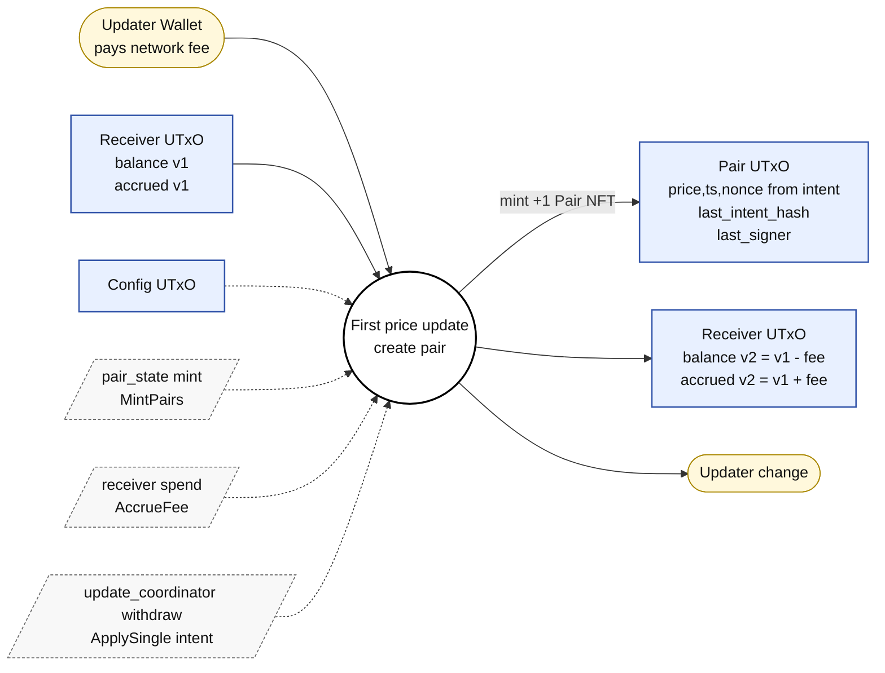

- **Frequency:** once per (client, pair).
- **Inputs:**
  - Receiver UTxO.
  - Updater wallet (pays network fee; permissionless, does not need to be DIA).
- **Reference inputs:**
  - Config UTxO.
- **Mint:** `+1` Pair NFT (asset name = `blake2b_256(pair_id)`).
- **Withdrawals:** `update_coordinator` (zero-lovelace trigger).
- **Outputs:**
  - Pair UTxO with the signed intent's real datum (`price`, `timestamp`, `nonce`, `intent_hash`, `signer`).
  - Receiver UTxO recreated with `balance -= fee`, `accrued_to_hook += fee`. Total lovelace on the Receiver UTxO is unchanged.
- **Signers:** none required by validators.

PaymentHook is **not** involved. Fees are accrued locally on the Receiver and settled later (§5.11).

**Validators invoked**

1. **`update_coordinator` withdraw** — redeemer `CoordinatorRedeemer::ApplySingle(witness)` (index 0). Stake credential firing this withdraw must equal `config.update_coordinator_credential`. Validates:
   - Config NFT visible as REFERENCE input `qty 1`; decodes as `ConfigDatum`; `valid_config_state(config_datum)`.
   - `config_datum.update_coordinator_credential == Some(own_credential)` (the staking credential firing this withdraw is the one Config currently points at).
   - `intent_expiry_satisfied(witness.intent, tx)` ⇒ tx upper validity bound (in ms) is finite AND ≤ `intent.expiry × 1000`. Open-ended upper bounds are rejected.
   - Exactly one output carries `(witness.pair_policy_id, witness.pair_token_name) qty 1`; output decodes as inline `PairDatum`; output payment credential is `Script(witness.pair_policy_id)`.
   - `pair_input_count == 0` (this is the bootstrap-of-pair branch): `minted_pair_quantity(tx, pair_policy_id, pair_token_name) == 1` AND `minted_pair_token_count(tx, pair_policy_id) == 1` (no extra Pair NFTs may be smuggled in).
   - `exact_locked_lovelace(pair_output, next_pair)` ⇒ pair output ADA equals `next_pair.min_utxo_lovelace`.
   - `initial_pair_matches_witness` binds `next_pair.{pair_id, price, timestamp, nonce} == witness.intent.{symbol, price, timestamp, nonce}`; `next_pair.intent_hash == oracle_intent_hash(config.domain, witness.intent)`; `next_pair.signer == witness.intent.signer`; `witness.pair_token_name == blake2b_256(next_pair.pair_id)`. Plus `has_valid_signature` ⇒ `valid_intent` (non-empty fields, `chain_id ≥ 0`, `nonce ≥ 0`, `expiry ≥ 0`, `price ≥ 0`, `timestamp ≥ 0`, signature length 64/65, signer 20 bytes) AND `signer_is_authorized(config, witness.signer_public_key)` AND `verify_ecdsa_signature(...)`.
   - `intent_freshness_satisfied(witness.intent, tx, config.max_bootstrap_drift_seconds)` ⇒ tx lower validity bound is finite AND `intent.timestamp × 1000 ≥ lower_ms - max_drift × 1000`. Rejects stale-intent replay on bootstrap.
   - `valid_receiver_accrue_fee(tx, witness.receiver_policy_id, witness.receiver_asset_name, fee = config.protocol_fee_lovelace)`: locates a Receiver input/output pair carrying that NFT; both decode as `ReceiverDatum`; both pass `valid_receiver_state` AND `exact_locked_lovelace`; `accrue_fee_transition(prev, next, fee = config.protocol_fee_lovelace)` ⇒ `fee ≥ 0`, `fee ≤ prev.balance`, `next.balance == prev.balance - fee`, `next.accrued_to_hook == prev.accrued_to_hook + fee`, `next.min_utxo == prev.min_utxo`.

2. **`pair_state` mint** — redeemer `PairMintAction::MintPairs`. Validates:
   - Mint redeemer is `MintPairs`.
   - At least one minted pair entry; each has `qty == 1`.
   - For every minted name: an output holds that NFT `qty 1` and inline `PairDatum`; payment credential `Script(pair_policy_id)`; `pair_asset_name(datum.pair_id) == minted_name`; `valid_pair_state(datum)`; `exact_locked_lovelace`.
   - Config NFT visible as reference input `qty 1`; decodes as `ConfigDatum`; `valid_config_state(config_datum)`.
   - **Coordinator witness check:** `coordinator_witness_present(tx.withdrawals, config_datum)` ⇒ a withdrawal in `tx.withdrawals` has key equal to `config_datum.update_coordinator_credential`. If `config_datum.update_coordinator_credential == None` this returns `False` (rejects).

3. **`receiver` spend** — redeemer `ReceiverRedeemer::AccrueFee` (index 1). Validates:
   - All §5.5 common spend prefix.
   - Visible Config decoded; `valid_config_state(config_datum)`.
   - `coordinator_witness_present(tx.withdrawals, config_datum)` (same definition as in `pair_state`).
   - `accrue_fee_transition(current_datum, next_datum, fee = current.balance - next.balance)` ⇒ same five-condition body as the coordinator's check above, but `fee` is **derived from the datum delta** here.

**Cross-script invariants**

- **The fee per update is exactly `protocol_fee_lovelace`.** The coordinator binds `fee = config.protocol_fee_lovelace` (constant). The receiver binds `fee = current.balance - next.balance` (datum delta). Both must hold simultaneously, so the datum delta is forced equal to the constant. Neither side alone is enough.
- **Pair NFT name is bound to the intent symbol.** Coordinator: `pair_token_name == blake2b_256(pair_id)` AND `pair_id == witness.intent.symbol`. Pair mint: `pair_asset_name(datum.pair_id) == minted_name`. Either side alone could be circumvented; together they pin the asset name.
- **No ghost-mint.** Coordinator: "exactly one Pair NFT under this policy/name AND no other token of this policy was minted in this tx". Pair mint: every minted name has a matching well-formed output.
- **Stale-intent replay on bootstrap is rejected** by `intent_freshness_satisfied` (max-drift window).

### 5.8 Price update (single) — main tx

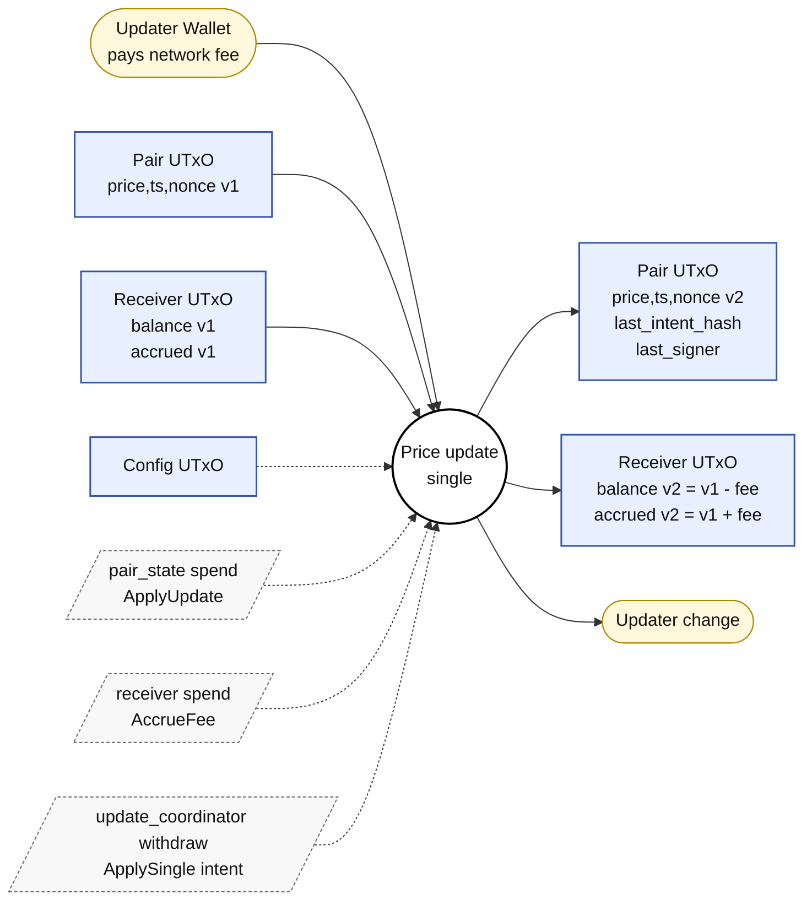

Same shape as §5.7 but for an EXISTING pair UTxO: the Pair UTxO is spent (no Pair NFT minted), and the Receiver accrues one fee.

- **Frequency:** high (heartbeat / deviation).
- **Inputs:**
  - Pair UTxO.
  - Receiver UTxO.
  - Updater wallet.
- **Reference inputs:**
  - Config UTxO.
- **Mint:** —
- **Withdrawals:** `update_coordinator` (zero-lovelace trigger).
- **Outputs:**
  - Pair UTxO recreated with new `price`, `timestamp`, `nonce`, `intent_hash`, `signer`.
  - Receiver UTxO recreated with `balance -= fee`, `accrued_to_hook += fee`. Total Receiver UTxO lovelace unchanged.
- **Signers:** none required by validators.

PaymentHook is **not** an input or output in update transactions. This eliminates PaymentHook contention during high-frequency updates.

**Validators invoked**

1. **`update_coordinator` withdraw** — redeemer `CoordinatorRedeemer::ApplySingle(witness)` (index 0). Same as §5.7 except the branch is `pair_input_count == 1`. Validates:
   - Config visibility/validity, coordinator-credential match, `intent_expiry_satisfied`, `valid_receiver_accrue_fee` exactly as in §5.7.
   - Exactly one pair input AND exactly one pair output `qty 1` `(witness.pair_policy_id, witness.pair_token_name)`.
   - `minted_pair_token_count(tx, pair_policy_id) == 0` (the spend branch must not mint Pair NFTs).
   - `next_pair_matches_witness(prev_pair, next_pair, config, witness)` ⇒ `valid_pair_state` for both; `prev.pair_id == next.pair_id`; `prev.min_utxo == next.min_utxo`; same field bindings as §5.7's `initial_pair_matches_witness`; `is_fresh_update(prev, witness.intent)` ⇒ `intent.timestamp > prev.timestamp` AND `intent.nonce > prev.nonce`; signature path identical.
   - `intent_freshness_satisfied` is NOT required here because the prev-vs-next replay check provides freshness from the previous Pair datum.

2. **`pair_state` spend** — redeemer `PairSpendAction::ApplyUpdate`. Validates:
   - Datum is `Some(current_datum)`; own input found at `own_ref` and is `Script(own_policy_id)`.
   - Tokens of own policy on own input form exactly one `Pair(pair_token_name, 1)` (no multi-token Pair UTxO).
   - Config NFT visible as reference input `qty 1`; decodes as `ConfigDatum`; `valid_config_state(config_datum)`.
   - Continuation output holds the same Pair NFT `qty 1` with inline `next_datum`; payment credential `Script(own_policy_id)`.
   - `valid_pair_state` for both `current_datum` and `next_datum`.
   - `current.pair_id == next.pair_id`; `current.min_utxo == next.min_utxo`.
   - `pair_token_name == blake2b_256(current.pair_id)`.
   - `receiver_input_present(tx.inputs, receiver_hash)` ⇒ a UTxO at the parameterized `Script(receiver_hash)` is being spent in the same tx (binds the pair to its client's Receiver).
   - `exact_locked_lovelace` on input AND on continuation.
   - `coordinator_witness_present(tx.withdrawals, config_datum)`.

3. **`receiver` spend** — redeemer `ReceiverRedeemer::AccrueFee`. Same as §5.7.

**Cross-script invariants:** identical to §5.7, plus replay protection: `intent.timestamp > prev.timestamp` AND `intent.nonce > prev.nonce` (coordinator's `is_fresh_update`). Pair NFT cannot be duplicated mid-flight (no mint on this branch + single token of pair policy on own input + parametric NFT name = `blake2b_256(pair_id)`).

### 5.9 Price update (batch)

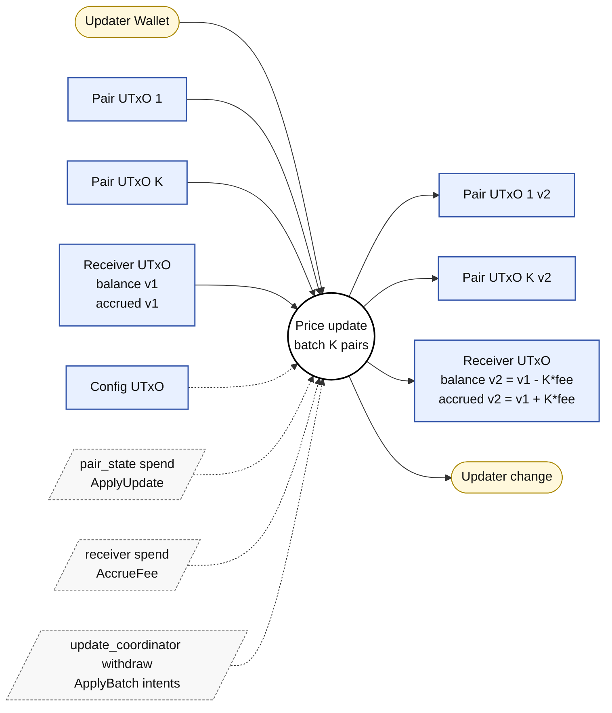

N intents in one tx, each addressing the SAME pair policy and the SAME Receiver. Each witness is either a "first update" (mints the Pair NFT) or an "ApplyUpdate" (spends an existing Pair UTxO).

- **Frequency:** high; batch variant of §5.8.
- **Inputs:**
  - Existing Pair UTxOs being updated (`0..K`).
  - Receiver UTxO.
  - Updater wallet.
- **Reference inputs:**
  - Config UTxO.
- **Mint:** Pair NFTs for any "first update" witnesses.
- **Withdrawals:** `update_coordinator` (zero-lovelace trigger).
- **Outputs:**
  - `N` Pair UTxOs (one per witness, mix of newly-minted and recreated).
  - Receiver UTxO recreated with `balance -= N × fee`, `accrued_to_hook += N × fee`. Total Receiver UTxO lovelace unchanged.
- **Signers:** none required by validators.

**Validators invoked**

1. **`update_coordinator` withdraw** — redeemer `CoordinatorRedeemer::ApplyBatch(witnesses)` (index 1). Same Config visibility/validity and coordinator-credential match as in §5.7, plus:
   - `witnesses_share_receiver(witnesses)` ⇒ every witness names the same Receiver NFT.
   - `list.all(witnesses, intent_expiry_satisfied)` (per-intent expiry).
   - `length(witnesses) > 0`.
   - `unique_pair_units(witnesses)` ⇒ no duplicate `(pair_policy_id, pair_token_name)`.
   - `witnesses_share_pair_policy(witnesses)`.
   - `minted_pair_token_count(tx, shared_pair_policy_id) == create_witness_count(tx, witnesses)` ⇒ the count of minted Pair NFTs equals the count of "first update" witnesses (extras are rejected).
   - For each witness: same per-witness assertions as §5.7 (`pair_input_count == 0`) OR §5.8 (`pair_input_count == 1`), depending on whether the Pair UTxO already exists.
   - `valid_batch_receiver_accrue_fee(tx, witnesses, fee = config.protocol_fee_lovelace × length(witnesses))` ⇒ the Receiver datum delta MUST equal `N × protocol_fee`.

2. **`pair_state` mint** — redeemer `MintPairs`. Same as §5.7. Fired once for the shared pair policy with all newly-minted Pair NFTs in `tx.mint`.

3. **`pair_state` spend** — redeemer `ApplyUpdate`. Same as §5.8. Fired once per existing Pair UTxO being updated.

4. **`receiver` spend** — redeemer `ReceiverRedeemer::AccrueFee`. Same as §5.7. Fired once for the single Receiver UTxO.

**Cross-script invariants**

- Per-pair fee accumulates linearly with batch size: coordinator wires receiver to `N × fee`; receiver `accrue_fee_transition` enforces the datum delta. Both must agree.
- No witness can pair-mint twice inside a batch: `unique_pair_units` + `minted_pair_token_count == create_witness_count` + `witnesses_share_pair_policy`.
- All N witnesses come from the same client (`witnesses_share_receiver` + the per-client Receiver NFT).

### 5.10 PaymentHook withdraw

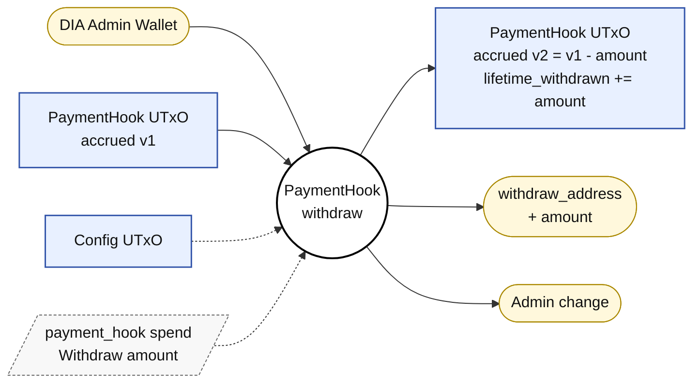

- **Frequency:** low, manual.
- **Inputs:**
  - PaymentHook UTxO.
  - DIA admin wallet (network fee).
- **Reference inputs:**
  - Config UTxO.
- **Mint:** —
- **Outputs:**
  - PaymentHook UTxO recreated with reduced `accrued_fees`.
  - Target wallet at `withdraw_address` receiving `amount` lovelace.
- **Signers:** `config_admins`.

The `update_coordinator` does NOT need to fire — `coordinator_witness_present` is only required on `ApplySettle`.

**Validators invoked**

1. **`payment_hook` spend** — redeemer `PaymentHookRedeemer::Withdraw { amount }` (index 2). Validates:
   - Common hook-spend prefix: datum decoded; own input is `Script(own_policy_id)`; visible Config decoded; `valid_payment_hook_state` for both old and new; NFT `qty 1` preserved on input AND on continuation; continuation payment credential `Script(own_policy_id)`; `exact_locked_lovelace` on both.
   - `has_config_signer(config_datum, tx)` (admin authorization).
   - `withdraw_transition` ⇒ `amount ≥ 0`; `amount ≤ previous.accrued_fees_lovelace`; `next.withdraw_address == previous.withdraw_address` (frozen); `next.min_utxo == previous.min_utxo` (frozen); `next.accrued_fees == previous.accrued_fees - amount`; `next.lifetime_collected == previous.lifetime_collected` (frozen); `next.lifetime_withdrawn == previous.lifetime_withdrawn + amount`.
   - `withdraw_paid_to_target(tx.outputs, current.withdraw_address, amount)` ⇒ total ADA on outputs whose `address == withdraw_address` is `≥ amount`.

**Invariants**

- `withdraw_address` cannot be silently rotated during a Withdraw: `withdraw_transition` freezes it. (To change it admins must use `AdminUpdate` on the hook, which freezes all economic fields by `admin_update_transition`.)
- `lifetime_collected` and `lifetime_withdrawn` are monotonic. Withdraw bumps `lifetime_withdrawn`; Settle bumps `lifetime_collected` (§5.11). Neither transition lets either field decrease.

### 5.11 Settle accrued fees

This transaction is the second half of the decoupled fee settlement model. It drains `accrued_to_hook_lovelace` from one or more Receiver UTxOs and credits the corresponding ADA to the PaymentHook UTxO.

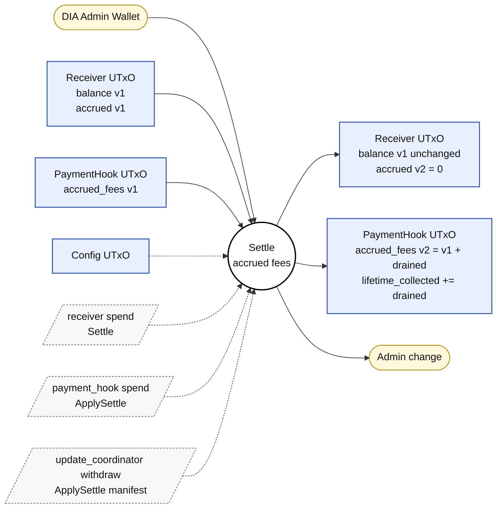

**Three validators fire in this single tx**, tied together by the coordinator: `update_coordinator` (the only place the cross-UTxO arithmetic is enforced), one `receiver` spend per Receiver in the manifest, and the `payment_hook` spend.

- **Frequency:** periodic (e.g. daily or after N updates), admin-initiated.
- **Inputs:**
  - `R` Receiver UTxOs (each with `accrued_to_hook_lovelace > 0`).
  - PaymentHook UTxO.
  - DIA admin wallet (network fee).
- **Reference inputs:**
  - Config UTxO.
- **Mint:** —
- **Withdrawals:** `update_coordinator` (zero-lovelace trigger).
- **Outputs:**
  - Each Receiver UTxO recreated with `accrued_to_hook = 0`, `balance` unchanged, total UTxO lovelace decreased by its `drained` amount.
  - PaymentHook UTxO recreated with `accrued_fees += sum(drained)`, `lifetime_collected += sum(drained)`, total UTxO lovelace increased by `sum(drained)`.
- **Signers:** `config_admins`.

**Validators invoked**

1. **`update_coordinator` withdraw** — redeemer `CoordinatorRedeemer::ApplySettle(SettleManifest { receivers })` (index 2). This is the only validator that knows the cross-UTxO arithmetic. Validates:
   - Config NFT visible as REFERENCE input `qty 1`; `valid_config_state(config_datum)`; `config_datum.update_coordinator_credential == Some(own_credential)`.
   - `has_config_signer(config_datum, tx)` (admin authorization).
   - `config_datum.payment_hook_ref == Some(payment_hook_ref)`.
   - An input AND an output carry `(payment_hook_ref.policy_id, payment_hook_ref.asset_name) qty 1`; both decode as `PaymentHookDatum` (`previous_hook`, `next_hook`).
   - `manifest.receivers` non-empty AND `unique_settle_receivers(manifest.receivers)` (no duplicate Receiver in the manifest).
   - `valid_payment_hook_state` for both hooks; `exact_locked_lovelace` for both.
   - `apply_settle_transition(previous_hook, next_hook, expected_delta = next.accrued - prev.accrued)` ⇒ `delta > 0`; `next.withdraw_address == prev.withdraw_address`; `next.min_utxo == prev.min_utxo`; `next.accrued == prev.accrued + delta`; `next.lifetime_collected == prev.lifetime_collected + delta`; `next.lifetime_withdrawn == prev.lifetime_withdrawn` (frozen).
   - `sum_receiver_accrued_drained(manifest.receivers, tx) == expected_delta`. For each manifest entry the coordinator finds the matching Receiver input/output, asserts `valid_receiver_state` on both, `exact_locked_lovelace` on both, `receiver_logic.settle_transition` (drains `accrued_to_hook` to zero, freezes `balance` and `min_utxo`), and `receiver_output.payment_credential == Script(receiver.receiver_policy_id)`. The previous `accrued_to_hook` is summed across all manifest entries; the total must equal the hook's `accrued_fees` increase.

2. **`receiver` spend × R** — redeemer `ReceiverRedeemer::Settle` (index 2). Each Receiver UTxO in the manifest is spent under this branch. Validates:
   - All §5.5 common spend prefix.
   - Visible Config decoded; `valid_config_state(config_datum)`.
   - **Coordinator witness check:** `coordinator_witness_present(tx.withdrawals, config_datum)` ⇒ this is HOW the local Receiver "knows" the coordinator authorized the cross-UTxO arithmetic. The check passes iff a withdrawal in `tx.withdrawals` has key `config_datum.update_coordinator_credential`. The validator does NOT inspect which redeemer the coordinator was invoked with; it relies on the fact that the coordinator's withdraw script only succeeds when its own redeemer-branch invariants hold. In this tx that redeemer is `ApplySettle(manifest)`, and the coordinator already enforced the global drain==delta arithmetic.
   - `settle_transition` ⇒ `previous.accrued_to_hook > 0` (rejects no-op churn); `next.accrued_to_hook == 0`; `next.balance == previous.balance` (FROZEN); `next.min_utxo == previous.min_utxo` (FROZEN).

3. **`payment_hook` spend** — redeemer `PaymentHookRedeemer::ApplySettle` (index 0). Validates:
   - Common hook-spend prefix (datum decoded, NFT continuity, `valid_payment_hook_state` × 2, `exact_locked_lovelace` × 2, payment credential preserved).
   - `has_expected_hook_ref(config_datum, own_policy_id, expected_asset_name)` ⇒ Config currently names THIS exact hook policy/name as the protocol's hook (`payment_hook_ref`). Even a compromised coordinator could not slip a different hook UTxO into the tx.
   - `coordinator_witness_present(tx.withdrawals, config_datum)`.
   - `has_config_signer(config_datum, tx)` (defense-in-depth: admin must sign even though the coordinator is gating the tx, because the hook is the single most valuable UTxO in the protocol).
   - `apply_settle_transition(current_datum, next_datum, delta = next.accrued - current.accrued)` ⇒ same five-condition body as the coordinator's check above, but `delta` is **derived from the hook's own datum delta** here.

**How "deferral to the coordinator" actually works.** The local `receiver` and `payment_hook` validators do NOT inspect the redeemer the coordinator was invoked with. They only check that **some** withdrawal at `config_datum.update_coordinator_credential` is present in `tx.withdrawals`. The coordinator validator runs once per tx and is the only place the cross-UTxO arithmetic (Σ receiver drains == hook accrued delta) is enforced. Each local validator enforces the local invariants of its own UTxO; the coordinator enforces the cross-UTxO arithmetic; both run in the same tx. None of the three can be omitted, and none is sufficient on its own.

**Cross-script invariants**

- **`Σ (drained accrued_to_hook on receivers) == Δ accrued_fees on the hook`.** Coordinator: `sum == expected_delta`. Receiver `settle_transition`: drain is the WHOLE `accrued_to_hook` (`prev > 0`, `next == 0`). Hook `apply_settle_transition`: `delta > 0`. None can be circumvented in isolation.
- **Settle cannot rotate the hook NFT or the `withdraw_address`.** `apply_settle_transition` freezes hook identity fields. The hook spend independently re-asserts `has_expected_hook_ref`.
- **Settle cannot bleed `balance` from the receiver.** `settle_transition` freezes `balance` and `min_utxo`; only `accrued_to_hook` moves.
- **A no-op settle is impossible.** `manifest.receivers` non-empty + each entry's `prev.accrued_to_hook > 0`.

---

## 6. Finalized design decisions

1. **Config is shared.** One global Config UTxO is read as a reference input by Receivers, Pair states, PaymentHook, and the coordinator.
2. **Fees live in Config.** `protocol_fee_lovelace` is admin-tunable in Config and is charged per updated pair.
3. **Pair NFT asset names are hashed.** Pair asset name = `blake2b_256(pair_id)`, where `pair_id` is the UTF-8 bytes of the DIA symbol such as `USDC/USD`.
4. **Decoupled fee settlement.** Update transactions accrue fees locally on the Receiver (`balance -= fee`, `accrued_to_hook += fee`). Fees are settled to the PaymentHook in a separate admin-initiated Settle transaction. This eliminates contention on the global PaymentHook UTxO during high-frequency updates.

---

## 7. Redeemer index reference

| Script | Idx | Redeemer | Used in |
|---|:---:|---|---|
| `config_state` mint | — | `ConfigMintAction::Bootstrap` | §5.1 |
| `config_state` spend | 0 | `ConfigRedeemer::AdminUpdate` | §5.2, §5.3 |
| `payment_hook` mint | — | `PaymentHookMintAction::Bootstrap` | §5.2 |
| `payment_hook` spend | 0 | `PaymentHookRedeemer::ApplySettle` | §5.11 |
| `payment_hook` spend | 1 | `PaymentHookRedeemer::AdminUpdate` | (admin-only mutation, no full-tx section) |
| `payment_hook` spend | 2 | `PaymentHookRedeemer::Withdraw { amount }` | §5.10 |
| `receiver` mint | — | `ReceiverMintAction::Bootstrap` | §5.4 |
| `receiver` spend | 0 | `ReceiverRedeemer::TopUp` | §5.5 |
| `receiver` spend | 1 | `ReceiverRedeemer::AccrueFee` | §5.7, §5.8, §5.9 |
| `receiver` spend | 2 | `ReceiverRedeemer::Settle` | §5.11 |
| `receiver` spend | 3 | `ReceiverRedeemer::Withdraw { amount, recipient }` | §5.6 |
| `pair_state` mint | — | `PairMintAction::MintPairs` | §5.7, §5.9 |
| `pair_state` spend | — | `PairSpendAction::ApplyUpdate` | §5.8, §5.9 |
| `update_coordinator` withdraw | 0 | `CoordinatorRedeemer::ApplySingle(UpdateWitness)` | §5.7, §5.8 |
| `update_coordinator` withdraw | 1 | `CoordinatorRedeemer::ApplyBatch(List<UpdateWitness>)` | §5.9 |
| `update_coordinator` withdraw | 2 | `CoordinatorRedeemer::ApplySettle(SettleManifest)` | §5.11 |

The exhaustive list of validators invoked per transaction, the redeemer each one is invoked with, and every check enforced by every redeemer lives inline in §5. There is no separate per-transaction validation table — §5 is the single source of truth.

---

## 8. Script identities and references

This section is the global counterpart of §5 — instead of grouping
information by transaction, it groups it by the **identifiers** that
flow through the system: which policy IDs and script hashes exist,
where each one is stored on-chain and on-disk, which NFTs witness
which identity, where the Config datum is treated as the source of
truth, and which scripts are parameterized by what.

### 8.1 Table E — Where each policy ID / script hash is stored and read

| Identifier | Bound to script | Stored on-chain in | Stored off-chain in | Read by (on-chain) |
|---|---|---|---|---|
| `config_policy_id` | `validators/config_state.ak` (mint) | NFT bytes on the Config UTxO | `state.scripts.configPolicyId` (`offchain/cli/state/preview/config-bootstrap.json`) | Hardcoded as a compile-time parameter on `payment_hook`, `receiver`, `pair_state`, `update_coordinator` (`validators/{payment_hook,receiver,pair_state,update_coordinator}.ak` headers); also re-checked at runtime via `find_visible_config_input` |
| `config_asset_name` | same | NFT bytes on the Config UTxO | `state.scripts.configUnit.assetName` | Same compile-time parameters as above |
| `payment_hook_policy_id` | `validators/payment_hook.ak` (mint) | NFT bytes on the Hook UTxO; **also recorded inside `ConfigDatum.payment_hook_ref`** | `state.scripts.paymentHookPolicyId` and `state.scripts.paymentHookValidator{Hash,Address}` | Read by `update_coordinator` `valid_settle` (`update_coordinator.ak:175-205`) and re-asserted by hook's `has_expected_hook_ref` (`payment_hook.ak:243-253`) |
| `payment_hook_asset_name` | same | NFT bytes; `ConfigDatum.payment_hook_ref.asset_name` | `state.scripts.paymentHookUnit` | Same as above |
| `receiver_policy_id` | `validators/receiver.ak` (mint) | NFT bytes on the Receiver UTxO; embedded in `UpdateWitness.receiver_policy_id` (off-chain witness) | `clientState.receiver.receiverPolicyId` (per-client artifact) | Read by `update_coordinator` `valid_receiver_accrue_fee` (`update_coordinator.ak:107-126`) which finds the receiver via this NFT |
| `receiver_asset_name` | same | NFT bytes; embedded in `UpdateWitness` | `clientState.receiver.receiverAssetName` | Same as above |
| `receiver_validator_hash` | `validators/receiver.ak` (spend) | None — derived from script | `clientState.receiver.receiverValidatorHash` | Wired as compile-time parameter into `pair_state.receiver_hash` (`validators/pair_state.ak:23`); enforced at runtime by `pair_state.receiver_input_present` (`pair_state.ak:116, 161-170`) |
| `pair_policy_id` (per-client) | `validators/pair_state.ak` (mint) | NFT bytes on each pair UTxO; embedded in `UpdateWitness.pair_policy_id` | `pairArtifact.scripts.pairPolicyId` | Read by `update_coordinator.valid_single_update` and `valid_batch_update` (`update_coordinator.ak:319, 367, 389`) |
| `pair_token_name` (per pair) | same | NFT bytes; equal to `blake2b_256(pair_id)` | `pairArtifact.scripts.pairUnit` | Re-derived on-chain by `oracle_logic.pair_asset_name` (`oracle_logic.ak:50-52`) and asserted at `pair_state.ak:115` and `update_coordinator.ak` C7 / C7' |
| `coordinator_credential` (stake credential) | `validators/update_coordinator.ak` (withdraw) | `ConfigDatum.update_coordinator_credential` (set at hook bootstrap, frozen unless config admin update edits it) | `state.scripts.coordinatorHash`, `state.scripts.coordinatorRewardAddress` | Read by `update_coordinator.ak:55-56` (must equal `own_credential`); read by every `coordinator_witness_present` site in `pair_state`, `receiver`, and `payment_hook` |
| `reference_holder` validator hash | `validators/reference_holder.ak` | UTxOs at the reference-holder address that carry the reference scripts | `state.referenceHolderAddress` | Not read by any other validator on-chain; this script's only purpose is to hold reference scripts (its `spend` returns `False`, so the UTxOs are forever consumable only as `reference_input`s) |

### 8.2 Table F — Identity NFTs

| NFT | Derivation (policy id source) | Asset name | Custodian (UTxO it lives in) | Downstream checks that require its presence |
|---|---|---|---|---|
| Config NFT | One-shot mint policy parameterized by `bootstrap_ref` and `expected_asset_name` (`validators/config_state.ak:12-14`) | Compile-time parameter `expected_asset_name` (operator-chosen UTF-8 label, e.g. `"DIA_CONFIG"`) | The single Config UTxO at `Script(config_policy_id)` | `payment_hook`, `receiver`, `pair_state`, `update_coordinator` all do `find_visible_config_input` searching for a UTxO carrying this NFT `qty 1` |
| PaymentHook NFT | One-shot mint policy parameterized by hook `bootstrap_ref`, `expected_asset_name`, `config_policy_id`, `config_asset_name`, `coordinator_credential` (`validators/payment_hook.ak:15-20`) | Compile-time `expected_asset_name` (operator-chosen) | The single PaymentHook UTxO at `Script(payment_hook_policy_id)` | `update_coordinator.valid_settle` searches inputs and outputs for this NFT (`update_coordinator.ak:178-205`); hook's own `ApplySettle`/`Withdraw` paths re-assert the NFT is on the consumed input and the continuation output, `qty 1` (`payment_hook.ak:117-121`) |
| Receiver NFT | Mint policy parameterized per client by `bootstrap_ref`, `expected_asset_name`, `config_policy_id`, `config_asset_name` (`validators/receiver.ak:15-19`) | Compile-time `expected_asset_name` (operator-chosen per-client label, typically `"DIA_RECEIVER_<ClientID>"`) | The single Receiver UTxO at `Script(receiver_policy_id)` | `update_coordinator.valid_receiver_accrue_fee` finds the receiver by this NFT (`update_coordinator.ak:107-126`); `pair_state` requires a receiver UTxO under `receiver_hash` to be a tx input (`pair_state.ak:116, 161-170`); receiver's own spend re-asserts the NFT on input and continuation `qty 1` (`receiver.ak:76-82`) |
| Pair NFT | Mint policy parameterized per client by `config_policy_id`, `config_asset_name`, `receiver_hash` (`validators/pair_state.ak:20-23`) | `blake2b_256(pair_id)` where `pair_id` is the UTF-8 bytes of the DIA symbol (e.g. `"USDC/USD"`) — derived by `oracle_logic.pair_asset_name` (`oracle_logic.ak:50-52`) | One Pair UTxO per pair at `Script(pair_policy_id)` | `update_coordinator.valid_single_update` and `valid_batch_update` enforce exactly one pair output and `pair_input_count ∈ {0,1}` per witness; `pair_state.spend` enforces exactly one token of own policy on own input and continuation |

### 8.3 Table G — Config datum as a source of truth

For every field of `ConfigDatum`, where it is set, who can mutate it,
and which on-chain checks consume it.

| Field | Set at | Mutable by | Consumed by |
|---|---|---|---|
| `config_admins: List<VKH>` | Config bootstrap (initial value) | `config_state.spend AdminUpdate` | Every `has_config_signer(config_datum, tx)` site: `config_state.spend`, `payment_hook` mint and `ApplySettle`/`AdminUpdate`/`Withdraw`, `receiver` mint and `Withdraw`, `update_coordinator.ApplySettle` |
| `authorized_dia_public_keys: List<ByteArray>` | Config bootstrap | `config_state.spend AdminUpdate` | `oracle_logic.signer_is_authorized` inside `has_valid_signature` for every coordinator update |
| `domain_data: Domain` | Config bootstrap | `config_state.spend AdminUpdate` | `oracle_logic.oracle_intent_hash` (the EIP-712 hash bound into every `PairDatum.intent_hash`) |
| `protocol_fee_lovelace: Int` | Config bootstrap | `config_state.spend AdminUpdate` | `update_coordinator.valid_receiver_accrue_fee` (single) and `valid_batch_receiver_accrue_fee` (batch × N) |
| `payment_hook_ref: Option<PaymentHookRef>` | `None` at Config bootstrap; set to `Some(...)` at PaymentHook bootstrap | `config_state.spend AdminUpdate` (subject to `valid_config_state` consistency) | `update_coordinator.valid_settle` (must be `Some`); `payment_hook.has_expected_hook_ref` (must equal own policy/name); `valid_config_state.hook_and_coordinator_are_consistent` |
| `update_coordinator_credential: Option<Credential>` | `None` at Config bootstrap; set to `Some(...)` at PaymentHook bootstrap | `config_state.spend AdminUpdate` | `update_coordinator` itself (own credential must match); every `coordinator_witness_present` site (`pair_state`, `receiver.AccrueFee`/`Settle`, `payment_hook.ApplySettle`) |
| `max_bootstrap_drift_seconds: Int` | Config bootstrap | `config_state.spend AdminUpdate` | `update_coordinator.intent_freshness_satisfied` for the bootstrap branch of single/batch updates |
| `min_utxo_lovelace: Int` | Config bootstrap | `config_state.spend AdminUpdate` (but `admin_update_transition` requires `previous == next` — this field is effectively immutable post-bootstrap) | `config_state.spend` (Config UTxO ADA must equal this value on input AND on output) |

### 8.4 Table H — Parameterization vs runtime references

For each script that takes compile-time parameters (`applyParamsToScript`),
list the parameters and whether the same value is **also** read at
runtime through Config / NFT presence (defense in depth) or only used
at compile time.

| Script | Compile-time parameters | Re-read at runtime? |
|---|---|---|
| `config_state` | `bootstrap_ref: OutputReference`, `expected_asset_name: AssetName` (`validators/config_state.ak:12-14`) | `bootstrap_ref` is consumed once at mint time and never again; `expected_asset_name` is checked on every spend (continuation must carry `(own_policy_id, expected_asset_name) qty 1`). |
| `payment_hook` | `bootstrap_ref`, `expected_asset_name`, `config_policy_id`, `config_asset_name`, `coordinator_credential: Credential` (`validators/payment_hook.ak:15-20`) | `config_policy_id` + `config_asset_name` are used to find the Config NFT at runtime (`payment_hook.ak:36-46, 211-239`); `coordinator_credential` is wired into the initial `ConfigDatum` at hook bootstrap (`payment_hook.ak:75-76`) and from then on the coordinator credential is re-derived from `ConfigDatum.update_coordinator_credential` rather than from the parameter. The compile-time parameter is what allowed bootstrap to assert the new Config datum names this exact credential. |
| `receiver` | `bootstrap_ref`, `expected_asset_name`, `config_policy_id`, `config_asset_name` (`validators/receiver.ak:15-19`) | `config_policy_id` + `config_asset_name` are used by `find_visible_config_input` on every receiver mint and on `AccrueFee`/`Settle`/`Withdraw` spends. |
| `pair_state` | `config_policy_id`, `config_asset_name`, `receiver_hash: ScriptHash` (`validators/pair_state.ak:20-23`) | `config_policy_id`/`asset_name` are searched on every mint and spend; `receiver_hash` is asserted by `receiver_input_present` on every pair spend, AND by every pair mint via the inner `coordinator_witness_present + receiver_input_present` requirement (the pair mint requires the receiver UTxO to be in the tx). |
| `update_coordinator` | `config_policy_id`, `config_asset_name` (`validators/update_coordinator.ak:30-33`) | Used to locate Config as a reference input on every coordinator withdraw (`update_coordinator.ak:39-48`). All other identifiers (hook NFT, receiver NFT, pair policy) come from runtime witnesses, not parameters. |
| `reference_holder` | none (`validators/reference_holder.ak:3-6`) | The script's only purpose is to host reference UTxOs; its `spend` returns `False`, so the UTxOs can never be consumed and instead are forever available as `reference_input`s. |

---
