# DIA Cardano Oracle — Grafana dashboards guide

The maintained, panel-by-panel reference for the three Grafana dashboards the feeder
ships. Written to be read by a non-specialist: for **every** chart it gives the metric
(PromQL), then answers **what it shows · how to read it · when to worry**. It also
explains **how the filter bar works** and which panels react to each filter, and ends
with a one-page **when-to-panic** cheat sheet.

This is the living companion to:

- the **operator manual** — [`offchain/feeder/README.md`](../../offchain/feeder/README.md)
  (§ Thresholds and alerts, § Service URLs, § HTTP API);
- the **feeder architecture** — [`feeder.md`](./feeder.md) (the metric catalog, § 19);
- the **dashboards themselves** —
  [`offchain/feeder/monitoring/grafana/dashboards/`](../../offchain/feeder/monitoring/grafana/dashboards/).

Thresholds quoted here are the canonical values from `infrastructure.<network>.yaml::alerting`,
enforced by the `threshold-drift` test. PromQL exprs use the dashboard's `$network / $customer /
$client / $router / $symbol` filter variables (omitted from the snippets below for readability,
shown as `{…}`). Dashboard PNG snapshots are rendered by `make evidence3` (the Grafana renderer)
— see [§ 10](#10-screenshots).

## Contents

- [1. The three dashboards at a glance](#1-the-three-dashboards-at-a-glance)
- [2. How to open them](#2-how-to-open-them)
- [3. How the filters work (read this first)](#3-how-the-filters-work-read-this-first)
  - [3.1 The filter cascade](#31-the-filter-cascade)
  - [3.2 The same symbol on more than one client](#32-the-same-symbol-on-more-than-one-client)
  - [3.3 Which panel reacts to which filter](#33-which-panel-reacts-to-which-filter)
- [4. Dashboard 1 — Overview (`dia-cardano-feeder`)](#4-dashboard-1--overview-dia-cardano-feeder)
- [5. Dashboard 2 — Transactions (`dia-cardano-feeder-tx`)](#5-dashboard-2--transactions-dia-cardano-feeder-tx)
- [6. Dashboard 3 — Internals (`dia-cardano-feeder-internals`)](#6-dashboard-3--internals-dia-cardano-feeder-internals)
- [7. How alerts surface visually](#7-how-alerts-surface-visually)
- [8. When to panic — one-page cheat sheet](#8-when-to-panic--one-page-cheat-sheet)
- [9. Concepts the charts assume](#9-concepts-the-charts-assume)
- [10. Screenshots](#10-screenshots)

## 1. The three dashboards at a glance

| Dashboard | UID | Counts in units of | Answers |
| --- | --- | --- | --- |
| **Overview** | `dia-cardano-feeder` | **symbol updates** (+ money / health) | "Is each price feed alive, fresh, accurate and funded?" |
| **Transactions** | `dia-cardano-feeder-tx` | **transactions** | "How are the Cardano transactions themselves performing?" |
| **Internals** | `dia-cardano-feeder-internals` | feeder internals | "Where is time/work going inside the feeder, and where do intents drop off?" |

**Why different units?** The feeder batches: one Cardano transaction can carry **N price
pairs**. So a tx that updates 5 pairs is **5 symbol updates** on Overview and **1
transaction** on the Transactions dashboard. A count that looks bigger on one dashboard than
the other is the batch factor, not a bug.

## 2. How to open them

The monitoring stack runs under Docker (`make up MONITORING=1`).

| What | URL | Login |
| --- | --- | --- |
| Grafana | <http://localhost:3000> | `admin` / `${GRAFANA_ADMIN_PASSWORD:-admin}` |
| Overview | <http://localhost:3000/d/dia-cardano-feeder> | — |
| Transactions | <http://localhost:3000/d/dia-cardano-feeder-tx> | — |
| Internals | <http://localhost:3000/d/dia-cardano-feeder-internals> | — |

All auto-refresh every 30 s; the time picker (top-right) controls the window for every panel
at once. Dashboards are provisioned from the JSON files, so edit the JSON and reload Grafana —
there is no manual import.

## 3. How the filters work (read this first)

The Overview and Transactions dashboards carry a **filter bar** (Grafana *template variables*)
to zoom from "everything" down to one customer, client, router or symbol without editing a
query. The Internals dashboard is feeder-wide (filtered by `network` only).

### 3.1 The filter cascade

| Filter | Means | Example |
| --- | --- | --- |
| **Customer** | The business/operator a router serves (`customer_id`). | `customer-test-01`, `All` |
| **Client** | The on-chain deployment: one Receiver, one deposit address, one pair namespace (`client_id`). | `client-test-01`, `All` |
| **Router** | An off-chain config group of symbols + policy pointing at a client (`router_id`). | `client_test_01_router_a_majors`, `All` |
| **Symbol** | The price pair. | `BTC/USD`, `All` |
| **Error code** | *(Overview only)* a real transaction-failure code, to slice the failures chart. | `BuilderError`, `All` |

The filters chain **left to right**: `Customer → Client → Router → Symbol`. Picking a customer
narrows the Client dropdown to that customer's clients, which narrows Router, which narrows
Symbol. Each has an **`All`** default (do not narrow on this dimension). The cascade is built
from the transaction-flow metrics, so an entity appears once it has produced (or is registered
against) a transaction. Start broad (Customer) and work right; setting a filter back to `All`
re-opens the downstream dropdowns.

A filter rewrites the label matcher inside each panel's query (e.g. `…{symbol=~"$symbol"}`), so
the whole dashboard re-scopes at once. Filtering to one symbol collapses the per-symbol panels to
that pair while the global/wallet panels stay put — that is correct, not a bug (see § 3.3).

### 3.2 The same symbol on more than one client

The **same symbol can be served by more than one client** — e.g. `BTC/USD` published by two
independent on-chain deployments (one customer's majors router and another customer's default
router). Those are two **separate feeds**: each has its own Receiver, its own on-chain value,
its own staleness. The per-pair panels therefore key by **`(symbol, client_id)`** (or
`router_id` for the source-deviation panels, which carry no `client_id`), so `BTC/USD ·
client-a` and `BTC/USD · client-b` show as distinct series, never collapsed into one. When
`Client = All`, expect a symbol that two clients serve to appear once per client.

### 3.3 Which panel reacts to which filter

Not every panel honours every filter — a wallet balance has no "symbol". Use this to predict
what changes:

| Panel group | Customer | Client | Router | Symbol | Error code |
| --- | :--: | :--: | :--: | :--: | :--: |
| Confirmed updates · Pair staleness · Symbol updates/latency · Reorg | – | ✓ | ✓ | ✓ | – |
| Feed sanity verdict | – | ✓ | – | ✓ | – |
| Price age · Price deviation (stat + heatmap) · Intents filtered | – | – | ✓ | ✓ | – |
| Symbol-update failures | – | ✓ | ✓ | ✓ | ✓ |
| Receiver balance · Deposit pending | – | ✓ | – | – | – |
| **Admin / PaymentHook / Receiver-accrued (sum) · Scanner block lag · Provider health** | – | – | – | – | – |
| Tx fee p50 · Tx involving router | ✓ | ✓ | ✓ | (fee only) | – |
| All Transactions-dashboard panels | ✓ | ✓ | (membership) | (membership) | – |

> The **global** panels never change with filters: *Admin / PaymentHook / Receiver-accrued
> (sum)* (protocol-wide singletons), *Scanner block lag* (one scanner), and *Provider health*
> (the two shared API providers). Internals panels react only to `network`.

## 4. Dashboard 1 — Overview (`dia-cardano-feeder`)

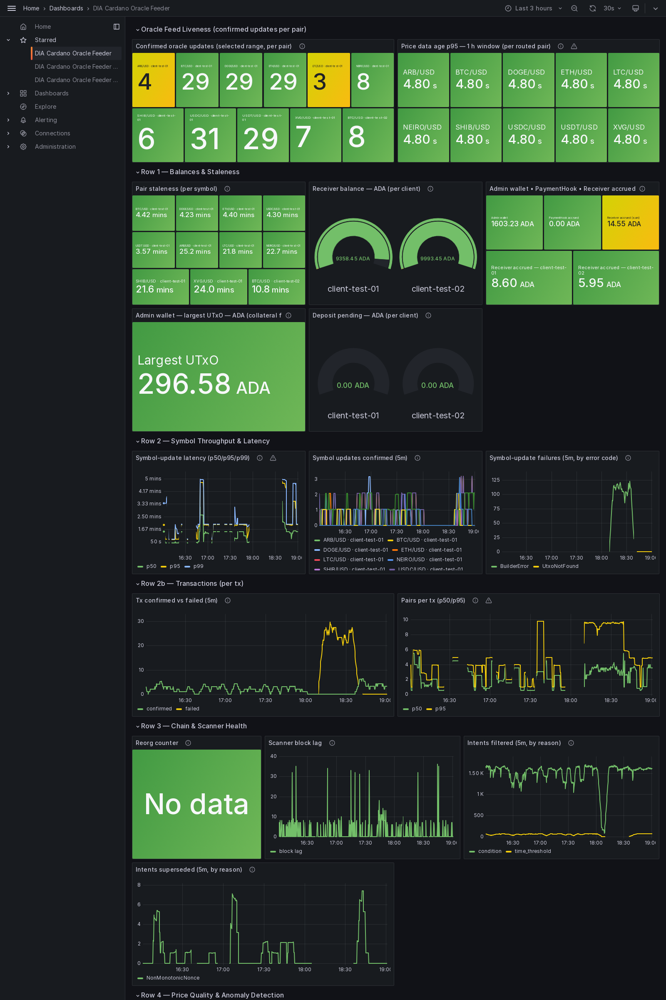

The operational home base: liveness, money, latency, health, accuracy and billing. Each panel:
**what · how to read · when to worry.**

### Row — Oracle Feed Liveness

**Confirmed oracle updates — all-time total (per pair)** · `stat`

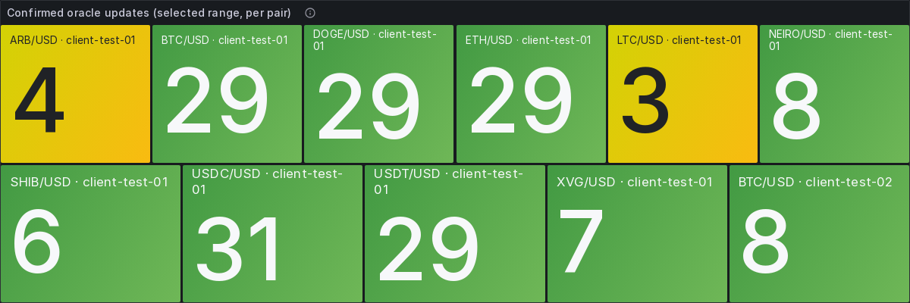
`sum by (symbol, client_id) (dia_bridge_transactions_confirmed_total{…})`

- **What it shows** — one number per feed: how many oracle updates have ever reached on-chain
  confirmation since the counter started. Keyed by `(symbol, client_id)`, so the same pair on
  two clients is two tiles.
- **How to read it** — the liveness proof. Every active feed shows a non-zero, slowly growing
  number; the legend reads `BTC/USD · client-test-01`.
- **When to worry** — a feed stuck at 0 while others climb, or a number that stopped growing for
  a feed you expect active. Cross-check *Pair staleness*.

**Price data age p95 — 1 h window (per routed pair)** · `stat`

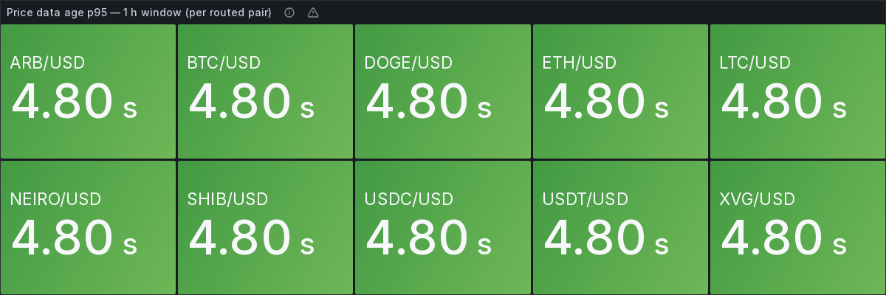
`histogram_quantile(0.95, sum by (le, symbol) (rate(dia_bridge_price_age_seconds_bucket{…}[1h])))`

- **What it shows** — in seconds, the 95th-percentile **age of the DIA source price** when the
  feeder consumed it. This is freshness *at the source*, not transaction speed. Recorded only for
  the symbols this feeder routes (not the hundreds the source carries).
- **How to read it** — lower is better; a few seconds is healthy. p95 = "95% of intents were
  fresher than this." Symbol-level (the source price is the same regardless of which client
  routes it).
- **When to worry** — climbing toward **600 s** fires `PriceAgeHigh` → the DIA source is
  publishing stale prices for a routed pair. Upstream of the feeder, not a Cardano problem.

### Row 1 — Balances & Staleness

**Pair staleness (per symbol)** · `stat` · legend `{{symbol}} · {{client_id}}`

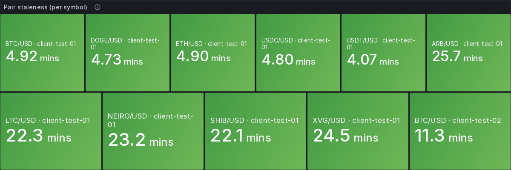
`time() - dia_bridge_cardano_oracle_last_confirmed_timestamp_seconds{…}`

- **What it shows** — for each feed, the wall-clock age of the value **currently on Cardano**
  (now minus the timestamp of its last confirmed update).
- **How to read it** — the number an oracle consumer cares about: "how old is the on-chain price
  right now." It sawtooths — climbing between updates, dropping to ~0 on each confirmation. Two
  clients serving the same pair show as two rows (`BTC/USD · client-a`, `BTC/USD · client-b`).
- **When to worry** — past **3600 s (1 h)** fires `OraclePairStale`. Usual root cause: a low
  Receiver or Admin balance (next panels), not the pipeline.

**Receiver balance — ADA (per client)** · `gauge` · legend `{{client_id}}`

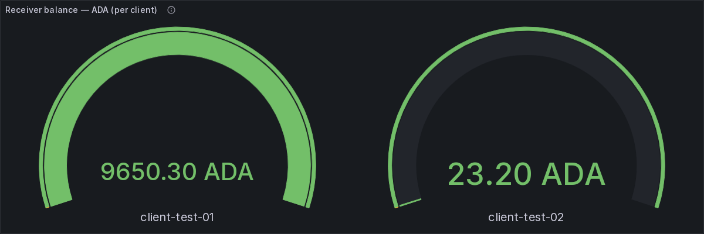
`dia_bridge_cardano_receiver_balance_lovelace{…} / 1000000`

- **What it shows** — spendable ADA in each client's Receiver UTxO. The Receiver pays the
  `protocolFee` on every update, so it **drains over time**.
- **How to read it** — a healthy Receiver sits above the low-water mark (green ≥ 10 ADA), topped
  up by side-deposits (see *Deposit pending*). One gauge per client.
- **When to worry** — below **2 ADA** (yellow→red) fires `ReceiverBalanceLow`. Action: send ADA
  to that client's deposit address (folded in automatically) or `receiver:top-up`.

**Admin wallet · PaymentHook · Receiver accrued — ADA** · `stat` (four series)

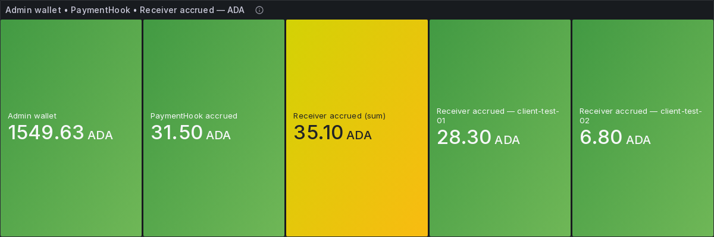
`…admin_wallet_lovelace/1e6`, `…payment_hook_accrued_lovelace/1e6`,
`sum(…receiver_accrued_lovelace)/1e6`, `sum by (client_id) (…receiver_accrued_lovelace)/1e6`

- **What it shows** — the fee money-flow: the **Admin wallet** (pays Cardano network fees), the
  **PaymentHook accrued** (protocol fees awaiting withdraw), and **Receiver accrued** both as a
  protocol-wide sum and per client.
- **How to read it** — Admin wallet drains as it pays fees; PaymentHook and Receiver-accrued grow
  as revenue accumulates. The sum series is **global** (filters don't change it); the per-client
  series splits the accrual.
- **When to worry** — Admin wallet below **5 ADA** (`AdminWalletLow`) stalls all updates → refill
  via `settle` then `payment-hook:withdraw`. Receiver accrued above **10 ADA** (`SettleOverdue`)
  → run `settle`. PaymentHook above **50 ADA** (`PaymentHookWithdrawReady`) → DIA withdraws.

**Admin wallet — largest UTxO — ADA (collateral floor)** · `stat`

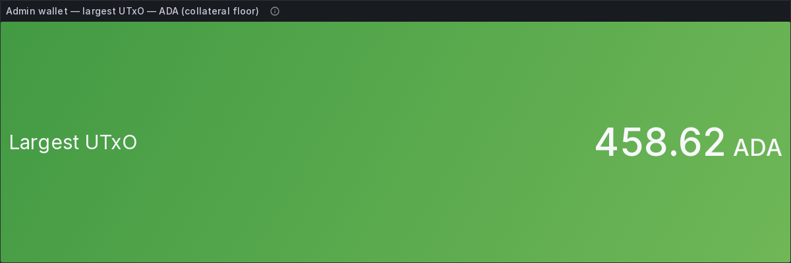
`dia_bridge_cardano_admin_wallet_max_utxo_lovelace / 1000000`

- **What it shows** — the **largest single pure-ADA UTxO** in the admin/signer wallet — not the
  total. A script tx needs a collateral UTxO distinct from its fee inputs, so this decides whether
  the wallet can still build.
- **How to read it** — green at/above the floor (**10 ADA**), red below. Global panel.
- **When to worry** — below **10 ADA** (`AdminWalletFragmented`, critical): the wallet has
  shattered into sub-collateral dust and every build traps, even if the TOTAL still looks healthy.
  The daemon auto-consolidates below `auto_consolidate_below_lovelace`; force with
  `make cli CMD="wallet:consolidate"`.

**Deposit pending — ADA (per client)** · `gauge` · legend `{{client_id}}`

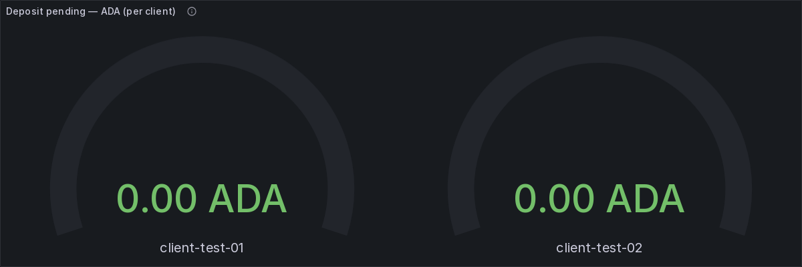
`dia_bridge_cardano_deposit_pending_lovelace{…} / 1000000`

- **What it shows** — side-deposits a client has sent to its deposit address that the feeder has
  **not yet folded** into the Receiver balance.
- **How to read it** — normally near 0: the daemon merges pending deposits automatically once the
  Receiver falls below `receiver_balance_low_lovelace` or the pile reaches
  `deposit_pending_merge_lovelace`.
- **When to worry** — a value that **keeps growing with no merges** — deposits arriving but the
  fold not happening; check the daemon logs.

### Row 2 — Symbol Throughput & Latency

**Symbol-update latency (p50/p95/p99)** · `timeseries` · seconds

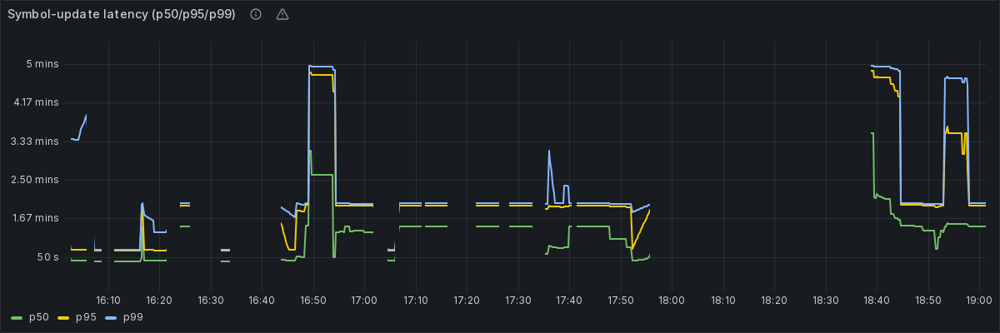
`histogram_quantile(0.50/0.95/0.99, sum by (le) (rate(dia_bridge_end_to_end_latency_seconds_bucket{…}[5m])))`

- **What it shows** — end-to-end pipeline latency **per symbol update** at the median, 95th and
  99th percentiles — from the feeder starting to process an intent to its Cardano confirmation.
- **How to read it** — p50 is the typical experience, p99 the worst 1%. Healthy = steady low
  lines with p99 not wildly above p50. For the per-stage breakdown see the Transactions dashboard.
- **When to worry** — a rising p95/p99, or a widening p50↔p99 gap (most updates fine but a tail
  getting slow — often Cardano settlement or a congested lane).

**Symbol updates confirmed (5m)** · `timeseries` · legend `{{symbol}} · {{client_id}}`

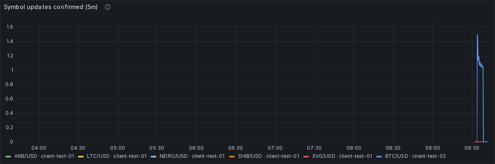
`sum by (symbol, client_id) (increase(dia_bridge_transactions_confirmed_total{…}[5m]))`

- **What it shows** — a rolling 5-minute **count** (not a rate) of confirmed updates per feed.
- **How to read it** — bars/lines present for active feeds. Gaps are normal (the policy gate
  suppresses unchanged prices on purpose — see *Intents filtered*).
- **When to worry** — a feed flatlining at 0 well past its expected cadence while *Intents
  filtered* keeps rising for it.

**Symbol-update failures (5m, by error code)** · `timeseries` · legend `{{error_code}}`

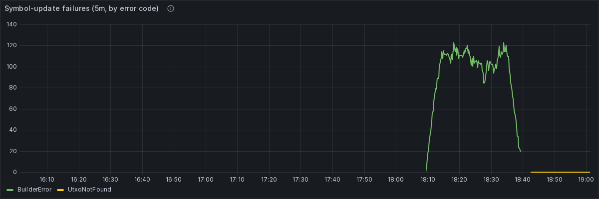
`sum by (error_code) (increase(dia_bridge_transactions_failed_total{…}[5m]))`

- **What it shows** — 5-minute count of **real** failed updates, grouped by error code. Superseded
  no-ops (`NonMonotonicNonce`, no tx, no fee) are excluded — they live in
  `dia_bridge_intents_superseded_total{reason}`.
- **How to read it** — every code here is a genuine submission problem. Codes documented in
  `offchain/feeder/src/errors/codes.ts`. Use the **Error code** filter to isolate one.
- **When to worry** — any code appearing repeatedly.

### Row 2b — Transactions (preview)

> Two panels mirrored from the Transactions dashboard for convenience — the only panels in this
> row counted **per transaction**, not per symbol. Full detail in § 5.

**Tx confirmed vs failed (5m)** · `timeseries` — `sum by (outcome) (increase(dia_bridge_transactions_total{…}[5m]))`.
Confirmed should dominate; a rising failed line is the warning.

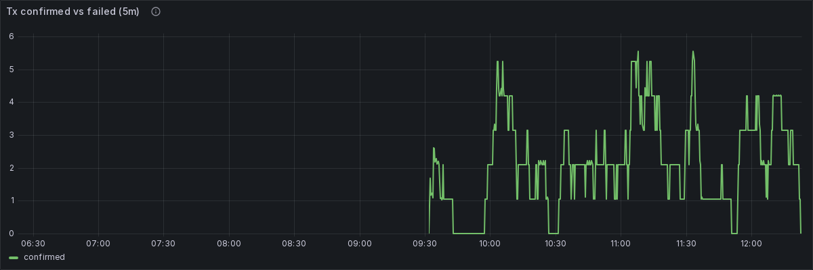

**Pairs per tx (p50/p95)** · `timeseries` — the **batch size** (pairs per tx) at median and 95th;
higher = more amortized fees per pair.

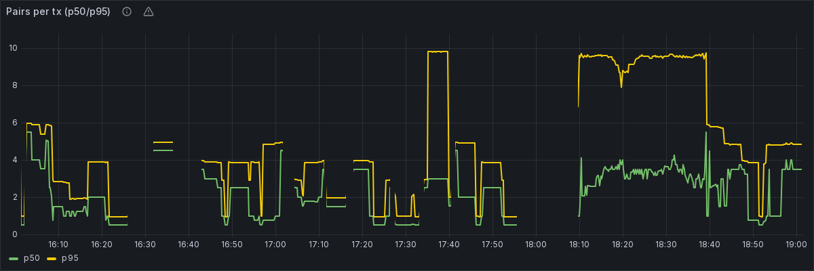

### Row 3 — Chain & Scanner Health

**Reorg counter** · `stat` — `sum(increase(dia_bridge_transactions_reorg_total{…}[1h]))`

- **What it shows** — confirmed txs dropped by a Cardano reorg in the last hour.
- **How to read it** — should sit at **0**; depth-1 reorgs are rare but possible — the feeder
  detects and re-submits.
- **When to worry** — sustained **> 3/h** fires `ReorgRateHigh` → check provider lag + scanner lag.

**Scanner block lag** · `timeseries` · global — `dia_bridge_scanner_block_lag`

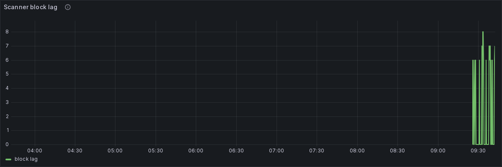

- **What it shows** — blocks behind the source-chain tip the DIA-side scanner currently is. One
  scanner; filters don't change it.
- **How to read it** — a small stable lag is normal (it stays a few confirmations behind by design).
- **When to worry** — a **steadily rising** lag → the scanner is falling behind and updates will lag.

**Intents filtered (5m, by reason)** · `timeseries` · legend `{{reason}}`

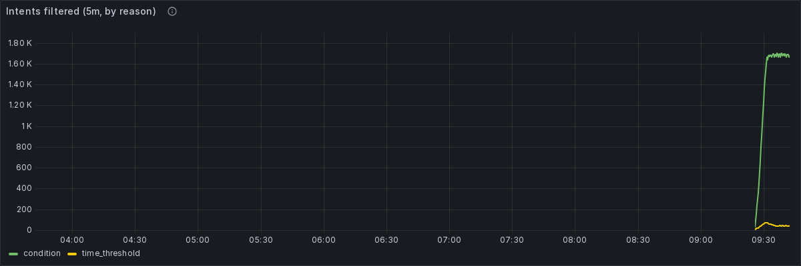
`sum by (reason) (increase(dia_bridge_intents_filtered_total{…}[5m]))`

- **What it shows** — 5-minute count of intents the feeder **deliberately suppressed** before
  submitting, by reason (`condition`, `time_threshold`, `price_deviation`, …).
- **How to read it** — **high counts here are normal and healthy:** the policy gate suppresses most
  intents on purpose (price barely moved, or within the time window). A big `condition` count just
  means most source events don't match this client's pairs.
- **When to worry** — not by itself. Read with *Symbol updates confirmed*: lots of filtering **and**
  zero confirmations for a feed that should update is the signal.

### Row 4 — Price Quality & Anomaly Detection

**Price deviation p95 — 1 h window (per pair)** · `stat` · legend `{{symbol}} · {{router_id}}`

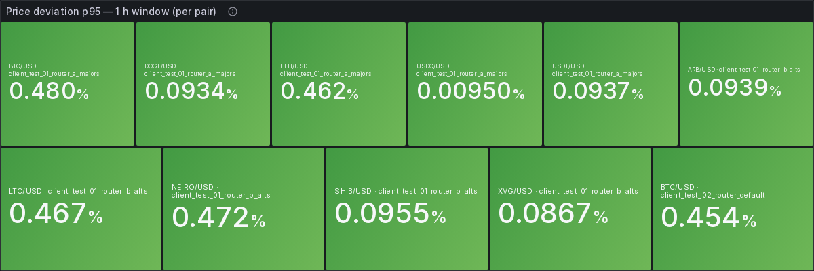
`histogram_quantile(0.95, sum by (le, symbol, router_id) (rate(dia_bridge_price_deviation_percent_bucket{…}[1h])))`

- **What it shows** — per feed, the 95th-percentile **% move** between consecutive prices measured
  at gate time (`|new − last| ÷ last × 100`). Keyed by `router_id` (the metric has no `client_id`),
  which still separates the two BTC feeds since each is on a distinct router.
- **How to read it** — small percentages (well under a percent) = a calm market; green = within
  bounds.
- **When to worry** — p95 above **5%** fires `PriceDeviationHigh` → investigate the DIA source for a
  possible misreport.

**Price deviation distribution (heatmap)** · `heatmap`

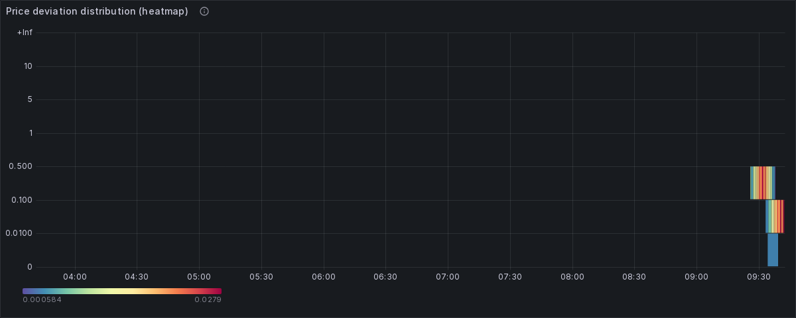
`sum by (le, symbol, router_id) (rate(dia_bridge_price_deviation_percent_bucket{…}[5m]))`

- **What it shows** — the full **distribution** of price-deviation percentages over time: y-axis =
  deviation buckets, colour = frequency.
- **How to read it** — a healthy feed shows a bright band hugging the **bottom (near 0%)**.
- **When to worry** — the band **drifting upward** or a **vertical smear** toward higher deviations
  → prices moving more than usual (market event or source anomaly); cross-check the p95 stat.

**Feed sanity verdict (per pair)** · `stat` · legend `{{symbol}} · {{client_id}}`

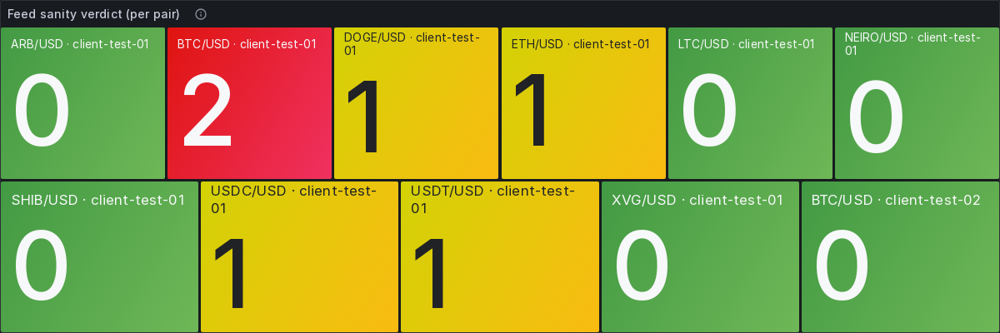
`max by (symbol, client_id) (dia_bridge_feed_sanity_status{…})`

- **What it shows** — the periodic feed-sanity check's verdict: the **live on-chain value vs the
  latest DIA source value**, judged against that feed's push-policy thresholds. **0 = ok (green) /
  1 = suspect (yellow) / 2 = broken (red)**, per `(symbol, client_id)`.
- **How to read it** — all feeds should be green. This is the only panel that compares on-chain
  against the source directly (price age/deviation are gate-time, not a post-hoc reconcile).
- **When to worry** — a sustained **2** fires `FeedAccuracyFail`: the on-chain value drifted past
  tolerance AND went stale. Inspect with `npm run sanity:feeds`; confirm the feeder still publishes
  that pair and the source delivers fresh intents.

### Row 5 — Billing (per client / customer)

**Tx fee p50 — lovelace (per customer)** · `timeseries` · legend `{{customer_id}}`

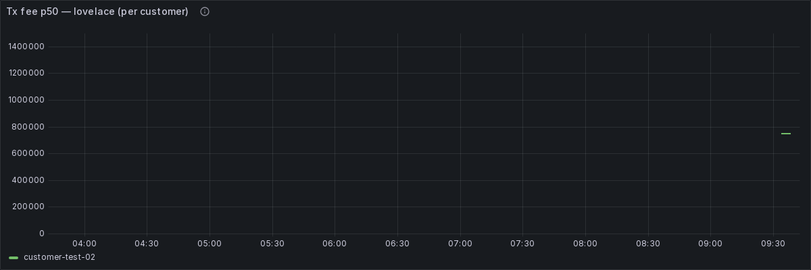
`histogram_quantile(0.50, sum by (le, customer_id) (rate(dia_bridge_transaction_fee_lovelace_bucket{…}[5m])))`

- **What it shows** — the **median Cardano network fee** (lovelace; 1 ADA = 1,000,000) paid per
  oracle-update tx, grouped by customer — the basis for per-customer cost attribution.
- **How to read it** — a batch of N pairs is one tx and one fee observation, so batching lowers the
  per-pair cost. One line per customer.
- **When to worry** — a sustained climb in the median (Cardano fee-market pressure, or batches
  shrinking so each pair carries more fixed cost).

**Tx involving router (5m, by router & outcome)** · `timeseries` · legend `{{router_id}} · {{outcome}}`

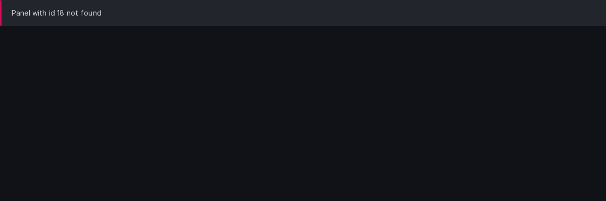
`sum by (router_id, outcome) (increase(dia_bridge_transaction_router_membership_total{…}[5m]))`

- **What it shows** — which **routers** contributed at least one member to a transaction, split
  confirmed vs failed. With multiple routers per client this shows their relative activity.
- **How to read it** — one line per `(router_id, outcome)`. A router going silent that should be
  active is the signal.
- **When to worry** — a router with repeated `failed` memberships.

### Row 6 — Provider Health

**Cardano provider health — primary vs secondary (1 = up)** · `stat` · legend `{{component}} ({{role}})`

`dia_bridge_component_health{component=~"blockfrost|koios", …}`

- **What it shows** — the health of the **two Cardano API providers**, by role. **PRIMARY** is the
  provider lucid uses to build/sign/submit (selected by `CARDANO_PROVIDER`); **SECONDARY** backs
  confirmation and reorg checks. `1` = up, `0` = down. Global panel.
- **How to read it** — the role follows `CARDANO_PROVIDER`, so the panel always labels whichever
  provider actually builds as `primary`. Primary is measured passively from calls the feeder
  already makes; secondary is probed actively.
- **When to worry** — **primary down** (`PrimaryProviderDown`, critical): nothing can be built,
  every feed freezes together — classically a Blockfrost `402 Payment Required` (quota). Rotate
  `BLOCKFROST_PROJECT_ID_<NET>` / `KOIOS_API_URL_<NET>` or switch `CARDANO_PROVIDER`, then
  `make restart`. **Secondary down** (`SecondaryProviderDown`, warning): redundancy lost only.

## 5. Dashboard 2 — Transactions (`dia-cardano-feeder-tx`)

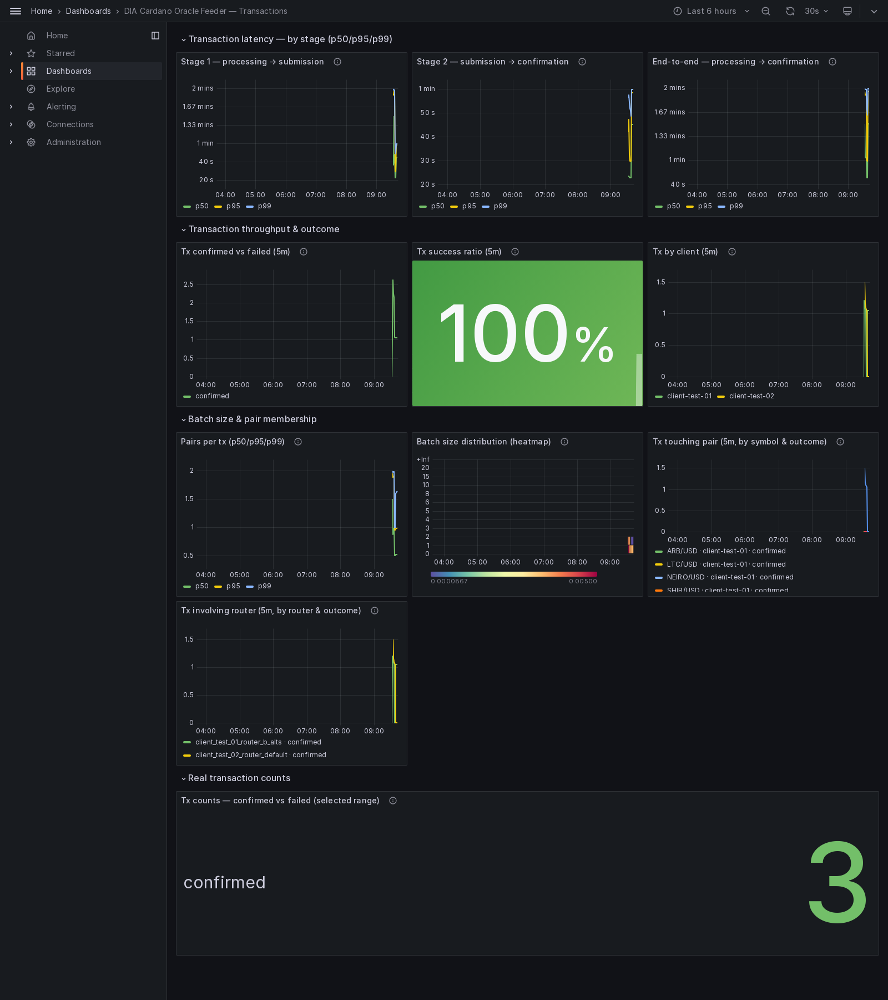

Everything here is counted **per transaction** (a batch of N pairs is ONE tx). Filtered by
Customer / Client (and Symbol on the membership panel).

### Row T1 — Transaction latency by stage

Decomposes the end-to-end transaction time so you can tell **where** time is spent.

**Stage 1 — processing → submission (p50/p95/p99)** · `timeseries` · seconds

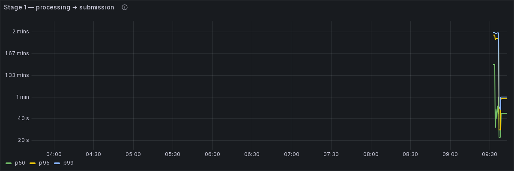
`histogram_quantile(…, rate(dia_bridge_tx_processing_to_submission_seconds_bucket{…}[5m]))`

- **What it shows** — time to **build, queue and sign** a tx before broadcast — the feeder's own
  work, before Cardano is involved.
- **How to read it** — should be short and stable; this is the part the feeder controls.
- **When to worry** — a rising p95/p99 → a busy lane or slow build/UTxO-fetch inside the feeder.

**Stage 2 — submission → confirmation (p50/p95/p99)** · `timeseries` · seconds

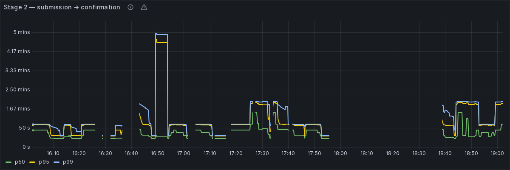
`…tx_submission_to_confirmation_seconds_bucket…`

- **What it shows** — **pure Cardano settlement**: broadcast → on-chain confirmation (at
  `confirmation_depth`, default 1 block).
- **How to read it** — tracks the chain, not the feeder; expect roughly one block's time.
- **When to worry** — sustained increase = the network is slow to confirm or the provider lags.

**End-to-end — processing → confirmation (p50/p95/p99)** · `timeseries` · seconds

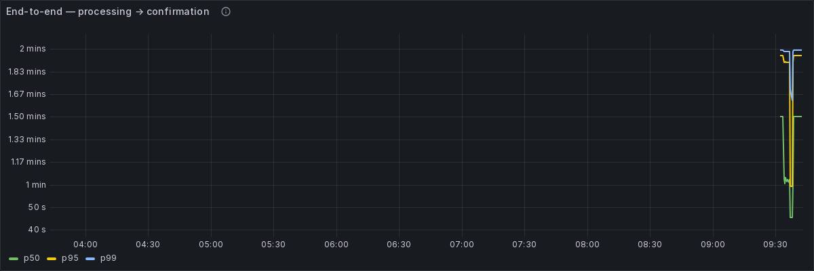
`…tx_end_to_end_seconds_bucket…`

- **What it shows** — Stage 1 + Stage 2 combined: total per-transaction latency.
- **How to read it** — the headline tx latency; compare its shape to the two stages to see which
  dominates.
- **When to worry** — rising end-to-end → look at the stage panels to attribute feeder-side vs
  chain-side.

### Row T2 — Transaction throughput & outcome

**Tx confirmed vs failed (5m)** · `timeseries` · legend `{{outcome}}`

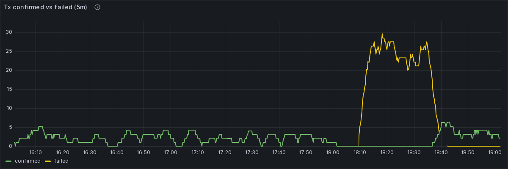
`sum by (outcome) (increase(dia_bridge_transactions_total{…}[5m]))`

- **What it shows** — transactions per 5 min by outcome, counted once per tx. Condemned no-ops
  excluded.
- **How to read it** — confirmed should dominate; failed near zero.
- **When to worry** — any sustained failed line; pair with the success-ratio stat.

**Tx success ratio (5m)** · `stat` · percent

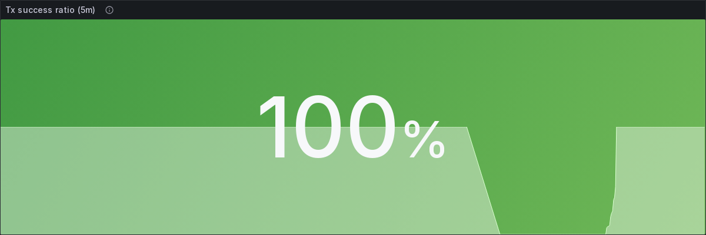
`100 * confirmed / total over dia_bridge_transactions_total[5m]`

- **What it shows** — confirmed as a % of all real attempts (confirmed + failed); superseded
  no-ops excluded from both terms.
- **How to read it** — should sit at/near **100%**. **Idle window = "No data"** (the denominator
  is 0), not `0%`.
- **When to worry** — a real value below ~**95%** sustained → a genuine submission problem
  (failures panel + `make logs`).

**Tx by client (5m)** · `timeseries` · legend `{{client_id}}`

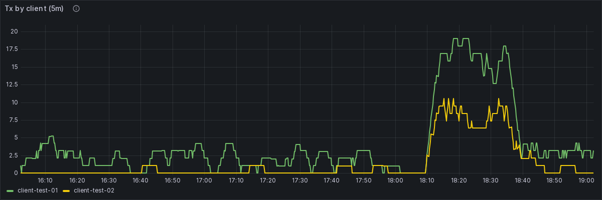
`sum by (client_id) (increase(dia_bridge_transactions_total{…}[5m]))`

- **What it shows** — transactions per 5 min grouped by client (receiver identity).
- **How to read it** — how tx load is distributed across clients; one line per client.
- **When to worry** — a client that should be active going silent, or one unexpectedly dominating.

### Row T3 — Batch size & pair membership

**Pairs per tx (p50/p95/p99)** · `timeseries`

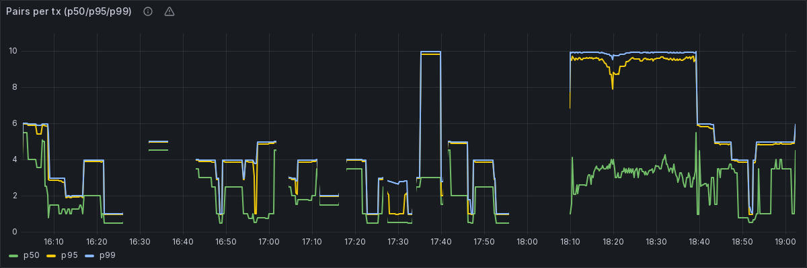
`histogram_quantile(…, rate(dia_bridge_transaction_pairs_bucket{…}[5m]))`

- **What it shows** — the batch-size distribution: pairs per tx at median, 95th, 99th.
- **How to read it** — higher batch sizes amortize the fixed Cardano fee over more pairs → cheaper
  per pair. The lever behind the billing panel.
- **When to worry** — batch size collapsing toward 1 when you expect coalescing → per-pair fees rise.

**Batch size distribution (heatmap)** · `heatmap`

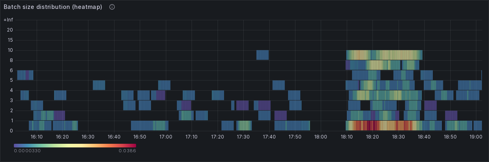
`sum by (le) (rate(dia_bridge_transaction_pairs_bucket{…}[5m]))`

- **What it shows** — the same batch-size data as a heatmap over time; bright bands = the typical
  batch size.
- **How to read it** — a stable bright band at your expected batch size is healthy.
- **When to worry** — the band sliding toward 1 (less batching) or becoming erratic.

**Tx touching pair (5m, by symbol & outcome)** · `timeseries` · legend `{{symbol}} · {{client_id}} · {{outcome}}`

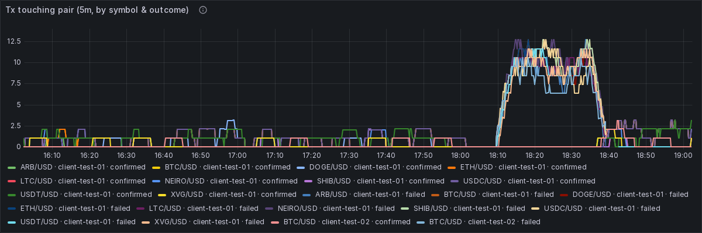
`sum by (symbol, client_id, outcome) (increase(dia_bridge_tx_pair_membership_total{…}[5m]))`

- **What it shows** — one increment per (tx, pair): which transactions included a given pair, split
  confirmed vs failed. Keyed by `client_id` too, so the same pair on two clients stays distinct.
- **How to read it** — filter by `$symbol` to answer "which transactions carried BTC/USD for this
  client, and did they confirm?"
- **When to worry** — a pair showing failed memberships repeatedly.

**Tx involving router (5m, by router & outcome)** · `timeseries` · legend `{{router_id}} · {{outcome}}`

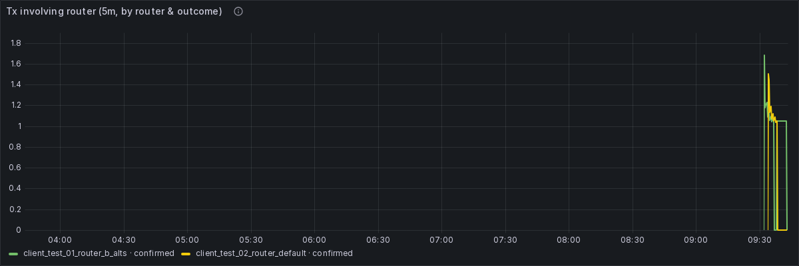
`sum by (router_id, outcome) (increase(dia_bridge_transaction_router_membership_total{…}[5m]))`

- **What it shows** — which routers contributed to transactions, confirmed vs failed (same metric
  as the Overview billing-row panel, here on the per-tx axis).
- **How to read it** — one line per `(router_id, outcome)`.
- **When to worry** — a router with repeated failures, or one silent that should be active.

### Row T4 — Real transaction counts

**Tx counts — confirmed vs failed (selected range)** · `stat`

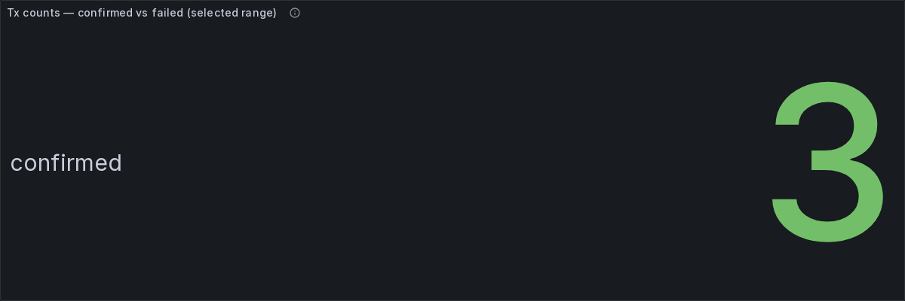
`sum(increase(dia_bridge_transactions_total{outcome="confirmed"|"failed", …}[$__range]))`

- **What it shows** — the **raw count** of real Cardano transactions over the dashboard's selected
  time range: confirmed (green) and failed (red), once per tx. No averages, no ratios.
- **How to read it** — `$__range` is the time picker, so the counts are the totals for the window
  you selected. Superseded no-ops and crash-recovery rows are not transactions and are not counted.
- **When to worry** — a non-trivial `failed` count → cross-check the failures-by-error-code panel
  and `make logs`.

## 6. Dashboard 3 — Internals (`dia-cardano-feeder-internals`)

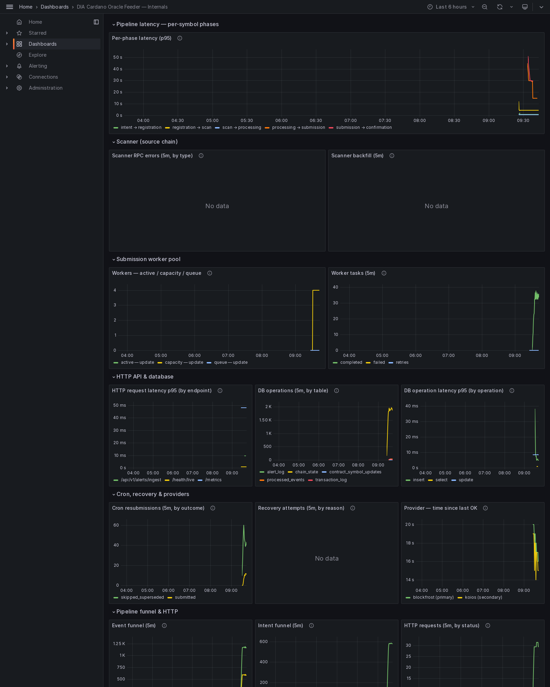

Feeder-internal observability (filtered by `network` only) — for troubleshooting the feeder
itself rather than the feeds.

**Per-phase latency (p95)** · `timeseries` · seconds

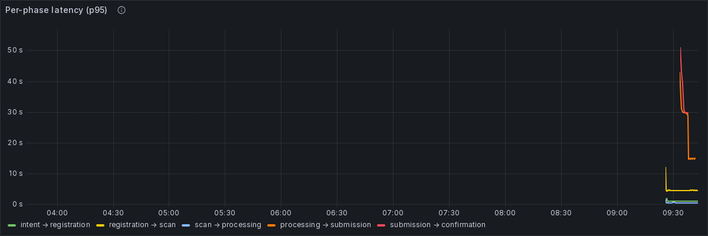
`histogram_quantile(0.95, … intent_to_registration / registration_to_scan / scan_to_processing / processing_to_submission / submission_to_confirmation …)`

- **What it shows** — the pipeline latency split into phases 1–5 (DIA/EVM → registration → scan →
  processing → submission → confirmation).
- **How to read it** — one line per phase; isolates **where** latency lives (source, transport,
  internal backlog, or Cardano).
- **When to worry** — a single phase climbing tells you the culprit layer (e.g. phase 5 rising =
  Cardano settlement, not the feeder).

**Scanner RPC errors (5m, by type)** · `timeseries` — `sum by (error_type) (increase(dia_bridge_scanner_rpc_errors_total{…}[5m]))`

- **What it shows** — scanner RPC/WS errors against the source chain, by type. **When to worry:**
  a sustained non-zero rate → an unhealthy RPC endpoint; expect scanner lag to follow.

**Scanner backfill (5m)** · `timeseries` — `increase(dia_bridge_scanner_backfill_blocks_total / _chunks_total[5m])`

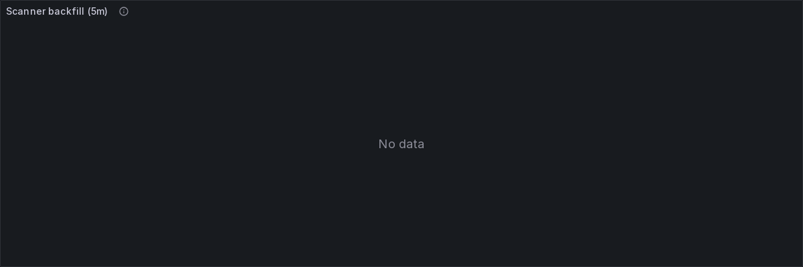

- **What it shows** — blocks/chunks backfilled after a detected gap (> `max_block_gap`). **When to
  worry:** repeated backfilling = the scanner keeps falling behind and recovering (connectivity).

**Workers — active / capacity / queue** · `timeseries`

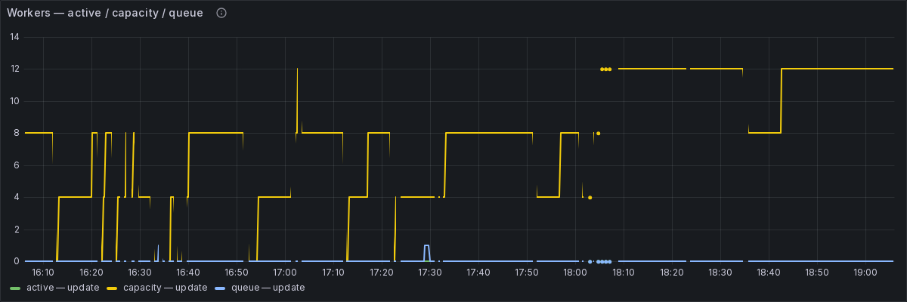
`dia_bridge_active_workers / worker_pool_size / worker_queue_size {pool_type="update"}`

- **What it shows** — the submission worker pool's occupancy: workers busy, configured capacity, and
  the queue depth.
- **How to read it** — active below capacity with a near-zero queue is healthy.
- **When to worry** — a queue that stays full (active pinned at capacity) = backpressure; submissions
  are arriving faster than they drain.

**Worker tasks (5m)** · `timeseries` — `increase(dia_bridge_worker_tasks_completed_total{pool_type}[5m])`.

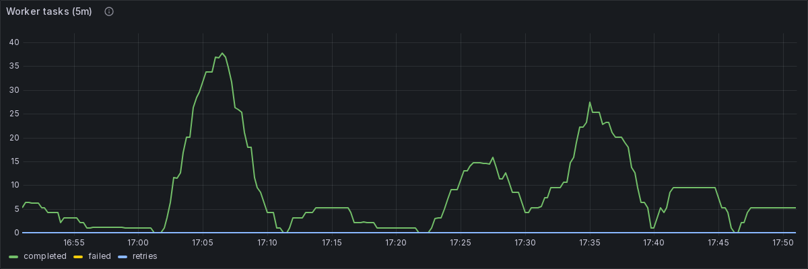
Tasks completed by the pool; should track throughput. A drop to 0 while intents arrive = the pool
stalled.

**HTTP request latency p95 (by endpoint)** · `timeseries` — `histogram_quantile(0.95, … dia_bridge_http_request_duration_seconds_bucket …)`.

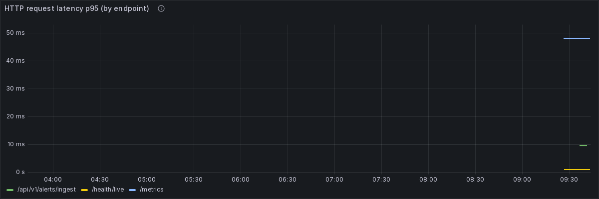
API responsiveness per endpoint. **When to worry:** a slow `/metrics` or health endpoint can trip
Docker health checks.

**DB operations (5m, by table)** · `timeseries` — `sum by (table) (increase(dia_bridge_db_operations_total{…}[5m]))`.

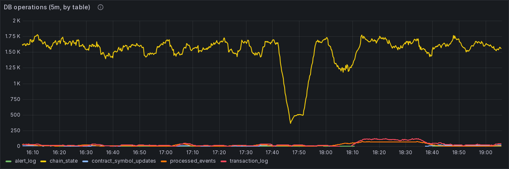
Database load by table, from the `instrumentDb` wrapper. A sudden spike/stall is worth a look.

**DB operation latency p95 (by operation)** · `timeseries` — `histogram_quantile(0.95, … dia_bridge_db_operation_duration_seconds_bucket …)`.

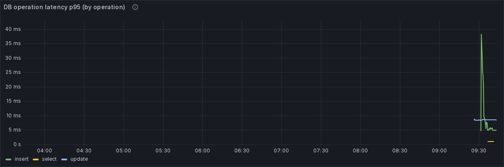
Per-operation DB latency. **When to worry:** rising latency → disk pressure or a hot table.

**Cron resubmissions (5m, by outcome)** · `timeseries` — `sum by (outcome) (increase(dia_bridge_cron_resubmissions_total{…}[5m]))`.

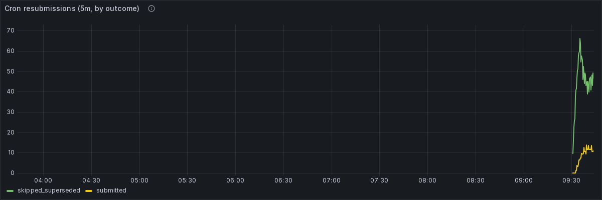
Cron decisions (`submitted`, `skipped_already_fresh`, `skipped_superseded`, …): shows whether the
heartbeat is working and **why** it skips. Mostly-`skipped_already_fresh` is healthy.

**Recovery attempts (5m, by reason)** · `timeseries` — `sum by (reason) (increase(dia_bridge_recovery_attempts_total{…}[5m]))`.

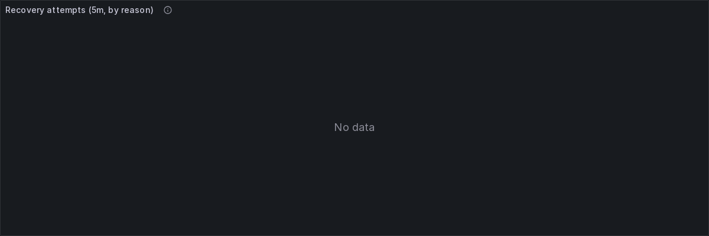
Recovery events (e.g. crash recovery on startup). **When to worry:** a steady stream = the daemon is
restarting/looping (see the WASM self-exit guard); it erodes uptime.

**Provider — time since last OK** · `timeseries` — `time() - dia_bridge_provider_last_ok_timestamp_seconds{role}`.

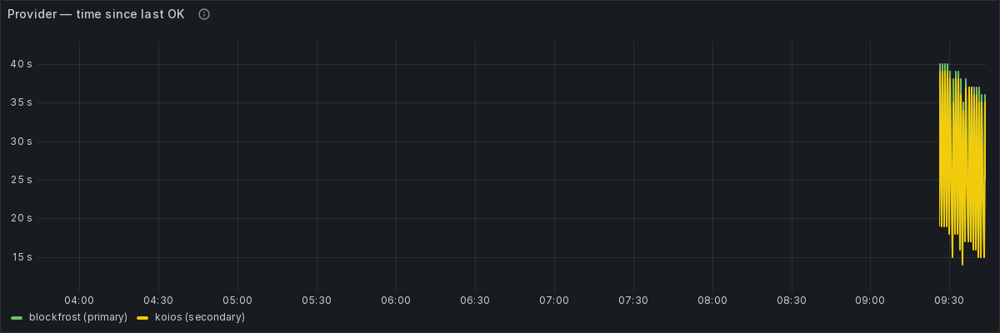
Seconds since each provider last succeeded — the signal the provider-down alerts watch. **When to
worry:** primary crossing **600 s** / secondary **900 s**.

### Pipeline funnel & HTTP

**Event funnel (5m)** · `timeseries` — `increase(dia_bridge_events_{detected,duplicate,invalid}_total[5m])`

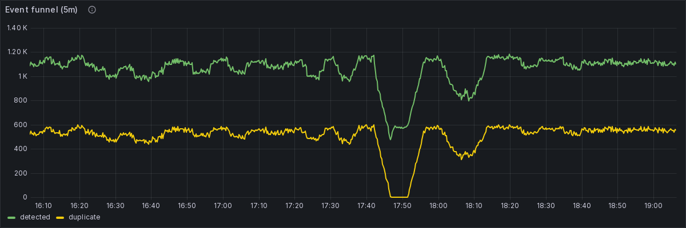

- **What it shows** — inbound event flow: raw events **detected**, dropped as **duplicate** (seen on
  both HTTP and WS, or a re-scan), rejected as **invalid** (decode/enrich failed).
- **When to worry** — invalid climbing → malformed source data; duplicate dominating → transport
  churn (reconnects).

**Intent funnel (5m)** · `timeseries`

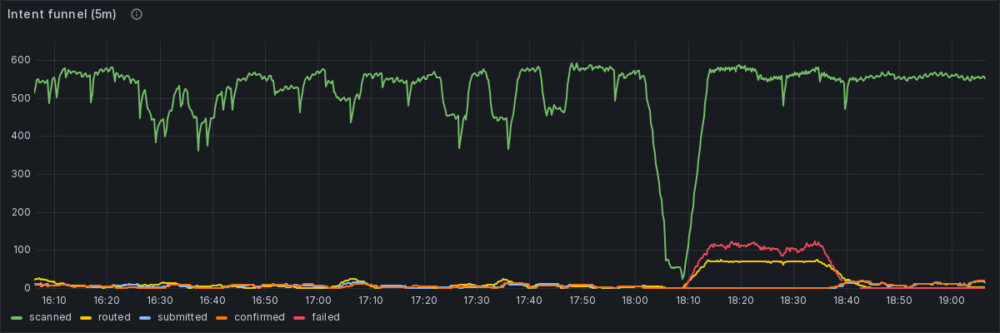
`increase(dia_bridge_intents_scanned_total → intents_routed_total → transactions_submitted_total → transactions_confirmed_total → transactions_failed_total [5m])`

- **What it shows** — where intents drop off: **scanned** (entered routing) → **routed** (accepted by
  a destination) → **submitted** (broadcast) → **confirmed / failed**.
- **How to read it** — the best single panel for "intents are arriving but nothing confirms": the
  stage where the line collapses is the culprit (e.g. routed but never submitted → a lane/queue
  problem; submitted but never confirmed → Cardano/provider).
- **When to worry** — a big gap between adjacent stages.

**HTTP requests (5m, by status)** · `timeseries` — `sum by (status) (increase(dia_bridge_http_requests_total{…}[5m]))`.

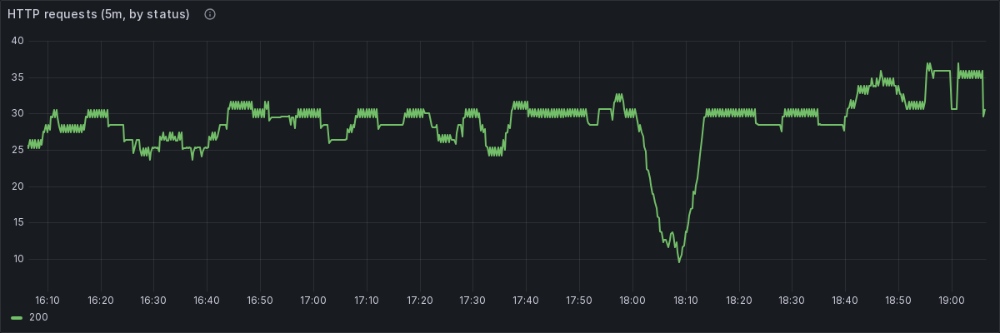
API request counts by HTTP status (pairs with the latency panel: how many, not just how long). A
rising 5xx rate is the worry.

## 7. How alerts surface visually

An alert condition shows up in three places, all from one pipeline (feeder metrics → Prometheus
rules → Alertmanager → feeder webhook → `alert_log`):

- **Grafana panels** — the panel that owns the metric turns **yellow then red** at the configured
  threshold steps (e.g. Pair staleness red at 3600 s, Feed sanity red at 2). The colours are
  generated from the same `alerting.*` thresholds as the rules.
- **Prometheus** `/alerts` (<http://localhost:9090/alerts>) — the rule state: `pending` (matched,
  within its `for:` window) → `firing`.
- **Alertmanager** (<http://localhost:9093>) — active alerts, grouping and silences; it posts each
  firing/resolved alert to the feeder, recorded in `alert_log` (queryable at `/api/v1/alerts`).

To see an alert fire on demand without waiting for a real incident, the
`scripts/monitoring/trigger-alert.sh` harness pushes a synthetic value to a Pushgateway so the
**real** rule fires and flows through the whole pipeline (the pushed series is tagged
`client_id="trigger"`, so it is filterable and distinct from real feeds). See the feeder README →
*How alerts work*.

## 8. When to panic — one-page cheat sheet

Thresholds are the canonical values from `infrastructure.<network>.yaml::alerting` (mirrored into the
Prometheus rules and the Grafana panel colours; kept in sync by the threshold-drift test).

| Panel | Alert | Fires when | Default | First action |
| --- | --- | --- | --- | --- |
| Pair staleness | `OraclePairStale` | on-chain value older than | **3600 s** | Check Receiver/Admin balance + `make logs` |
| Price age p95 | `PriceAgeHigh` | source price age p95 over | **600 s** | DIA source publishing stale prices (upstream) |
| Feed sanity verdict | `FeedAccuracyFail` | verdict sustained at | **2 (broken)** | On-chain disagrees with source — `npm run sanity:feeds` |
| Receiver balance | `ReceiverBalanceLow` | balance below | **2 ADA** | Send ADA to the client's deposit address |
| Admin wallet | `AdminWalletLow` | balance below | **5 ADA** | `settle` then `payment-hook:withdraw` to refill |
| Admin wallet largest UTxO | `AdminWalletFragmented` | largest pure-ADA UTxO below | **10 ADA** | `wallet:consolidate` |
| Receiver accrued | `SettleOverdue` | accrued above | **10 ADA** | Run `settle` |
| PaymentHook accrued | `PaymentHookWithdrawReady` | accrued above | **50 ADA** | DIA `payment-hook:withdraw` |
| Price deviation p95 | `PriceDeviationHigh` | p95 deviation over | **5 %** | Investigate the DIA source |
| Reorg counter | `ReorgRateHigh` | reorgs per hour over | **3 / h** | Check provider lag + scanner block lag |
| Provider health (primary) | `PrimaryProviderDown` | primary no success for | **600 s** | Rotate the key / switch `CARDANO_PROVIDER`, `make restart` |
| Provider health (secondary) | `SecondaryProviderDown` | secondary no probe for | **900 s** | Fix/rotate its endpoint in `feeder/.env`, `make restart` |
| Tx success ratio | _(watch manually)_ | confirmed/total drops | — | Failures panel + `make logs` |
| Scanner block lag | _(watch manually)_ | lag keeps climbing | — | Provider/connectivity check |

## 9. Concepts the charts assume

**Symbol updates vs transactions (the batch factor).** One transaction can carry many pairs.
Overview counts in **symbol updates**; the Transactions dashboard counts in **transactions**. A
"5 updates / 1 tx" reading is a batch of 5, not a discrepancy.

**The same symbol on more than one client.** A symbol can run on multiple independent clients;
per-pair panels key by `(symbol, client_id)` so each on-chain feed is a distinct series (see § 3.2).

**Confirmation depth.** A tx is *confirmed* once observed at `cardano.confirmation_depth` blocks
deep (default **1**) — probabilistically final, sufficient for a price feed. Higher depths (3–5)
buy practical finality at the cost of latency. Detail: README → *What "confirmed" means*.

## 10. Screenshots

The images embedded above (`img/`) were rendered by the Grafana image renderer from a live
multi-customer Preview deployment (two customers, two clients, three routers — including the same
symbol served by two clients), so the per-pair panels show the `symbol · client_id` split this
guide describes.

To refresh them after a dashboard change, with the monitoring stack up (`make up MONITORING=1`),
re-render each panel via the renderer endpoint
(`/render/d-solo/<uid>/x?panelId=<id>&width=1200&height=400&tz=UTC`) into `img/`, or capture a
point-in-time set with `make evidence3` (which also writes dashboard PNGs into the M3 evidence
pack's `dashboards/` directory).
