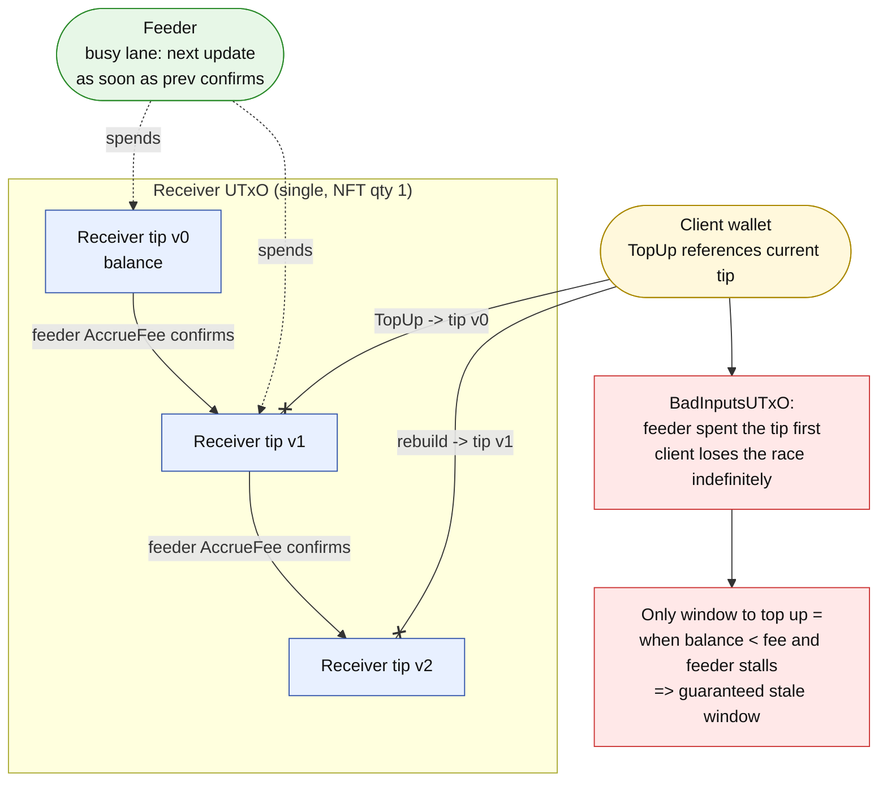

# Receiver Concurrency & Update-Griefing — Discussion Note

**Date:** 2026-06-05 · **Status:** draft for DIA review · **Audience:** DIA + PROTOFIRE
**Scope:** two issues on the per-client Receiver UTxO that are NOT bugs in the current
contracts but are design/operational concerns worth a joint decision before Mainnet.

This note is deliberately a *discussion* document, not a remediation PR. Each issue
states the current behaviour (grounded in code), the concern, concrete scenarios, and a
menu of options with trade-offs. No option is chosen here — that is the point of the
review.

## Contents

- [Receiver Concurrency \& Update-Griefing — Discussion Note](#receiver-concurrency--update-griefing--discussion-note)
  - [Contents](#contents)
  - [Background: the single-NFT Receiver model](#background-the-single-nft-receiver-model)
  - [Issue 1 — Top-up vs update contention on the Receiver UTxO](#issue-1--top-up-vs-update-contention-on-the-receiver-utxo)
    - [Current behaviour](#current-behaviour)
    - [The concern](#the-concern)
    - [Why the "two UTxOs" idea is the right direction but needs a contract change](#why-the-two-utxos-idea-is-the-right-direction-but-needs-a-contract-change)
    - [Options for Issue 1 (trade-offs)](#options-for-issue-1-trade-offs)
  - [Issue 2 — Active update-griefing with valid DIA intents](#issue-2--active-update-griefing-with-valid-dia-intents)
    - [Why it is possible](#why-it-is-possible)
    - [Attack variants and attacker benefit](#attack-variants-and-attacker-benefit)
    - [Options for Issue 2 (trade-offs, no decision)](#options-for-issue-2-trade-offs-no-decision)
  - [How the two issues compound](#how-the-two-issues-compound)
  - [Open questions for DIA](#open-questions-for-dia)
  - [Prioritised recommendation (for discussion, not a decision)](#prioritised-recommendation-for-discussion-not-a-decision)

---

## Background: the single-NFT Receiver model

Each onboarded client has **exactly one** canonical Receiver UTxO, identified by a
**Receiver NFT (quantity 1, fixed asset name)**. Every operation that touches client
balance — `TopUp`, `AccrueFee` (price update), `Settle`, `Withdraw`, `UpdateMinUtxo` —
**spends that single UTxO and recreates it** with the NFT on the continuation output.

Confirmed in code:

- The spend validator locates the continuation by NFT and requires `qty 1` on input
  **and** output (`contracts/aiken/validators/receiver.ak:68-89`).
- The Receiver datum is `{ balance_lovelace, accrued_to_hook_lovelace, min_utxo_lovelace }`
  and the fee moves `balance → accrued_to_hook` on the *same* UTxO
  (`contracts/aiken/lib/dia_cardano_oracle/receiver_logic.ak:6-12,60-72`).
- The coordinator finds the Receiver input/output **by NFT** during fee accrual
  (`valid_receiver_accrue_fee`, `contracts/aiken/validators/update_coordinator.ak:87-136`).
- The price update requires **no signature from the tx submitter**; authority is the DIA
  signature on the intent (architecture §5.8, "Signers: none required by validators").
- The off-chain top-up spends precisely that one NFT-bearing UTxO
  (`offchain/cli/src/transactions/receiver-top-up.ts:62-120`, `collectFrom([currentReceiverUtxo], ...)`).

**Consequence that drives both issues:** the Receiver is a *single, shared, contended*
UTxO, and the party allowed to spend it for an update is *anyone holding a valid signed
intent*.

---

## Issue 1 — Top-up vs update contention on the Receiver UTxO

### Current behaviour

`TopUp` (§5.5) and `AccrueFee` (§5.8/§5.9) both spend the **same** Receiver UTxO. The
feeder serialises its own updates per lane `(client_state, protocol_state)` (feeder.md
§5, "the UTxO lock"), but a client's top-up transaction is built **out of band** by the
client/operator and is not part of that lane's serial queue.

### The concern

When the feeder is continuously producing updates for a client (a busy lane that starts
the next update as soon as the previous one confirms), the client cannot reliably get a
top-up to land:

1. While `balance_lovelace > fee`, the feeder keeps spending the Receiver UTxO. Each
   confirmed update moves the canonical UTxO to a new tip (new `OutputReference`).
2. A client top-up references the current tip. Before it is accepted, the feeder's next
   update consumes that tip → the top-up input is already spent → the top-up tx fails
   (`BadInputsUTxO`) and must be rebuilt against the new tip.
3. On a saturated lane the client can lose this race indefinitely.

**The perverse self-stall:** the client can effectively *only* top up once the balance
has fallen below the next fee — at that point `accrue_fee_transition` fails
(`fee_lovelace <= previous.balance_lovelace`,
`receiver_logic.ak:67`), the feeder's updates stop, the lane goes idle, and only then is
there a window for the top-up. So the prepaid-balance model, whose whole purpose is
*uninterrupted* updates, forces a **guaranteed stale window on every refill cycle**,
exactly when the client wanted seamlessness.

**Current situation and the block (both parties fight over one UTxO):**



### Why the "two UTxOs" idea is the right direction but needs a contract change

The intuition (keep ≥ 2 balance UTxOs; the feeder draws from one while the client tops
up another; roles rotate as each drains) is sound — it is **double-buffering** and it
removes the contention because the feeder and the client never touch the same UTxO at the
same time.

But it is **not possible today without changing the contracts**, because the single-NFT
invariant pins balance to one UTxO:

- `AccrueFee`, `TopUp`, and the coordinator's `valid_receiver_accrue_fee` all require the
  Receiver **NFT qty 1** on the spent input and the continuation output. Only one UTxO
  can carry the NFT.
- A second, NFT-less "balance shard" cannot be used for fee accrual as the validators
  stand, and `accrued_to_hook_lovelace` accounting currently lives on the one NFT UTxO.

A shard model therefore implies real redesign: allow N balance UTxOs (NFT-bearing or a
new shard token), decide where `accrued_to_hook` lives per shard, and make `Settle`
aggregate accrued across shards.

### Options for Issue 1 (trade-offs)

- **Option A — Side-deposit + feeder merge. ⭐ RECOMMENDED.**
  A per-client **deposit script address**. Clients fund their balance with an **ordinary
  wallet payment** to that address — **no CLI, no SDK, no datum, no script knowledge**. The
  feeder later sweeps the accumulated deposits into the Receiver's `balance_lovelace`. This
  is the only option that gives the client a one-step "just send ADA" UX while keeping the
  guarantee on-chain.

  **Why a plain send works and is safe (Plutus V3 specifics):**
  - In Plutus V3 the spend validator's datum argument is an `Option` (cf.
    `receiver.ak:58`, `maybe_datum: Option<...>`), so the ledger can present a
    **datum-less** script UTxO to the validator as `None`. A normal wallet payment (which
    attaches no datum) therefore lands as a **spendable** deposit UTxO — it is *not* stuck,
    unlike a datum-less UTxO at the current Receiver address whose validator does
    `expect Some(...)`.
  - Security comes from the **spend condition, not a datum**: the deposit validator only
    authorises a spend if the **same tx consumes the canonical Receiver UTxO (identified by
    the Receiver NFT) and increases its `balance_lovelace` by at least the swept ADA**.
    So a deposit cannot be stolen — the only thing anyone can do by spending it is credit
    the client's own Receiver (which helps, not harms, the client).
  - **Attribution is structural:** the deposit address is **per client** (parametrised like
    `receiver`/`pair_state`), so the address itself identifies the owner and the merge can
    only credit *that* client's Receiver. No memo/tag needed.

  **Feeder work (the extra off-chain machinery this option adds):**
  - **Watch** the per-client deposit address for new UTxOs.
  - **Filter** them: accept only clean ADA-only UTxOs above min-UTxO; **skip** dust,
    native-token junk, or oversized-datum UTxOs a griefer might park there (they stay
    harmlessly at the address, they do not block the Receiver).
  - **Merge**: build a tx that consumes the Receiver UTxO + the selected deposit UTxOs and
    recreates the Receiver with `balance += Σ swept` (the deposit-collect branch / a new
    `AbsorbDeposits` redeemer), then submit it through the same serial lane so it never
    races the feeder's own updates.
  - **Trigger**: run the merge **when the Receiver balance falls below a threshold** —
    reuse the existing `receiver_balance_low` threshold (`infrastructure.<network>.yaml`
    `alerting.*`, surfaced by the `ReceiverBalanceLow` alert) rather than inventing a new
    knob. Optionally also a periodic safety sweep. Because the merge runs *before* balance
    is exhausted, the prepay stays continuous and there is no refill-time stale window.

  - *Pros:* client funds with a **normal tx, no tooling**; one canonical Receiver UTxO is
    preserved; no client/feeder race; non-custodial (guarantee is on-chain); on-chain change
    is additive (one new spend branch + one deposit validator); reuses the existing
    low-balance trigger.
  - *Cons:* deposited ADA is "inactive" until the next merge (bounded by the trigger, so it
    activates before balance runs dry); the feeder must watch/filter/sweep deposits and pay
    those sweep fees; the deposit validator must safely reject/ignore malicious deposit
    shapes (dust, tokens).

  **Option A flow (client never touches the Receiver UTxO):**

  ```mermaid
  flowchart TB
    Client([Client wallet]):::warn
    Dep["Per-client deposit address<br/>(script, datum-less UTxOs OK in V3)"]:::dep
    D1[deposit UTxO 1]:::dep
    D2[deposit UTxO 2]:::dep
    Junk["griefer dust / token junk"]:::bad

    Client -->|"ordinary wallet payment<br/>(no CLI, no datum)"| Dep
    Dep --- D1
    Dep --- D2
    Dep --- Junk

    Trigger{{"balance < receiver_balance_low"}}:::ok
    Feeder([Feeder<br/>owns the serial lane]):::ok
    Trigger --> Feeder

    Recv[Receiver UTxO<br/>NFT qty 1]:::recv
    Merge((Merge / AbsorbDeposits tx)):::tx

    Feeder -->|watch + filter<br/>skip dust/tokens| Merge
    D1 -->|swept| Merge
    D2 -->|swept| Merge
    Recv -->|spent| Merge
    Junk -. ignored, stays put .- Merge
    Merge -->|"balance += Σ swept<br/>(spend condition: must credit this Receiver)"| Recv2[Receiver UTxO<br/>balance up, NFT qty 1]:::recv

    classDef recv fill:#e8f0ff,stroke:#3355aa,color:#111
    classDef dep fill:#eef6ff,stroke:#5577bb,color:#111
    classDef ok fill:#e7f7e7,stroke:#2a8a2a,color:#111
    classDef warn fill:#fff8dc,stroke:#aa8800,color:#111
    classDef bad fill:#ffe8e8,stroke:#cc3333,color:#111
    classDef tx fill:#ffffff,stroke:#000,stroke-width:2px,color:#111
  ```

- **Option B — Balance shards / double-buffer (the original idea, formalised).**
  N Receiver balance UTxOs; the feeder uses the one with the most balance, top-up targets
  another; roles rotate as shards drain.
  - *Pros:* removes the contention at the root; truly uninterrupted prepay.
  - *Cons:* most invasive — NFT/identity model, per-shard `accrued_to_hook`, and
    cross-shard `Settle` all change; more UTxOs and exec cost; off-chain shard selection.

- **Option C — Cooperative scheduling (off-chain only).**
  The feeder voluntarily pauses the lane when it detects a queued/pending top-up, letting
  it land before resuming.
  - *Pros:* no contract change.
  - *Cons:* mitigation, not a fix — still a best-effort race against the EUTxO model;
    needs a signalling channel and adds feeder complexity.

---

## Issue 2 — Active update-griefing with valid DIA intents

This is the **active** escalation of the *passive* exclusion already recorded in
`docs/security/security-notes.md:85-89` ("Censorship resistance of updates" — a
withholding attacker). Here the attacker does not withhold; they **submit real,
validly-signed DIA intents themselves**.

### Why it is possible

- The updater is **permissionless**: validators require no signature from the submitter;
  authority is the DIA signature inside the intent (§5.8).
- DIA signatures are **public**: intents are observable as `IntentRegistered` events on
  the EVM source chain and fetched via `getIntent()` — the feeder itself reconstructs the
  `UpdateWitness` from public data (feeder.md §2-3). Anyone watching the source chain can
  build the same valid witness.
- The protocol fee is debited from the **client's** prepaid `balance_lovelace`, *not* from
  the submitter (the submitter only pays the Cardano network fee).
- Pair updates contend on the shared Receiver UTxO and the relevant Pair UTxO(s), and are
  ordered by strict monotonicity (`is_fresh_update`: `timestamp` and `nonce` strictly
  increasing).

### Attack variants and attacker benefit

The on-chain price stays "real" (DIA-signed) in all cases — the damage is to **liveness,
client economics, and timing control**, not price authenticity.

1. **Targeted economic drain.** The attacker submits valid updates, paying the network
   fee themselves but burning the client's prepaid balance via the protocol fee
   (`base_fee + N × per_pair_fee`). DIA is not harmed (it accrues the fee); the *client*
   is — their prepay evaporates faster than planned.

2. **In-flight tx invalidation / batch disruption (front-running the UTxO).** By spending
   the Receiver UTxO (and a Pair UTxO), the attacker invalidates the feeder's in-flight tx
   (its inputs are now spent). A batched 10-pair update collapses; the feeder rebuilds in
   a loop, drives up `transactions_reorg_total` / failed-tx metrics, and may fall back to
   costlier single updates (more balance burn per pair).

3. **Monotonicity lockout / timing control.** By landing the *freshest* available intent,
   the attacker can make the feeder's resubmission (e.g. an older cached intent from the
   cron / `latestIntentCache`, feeder.md §10) bounce as `NonMonotonicNonce`
   (`skipped_already_fresh`). The attacker cannot *hold the price back* (a newer signed
   intent can always advance it), but they **control which validly-signed price lands and
   when** — an MEV-like lever for a dependent consumer dApp.

4. **Terminal DoS.** Once `balance < fee`, `AccrueFee` fails for *everyone*, including the
   feeder, until a top-up lands — which (see Issue 1) is itself hard to land on a contended
   Receiver.

### Options for Issue 2 (trade-offs, no decision)

- **Option I — Gate the updater (the big lever).** Require an authorised signer (feeder /
  admin / an authorised-updater key) on the update path, in addition to the DIA intent
  signature.
  - *Pros:* eliminates the whole vector — only the feeder can drain client balance.
  - *Cons:* loses permissionless relaying / third-party censorship resistance. In this
    deployment DIA runs the feeder, so the practical value of permissionless relaying is
    debatable; this is the core policy question for DIA.

- **Option II — Minimum inter-update interval (cheap on-chain bound).** Enforce
  `intent.timestamp > prev.timestamp + min_gap` from the Pair datum.
  - *Pros:* bounds update frequency → bounds the drain rate and spam; cheap to add.
  - *Cons:* caps legitimate deviation responsiveness; must be tuned per-pair.

- **Option III — Submitter funds the protocol fee when unauthorised.** A non-authorised
  submitter must supply the protocol fee themselves rather than debiting client balance.
  - *Pros:* kills the economic-drain incentive while keeping relaying open.
  - *Cons:* requires distinguishing submitter identity on-chain → effectively needs the
    Option I machinery anyway.

- **Option IV — Combine with Issue 1 double-buffer** so that even if balance is drained,
  refills are not also locked out.

---

## How the two issues compound

Issue 2 drains balance; Issue 1 makes refilling a drained Receiver hard. Together they
turn an economic nuisance into a **liveness attack**: an attacker burns the client's
prepay (Issue 2), the balance hits the floor, `AccrueFee` starts failing, and the client
cannot reliably top up against the contended Receiver (Issue 1) → the oracle goes stale →
downstream consumers that assume freshness can be exploited. Any decision should consider
both together, not in isolation.

---

## Open questions for DIA

1. **Permissionless updates — keep or gate?** Is third-party relaying a required property,
   or is it acceptable to require an authorised updater (Option I) given DIA operates the
   feeder? This single answer collapses most of Issue 2.
2. **Who should bear the protocol fee for a non-feeder submission?** Client prepay (today)
   or the submitter (Option III)?
3. **Is a minimum inter-update interval acceptable** given the deviation-trigger SLA, and
   if so what `min_gap` per pair (Option II)?
4. **Prepay continuity target.** Is the occasional refill-time stale window (current
   behaviour) acceptable, or is uninterrupted prepay a hard requirement (→ Option A or B)?
5. **Appetite for contract change before Mainnet** vs. shipping an off-chain mitigation
   (Option C) now and a contract change later.

---

## Prioritised recommendation (for discussion, not a decision)

- **Issue 2 first, via Option I (gate the updater)** — highest impact, smallest surface,
  and it removes the economic incentive behind the liveness attack. If permissionless
  relaying must stay, fall back to Option II + III.
- **Issue 1 via Option A (side-deposit + feeder merge) — recommended.** It is the only
  option that lets a client fund balance with an **ordinary wallet payment (no CLI/SDK,
  no datum)** while keeping the single-NFT Receiver model and an on-chain guarantee. The
  feeder sweeps deposits into balance, triggered by the existing `receiver_balance_low`
  threshold so the prepay never runs dry and there is no refill-time stale window. Option B
  (shards) remains the heavier target design only if DIA later wants per-update buffering;
  Option C is a stop-gap, not a fix.
- Revisit `security-notes.md` ("Censorship resistance of updates") and `feeder.md §18`
  (limitations) to distinguish **passive withholding** from **active griefing** once a
  direction is chosen.
