# DIA Cardano Oracle — Grafana Dashboards Audit

A complete, panel-by-panel reference for the two Grafana dashboards the feeder
ships. It is written to be read aloud to a non-specialist: for every chart it
answers **what it shows**, **how to read the numbers**, and **when to worry**.
It also explains **how the Grafana filter bar works** and exactly which panels
react to each filter.

Images are PNG snapshots captured with the Grafana renderer (the same engine the
M2 evidence pack uses) over a `now-6h` window on the live Preview deployment.
Every chart links to its larger image and is also shown inline.

> Companion docs: the **operator manual** is
> [`offchain/feeder/README.md`](../../offchain/feeder/README.md) (§ Thresholds and
> alerts, § HTTP API); the **dashboards themselves** live in
> [`offchain/feeder/monitoring/grafana/dashboards/`](../../offchain/feeder/monitoring/grafana/dashboards/).
> Thresholds quoted here are the canonical values from
> `infrastructure.<network>.yaml::alerting` (enforced by the threshold-drift test).

## Contents

- [1. The two dashboards at a glance](#1-the-two-dashboards-at-a-glance)
- [2. How to open them](#2-how-to-open-them)
- [3. How the filters work (read this first)](#3-how-the-filters-work-read-this-first)
  - [3.1 The four filters](#31-the-four-filters)
  - [3.2 The cascade — selecting one narrows the next](#32-the-cascade--selecting-one-narrows-the-next)
  - [3.3 What actually changes when you filter](#33-what-actually-changes-when-you-filter)
  - [3.4 Which panel reacts to which filter](#34-which-panel-reacts-to-which-filter)
- [4. Dashboard 1 — Overview (`dia-cardano-feeder`)](#4-dashboard-1--overview-dia-cardano-feeder)
  - [Row 0 — Oracle Feed Liveness](#row-0--oracle-feed-liveness)
  - [Row 1 — Balances & Staleness](#row-1--balances--staleness)
  - [Row 2 — Symbol Throughput & Latency](#row-2--symbol-throughput--latency)
  - [Row 2b — Transactions (per tx)](#row-2b--transactions-per-tx)
  - [Row 3 — Chain & Scanner Health](#row-3--chain--scanner-health)
  - [Row 4 — Price Quality & Anomaly Detection](#row-4--price-quality--anomaly-detection)
  - [Row 5 — Billing (per client / customer)](#row-5--billing-per-client--customer)
  - [Row 6 — Provider Health](#row-6--provider-health)
- [5. Dashboard 2 — Transactions (`dia-cardano-feeder-tx`)](#5-dashboard-2--transactions-dia-cardano-feeder-tx)
  - [Row T1 — Transaction latency by stage](#row-t1--transaction-latency-by-stage)
  - [Row T2 — Transaction throughput & outcome](#row-t2--transaction-throughput--outcome)
  - [Row T3 — Batch size & pair membership](#row-t3--batch-size--pair-membership)
  - [Row T4 — Real transaction counts](#row-t4--real-transaction-counts)
- [6. When to panic — one-page cheat sheet](#6-when-to-panic--one-page-cheat-sheet)
- [7. Two concepts the charts assume](#7-two-concepts-the-charts-assume)
- [8. Note on the deviation heatmap (instrumentation fix)](#8-note-on-the-deviation-heatmap-instrumentation-fix)

## 1. The two dashboards at a glance

There are **two** dashboards, and the difference between them is the single most
important idea for reading any of these charts:

| Dashboard | UID | Counts in units of | Use it to answer |
| --- | --- | --- | --- |
| **Overview** | `dia-cardano-feeder` | **symbol updates** (and money/health) | "Is each of the 10 price pairs alive, fresh, and funded?" |
| **Transactions** | `dia-cardano-feeder-tx` | **transactions** | "How are the Cardano transactions themselves performing?" |

**Why two units?** The feeder batches. One Cardano transaction can carry **N price
pairs at once**. So a single tx that updates 5 pairs counts as:

- **5 symbol updates** on the Overview dashboard, and
- **1 transaction** on the Transactions dashboard.

Keep that in mind whenever a count on one dashboard looks bigger than on the
other — it is not a bug, it is the batch factor.

## 2. How to open them

The monitoring stack only exists under Docker (`make up MONITORING=1`). With it
running:

| What | URL | Login |
| --- | --- | --- |
| Grafana | <http://localhost:3000> | `admin` / `${GRAFANA_ADMIN_PASSWORD:-admin}` |
| Overview dashboard | <http://localhost:3000/d/dia-cardano-feeder> | — |
| Transactions dashboard | <http://localhost:3000/d/dia-cardano-feeder-tx> | — |

Both auto-refresh every 30 s. The time picker (top-right) controls the window for
every panel at once.

## 3. How the filters work (read this first)

At the top of each dashboard is a **filter bar** (Grafana calls them *template
variables*). They let you zoom from "everything" down to one customer, one
client, one symbol, without editing any query.

### 3.1 The four filters

| Filter | Means | Example values |
| --- | --- | --- |
| **Customer** | The billing entity a router serves (`router.customer`). | `acme`, `All` |
| **Client** | The on-chain receiver identity (one deployed client = one receiver). | `client-a`, `All` |
| **Symbol** | The price pair. | `BTC/USD`, `ETH/USD`, … or `All` |
| **Error code** | *(Overview only)* a REAL transaction failure code, used to slice the failures chart. (`NonMonotonicNonce` is **not** here — superseded intents are no-ops counted in `dia_bridge_intents_superseded_total`.) | `BuilderError`, `ProviderLag`, `All` |

Each filter has an **`All`** option (the default). `All` means "do not narrow on
this dimension" — every series is shown.

The filter bar sits across the top of the dashboard, just under the title (here on
the Overview dashboard, all set to `All` except a single client):

[filter-bar-ui.png](img/filter-bar-ui.png)

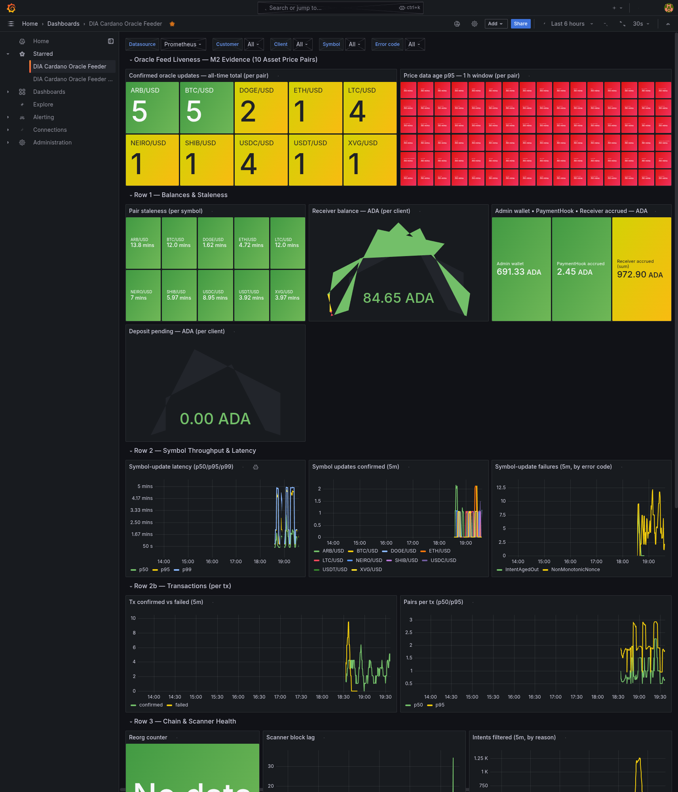

### 3.2 The cascade — selecting one narrows the next

The filters are **chained left-to-right**: `Customer → Client → Symbol`. Picking a
customer reduces the **Client** dropdown to only that customer's clients, which in
turn reduces the **Symbol** dropdown to only the pairs that client serves. This is
why the order matters: start broad (Customer) and work right. Setting Customer
back to `All` re-opens the downstream dropdowns.

Think of it as drilling down: *"this customer → this one of their clients → this
one of that client's pairs."*

### 3.3 What actually changes when you filter

A filter rewrites the label matcher inside each panel's query. Concretely, the
"Symbol updates confirmed" panel runs
`… dia_bridge_transactions_confirmed_total{symbol=~"$symbol", …}` — and `$symbol`
is replaced by your selection. The visible effect:

- **Unfiltered (`Symbol = All`)** — every pair is drawn. The legend is crowded
  with all 10 symbols:

  [filter-panel5-all.png](img/filter-panel5-all.png)

  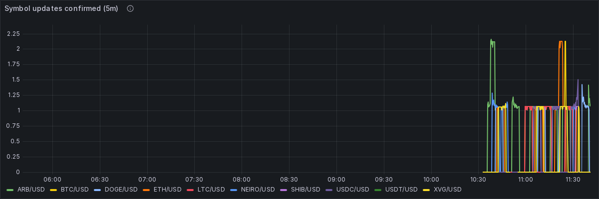

- **Filtered (`Symbol = BTC/USD`)** — the same panel now draws a single series.
  Everything else is hidden, the axis rescales to that one line:

  [filter-panel5-btcusd.png](img/filter-panel5-btcusd.png)

  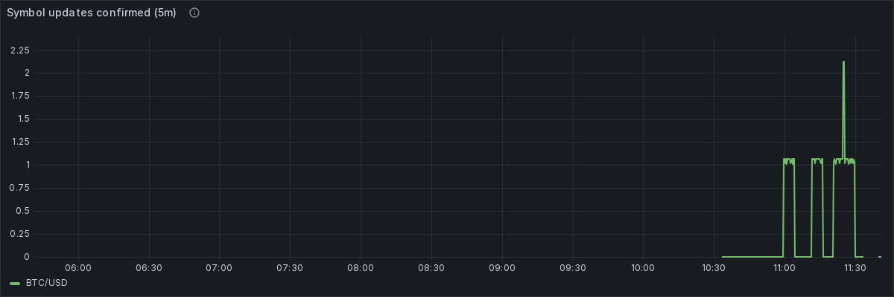

The filter applies to **every panel that uses that variable, simultaneously**, so
the whole dashboard re-scopes at once. Here is the full Overview dashboard pinned
to `Symbol = BTC/USD` — notice the per-symbol panels collapse to one line while
the global/wallet panels are unchanged:

[filter-home-btcusd.png](img/filter-home-btcusd.png)

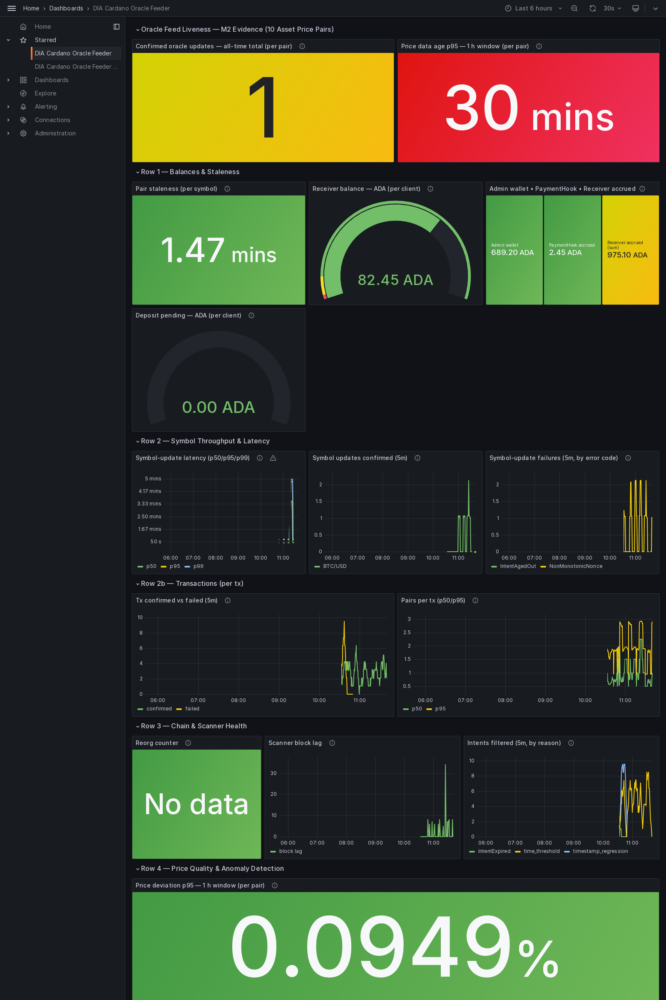

### 3.4 Which panel reacts to which filter

Not every panel honors every filter — a wallet balance has no "symbol". Use this
table to predict what will (and won't) change:

| Panel | Customer | Client | Symbol | Error code |
| --- | :--: | :--: | :--: | :--: |
| Confirmed updates total · Pair staleness · Reorg counter | – | ✓ | ✓ | – |
| Price age p95 · Intents filtered · Price deviation (stat + heatmap) | – | – | ✓ | – |
| Symbol-update latency · Symbol updates confirmed | – | ✓ | ✓ | – |
| Symbol-update failures | – | ✓ | ✓ | ✓ |
| Receiver balance · Deposit pending | – | ✓ | – | – |
| **Admin/PaymentHook/Receiver accrued · Scanner block lag** | – | – | – | – |
| Tx confirmed vs failed · Pairs per tx · Tx fee p50 | ✓ | ✓ | (fee only) | – |
| All Transactions-dashboard panels | ✓ | ✓ | (only "Tx touching pair") | – |

> **The two "global" panels never change with filters:** *Admin/PaymentHook/Receiver
> accrued* (protocol-wide singletons) and *Scanner block lag* (one scanner for the
> whole feeder). If you filter to one symbol and those two stay put — that is
> correct, not a bug.

## 4. Dashboard 1 — Overview (`dia-cardano-feeder`)

[dashboard-full.png](img/dashboard-full.png)

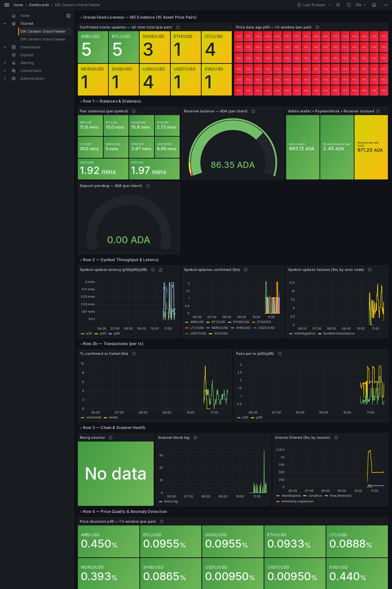

The operational home base: liveness, money, latency, health and billing for all
pairs. Each panel below follows the same shape — **What it shows · How to read it
· When to worry.**

### Row 0 — Oracle Feed Liveness

**Confirmed oracle updates — all-time total (per pair)** · `stat`
`sum by (symbol) (dia_bridge_transactions_confirmed_total)`

[panel-11.png](img/panel-11.png)

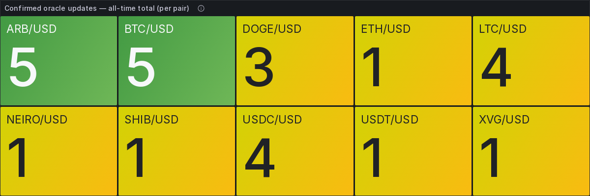

- **What it shows** — one number per pair: how many oracle updates have ever
  reached on-chain confirmation for that symbol since the counter started.
- **How to read it** — this is the liveness proof. Every active pair should show a
  **non-zero, slowly growing** number. A pair stuck at 0 has never confirmed an
  update.
- **When to worry** — a pair at 0 while others climb, or a number that has stopped
  growing for a pair you expect to be active. Cross-check with *Pair staleness*.

**Price data age p95 — 1 h window (per routed pair)** · `stat`
`histogram_quantile(0.95, rate(dia_bridge_price_age_seconds_bucket[1h]))`

[panel-12.png](img/panel-12.png)

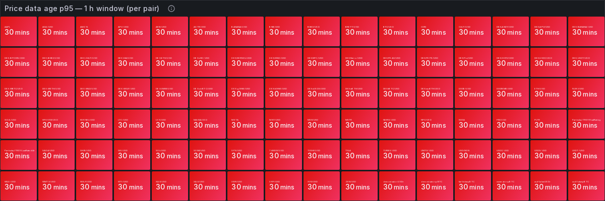

- **What it shows** — in seconds, the 95th-percentile **age of the DIA source
  price** at the moment the feeder consumed it. This is data *freshness at the
  source*, not transaction speed.
- **Scope (routed pairs only).** `dia_bridge_price_age_seconds` is recorded
  **only for the symbols this feeder routes** (the intent matched a router) — not
  the hundreds of other symbols the DIA source feed carries. Earlier this metric
  covered every scanned symbol, which flooded this panel (and `PriceAgeHigh`)
  with exotic pairs we never publish; it is now scoped to our pairs.
- **How to read it** — lower is better. p95 means "95% of intents were fresher
  than this." A few seconds is healthy. The histogram tops out at the 1800 s
  bucket, so a value pegged at `1800` (30 min) means "≥ 30 min" — it cannot show
  how much older.
- **When to worry** — sustained climbing toward **600 s** fires the `PriceAgeHigh`
  alert → the DIA source is publishing stale prices for a routed pair. This is
  upstream of the feeder, not a Cardano problem.

### Row 1 — Balances & Staleness

**Pair staleness (per symbol)** · `stat`
`time() - dia_bridge_cardano_oracle_last_confirmed_timestamp_seconds`

[panel-1.png](img/panel-1.png)

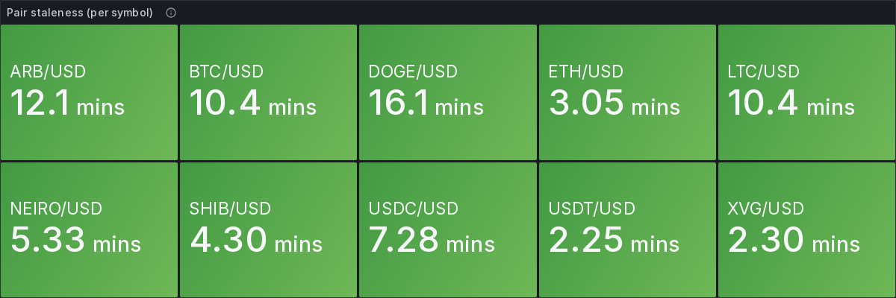

- **What it shows** — for each pair, the wall-clock age of the value **currently
  living on Cardano** (now minus the timestamp of its last confirmed update).
- **How to read it** — this is the number a consumer of the oracle cares about:
  "how old is the price on chain right now." It naturally sawtooths — climbing
  between updates, dropping to ~0 on each new confirmation.
- **When to worry** — a value climbing past **3600 s (1 h)** fires `OraclePairStale`.
  Usual root cause: a low Receiver or Admin wallet (see next panels), not the
  pipeline.

**Receiver balance — ADA (per client)** · `gauge`
`dia_bridge_cardano_receiver_balance_lovelace / 1000000`

[panel-2.png](img/panel-2.png)

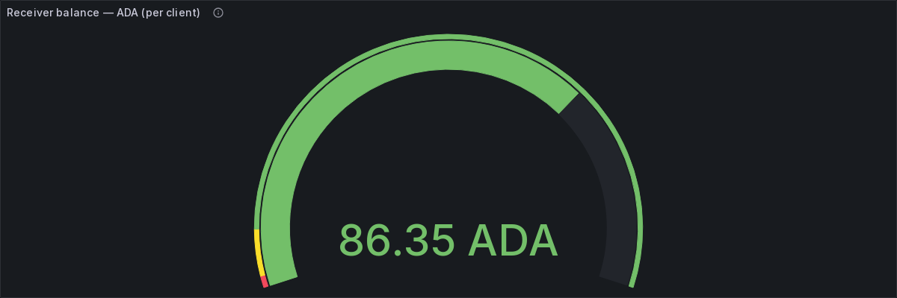

- **What it shows** — the spendable ADA in each client's Receiver UTxO. The
  Receiver pays the `protocolFee` on every oracle update, so it **drains over
  time**.
- **How to read it** — a healthy Receiver sits comfortably above the low-water
  mark and is topped up by side-deposits (see *Deposit pending*).
- **When to worry** — below **2 ADA** fires `ReceiverBalanceLow`. Action: send ADA
  to the client's deposit address (the feeder folds it in automatically) or run
  `receiver:top-up`.

**Admin wallet • PaymentHook • Receiver accrued — ADA** · `stat` (three series)
`dia_bridge_cardano_admin_wallet_lovelace / 1e6`, `…payment_hook_accrued… / 1e6`,
`sum(…receiver_accrued…) / 1e6`

[panel-3.png](img/panel-3.png)

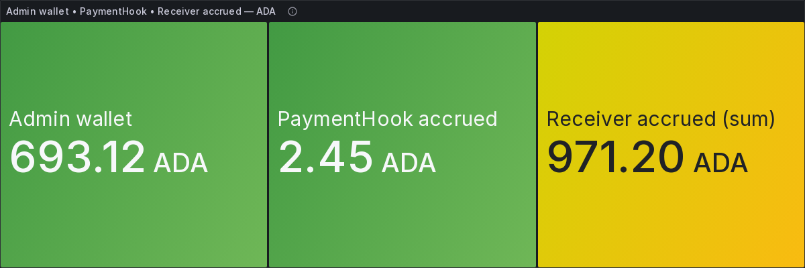

- **What it shows** — the three pools in the fee money-flow: the **Admin wallet**
  (pays Cardano network fees for every update), the **PaymentHook accrued** (fees
  collected protocol-wide, awaiting withdraw), and **Receiver accrued** (fees
  sitting at receivers, awaiting a settle that sweeps them into the PaymentHook).
- **How to read it** — Admin wallet drains as it pays fees; PaymentHook and
  Receiver-accrued grow as protocol revenue accumulates. This is a **global**
  panel — filters do not change it.
- **When to worry** — Admin wallet below **5 ADA** (`AdminWalletLow`) stalls all
  updates → refill by collecting revenue (`settle` then `payment-hook:withdraw`).
  Receiver accrued above **10 ADA** (`SettleOverdue`) → run `settle`. PaymentHook
  accrued above **50 ADA** (`PaymentHookWithdrawReady`) → DIA withdraws.

**Admin wallet — largest UTxO — ADA (collateral floor)** · `stat`
`dia_bridge_cardano_admin_wallet_max_utxo_lovelace / 1000000`

[panel-201.png](img/panel-201.png)

- **What it shows** — the **largest single pure-ADA UTxO** in the admin/signer
  wallet — not the total. A Cardano script tx needs a collateral UTxO distinct
  from its fee inputs, so this is what decides whether the wallet can still build.
- **How to read it** — green at/above the collateral floor (**10 ADA**), red
  below it. Global panel — filters do not change it.
- **When to worry** — below **10 ADA** (`AdminWalletFragmented`, critical): the
  wallet has shattered into sub-collateral dust and every build traps with
  "RuntimeError: unreachable" even if the TOTAL (the panel above) still looks
  healthy. The daemon auto-consolidates below `auto_consolidate_below_lovelace`;
  to force it: `make cli CMD="wallet:consolidate"`.

**Deposit pending — ADA (per client)** · `gauge`
`dia_bridge_cardano_deposit_pending_lovelace / 1000000`

[panel-15.png](img/panel-15.png)

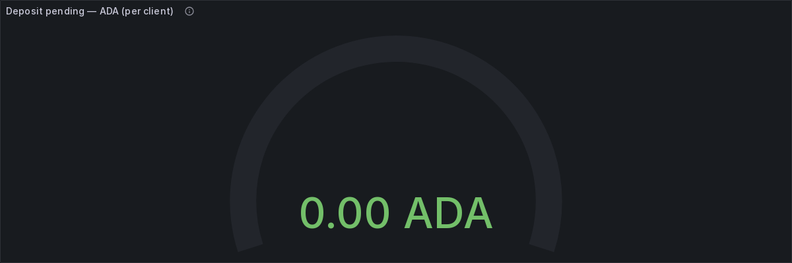

- **What it shows** — side-deposits a client has sent to its deposit address that
  the feeder has **not yet folded** into the Receiver balance.
- **How to read it** — normally near 0: the daemon merges pending deposits
  automatically once the Receiver falls below `receiver_balance_low_lovelace` or
  the pile reaches `deposit_pending_merge_lovelace`.
- **When to worry** — a value that **keeps growing with no merges** — it means
  deposits are arriving but the fold is not happening; check the daemon logs.

### Row 2 — Symbol Throughput & Latency

**Symbol-update latency (p50/p95/p99)** · `timeseries`
`histogram_quantile(0.50/0.95/0.99, rate(dia_bridge_end_to_end_latency_seconds_bucket[5m]))`

[panel-4.png](img/panel-4.png)

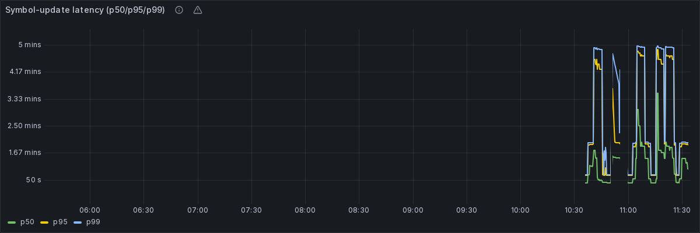

- **What it shows** — end-to-end pipeline latency **per symbol update**, in
  seconds, at the median (p50), 95th and 99th percentiles — from the moment the
  feeder starts processing an intent to its Cardano confirmation.
- **How to read it** — p50 is the typical experience; p99 is the worst 1%. A
  healthy feed shows steady, low lines with p99 not wildly above p50. For the
  *per-transaction* breakdown by stage, see the Transactions dashboard.
- **When to worry** — a rising p95/p99, or a widening gap between p50 and p99
  (most updates fine but a tail getting slow — often Cardano settlement or a
  congested lane).

**Symbol updates confirmed (5m)** · `timeseries`
`sum by (symbol) (increase(dia_bridge_transactions_confirmed_total[5m]))`

[panel-5.png](img/panel-5.png)

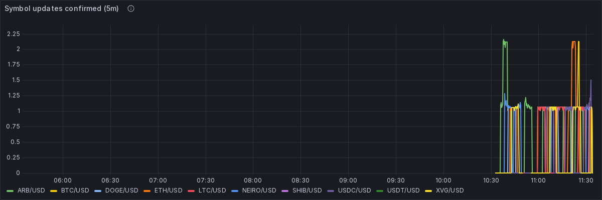

- **What it shows** — a rolling 5-minute **count** (not a rate) of confirmed
  updates per pair. A batch of N pairs adds 1 to each of its N symbols, so this is
  symbol-update throughput.
- **How to read it** — bars/lines should be present for active pairs. Gaps are
  normal between updates (the policy gate suppresses unchanged prices on purpose —
  see *Intents filtered*).
- **When to worry** — a pair flatlining at 0 for much longer than its expected
  cadence while *Intents filtered* keeps rising for it.

**Symbol-update failures (5m, by error code)** · `timeseries`
`sum by (error_code) (increase(dia_bridge_transactions_failed_total[5m]))`

[panel-6.png](img/panel-6.png)

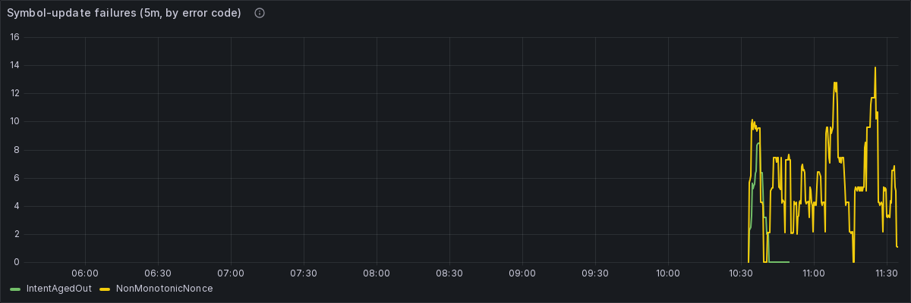

- **What it shows** — 5-minute count of **real** failed updates, grouped by error code.
- **How to read it** — this panel now counts **real submission failures only**.
  Superseded intents (`NonMonotonicNonce`, no tx, no fee) are **no longer counted
  here** — they moved to `dia_bridge_intents_superseded_total{reason}`, so the
  failure counters and success ratio reflect only genuine failures. Codes are
  documented in `offchain/feeder/src/errors/codes.ts`. Use the **Error code**
  filter to isolate one.
- **When to worry** — any error code appearing repeatedly — every code shown here
  is now a genuine submission problem.

### Row 2b — Transactions (per tx)

> These two panels are a **preview** of the Transactions dashboard, kept on the
> home page for convenience. They are explained in full in §5; here is the short
> version. They are the only panels in this row counted **per transaction**, not
> per symbol.

**Tx confirmed vs failed (5m)** · `timeseries`
`sum by (outcome) (increase(dia_bridge_transactions_total[5m]))` — see
[§5 · 311](#row-t2--transaction-throughput--outcome).

[panel-16.png](img/panel-16.png)

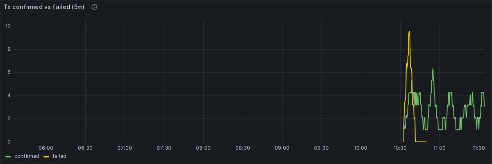

- **Short read** — Cardano transactions per 5 min by outcome (confirmed/failed),
  counted **once per tx** (a batch of N pairs is one tx). Condemned no-ops
  excluded. Confirmed should dominate; a rising failed line is the warning.

**Pairs per tx (p50/p95)** · `timeseries`
`histogram_quantile(0.50/0.95, rate(dia_bridge_transaction_pairs_bucket[5m]))` — see
[§5 · 321](#row-t3--batch-size--pair-membership).

[panel-17.png](img/panel-17.png)

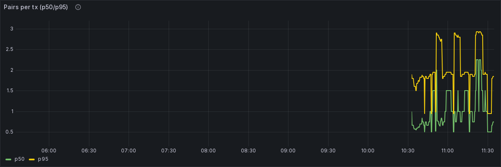

- **Short read** — the **batch size**: how many pairs travel in one tx, at the
  median and 95th percentile. Higher = more amortized fees per pair.

### Row 3 — Chain & Scanner Health

**Reorg counter** · `stat`
`sum(increase(dia_bridge_transactions_reorg_total[1h]))`

[panel-7.png](img/panel-7.png)

- **What it shows** — how many already-confirmed transactions were dropped by a
  Cardano chain reorganisation in the last hour.
- **How to read it** — it should sit at **0**. Cardano reorgs at depth 1 are rare
  but possible; the feeder detects them and re-submits.
- **When to worry** — a sustained non-zero value fires `ReorgRateHigh` (**> 3 / h**)
  → check provider lag and the scanner block-lag panel.

**Scanner block lag** · `timeseries`
`dia_bridge_scanner_block_lag`

[panel-8.png](img/panel-8.png)

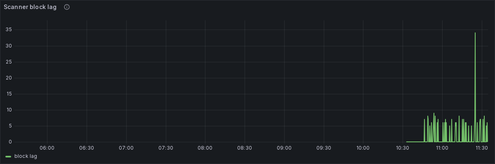

- **What it shows** — how many blocks behind the source-chain tip the DIA-side
  scanner currently is. **Global** panel (one scanner; filters do not change it).
- **How to read it** — a small, stable lag is normal (the scanner stays a few
  confirmations behind the tip by design).
- **When to worry** — a **steadily rising** lag means the scanner is falling
  behind and updates will be delayed.

**Intents filtered (5m, by reason)** · `timeseries`
`sum by (reason) (increase(dia_bridge_intents_filtered_total[5m]))`

[panel-9.png](img/panel-9.png)

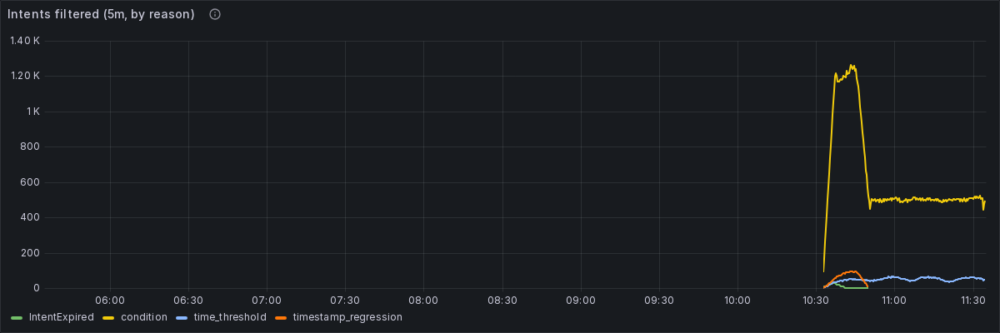

- **What it shows** — 5-minute count of intents the feeder **deliberately
  suppressed** before submitting, grouped by reason (`condition`, `time_threshold`,
  `price_deviation`, …).
- **How to read it** — **high counts here are normal and healthy.** The policy gate
  suppresses most incoming intents on purpose (price barely moved, or within the
  time window). A large `condition` count just means most source events don't match
  this client's pairs.
- **When to worry** — not by itself. Read it *together* with *Symbol updates
  confirmed*: lots of filtering **and** zero confirmations for a pair that should
  be updating is the signal.

### Row 4 — Price Quality & Anomaly Detection

**Price deviation p95 — 1 h window (per pair)** · `stat`
`histogram_quantile(0.95, rate(dia_bridge_price_deviation_percent_bucket[1h]))`

[panel-13.png](img/panel-13.png)

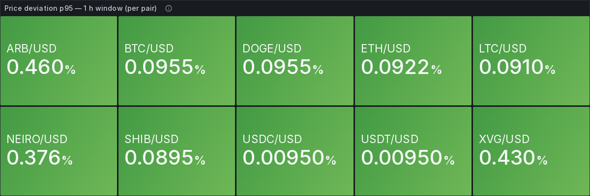

- **What it shows** — per pair, the 95th-percentile **percentage move** between
  consecutive prices measured at gate time (`|new − last| ÷ last × 100`).
- **How to read it** — small percentages (well under a percent) are a calm market.
  Green = within normal bounds.
- **When to worry** — p95 above **5%** fires `PriceDeviationHigh` → investigate the
  DIA source for a possible misreport.

**Price deviation distribution (heatmap)** · `heatmap`
`sum by (le, symbol) (rate(dia_bridge_price_deviation_percent_bucket[5m]))`

[panel-10.png](img/panel-10.png)

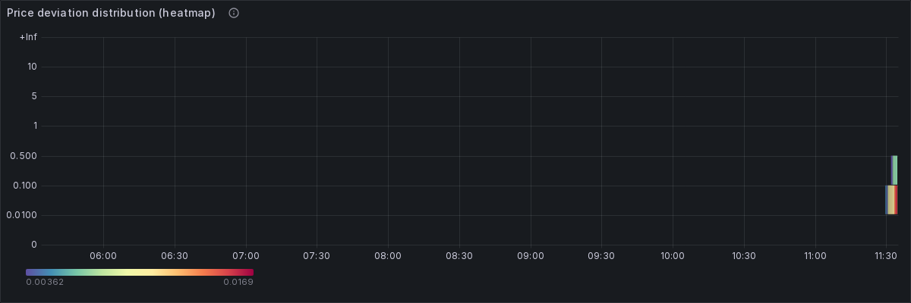

- **What it shows** — the **full distribution** of price-deviation percentages over
  time. The y-axis is deviation buckets, the colour is how frequently deviations
  landed in each bucket. (See §8 — this metric was just fixed; the image shows the
  band starting to fill from the right.)
- **How to read it** — a healthy feed shows a bright band hugging the **bottom
  (near 0%)**: most price moves are tiny. The colour scale (bottom-left) maps
  frequency.
- **When to worry** — the bright band **drifting upward** or a **vertical smear**
  toward higher deviation values means prices are moving more than usual — a
  market event, or a source anomaly worth checking against *Price deviation p95*.

### Row 5 — Billing (per client / customer)

**Tx fee p50 — lovelace (per customer)** · `timeseries`
`histogram_quantile(0.50, sum by (le, customer) (rate(dia_bridge_transaction_fee_lovelace_bucket[5m])))`

[panel-14.png](img/panel-14.png)

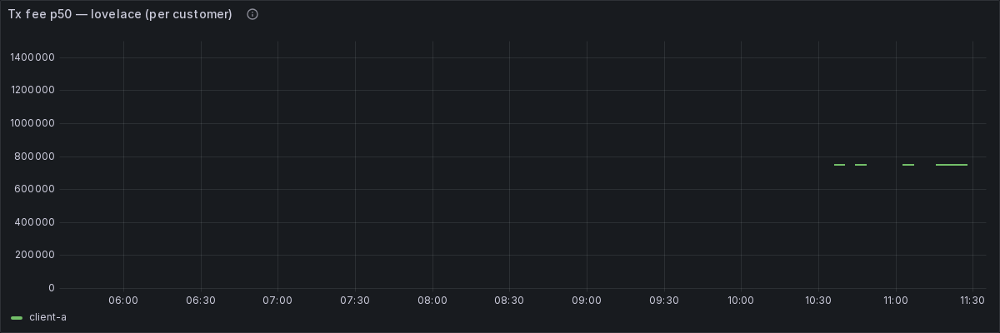

- **What it shows** — the **median Cardano network fee** (in lovelace; 1 ADA =
  1,000,000 lovelace) paid per oracle-update transaction, grouped by customer.
- **How to read it** — this is the basis for **per-customer cost attribution /
  billing**: "what does it cost to serve this customer." A batch of N pairs is one
  tx and one fee observation, so batching lowers the per-pair cost. ~750,000
  lovelace ≈ 0.75 ADA per tx in the Preview sample.
- **When to worry** — a sustained climb in the median fee (Cardano fee-market
  pressure, or batches getting smaller so each pair carries more fixed cost).

### Row 6 — Provider Health

**Cardano provider health — primary vs secondary (1 = up)** · `stat`
`dia_bridge_component_health{component,role}`

[panel-203.png](img/panel-203.png)

- **What it shows** — the health of the **two Cardano API providers** the feeder
  depends on, by **role**. **PRIMARY** is the provider lucid uses to build, sign
  and submit (selected by `CARDANO_PROVIDER`); **SECONDARY** backs tx confirmation
  and reorg checks. `1` = up, `0` = down.
- **How to read it** — the role is derived from `CARDANO_PROVIDER`, so the panel
  always labels whichever provider actually builds as `primary`. The primary is
  measured passively from the calls the feeder already makes; the secondary is
  probed actively once per tick. Global panel — filters do not change it.
- **When to worry** — **primary down** (`PrimaryProviderDown`, critical): nothing
  can be built and **every pair freezes together** — the classic case is a
  Blockfrost `402 Payment Required` (the API key hit its quota). Rotate
  `BLOCKFROST_PROJECT_ID_<NET>` / `KOIOS_API_URL_<NET>` in `feeder/.env` or switch
  `CARDANO_PROVIDER`, then `make restart`. **Secondary down**
  (`SecondaryProviderDown`, warning): redundancy lost, but core operation
  continues.

## 5. Dashboard 2 — Transactions (`dia-cardano-feeder-tx`)

[tx-dashboard-full.png](img/tx-dashboard-full.png)

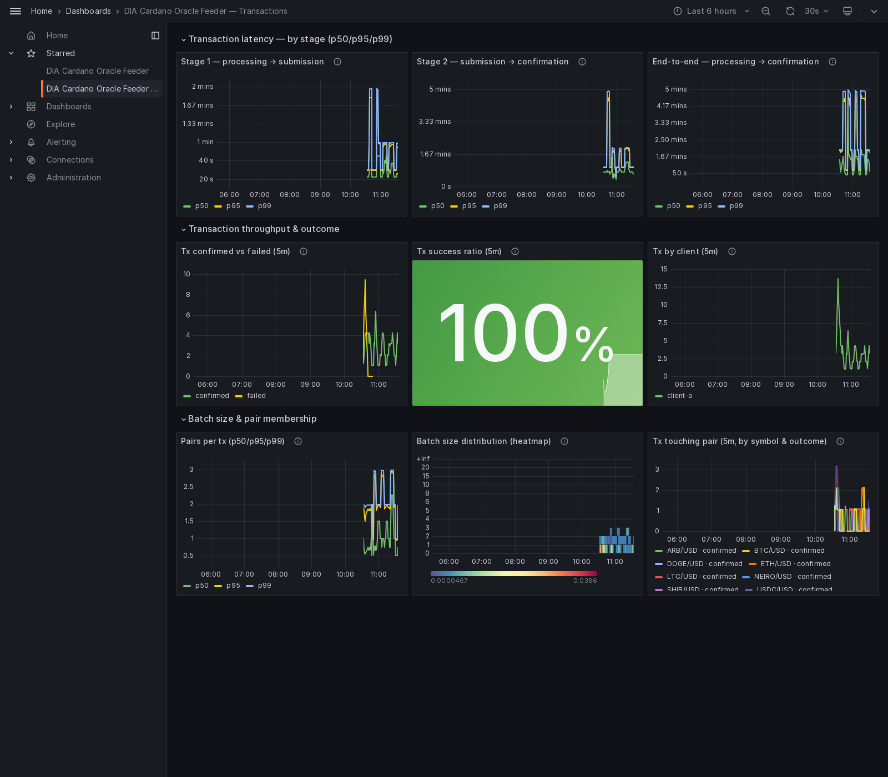

Everything here is counted **per transaction** (a batch of N pairs is ONE tx). This
dashboard answers "how are the transactions themselves doing," whereas the Overview
answers "is each pair healthy." It is filtered by **Customer / Client** (and Symbol
only on the last panel).

### Row T1 — Transaction latency by stage

This row decomposes the end-to-end transaction time into its two stages, so you can
tell **where** time is spent. (The Overview's *Symbol-update latency* is the same
idea but per-symbol and not split by stage — they do not repeat.)

**Stage 1 — processing → submission (p50/p95/p99)** · `timeseries` · seconds
`…tx_processing_to_submission_seconds_bucket…`

[tx-panel-301.png](img/tx-panel-301.png)

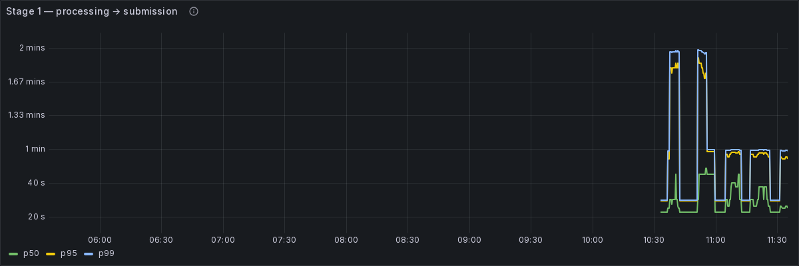

- **What it shows** — time to **build, queue and sign** a transaction before
  broadcast. This is the feeder's own work, before Cardano is involved.
- **How to read it** — should be short and stable. This is the part the feeder
  controls.
- **When to worry** — a rising p95/p99 points at a busy lane or build/UTxO-fetch
  slowness inside the feeder.

**Stage 2 — submission → confirmation (p50/p95/p99)** · `timeseries` · seconds
`…tx_submission_to_confirmation_seconds_bucket…`

[tx-panel-302.png](img/tx-panel-302.png)

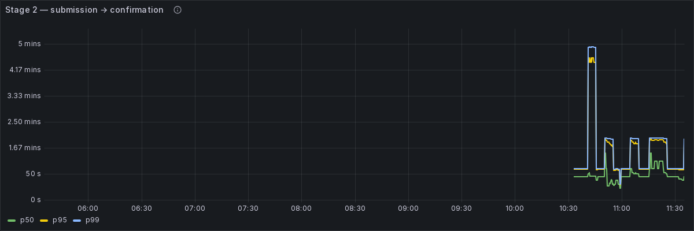

- **What it shows** — **pure Cardano settlement time**: from broadcast to on-chain
  confirmation (at `confirmation_depth`, default 1 block).
- **How to read it** — this tracks the chain, not the feeder. Expect it to hover
  around one block's worth of time.
- **When to worry** — sustained increase = the network is slow to confirm, or the
  provider is lagging. Not something the feeder can fix by itself.

**End-to-end — processing → confirmation (p50/p95/p99)** · `timeseries` · seconds
`…tx_end_to_end_seconds_bucket…`

[tx-panel-303.png](img/tx-panel-303.png)

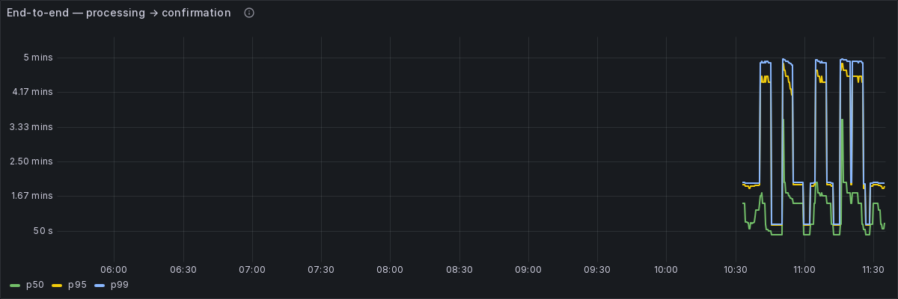

- **What it shows** — Stage 1 + Stage 2 combined: total per-transaction latency.
- **How to read it** — the headline latency number for a transaction. Compare its
  shape to Stage 1 vs Stage 2 to see which stage dominates.
- **When to worry** — rising end-to-end; then look at the two stage panels to
  attribute the cause (feeder-side vs chain-side).

### Row T2 — Transaction throughput & outcome

**Tx confirmed vs failed (5m)** · `timeseries`
`sum by (outcome) (increase(dia_bridge_transactions_total[5m]))`

[tx-panel-311.png](img/tx-panel-311.png)

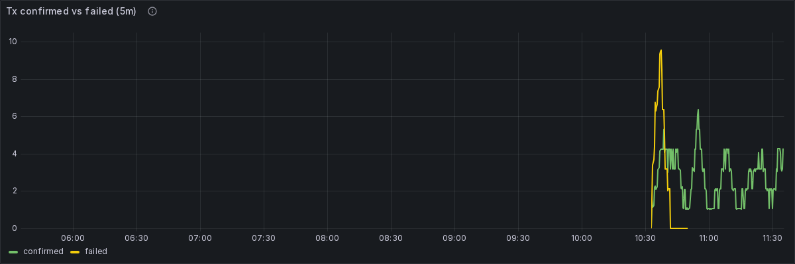

- **What it shows** — transactions per 5 min by outcome (confirmed vs failed),
  counted once per tx. Condemned no-ops are excluded. *(Same metric as the
  Overview's panel 16.)*
- **How to read it** — confirmed should dominate; failed should be near zero.
- **When to worry** — any sustained failed line; pair it with the success-ratio
  stat below.

**Tx success ratio (5m)** · `stat` · percent
`100 * confirmed / total` (over `dia_bridge_transactions_total[5m]`)

[tx-panel-312.png](img/tx-panel-312.png)

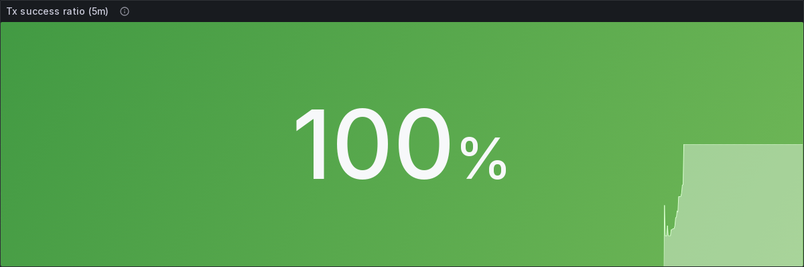

- **What it shows** — confirmed transactions as a percentage of all real attempts
  (confirmed + failed) over 5 minutes. Superseded no-ops excluded from both terms.
- **How to read it** — should sit at or near **100%**. **Idle = "No data".** When
  no transactions were sent in the window the panel shows **No data** (not `0%`):
  the denominator is 0, so there is nothing to divide. (It used to `clamp_min` the
  denominator to 1, which made an idle window read a misleading `0%` in red.)
- **When to worry** — a real value dropping below ~**95%** and staying there means
  a genuine submission problem — investigate via the failures panel and `make logs`.

**Tx by client (5m)** · `timeseries`
`sum by (client_id) (increase(dia_bridge_transactions_total[5m]))`

[tx-panel-313.png](img/tx-panel-313.png)

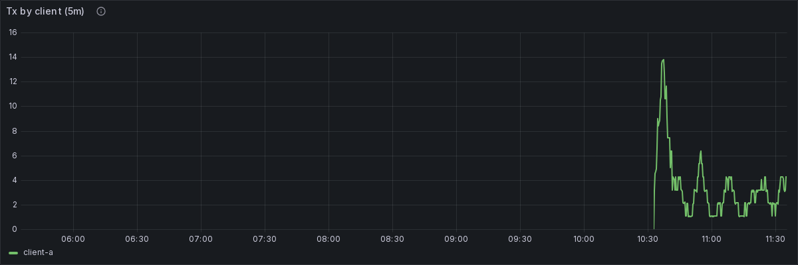

- **What it shows** — transactions per 5 min grouped by client (receiver identity).
- **How to read it** — shows how transaction load is distributed across clients;
  with a single client there is one line.
- **When to worry** — a client that should be active going silent, or one client
  unexpectedly dominating.

### Row T3 — Batch size & pair membership

**Pairs per tx (p50/p95/p99)** · `timeseries`
`histogram_quantile(0.50/0.95/0.99, rate(dia_bridge_transaction_pairs_bucket[5m]))`

[tx-panel-321.png](img/tx-panel-321.png)

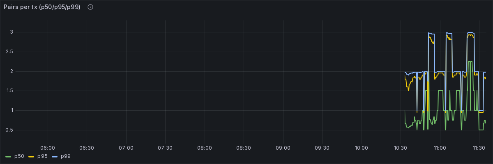

- **What it shows** — the batch-size distribution: pairs per transaction at the
  median, 95th and 99th percentiles. *(Same metric as the Overview's panel 17, with
  p99 added.)*
- **How to read it** — higher batch sizes amortize the fixed Cardano fee over more
  pairs → cheaper per pair. This is the lever behind the billing panel.
- **When to worry** — batch size collapsing toward 1 when you expect coalescing —
  fees per pair will rise.

**Batch size distribution (heatmap)** · `heatmap`
`sum by (le) (rate(dia_bridge_transaction_pairs_bucket[5m]))`

[tx-panel-322.png](img/tx-panel-322.png)

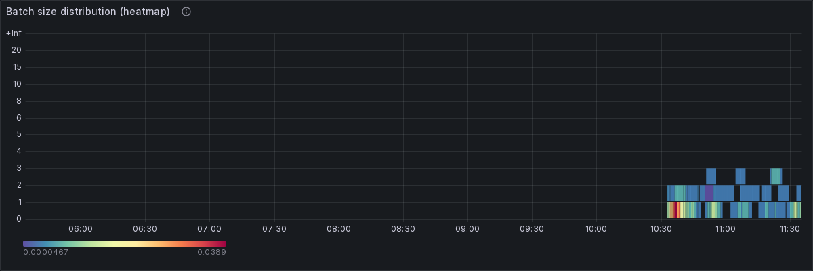

- **What it shows** — the same batch-size data as a heatmap over time: bright bands
  show the **typical** batch size.
- **How to read it** — a stable bright band at your expected batch size is healthy.
- **When to worry** — the band sliding toward 1 (less batching) or becoming erratic.

**Tx touching pair (5m, by symbol & outcome)** · `timeseries`
`sum by (symbol, outcome) (increase(dia_bridge_tx_pair_membership_total[5m]))`

[tx-panel-323.png](img/tx-panel-323.png)

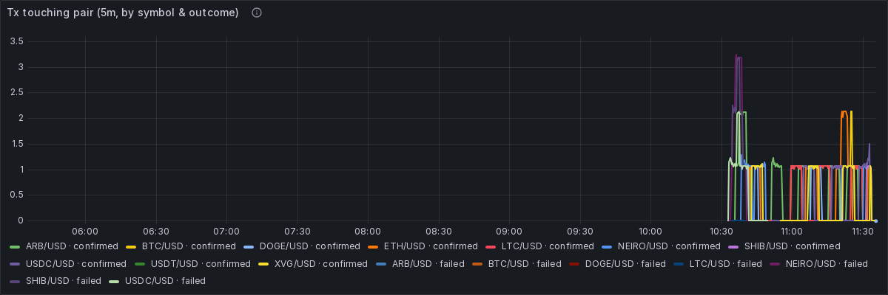

- **What it shows** — one increment per (tx, pair): which transactions included a
  given pair, split confirmed vs failed. This is the **only** Transactions-dashboard
  panel that honors the **Symbol** filter.
- **How to read it** — filter by `$symbol` to answer "which transactions carried
  BTC/USD, and did they confirm?" Their size is in *Pairs per tx*.
- **When to worry** — a pair showing failed memberships repeatedly.

### Row T4 — Real transaction counts

**Tx counts — confirmed vs failed (selected range)** · `stat`
`sum(increase(dia_bridge_transactions_total{outcome="confirmed"|"failed"}[$__range]))`

[tx-panel-331.png](img/tx-panel-331.png)

- **What it shows** — the **raw count** of real Cardano transactions over the
  dashboard's selected time range: how many **confirmed** on-chain (green) and how
  many **failed** (red), counted once per tx (a batch of N pairs is ONE tx). No
  averages, no ratios — just two numbers.
- **How to read it** — `$__range` is the time picker, so the counts are the totals
  for whatever window you have selected. Superseded no-ops (`NonMonotonicNonce`)
  and crash-recovery rows are not transactions and are not counted.
- **When to worry** — a non-trivial `failed` count (real failures) — cross-check
  the failures-by-error-code panel and `make logs`.

## 6. When to panic — one-page cheat sheet

Every threshold below is the canonical value from
`infrastructure.<network>.yaml::alerting` (mirrored into the Prometheus rules and
Grafana panel colours; kept in sync by the threshold-drift test).

| Panel | Alert | Fires when | Default | First action |
| --- | --- | --- | --- | --- |
| Pair staleness | `OraclePairStale` | on-chain value older than | **3600 s** | Check Receiver/Admin balance + `make logs` |
| Price age p95 | `PriceAgeHigh` | source price age p95 over | **600 s** | DIA source publishing stale prices (upstream) |
| Receiver balance | `ReceiverBalanceLow` | balance below | **2 ADA** | Send ADA to deposit address / `receiver:top-up` |
| Admin wallet | `AdminWalletLow` | balance below | **5 ADA** | `settle` then `payment-hook:withdraw` to refill |
| Admin wallet largest UTxO | `AdminWalletFragmented` | largest pure-ADA UTxO below | **10 ADA** | `wallet:consolidate` (daemon auto-consolidates below 7 ADA) |
| Receiver accrued | `SettleOverdue` | accrued above | **10 ADA** | Run `settle` |
| PaymentHook accrued | `PaymentHookWithdrawReady` | accrued above | **50 ADA** | DIA `payment-hook:withdraw` |
| Price deviation p95 | `PriceDeviationHigh` | p95 deviation over | **5 %** | Investigate DIA source (possible misreport) |
| Reorg counter | `ReorgRateHigh` | reorgs per hour over | **> 3 / h** | Check provider lag + scanner block lag |
| Provider health (primary) | `PrimaryProviderDown` | primary provider no success for | **600 s** | Build/submit provider down (e.g. Blockfrost 402) → rotate key / switch `CARDANO_PROVIDER`, `make restart` |
| Provider health (secondary) | `SecondaryProviderDown` | secondary provider no probe for | **900 s** | Redundancy lost only; fix/rotate its endpoint in `feeder/.env`, `make restart` |
| Tx success ratio | _(no alert — watch manually)_ | confirmed/total drops noticeably | — | Failures panel + `make logs` |
| Scanner block lag | _(no alert — watch manually)_ | lag keeps climbing off the tip | — | "Scanner block lag" panel + provider/connectivity check |

## 7. Two concepts the charts assume

**Symbol updates vs transactions (the batch factor).** Repeated because it is the
#1 source of confusion: one transaction can carry many pairs. Overview counts in
**symbol updates**; the Transactions dashboard counts in **transactions**. A "5
updates / 1 tx" reading is a batch of 5, not a discrepancy.

**Confirmation depth.** A tx is declared *confirmed* once it is observed at
`cardano.confirmation_depth` blocks deep (default **1**). At depth 1 a price is
probabilistically final — sufficient for an oracle feed. Every confirmed price in
the API carries the `confirmedAtDepth` it was accepted at. Higher depths (3–5) buy
practical finality at the cost of latency; the cryptographic bound (2160) is never
needed for a price feed. Detail: README → *What "confirmed" means*.

## 8. Note on the deviation heatmap (instrumentation fix)

Until 2026-06-11 the *Price deviation* stat and heatmap (Row 4) showed **"No
data"** on this deployment, regardless of runtime. Root cause: the
`dia_bridge_price_deviation_percent` histogram was only observed when an intent was
**suppressed specifically by the price-deviation gate** — a reason emitted only in
deviation-only push mode. The Preview client runs the classic
`time_threshold + price_deviation` OR-gate, where suppressions are recorded under
`time_threshold`, so the deviation histogram never received a sample.

The fix records the deviation **for every evaluated intent** (submitted and
suppressed alike), at gate time, against the last on-chain price — which is exactly
what the panel title promises ("full distribution"). The heatmap image above was
captured shortly after the fix, so its band is still filling in from the right; it
will accumulate a fuller distribution as updates flow. The panel and metric
descriptions were updated to match the new, accurate behaviour.
