# Milestone 2 Preview Evidence

Source of truth: [`final-cardano-milestones.md`](../../final-cardano-milestones.md).

Scope: Milestone 2 (Data Feeder and Documentation) validation on
Cardano Preview ↔ DIA Testnet.

Pack stamp: **20260604-100120**

Window observed in `transactions.jsonl`:

- First tx event: `2026-06-03T04:04:49.921Z`
- Last tx event:  `2026-06-04T10:01:19.060Z`

Evidence pack location: this directory.

## Contents

- [Official Milestone 2 Outputs](#official-milestone-2-outputs)
- [Totals (this window)](#totals-this-window)
- [Confirmed Cardano tx count per pair](#confirmed-cardano-tx-count-per-pair)
- [Sample Cardano tx hashes (one per pair, first observed)](#sample-cardano-tx-hashes-one-per-pair-first-observed)
- [End-to-end latency per pair](#end-to-end-latency-per-pair)
- [Failures (grouped by error_code)](#failures-grouped-by-error_code)
- [Raw artefacts in this pack](#raw-artefacts-in-this-pack)
- [Dashboards](#dashboards)
  - [Full dashboard](#full-dashboard)
  - [Panels](#panels)
- [Alerts active during the window](#alerts-active-during-the-window)

## Official Milestone 2 Outputs

| Official output | Repository status |
| --- | --- |
| Feeder scripts | Complete: `offchain/feeder/` (TypeScript, Node 22, ESM). |
| Test coverage | Complete: `npm test` in `offchain/feeder/` (passing, full surface). |
| Uptime / accuracy reports | This pack: per-pair confirmed counts + latency + reorg stats. |
| QA review logs | This pack: `logs/feeder.log`, `logs/transactions.jsonl`, `logs/lane.jsonl`, `logs/intents/`. |
| Automated alerts | Complete: `offchain/feeder/monitoring/alerts.yml` (8 alert rules; canonical thresholds in `infrastructure.<network>.yaml::alerting.*`). |
| Real-time dashboards | Complete: `dashboards/` (PNG snapshots taken at pack time). Source JSON: [`offchain/feeder/monitoring/grafana/dashboards/feeder.json`](../../../offchain/feeder/monitoring/grafana/dashboards/feeder.json). |
| Developer documentation | Complete: [feeder README](../../../offchain/feeder/README.md), [CLI README](../../../offchain/cli/README.md), [architecture](../../architecture/cardano-oracle-architecture.md). |

## Totals (this window)

| Metric | Value |
| --- | ---: |
| Confirmed Cardano oracle update txs | 416 |
| Failed Cardano tx attempts          | 12022 |
| Chain reorgs that dropped a tx      | 0 |

## Confirmed Cardano tx count per pair

| Pair | Confirmed txs |
| --- | --- |
| NEIRO/USD | 71 |
| LTC/USD | 64 |
| ARB/USD | 63 |
| XVG/USD | 51 |
| USDT/USD | 37 |
| USDC/USD | 36 |
| DOGE/USD | 35 |
| ETH/USD | 26 |
| BTC/USD | 23 |
| SHIB/USD | 10 |

## Sample Cardano tx hashes (one per pair, first observed)

| Pair | Tx hash |
| --- | --- |
| ARB/USD | 6472dd6c77908a5aaa1da18d8c9ea7e831c59dda79df07aee51435a81aaa82ab |
| BTC/USD | 57bdead81b9482fce9a09b46386f19110d74a80a3b74949b48b7314cc439e4b7 |
| DOGE/USD | 8518d38b73b2e469b00ef6122821634f3492fca2e2d02f3fd6dfeb800d3c3695 |
| ETH/USD | e360e659a0c9a0cf2777bf2742440a6cd644020565f76bc82674e054cbb1b03a |
| LTC/USD | ad4c035beed5ed3bc4133f5a163a2f5348797837be53b70ab3b1f02a000696c8 |
| NEIRO/USD | 6de0a25e875542416c0bb50ff2ff79863444aa9677fbc2e351860bcf719c7e1c |
| SHIB/USD | f12fad9725dd3c3f51781f08fb0f9bf0b25ea58a690ad36c533454c5924a20b2 |
| USDC/USD | 199293f4a4436b1fb614053da0b1cb1706b60c670f2a3da54032704f44460490 |
| USDT/USD | 29e0e11f11bd72378173612c78b769f1404c6743aff6db20b199a13cba6a73d8 |
| XVG/USD | 7db3ef988cc7de8bdbb113bdf1a3973ccbe72d99a51b04555aa95d072bf26d77 |

Verify on [Cardanoscan Preview](https://preview.cardanoscan.io/) or any
public Preview explorer.

## End-to-end latency per pair

DIA `IntentRegistered` → Cardano `tx_confirmed`, milliseconds.

| Pair | Samples | p50 (ms) | p95 (ms) |
| --- | --- | --- | --- |
| DOGE/USD | 34 | 54912 | 114582 |
| ARB/USD | 62 | 47374 | 100408 |
| USDT/USD | 36 | 54532 | 116686 |
| NEIRO/USD | 70 | 54423 | 109874 |
| BTC/USD | 22 | 48446 | 92552 |
| ETH/USD | 25 | 54297 | 94793 |
| LTC/USD | 63 | 52675 | 90504 |
| SHIB/USD | 9 | 47418 | 73976 |
| USDC/USD | 35 | 50386 | 100807 |
| XVG/USD | 50 | 51880 | 101126 |

## Failures (grouped by error_code)

_(no data)_

Failure semantics for each code are documented in
[`offchain/feeder/src/errors/codes.ts`](../../../offchain/feeder/src/errors/codes.ts).

## Raw artefacts in this pack

| Path | Contents |
| --- | --- |
| `logs/feeder.log`              | Daemon event stream (mirrors stderr). |
| `logs/transactions.jsonl`      | One JSON line per tx pipeline step. |
| `logs/lane.jsonl`              | Lane state events (intent_buffered, flush_triggered, …). |
| `logs/intents/`                | Per-intent lifecycle files (`<ts>_<hash>.log`). |
| `db/transaction_log.csv`       | Full `transaction_log` table dump from `feeder.sqlite`. |
| `db/processed_events.csv`      | Full `processed_events` table dump. |
| `db/chain_state.csv`           | Scanner checkpoint snapshot. |
| `api/prices.json`              | `GET /api/v1/prices` at pack time. |
| `api/chains.json`              | `GET /api/v1/chains` at pack time. |
| `api/symbols.json`             | `GET /api/v1/symbols` at pack time. |
| `api/metrics.txt`              | Prometheus `/metrics` exposition at pack time. |
| `dashboards/dashboard-full.png` | Full Grafana dashboard at pack time. |
| `dashboards/panel-*.png`       | Per-panel snapshots. |
| `stats/`                       | Intermediate TSV files this markdown was built from. |
| `SUMMARY.json`                 | Machine-readable totals (top of this document, as JSON). |

## Dashboards

Grafana dashboard `DIA Cardano Oracle Feeder` (UID `dia-cardano-feeder`) —
PNG snapshots taken at pack time over a `now-3h` window. Source JSON:
[`offchain/feeder/monitoring/grafana/dashboards/feeder.json`](../../../offchain/feeder/monitoring/grafana/dashboards/feeder.json).

### Full dashboard

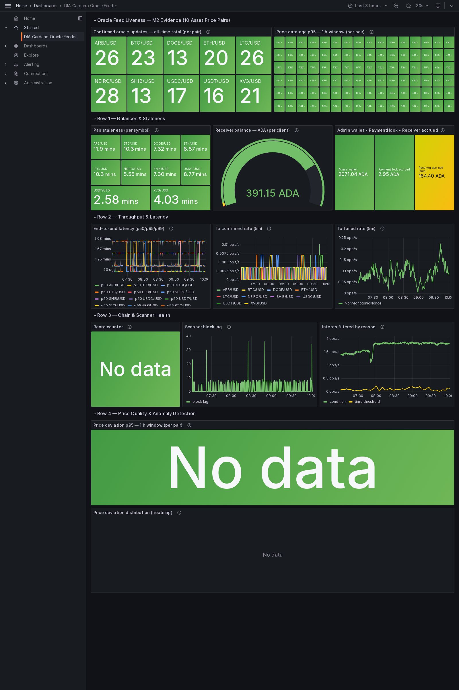

_Each panel is also captured individually below. Every caption names the underlying Prometheus metric and explains what it measures._

### Panels

**Confirmed oracle updates — all-time total (per pair)**

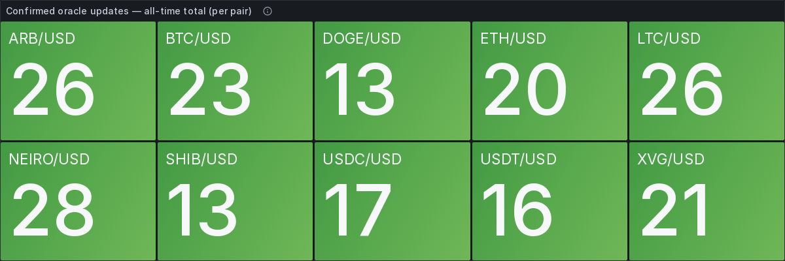

Metric `sum by (symbol) (dia_bridge_transactions_confirmed_total)`. Running all-time count of oracle-update transactions that reached on-chain confirmation, split per price pair (the `symbol` label). This is the liveness proof — every active pair should show a non-zero, growing count.

**Price data age p95 — 1 h window (per pair)**

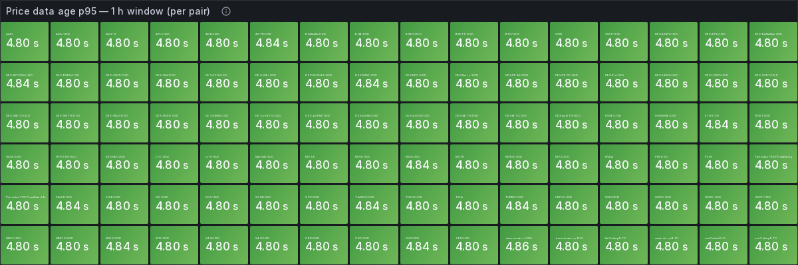

Metric `histogram_quantile(0.95, rate(dia_bridge_price_age_seconds_bucket[1h]))` per `symbol`, in seconds. 95th percentile of how old the DIA source price was at the moment the feeder consumed it — i.e. data freshness, not transaction speed. Lower is better; high values feed the `PriceAgeHigh` alert.

**Pair staleness (per symbol)**

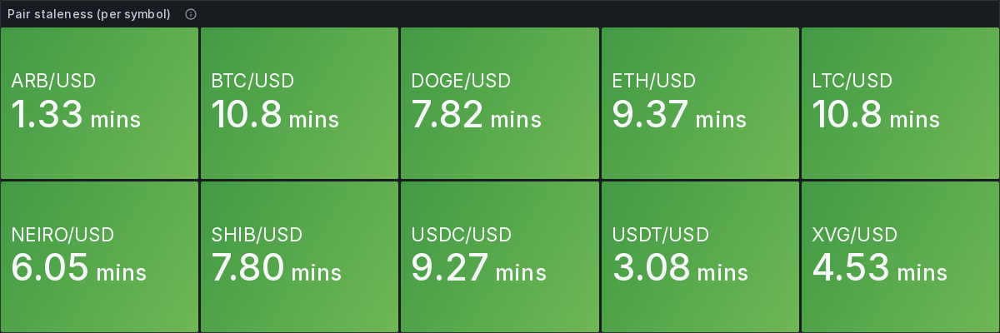

Metric `time() - dia_bridge_cardano_oracle_last_confirmed_timestamp_seconds`, in seconds. Wall-clock age of the most recent confirmed on-chain update for each pair — how stale the value currently living on Cardano is. Drives the `OraclePairStale` alert.

**Receiver balance — ADA (per client)**

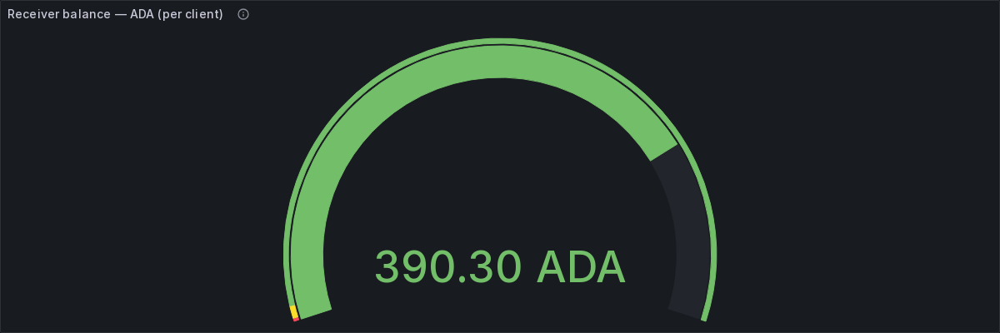

Metric `dia_bridge_cardano_receiver_balance_lovelace / 1000000`, in ADA. Current spendable balance of each Receiver address (the wallet that funds update fees), converted from lovelace. If it falls toward zero the feeder cannot pay fees and `ReceiverBalanceLow` fires.

**Admin wallet • PaymentHook • Receiver accrued — ADA**

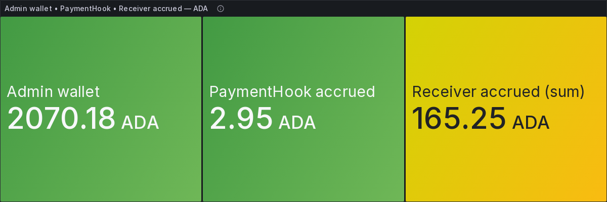

Three ADA series (lovelace ÷ 1e6): `dia_bridge_cardano_admin_wallet_lovelace` (operator admin wallet), `dia_bridge_cardano_payment_hook_accrued_lovelace` (fees accrued inside the PaymentHook awaiting withdraw), and `sum(dia_bridge_cardano_receiver_accrued_lovelace)` (amounts accrued at receivers awaiting settle). Together they track the fee / settlement money flow.

**End-to-end latency (p50/p95/p99)**

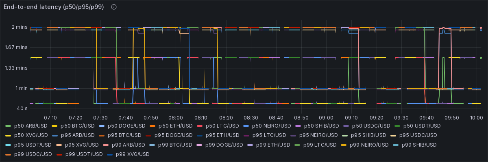

Metric `histogram_quantile(0.50 / 0.95 / 0.99, rate(dia_bridge_end_to_end_latency_seconds_bucket[5m]))`, in seconds. End-to-end pipeline latency — from the DIA `IntentRegistered` event to the Cardano `tx_confirmed` — at the median, 95th and 99th percentiles. How fast a price becomes a confirmed on-chain update.

**Tx confirmed rate (5m)**

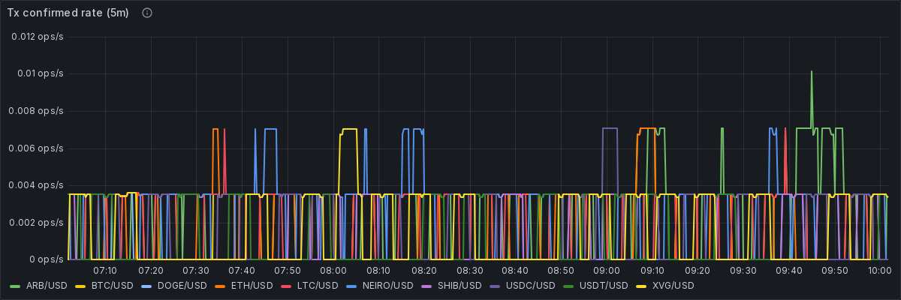

Metric `sum by (symbol) (rate(dia_bridge_transactions_confirmed_total[5m]))`, in ops/s. Rate of successfully confirmed update transactions over a 5-minute window, per pair. The positive-side throughput of the feeder.

**Tx failed rate (5m)**

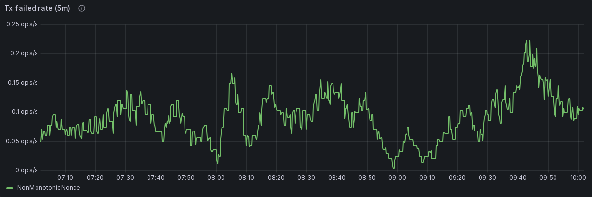

Metric `sum by (error_code) (rate(dia_bridge_transactions_failed_total[5m]))`, in ops/s. Rate of failed transaction attempts over 5 minutes, grouped by `error_code`. A spike on a given code points straight at the failing subsystem; codes are documented in `offchain/feeder/src/errors/codes.ts`.

**Reorg counter**


Metric `sum(increase(dia_bridge_transactions_reorg_total[1h]))`. Count of already-confirmed transactions dropped by a chain reorganisation in the last hour. Should sit at 0; a sustained non-zero value triggers `ReorgRateHigh` and points at provider lag.

**Scanner block lag**

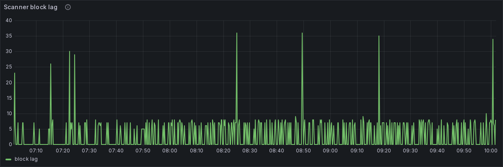

Metric `dia_bridge_scanner_block_lag`, in blocks. How many blocks behind the chain tip the DIA-side scanner currently is. A steadily rising lag means the scanner is falling behind the source chain and updates will be delayed.

**Intents filtered by reason**

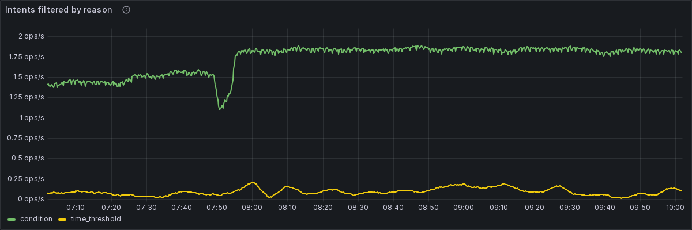

Metric `sum by (reason) (rate(dia_bridge_intents_filtered_total[5m]))`, in ops/s. Rate of incoming intents the feeder deliberately discarded before submitting a transaction, grouped by `reason` (e.g. below deviation threshold, duplicate, stale). Explains why some updates are intentionally skipped.

**Price deviation p95 — 1 h window (per pair)**

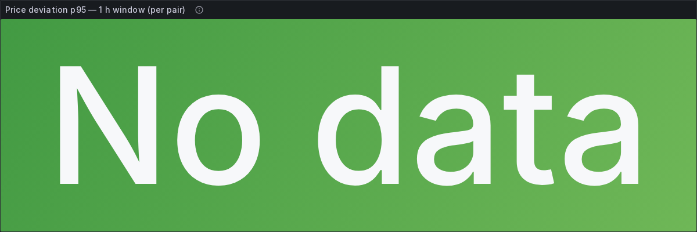

Metric `histogram_quantile(0.95, rate(dia_bridge_price_deviation_percent_bucket[1h]))` per `symbol`, in percent. 95th percentile of the percentage gap between the price the feeder published and the reference price, per pair. A high value suggests a possible misreport and feeds the `PriceDeviationHigh` alert.

**Price deviation distribution (heatmap)**

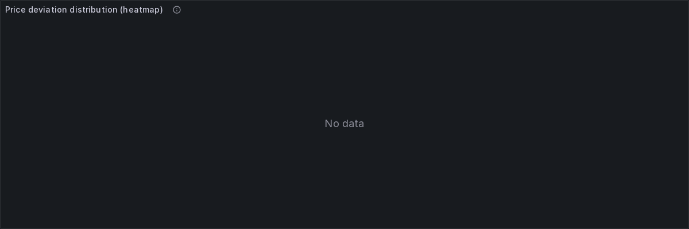

Metric `sum by (le, symbol) (rate(dia_bridge_price_deviation_percent_bucket[5m]))`, percent buckets. Heatmap of the full price-deviation distribution over time (histogram `le` buckets, colour = frequency). Healthy feeds cluster near 0%; a vertical spread means deviations are growing.


To reproduce this dashboard live:

```sh
cd offchain && make up-monitoring
# then open http://localhost:3000 (default admin/admin) — dashboard is auto-provisioned.
```

See the [feeder README — Daemon + monitoring section](../../../offchain/feeder/README.md#daemon--monitoring)
for the canonical operator instructions.

## Alerts active during the window

Source of truth: [`offchain/feeder/monitoring/alerts.yml`](../../../offchain/feeder/monitoring/alerts.yml).
Canonical thresholds: `infrastructure.<network>.yaml::alerting.*`.

| Alert | Metric | Operator action |
| --- | --- | --- |
| OraclePairStale          | `dia_bridge_cardano_oracle_last_confirmed_timestamp_seconds` | Investigate scanner / DIA source. |
| ReceiverBalanceLow       | `dia_bridge_cardano_receiver_balance_lovelace`               | `dia-cli receiver:top-up`. |
| SettleOverdue            | `dia_bridge_cardano_receiver_accrued_lovelace`               | `dia-cli settle`. |
| PaymentHookWithdrawReady | `dia_bridge_cardano_payment_hook_accrued_lovelace`           | `dia-cli payment-hook:withdraw`. |
| AdminWalletLow           | `dia_bridge_cardano_admin_wallet_lovelace`                   | Refill operator wallet. |
| PriceDeviationHigh       | `dia_bridge_price_deviation_percent_bucket` (p95)            | Investigate DIA source (possible misreport). |
| PriceAgeHigh             | `dia_bridge_price_age_seconds_bucket` (p95)                  | Investigate DIA Lasernet scanner. |
| ReorgRateHigh            | `dia_bridge_transactions_reorg_total`                        | Check provider lag + scanner block-lag panel. |
