# Milestone 2 Preview Evidence

Source of truth: [`final-cardano-milestones.md`](../../final-cardano-milestones.md).

Scope: Milestone 2 (Data Feeder and Documentation) validation on
Cardano Preview ↔ DIA Testnet.

Pack stamp: **20260609-071122**

Window observed in `transactions.jsonl`:

- First tx event: `2026-06-08T13:11:01.750Z`
- Last tx event:  `2026-06-09T07:11:17.888Z`

Evidence pack location: this directory.

## Contents

- [Official Milestone 2 Outputs](#official-milestone-2-outputs)
- [Totals (this window)](#totals-this-window)
- [Confirmed Cardano tx count per pair](#confirmed-cardano-tx-count-per-pair)
- [Sample Cardano tx hashes (one per pair, first observed)](#sample-cardano-tx-hashes-one-per-pair-first-observed)
- [End-to-end latency per pair](#end-to-end-latency-per-pair)
- [Failures (grouped by error_code)](#failures-grouped-by-error_code)
- [Raw artefacts in this pack](#raw-artefacts-in-this-pack)
- [Dashboards](#dashboards)
  - [Overview dashboard](#overview-dashboard)
  - [Overview panels](#overview-panels)
  - [Transactions dashboard](#transactions-dashboard)
  - [Transactions panels](#transactions-panels)
- [Alerts active during the window](#alerts-active-during-the-window)

## Official Milestone 2 Outputs

| Official output | Repository status |
| --- | --- |
| Feeder scripts | Complete: `offchain/feeder/` (TypeScript, Node 22, ESM). |
| Test coverage | Complete: `npm test` in `offchain/feeder/` (passing, full surface). |
| Uptime / accuracy reports | This pack: per-pair confirmed counts + latency + reorg stats. |
| QA review logs | This pack: `logs/feeder.log`, `logs/transactions.jsonl`, `logs/lane.jsonl`, `logs/intents/`. |
| Automated alerts | Complete: `offchain/feeder/monitoring/alerts.yml` (8 alert rules; canonical thresholds in `infrastructure.<network>.yaml::alerting.*`). |
| Real-time dashboards | Complete: `dashboards/` (PNG snapshots taken at pack time). Source JSON: [`offchain/feeder/monitoring/grafana/dashboards/feeder.json`](../../../offchain/feeder/monitoring/grafana/dashboards/feeder.json). |
| Developer documentation | Complete: [feeder README](../../../offchain/feeder/README.md), [CLI README](../../../offchain/cli/README.md), [architecture](../../architecture/cardano-oracle-architecture.md). |

## Totals (this window)

| Metric | Value |
| --- | ---: |
| Confirmed Cardano oracle update txs | 667 |
| Failed Cardano tx attempts          | 847 |
| Chain reorgs that dropped a tx      | 0 |

## Confirmed Cardano tx count per pair

| Pair | Confirmed txs |
| --- | --- |
| NEIRO/USD | 131 |
| ARB/USD | 90 |
| LTC/USD | 68 |
| USDC/USD | 62 |
| ETH/USD | 60 |
| USDT/USD | 60 |
| XVG/USD | 60 |
| DOGE/USD | 59 |
| BTC/USD | 39 |
| SHIB/USD | 38 |

## Sample Cardano tx hashes (one per pair, first observed)

| Pair | Tx hash |
| --- | --- |
| ARB/USD | cfd7c9463ab5756b309fcf32b0528b751031e53e01c0c06b76e17da3cb4c9b64 |
| BTC/USD | d54d79b7d72b8cf708a634a5779416fff1f617e254fcfd8c69e2e0a48d8c1ef2 |
| DOGE/USD | 7fbb001e22e0d8cfd902a5b3a106952d468efc7cb2ce92174e99f8fc07e1fb0e |
| ETH/USD | 3a50f728aa6caadfffd6ede5829392ede6529ea1a41856b37787b36d341c10d0 |
| LTC/USD | 09db21c13d970ee5d4a6968eb80b05cbcb4df44f96c9c75dc99edfe896f0f667 |
| NEIRO/USD | d39afe08c5d740d665d8d950a66e87c9c2565a120464e653504416926ac23d4a |
| SHIB/USD | a3132516a36d212ed661b7146b730569c55ccbfa3ae05b1211a0db6a8b0f37db |
| USDC/USD | e19c4f59f01f750db6b64ad17a75d7640b25ecca486d08bb7191c3b1ddea0c52 |
| USDT/USD | ed23c7aa35dff605667b4c02a520cd5192c8c90d0346984ee8e6844acbeec1a4 |
| XVG/USD | 152e60c149d89c69ad2665370bad89420f99a50871448db7a86745a4180dbd2a |

Verify on [Cardanoscan Preview](https://preview.cardanoscan.io/) or any
public Preview explorer.

## End-to-end latency per pair

DIA `IntentRegistered` → Cardano `tx_confirmed`, milliseconds.

| Pair | Samples | p50 (ms) | p95 (ms) |
| --- | --- | --- | --- |
| DOGE/USD | 58 | 58568 | 104760 |
| USDT/USD | 59 | 56272 | 114931 |
| ARB/USD | 89 | 64254 | 128431 |
| NEIRO/USD | 130 | 61926 | 115121 |
| BTC/USD | 38 | 59271 | 136044 |
| ETH/USD | 59 | 63144 | 117024 |
| LTC/USD | 67 | 64505 | 141922 |
| SHIB/USD | 37 | 65932 | 129370 |
| USDC/USD | 61 | 65268 | 122421 |
| XVG/USD | 59 | 61128 | 135620 |

## Failures (grouped by error_code)

_(no data)_

Failure semantics for each code are documented in
[`offchain/feeder/src/errors/codes.ts`](../../../offchain/feeder/src/errors/codes.ts).

## Raw artefacts in this pack

| Path | Contents |
| --- | --- |
| `logs/feeder.log`              | Daemon event stream (mirrors stderr). |
| `logs/transactions.jsonl`      | One JSON line per tx pipeline step. |
| `logs/lane.jsonl`              | Lane state events (intent_buffered, flush_triggered, …). |
| `logs/intents/`                | Per-intent lifecycle files (`<ts>_<hash>.log`). |
| `db/transaction_log.csv`       | Full `transaction_log` table dump from `feeder.sqlite`. |
| `db/processed_events.csv`      | Full `processed_events` table dump. |
| `db/chain_state.csv`           | Scanner checkpoint snapshot. |
| `api/prices.json`              | `GET /api/v1/prices` at pack time. |
| `api/chains.json`              | `GET /api/v1/chains` at pack time. |
| `api/symbols.json`             | `GET /api/v1/symbols` at pack time. |
| `api/metrics.txt`              | Prometheus `/metrics` exposition at pack time. |
| `dashboards/dashboard-full.png` | Full Grafana dashboard at pack time. |
| `dashboards/panel-*.png`       | Per-panel snapshots. |
| `stats/`                       | Intermediate TSV files this markdown was built from. |
| `SUMMARY.json`                 | Machine-readable totals (top of this document, as JSON). |

## Dashboards

Grafana dashboard `DIA Cardano Oracle Feeder` (UID `dia-cardano-feeder`) —
PNG snapshots taken at pack time over a `now-3h` window. Source JSON:
[`offchain/feeder/monitoring/grafana/dashboards/feeder.json`](../../../offchain/feeder/monitoring/grafana/dashboards/feeder.json).

### Overview dashboard

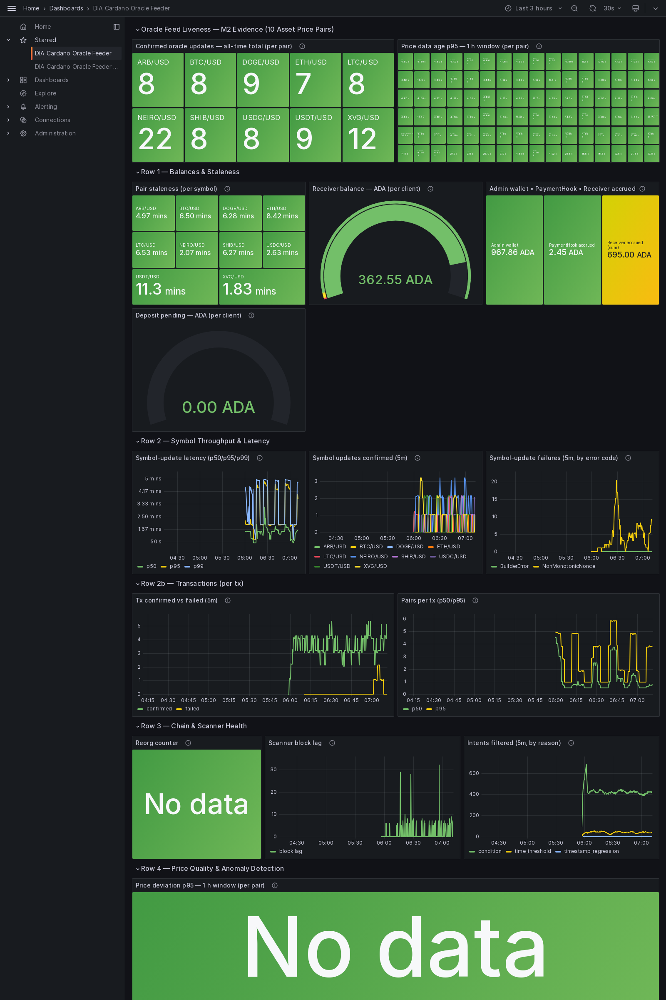

_Each panel is also captured individually below. Every caption names the underlying Prometheus metric and explains what it measures. A batch transaction of N pairs counts as N symbol updates in the per-symbol panels and as ONE transaction in the per-tx panels._

### Overview panels

**Confirmed oracle updates — all-time total (per pair)**

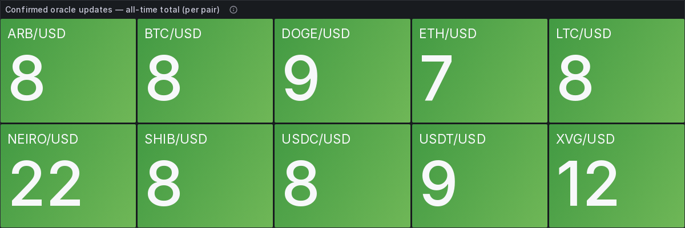

Metric `sum by (symbol) (dia_bridge_transactions_confirmed_total)`. Running all-time count of oracle-update transactions that reached on-chain confirmation, split per price pair (the `symbol` label). This is the liveness proof — every active pair should show a non-zero, growing count.

**Price data age p95 — 1 h window (per pair)**

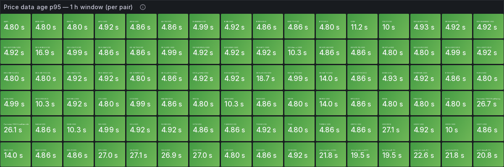

Metric `histogram_quantile(0.95, rate(dia_bridge_price_age_seconds_bucket[1h]))` per `symbol`, in seconds. 95th percentile of how old the DIA source price was at the moment the feeder consumed it — i.e. data freshness, not transaction speed. Lower is better; high values feed the `PriceAgeHigh` alert.

**Pair staleness (per symbol)**

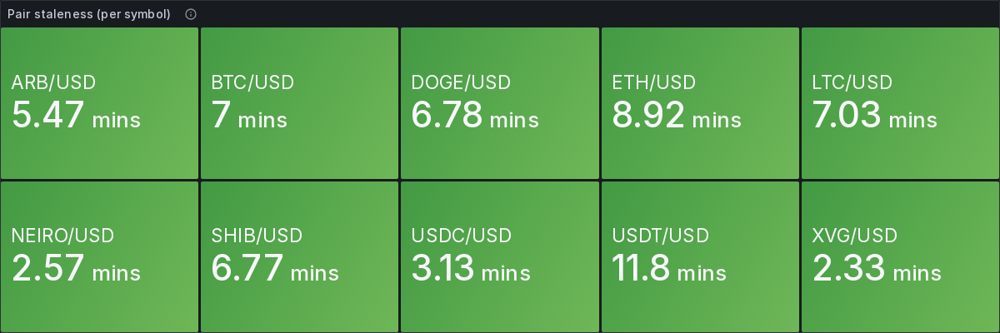

Metric `time() - dia_bridge_cardano_oracle_last_confirmed_timestamp_seconds`, in seconds. Wall-clock age of the most recent confirmed on-chain update for each pair — how stale the value currently living on Cardano is. Drives the `OraclePairStale` alert.

**Receiver balance — ADA (per client)**

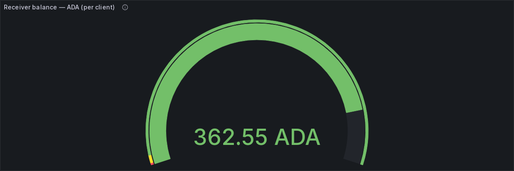

Metric `dia_bridge_cardano_receiver_balance_lovelace / 1000000`, in ADA. Current spendable balance of each Receiver address, converted from lovelace. The metric labels include both `receiver_address` and the client `deposit_address` operators should fund when `ReceiverBalanceLow` fires.

**Admin wallet • PaymentHook • Receiver accrued — ADA**

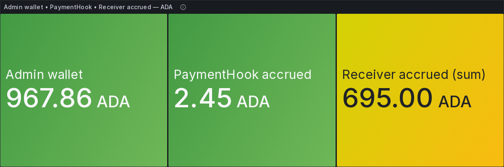

Three ADA series (lovelace ÷ 1e6): `dia_bridge_cardano_admin_wallet_lovelace` (operator admin wallet), `dia_bridge_cardano_payment_hook_accrued_lovelace` (fees accrued inside the PaymentHook awaiting withdraw), and `sum(dia_bridge_cardano_receiver_accrued_lovelace)` (amounts accrued at receivers awaiting settle). Together they track the fee / settlement money flow.

**Symbol-update latency (p50/p95/p99)**

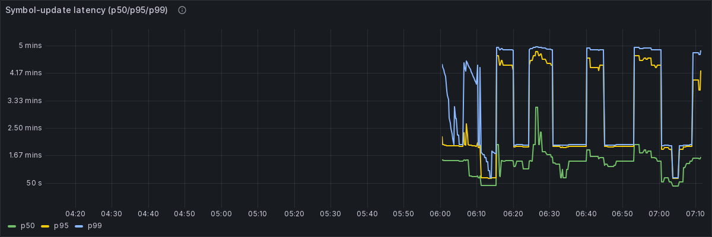

Metric `histogram_quantile(0.50 / 0.95 / 0.99, rate(dia_bridge_end_to_end_latency_seconds_bucket[5m]))`, in seconds, aggregated across all pairs. Per-symbol pipeline latency from feeder processing start to Cardano confirmation, at the median, 95th and 99th percentiles. For per-TRANSACTION stage latency see the Transactions dashboard below.

**Symbol updates confirmed (5m)**

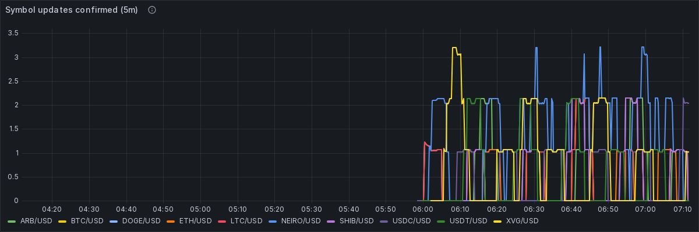

Metric `sum by (symbol) (increase(dia_bridge_transactions_confirmed_total[5m]))` — a 5-minute count (not a rate), per pair. A batch transaction of N pairs adds 1 to each of its N symbols, so this is symbol-update throughput; for pure per-transaction counts see "Tx confirmed vs failed" below.

**Symbol-update failures (5m, by error code)**

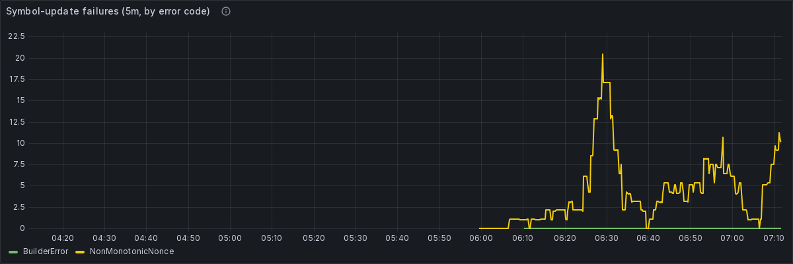

Metric `sum by (error_code) (increase(dia_bridge_transactions_failed_total[5m]))` — a 5-minute count grouped by `error_code`. Condemned/superseded intents the feeder declined to submit surface as `NonMonotonicNonce` (no tx, no fee); codes are documented in `offchain/feeder/src/errors/codes.ts`.

**Tx confirmed vs failed (5m)**

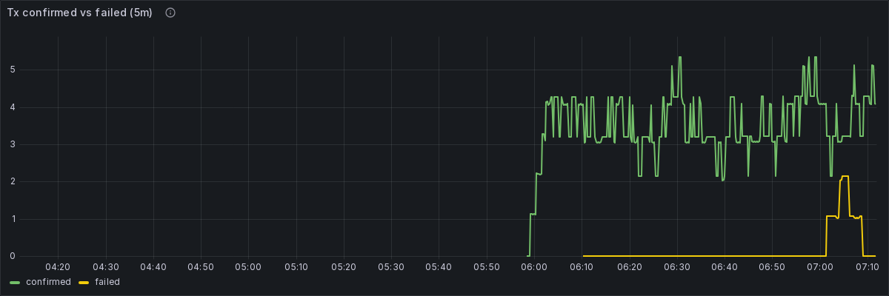

Metric `sum by (outcome) (increase(dia_bridge_transactions_total[5m]))` — Cardano TRANSACTIONS per 5-minute window, counted once per tx (a batch of N pairs is ONE tx), by `outcome`. Condemned no-ops are excluded. This is pure transaction throughput, distinct from the per-symbol counts above.

**Pairs per tx (p50/p95)**

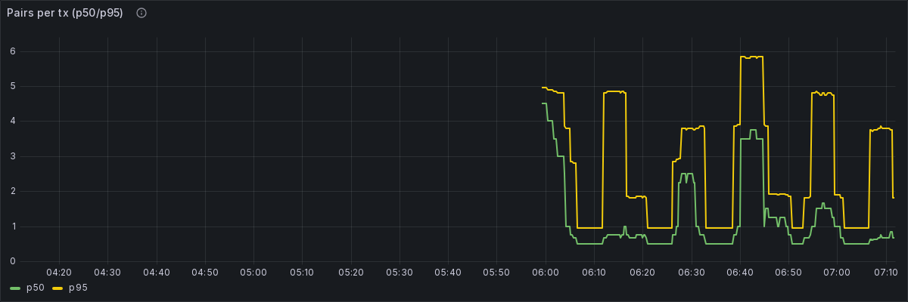

Metric `histogram_quantile(0.50 / 0.95, rate(dia_bridge_transaction_pairs_bucket[5m]))` — batch size: how many pairs travel in each transaction, at the median and 95th percentile.

**Reorg counter**


Metric `sum(increase(dia_bridge_transactions_reorg_total[1h]))`. Count of already-confirmed transactions dropped by a chain reorganisation in the last hour. Should sit at 0; a sustained non-zero value triggers `ReorgRateHigh` and points at provider lag.

**Scanner block lag**

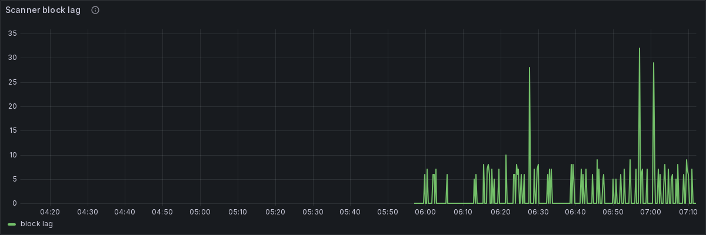

Metric `dia_bridge_scanner_block_lag`, in blocks. How many blocks behind the chain tip the DIA-side scanner currently is. A steadily rising lag means the scanner is falling behind the source chain and updates will be delayed.

**Intents filtered (5m, by reason)**

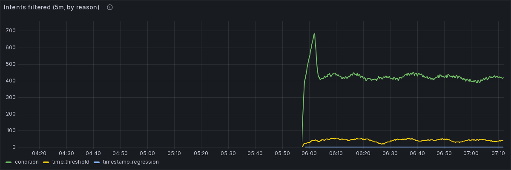

Metric `sum by (reason) (increase(dia_bridge_intents_filtered_total[5m]))` — a 5-minute count grouped by `reason`. Intents the feeder deliberately suppressed before submitting. High counts are normal: the deviation/time-threshold policy suppresses most intents by design.

**Price deviation p95 — 1 h window (per pair)**


Metric `histogram_quantile(0.95, rate(dia_bridge_price_deviation_percent_bucket[1h]))` per `symbol`, in percent. 95th percentile of the percentage gap between the price the feeder published and the reference price, per pair. A high value suggests a possible misreport and feeds the `PriceDeviationHigh` alert.

**Price deviation distribution (heatmap)**


Metric `sum by (le, symbol) (rate(dia_bridge_price_deviation_percent_bucket[5m]))`, percent buckets. Heatmap of the full price-deviation distribution over time (histogram `le` buckets, colour = frequency). Healthy feeds cluster near 0%; a vertical spread means deviations are growing.

### Transactions dashboard

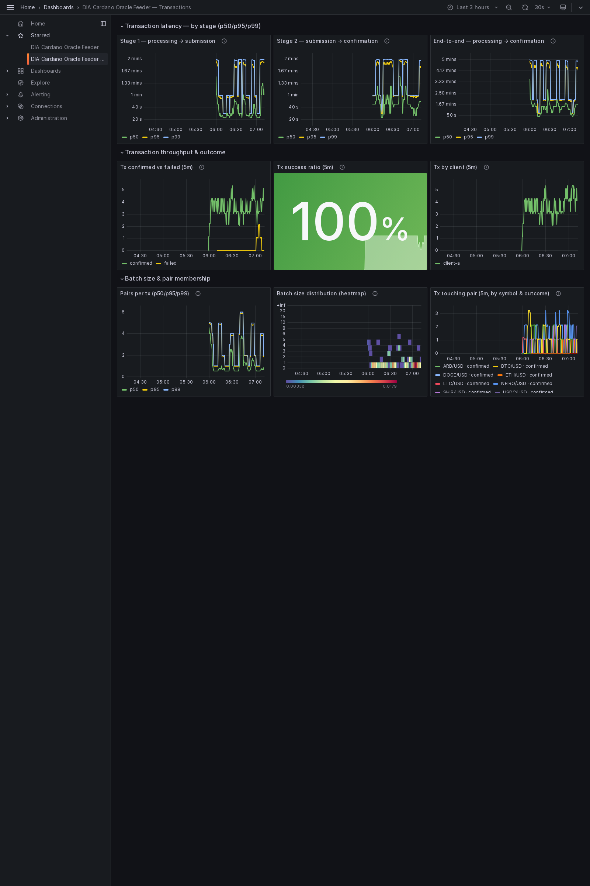

_The per-transaction view: a batch of N pairs is ONE transaction here. Stage latency, confirmed-vs-failed throughput, success ratio and batch size._

### Transactions panels

**Stage 1 — processing → submission**

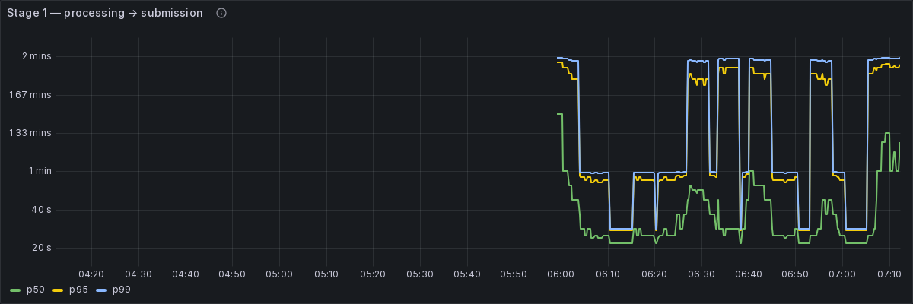

Metric `histogram_quantile(0.50 / 0.95 / 0.99, rate(dia_bridge_tx_processing_to_submission_seconds_bucket[5m]))`, in seconds, one observation per confirmed tx. Time to build, queue and sign a transaction before broadcast.

**Stage 2 — submission → confirmation**

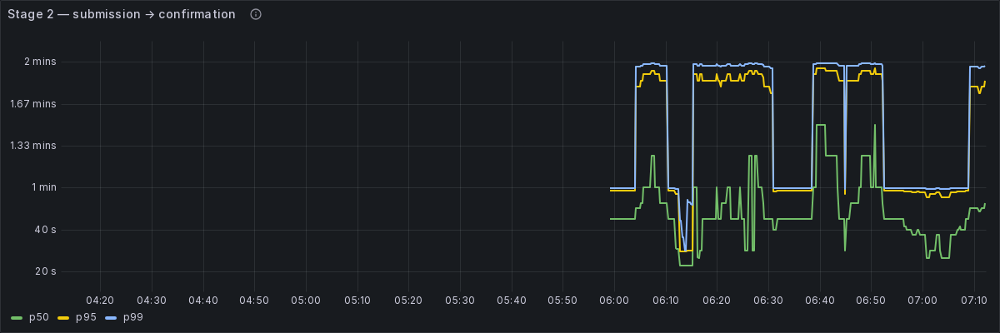

Metric `histogram_quantile(0.50 / 0.95 / 0.99, rate(dia_bridge_tx_submission_to_confirmation_seconds_bucket[5m]))`, in seconds. Pure Cardano settlement time from broadcast to on-chain confirmation, per tx.

**End-to-end — processing → confirmation**

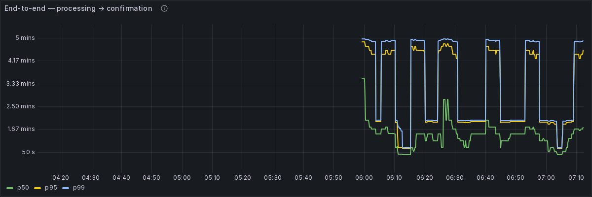

Metric `histogram_quantile(0.50 / 0.95 / 0.99, rate(dia_bridge_tx_end_to_end_seconds_bucket[5m]))`, in seconds. Total per-transaction latency from feeder processing start to confirmation.

**Tx confirmed vs failed (5m)**

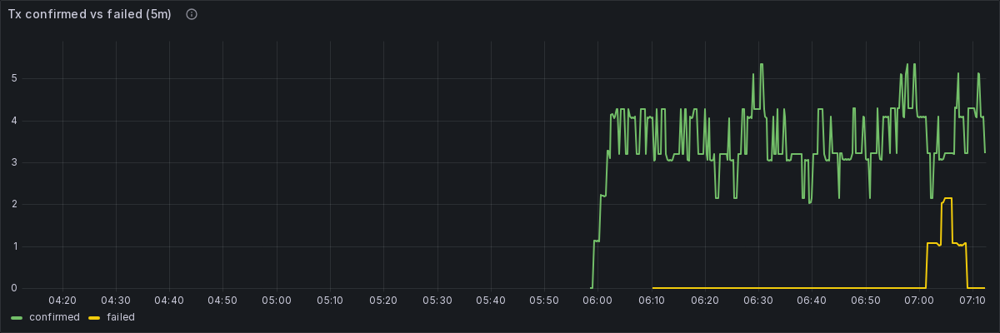

Metric `sum by (outcome) (increase(dia_bridge_transactions_total[5m]))` — transactions per 5-minute window counted once per tx, by outcome. Condemned no-ops excluded.

**Tx success ratio (5m)**

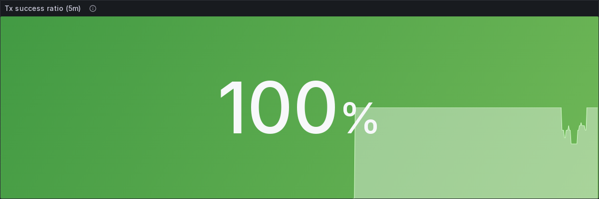

Confirmed transactions as a percentage of all real attempts (confirmed + failed) over 5 minutes: `100 * confirmed / (confirmed + failed)` from `dia_bridge_transactions_total`. Condemned no-ops are excluded from both terms.

**Tx by client (5m)**

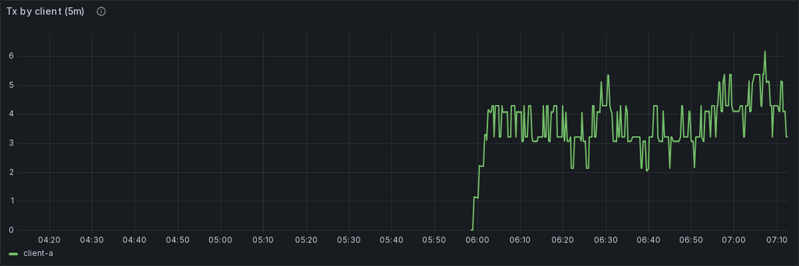

Metric `sum by (client_id) (increase(dia_bridge_transactions_total[5m]))` — transactions per 5-minute window grouped by client (receiver identity), counted once per tx.

**Pairs per tx (p50/p95/p99)**

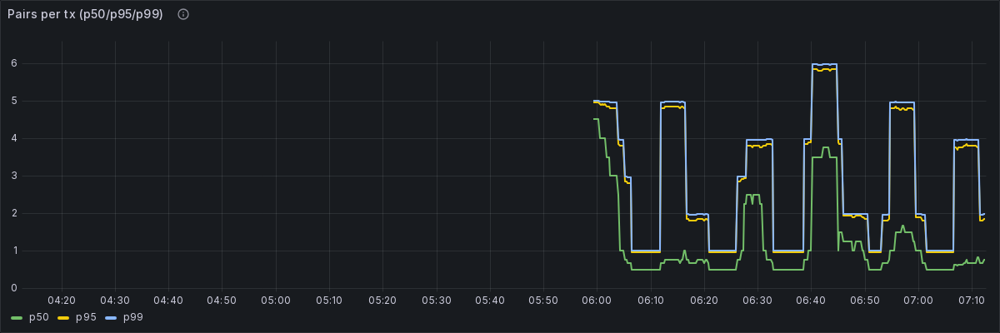

Metric `histogram_quantile(0.50 / 0.95 / 0.99, rate(dia_bridge_transaction_pairs_bucket[5m]))` — batch size distribution: pairs per transaction at the median, 95th and 99th percentiles.

**Batch size distribution (heatmap)**

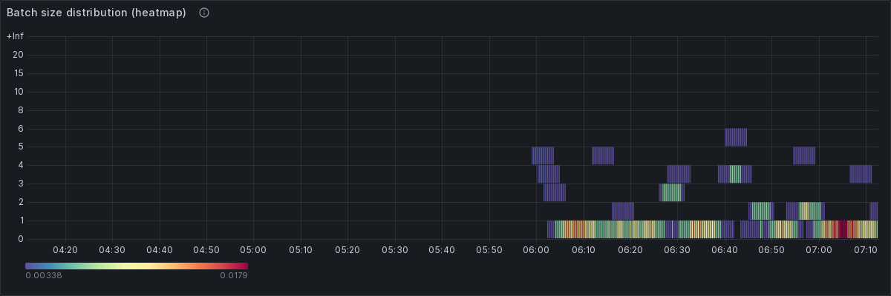

Metric `sum by (le) (rate(dia_bridge_transaction_pairs_bucket[5m]))`, batch-size buckets. Heatmap of pairs-per-transaction over time; bright bands show the typical batch size.

**Tx touching pair (5m, by symbol & outcome)**

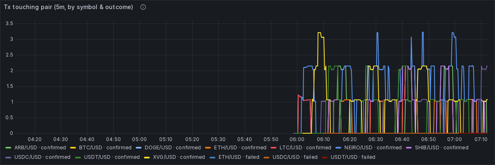

Metric `sum by (symbol, outcome) (increase(dia_bridge_tx_pair_membership_total[5m]))` — one increment per (tx, pair). Filter by `$symbol` to find the transactions that included a given pair (their size is in "Pairs per tx"); carries confirmed vs failed and the customer dimension.


To reproduce this dashboard live:

```sh
cd offchain && make up-monitoring
# then open http://localhost:3000 (default admin/admin) — dashboard is auto-provisioned.
```

See the [feeder README — Daemon + monitoring section](../../../offchain/feeder/README.md#daemon--monitoring)
for the canonical operator instructions.

## Alerts active during the window

Source of truth: [`offchain/feeder/monitoring/alerts.yml`](../../../offchain/feeder/monitoring/alerts.yml).
Canonical thresholds: `infrastructure.<network>.yaml::alerting.*`.

| Alert | Metric | Operator action |
| --- | --- | --- |
| OraclePairStale          | `dia_bridge_cardano_oracle_last_confirmed_timestamp_seconds` | Investigate scanner / DIA source. |
| ReceiverBalanceLow       | `dia_bridge_cardano_receiver_balance_lovelace`               | Fund the labelled `deposit_address`; fallback `dia-cli receiver:top-up`. |
| SettleOverdue            | `dia_bridge_cardano_receiver_accrued_lovelace`               | `dia-cli settle`. |
| PaymentHookWithdrawReady | `dia_bridge_cardano_payment_hook_accrued_lovelace`           | `dia-cli payment-hook:withdraw`. |
| AdminWalletLow           | `dia_bridge_cardano_admin_wallet_lovelace`                   | Refill operator wallet. |
| PriceDeviationHigh       | `dia_bridge_price_deviation_percent_bucket` (p95)            | Investigate DIA source (possible misreport). |
| PriceAgeHigh             | `dia_bridge_price_age_seconds_bucket` (p95)                  | Investigate DIA Lasernet scanner. |
| ReorgRateHigh            | `dia_bridge_transactions_reorg_total`                        | Check provider lag + scanner block-lag panel. |
