# Milestone 2 Preview Evidence

Source of truth: [`final-cardano-milestones.md`](../../final-cardano-milestones.md).

Scope: Milestone 2 (Data Feeder and Documentation) validation on
Cardano Preview ↔ DIA Testnet.

Pack stamp: **20260609-132545**

Window observed in `transactions.jsonl`:

- First tx event: `2026-06-09T08:36:49.436Z`
- Last tx event:  `2026-06-09T13:25:37.203Z`

Evidence pack location: this directory.

## Contents

- [Official Milestone 2 Outputs](#official-milestone-2-outputs)
- [Totals (this window)](#totals-this-window)
- [Confirmed Cardano tx count per pair](#confirmed-cardano-tx-count-per-pair)
- [Sample Cardano tx hashes (one per pair, first observed)](#sample-cardano-tx-hashes-one-per-pair-first-observed)
- [End-to-end latency per pair](#end-to-end-latency-per-pair)
- [Failures (grouped by error_code)](#failures-grouped-by-error_code)
- [Raw artefacts in this pack](#raw-artefacts-in-this-pack)
- [Push policy (this run)](#push-policy-this-run)
- [Dashboards](#dashboards)
  - [Overview dashboard](#overview-dashboard)
  - [Overview panels](#overview-panels)
  - [Transactions dashboard](#transactions-dashboard)
  - [Transactions panels](#transactions-panels)
- [Alerts active during the window](#alerts-active-during-the-window)

## Official Milestone 2 Outputs

| Official output | Repository status |
| --- | --- |
| Feeder scripts | Complete: `offchain/feeder/` (TypeScript, Node 22, ESM). |
| Test coverage | Complete: `npm test` in `offchain/feeder/` (passing, full surface). |
| Uptime / accuracy reports | This pack: per-pair confirmed counts + latency + reorg stats. |
| QA review logs | This pack: `logs/feeder.log`, `logs/transactions.jsonl`, `logs/lane.jsonl`, `logs/intents/`. |
| Automated alerts | Complete: `offchain/feeder/monitoring/alerts.yml` (8 alert rules; canonical thresholds in `infrastructure.<network>.yaml::alerting.*`). |
| Real-time dashboards | Complete: `dashboards/` (PNG snapshots taken at pack time). Source JSON: [`offchain/feeder/monitoring/grafana/dashboards/feeder.json`](../../../offchain/feeder/monitoring/grafana/dashboards/feeder.json). |
| Developer documentation | Complete: [feeder README](../../../offchain/feeder/README.md), [CLI README](../../../offchain/cli/README.md), [architecture](../../architecture/cardano-oracle-architecture.md). |

## Totals (this window)

| Metric | Value |
| --- | ---: |
| Confirmed Cardano oracle update txs | 174 |
| Failed Cardano tx attempts (real, tx broadcast) | 0 |
| Condemned intents (NonMonotonicNonce — no tx, no fee) | 60 |
| Chain reorgs that dropped a tx | 0 |

## Confirmed Cardano tx count per pair

| Pair | Confirmed txs |
| --- | --- |
| ARB/USD | 24 |
| XVG/USD | 22 |
| NEIRO/USD | 20 |
| USDT/USD | 19 |
| USDC/USD | 18 |
| BTC/USD | 17 |
| DOGE/USD | 17 |
| LTC/USD | 17 |
| ETH/USD | 14 |
| SHIB/USD | 6 |

## Sample Cardano tx hashes (one per pair, first observed)

| Pair | Tx hash |
| --- | --- |
| ARB/USD | e759ff0c023c68f4f637cde39ae0590fe869f07fcb952722d8a76dba01cd200a |
| BTC/USD | 22ebb073ecd0d0eb6c6e29903faadf087985ad87ca6aa5aff541d80374ccfed5 |
| DOGE/USD | 813c6fabe9094ebf28e4bc5e789b6b44592f3274b85157dbedf2dac75d79bf1a |
| ETH/USD | 0d46a85a7cea86cea5ae42c34083c14efedcf49a6f5f1e1fcea074e79d1f1108 |
| LTC/USD | f36a81a138414914ec27aeb0d9f079eff87ed0cdf78cd2fceda84588f9fa26ac |
| NEIRO/USD | b421a3620f9418d317656e3d8747b067f2f0ee6824aca14e04549e2e74d4e50e |
| SHIB/USD | 0ae86a6e83c38266b72b693e79c80feb38aa5f555c03c4aa80d2574b5c17aec5 |
| USDC/USD | 9224e887ce17581cb8e62d0f7d8cafa5f69ae2fd7487f7cc6fcfde65d811f5c8 |
| USDT/USD | 8bd013cd0c58234413d7ce2d99da32dce973b113eac7ab5969878d6de5a64850 |
| XVG/USD | 4be641f1e73bffcafe4511145c671d7b99d2385807f7f008084dbfa3d1cc2432 |

Verify on [Cardanoscan Preview](https://preview.cardanoscan.io/) or any
public Preview explorer.

## End-to-end latency per pair

DIA `IntentRegistered` → Cardano `tx_confirmed`, milliseconds.

| Pair | Samples | p50 (ms) | p95 (ms) |
| --- | --- | --- | --- |
| DOGE/USD | 16 | 63425 | 114516 |
| USDT/USD | 18 | 63945 | 116938 |
| ARB/USD | 23 | 56257 | 120907 |
| NEIRO/USD | 19 | 55245 | 91484 |
| BTC/USD | 16 | 62387 | 168269 |
| ETH/USD | 13 | 65211 | 103776 |
| LTC/USD | 16 | 71357 | 159410 |
| SHIB/USD | 5 | 68630 | 78085 |
| USDC/USD | 17 | 65030 | 106997 |
| XVG/USD | 21 | 62992 | 148595 |

## Failures (grouped by error_code)

Real Cardano tx failures only (tx broadcast but failed on-chain). Condemned intents
(`NonMonotonicNonce` — intent superseded before submission, no tx broadcast, no fee
paid) are counted separately in the Totals table above and excluded here.

_(no data)_ — 0 real tx failures in this window.

Failure semantics for each code are documented in
[`offchain/feeder/src/errors/codes.ts`](../../../offchain/feeder/src/errors/codes.ts).

## Raw artefacts in this pack

| Path | Contents |
| --- | --- |
| `logs/feeder.log`              | Daemon event stream (mirrors stderr). |
| `logs/transactions.jsonl`      | One JSON line per tx pipeline step. |
| `logs/lane.jsonl`              | Lane state events (intent_buffered, flush_triggered, …). |
| `logs/intents/`                | Per-intent lifecycle files (`<ts>_<hash>.log`). |
| `db/transaction_log.csv`       | Full `transaction_log` table dump from `feeder.sqlite`. |
| `db/processed_events.csv`      | Full `processed_events` table dump. |
| `db/chain_state.csv`           | Scanner checkpoint snapshot. |
| `api/prices.json`              | `GET /api/v1/prices` at pack time. |
| `api/chains.json`              | `GET /api/v1/chains` at pack time. |
| `api/symbols.json`             | `GET /api/v1/symbols` at pack time. |
| `api/metrics.txt`              | Prometheus `/metrics` exposition at pack time. |
| `dashboards/dashboard-full.png` | Full Grafana dashboard at pack time. |
| `dashboards/panel-*.png`       | Per-panel snapshots. |
| `stats/`                       | Intermediate TSV files this markdown was built from. |
| `alerts-active.json`           | Prometheus `/api/v1/alerts` snapshot at pack time. |
| `SUMMARY.json`                 | Machine-readable totals (top of this document, as JSON). |

## Push policy (this run)

When the feeder pushes an oracle update is decided per pair by an OR-gate over a few knobs.
**This run's config** (`config/routers/preview/<client>.yaml`, `destinations[].*`):

```yaml
# client-a.yaml
  price_deviation: "0.1%"
  time_threshold: 10m
  cron: true
```

With `time_threshold > 0` + `cron: true` + `price_deviation`, this is the **classic OR-gate + cron heartbeat**: a pair pushes when the price moves at least `price_deviation` **OR** every `time_threshold` (the cron heartbeat fires even if no new DIA intent arrives), so **max staleness ≈ `time_threshold`**. No `max_staleness` key is set — and it would be ignored here anyway, because it only applies when `time_threshold` is absent or `0`.

The other modes (and their effect on push frequency / max staleness / tx volume) are documented in full:
**[docs/audit/20260609-feeder-push-policy-config.md](../../audit/20260609-feeder-push-policy-config.md)**. In short:

- **OR-gate + heartbeat** (this run): move-based fast path + a `time_threshold` ceiling guaranteed by cron. Bounded staleness, medium tx.
- **Deviation-only mode** (`time_threshold: 0s` + `max_staleness`): push only on a real price move, with `max_staleness` as the backstop. Fewest tx, ceiling = `max_staleness`.
- **Periodic only** (`time_threshold` + `cron`, no `price_deviation`): a steady heartbeat every `time_threshold`, no fast path on a spike.
- **Push-everything** (no knobs): every monotonic intent is submitted — highest tx volume.

In every mode, out-of-order (`timestamp_regression`) and duplicate (`timestamp_duplicate`) intents are dropped before anything is built.

## Dashboards

Grafana dashboard `DIA Cardano Oracle Feeder` (UID `dia-cardano-feeder`) —
PNG snapshots taken at pack time over a `now-3h` window. Source JSON:
[`offchain/feeder/monitoring/grafana/dashboards/feeder.json`](../../../offchain/feeder/monitoring/grafana/dashboards/feeder.json).

### Overview dashboard

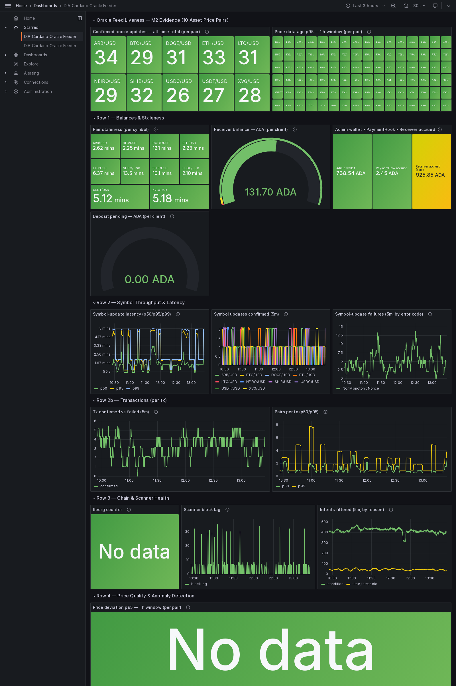

_Each panel is also captured individually below. Every caption names the underlying Prometheus metric and explains what it measures. A batch transaction of N pairs counts as N symbol updates in the per-symbol panels and as ONE transaction in the per-tx panels._

### Overview panels

**Confirmed oracle updates — all-time total (per pair)**

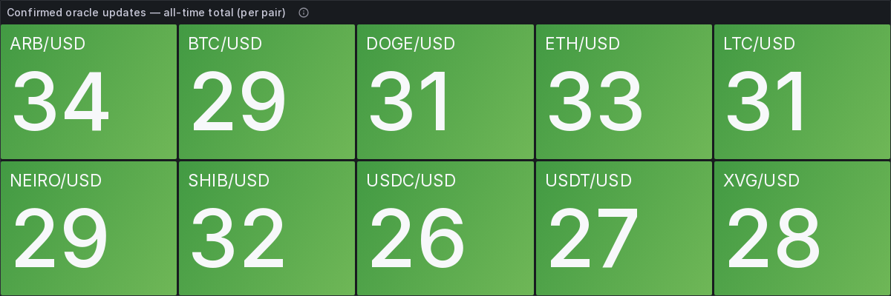

Metric `sum by (symbol) (dia_bridge_transactions_confirmed_total)`. Running all-time count of oracle-update transactions that reached on-chain confirmation, split per price pair (the `symbol` label). This is the liveness proof — every active pair should show a non-zero, growing count.

**Price data age p95 — 1 h window (per pair)**

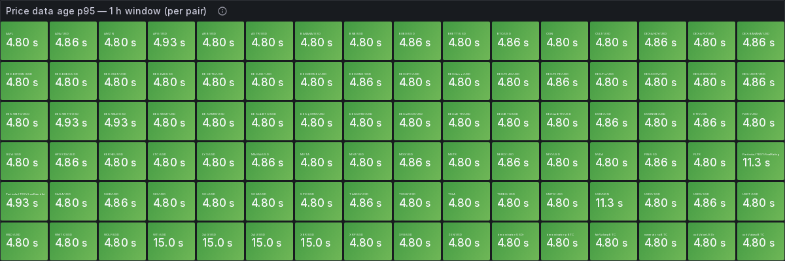

Metric `histogram_quantile(0.95, rate(dia_bridge_price_age_seconds_bucket[1h]))` per `symbol`, in seconds. 95th percentile of how old the DIA source price was at the moment the feeder consumed it — i.e. data freshness, not transaction speed. Lower is better; high values feed the `PriceAgeHigh` alert.

**Pair staleness (per symbol)**

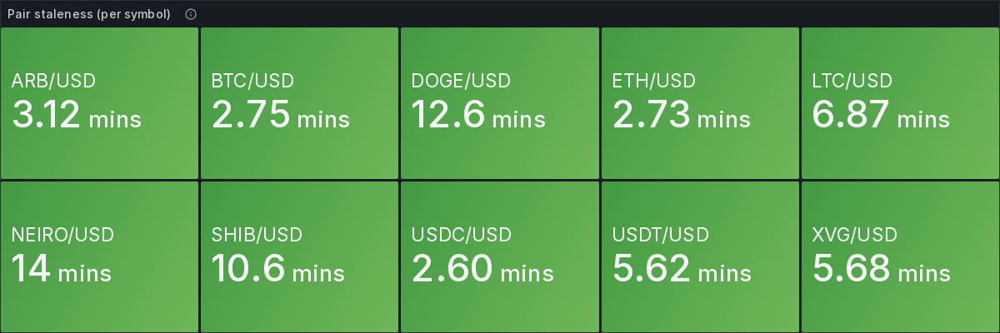

Metric `time() - dia_bridge_cardano_oracle_last_confirmed_timestamp_seconds`, in seconds. Wall-clock age of the most recent confirmed on-chain update for each pair — how stale the value currently living on Cardano is. Drives the `OraclePairStale` alert.

**Receiver balance — ADA (per client)**

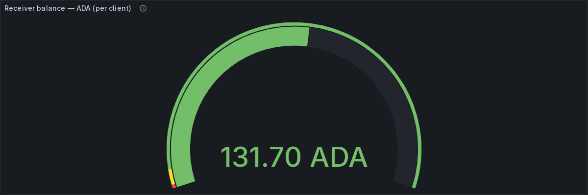

Metric `dia_bridge_cardano_receiver_balance_lovelace / 1000000`, in ADA. Current spendable balance of each Receiver address, converted from lovelace. The metric labels include both `receiver_address` and the client `deposit_address` operators should fund when `ReceiverBalanceLow` fires.

**Admin wallet • PaymentHook • Receiver accrued — ADA**

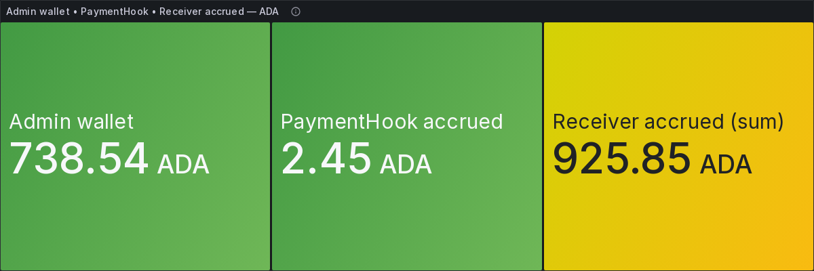

Three ADA series (lovelace ÷ 1e6): `dia_bridge_cardano_admin_wallet_lovelace` (operator admin wallet), `dia_bridge_cardano_payment_hook_accrued_lovelace` (fees accrued inside the PaymentHook awaiting withdraw), and `sum(dia_bridge_cardano_receiver_accrued_lovelace)` (amounts accrued at receivers awaiting settle). Together they track the fee / settlement money flow.

**Symbol-update latency (p50/p95/p99)**

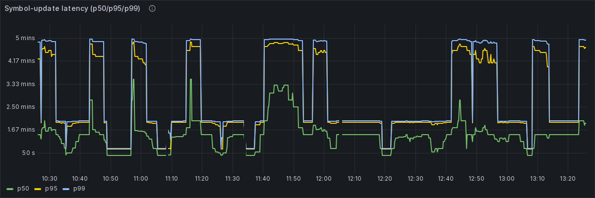

Metric `histogram_quantile(0.50 / 0.95 / 0.99, rate(dia_bridge_end_to_end_latency_seconds_bucket[5m]))`, in seconds, aggregated across all pairs. Per-symbol pipeline latency from feeder processing start to Cardano confirmation, at the median, 95th and 99th percentiles. For per-TRANSACTION stage latency see the Transactions dashboard below.

**Symbol updates confirmed (5m)**

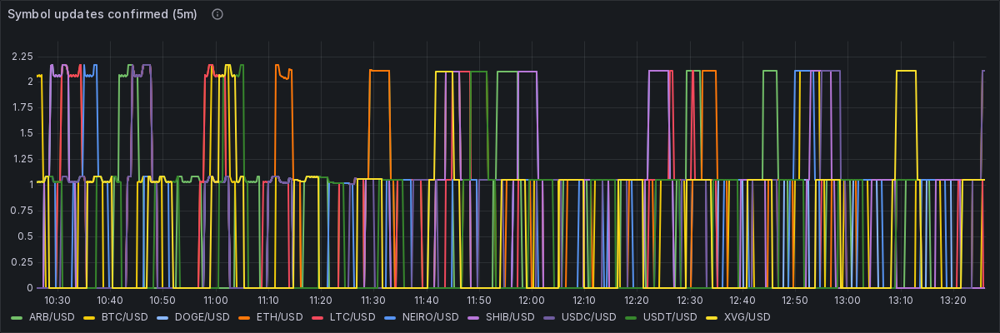

Metric `sum by (symbol) (increase(dia_bridge_transactions_confirmed_total[5m]))` — a 5-minute count (not a rate), per pair. A batch transaction of N pairs adds 1 to each of its N symbols, so this is symbol-update throughput; for pure per-transaction counts see "Tx confirmed vs failed" below.

**Symbol-update failures (5m, by error code)**

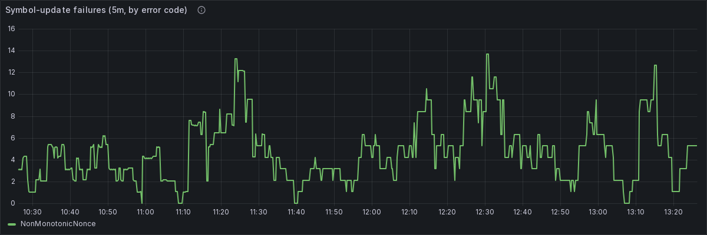

Metric `sum by (error_code) (increase(dia_bridge_transactions_failed_total[5m]))` — a 5-minute count grouped by `error_code`. Condemned/superseded intents the feeder declined to submit surface as `NonMonotonicNonce` (no tx, no fee); codes are documented in `offchain/feeder/src/errors/codes.ts`.

**Tx confirmed vs failed (5m)**

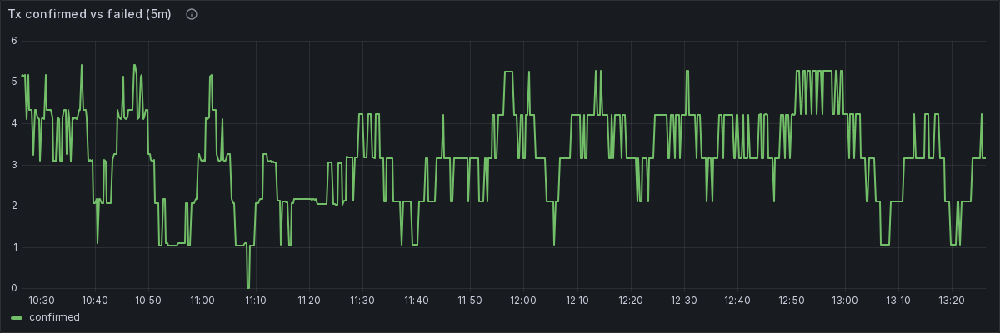

Metric `sum by (outcome) (increase(dia_bridge_transactions_total[5m]))` — Cardano TRANSACTIONS per 5-minute window, counted once per tx (a batch of N pairs is ONE tx), by `outcome`. Condemned no-ops are excluded. This is pure transaction throughput, distinct from the per-symbol counts above.

**Pairs per tx (p50/p95)**

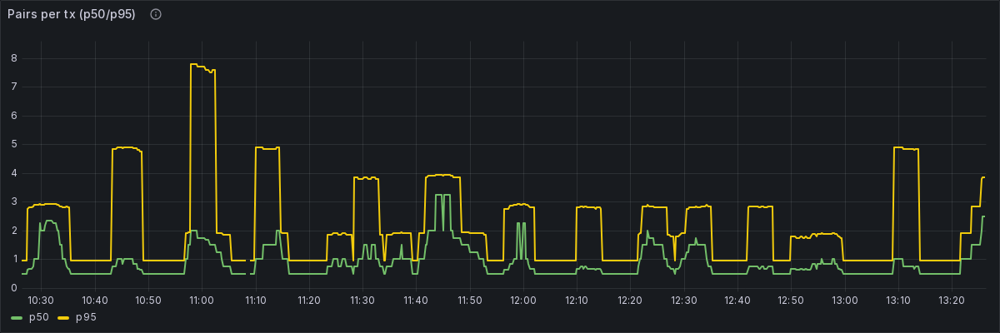

Metric `histogram_quantile(0.50 / 0.95, rate(dia_bridge_transaction_pairs_bucket[5m]))` — batch size: how many pairs travel in each transaction, at the median and 95th percentile.

**Reorg counter**


Metric `sum(increase(dia_bridge_transactions_reorg_total[1h]))`. Count of already-confirmed transactions dropped by a chain reorganisation in the last hour. Should sit at 0; a sustained non-zero value triggers `ReorgRateHigh` and points at provider lag.

**Scanner block lag**

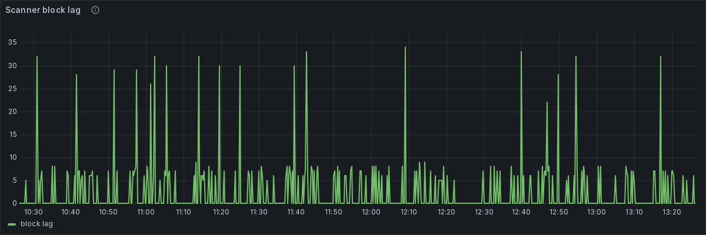

Metric `dia_bridge_scanner_block_lag`, in blocks. How many blocks behind the chain tip the DIA-side scanner currently is. A steadily rising lag means the scanner is falling behind the source chain and updates will be delayed.

**Intents filtered (5m, by reason)**

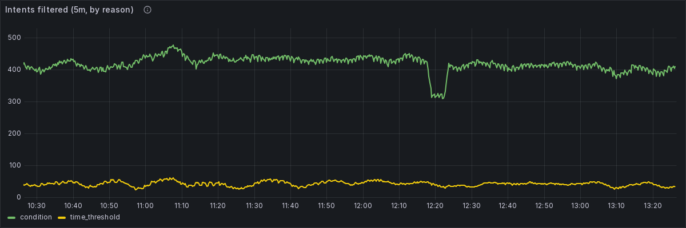

Metric `sum by (reason) (increase(dia_bridge_intents_filtered_total[5m]))` — a 5-minute count grouped by `reason`. Intents the feeder deliberately suppressed before submitting. High counts are normal: the deviation/time-threshold policy suppresses most intents by design.

**Price deviation p95 — 1 h window (per pair)**


Metric `histogram_quantile(0.95, rate(dia_bridge_price_deviation_percent_bucket[1h]))` per `symbol`, in percent. 95th percentile of the percentage gap between the price the feeder published and the reference price, per pair. A high value suggests a possible misreport and feeds the `PriceDeviationHigh` alert.

**Price deviation distribution (heatmap)**


Metric `sum by (le, symbol) (rate(dia_bridge_price_deviation_percent_bucket[5m]))`, percent buckets. Heatmap of the full price-deviation distribution over time (histogram `le` buckets, colour = frequency). Healthy feeds cluster near 0%; a vertical spread means deviations are growing.

### Transactions dashboard

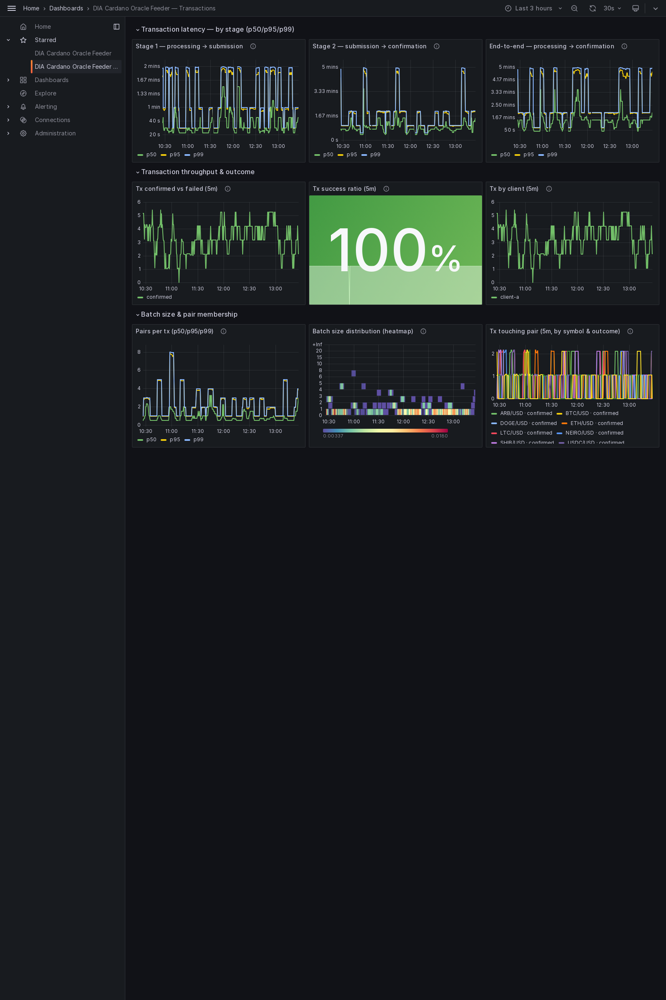

_The per-transaction view: a batch of N pairs is ONE transaction here. Stage latency, confirmed-vs-failed throughput, success ratio and batch size._

### Transactions panels

**Stage 1 — processing → submission**

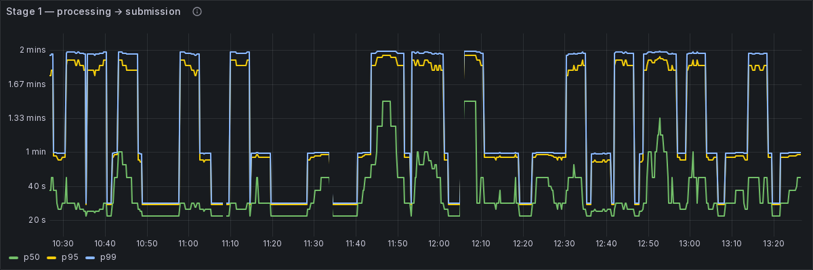

Metric `histogram_quantile(0.50 / 0.95 / 0.99, rate(dia_bridge_tx_processing_to_submission_seconds_bucket[5m]))`, in seconds, one observation per confirmed tx. Time to build, queue and sign a transaction before broadcast.

**Stage 2 — submission → confirmation**

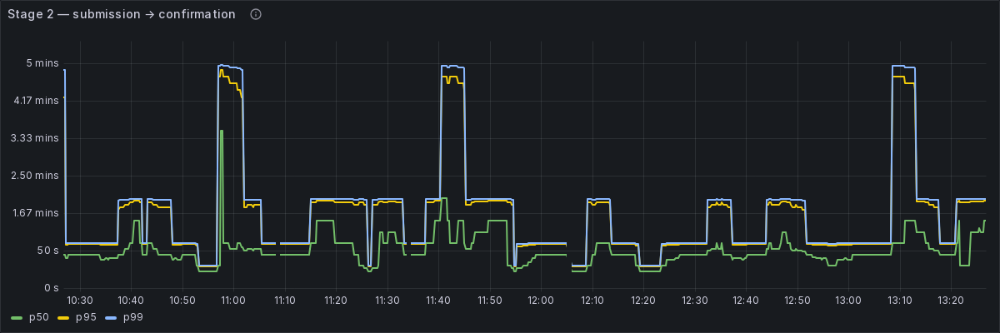

Metric `histogram_quantile(0.50 / 0.95 / 0.99, rate(dia_bridge_tx_submission_to_confirmation_seconds_bucket[5m]))`, in seconds. Pure Cardano settlement time from broadcast to on-chain confirmation, per tx.

**End-to-end — processing → confirmation**

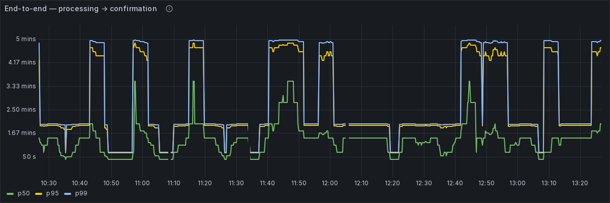

Metric `histogram_quantile(0.50 / 0.95 / 0.99, rate(dia_bridge_tx_end_to_end_seconds_bucket[5m]))`, in seconds. Total per-transaction latency from feeder processing start to confirmation.

**Tx confirmed vs failed (5m)**

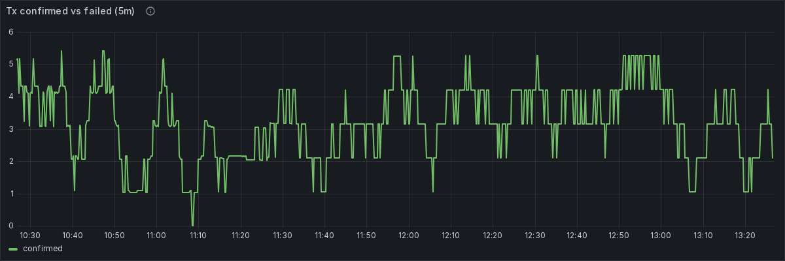

Metric `sum by (outcome) (increase(dia_bridge_transactions_total[5m]))` — transactions per 5-minute window counted once per tx, by outcome. Condemned no-ops excluded.

**Tx success ratio (5m)**

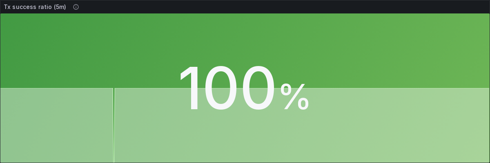

Confirmed transactions as a percentage of all real attempts (confirmed + failed) over 5 minutes: `100 * confirmed / (confirmed + failed)` from `dia_bridge_transactions_total`. Condemned no-ops are excluded from both terms.

**Tx by client (5m)**

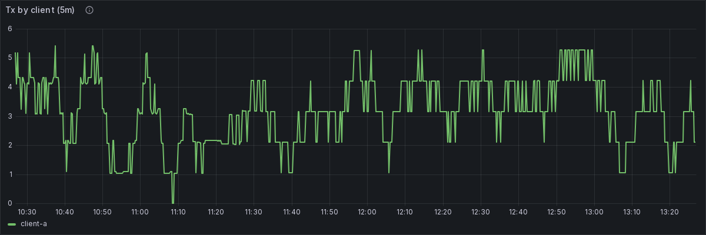

Metric `sum by (client_id) (increase(dia_bridge_transactions_total[5m]))` — transactions per 5-minute window grouped by client (receiver identity), counted once per tx.

**Pairs per tx (p50/p95/p99)**

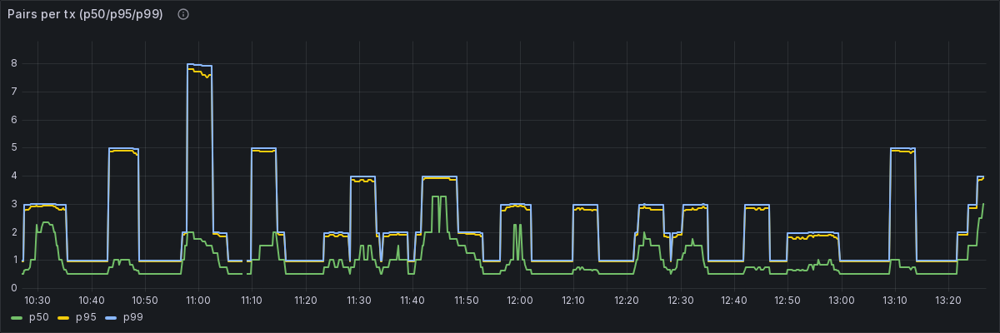

Metric `histogram_quantile(0.50 / 0.95 / 0.99, rate(dia_bridge_transaction_pairs_bucket[5m]))` — batch size distribution: pairs per transaction at the median, 95th and 99th percentiles.

**Batch size distribution (heatmap)**

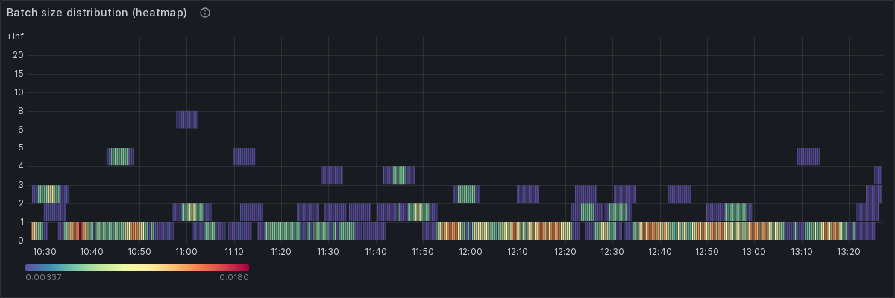

Metric `sum by (le) (rate(dia_bridge_transaction_pairs_bucket[5m]))`, batch-size buckets. Heatmap of pairs-per-transaction over time; bright bands show the typical batch size.

**Tx touching pair (5m, by symbol & outcome)**

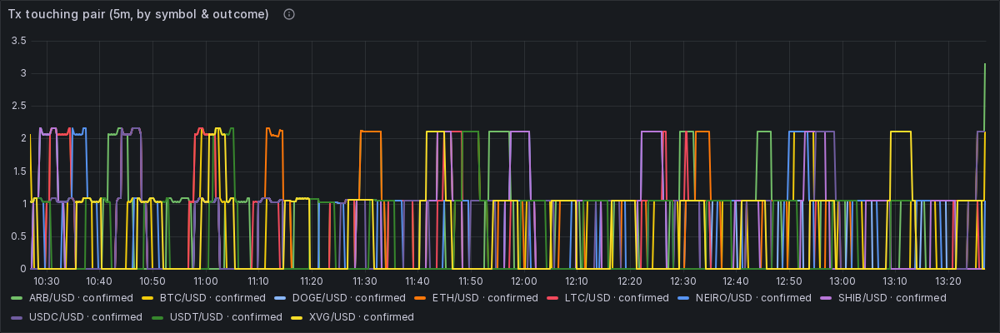

Metric `sum by (symbol, outcome) (increase(dia_bridge_tx_pair_membership_total[5m]))` — one increment per (tx, pair). Filter by `$symbol` to find the transactions that included a given pair (their size is in "Pairs per tx"); carries confirmed vs failed and the customer dimension.


To reproduce this dashboard live:

```sh
cd offchain && make up-monitoring
# then open http://localhost:3000 (default admin/admin) — dashboard is auto-provisioned.
```

See the [feeder README — Daemon + monitoring section](../../../offchain/feeder/README.md#daemon--monitoring)
for the canonical operator instructions.

## Alerts active during the window

Source of truth: [`offchain/feeder/monitoring/alerts.yml`](../../../offchain/feeder/monitoring/alerts.yml).
Canonical thresholds: `infrastructure.<network>.yaml::alerting.*`. Every alert below carries an
exact, copy-pasteable remediation (Docker + npm) in its description.

### Alert catalog (all rules)

| Alert | Severity | For | Threshold | Summary |
| --- | --- | --- | --- | --- |
| OraclePairStale | warning | 5m | 3600 | Oracle pair <symbol> has stopped updating on-chain |
| ReceiverBalanceLow | warning | 5m | 2 | Receiver prepaid balance for client <client_id> is below 2 ADA |
| SettleOverdue | warning | 10m | 10 | Client <client_id> has over 10 ADA of accrued fees waiting to settle |
| PaymentHookWithdrawReady | info | 10m | 50 | PaymentHook holds over 50 ADA of collected fees — ready to withdraw |
| AdminWalletLow | critical | 5m | 5 | Admin (operator) wallet is below 5 ADA — all updates will stall |
| PriceDeviationHigh | critical | 10m | 5 | Price for <symbol> moved more than 5% — possible bad data |
| PriceAgeHigh | warning | 10m | 600 | DIA source data for <symbol> is going stale (upstream) |
| ReorgRateHigh | warning | 5m | 3 | Cardano reorgs are dropping confirmed updates for <symbol> |
| ReceiverDepositsPending | info | 10m | 5 | Client <client_id> has over 5 ADA of un-merged deposits waiting |

### Active at capture time

Captured live from Prometheus `/api/v1/alerts` (raw: [`alerts-active.json`](./alerts-active.json)):

| Alert | State | Key labels | Value | Active since |
| --- | --- | --- | --- | --- |
| SettleOverdue | firing | client_id=client-a, run_dir=preview_run_20260608-040304 | 9.2585e+02 | 2026-06-09T08:36:50.29264446Z |

### Remediation (exact operator commands)

Each alert's full description from `alerts.yml` — the WHY and the exact Docker + npm commands an
operator runs. Labels shown as `{{ $labels.x }}` are filled in by Prometheus at fire time (the
active table above shows the real values).

**OraclePairStale** — Oracle pair <symbol> has stopped updating on-chain

```text
Pair {{ $labels.symbol }} has not had a confirmed Cardano update for {{ $value | humanizeDuration }} (alert fires after 1 hour). The feeder is no longer landing price updates for this pair on-chain, so consumers read an increasingly stale price.
WHY: an update lands on-chain only if (a) the client's Receiver has ADA to pay the per-update fee, (b) the operator (Admin) wallet has ADA to pay the network fee, and (c) the DIA source is still publishing this symbol. This alert does not say which of the three failed — work down the list.
WHAT TO DO: 1. Read the running feeder's logs and look for {{ $labels.symbol }}
   together with "Insufficient", "error", or "failed":
     cd offchain && make logs
2. Most common: the Receiver ran out of ADA (see ReceiverBalanceLow).
   Top it up with 5 ADA:
     Docker: cd offchain && make cli CMD="deposit:address --protocol-state /app/offchain/state/{{ $labels.run_dir }}/config-bootstrap.json --client-state /app/offchain/state/{{ $labels.run_dir }}/clients/{{ $labels.client_id }}.json"
     npm:    cd offchain/cli && npm run cli -- deposit:address --protocol-state ../state/{{ $labels.run_dir }}/config-bootstrap.json --client-state ../state/{{ $labels.run_dir }}/clients/{{ $labels.client_id }}.json
   Then send client ADA to that deposit address. The feeder will
   merge/fold it into the Receiver automatically; `receiver:top-up`
   is still available as an operator-only fallback.
3. Next: the Admin (signer) wallet may be empty — see AdminWalletLow
   for how to replenish it by collecting accrued fees.
4. If both wallets have ADA and the logs show no submit error, the
   DIA source likely stopped publishing this symbol — see
   PriceAgeHigh.
```

**ReceiverBalanceLow** — Receiver prepaid balance for client <client_id> is below 2 ADA

```text
The Receiver for client {{ $labels.client_id }} holds {{ $value | printf "%.2f" }} ADA of spendable balance (alert fires below 2 ADA).
Client Receiver address (on Preview, view on a testnet explorer):
  {{ $labels.receiver_address }}
Client deposit address to fund:
  {{ $labels.deposit_address }}

WHY / WHOSE MONEY: the Receiver is THE CLIENT'S PREPAID FEE POOL — the same model as the EVM side. The client prepays ADA into it and consumes prices off-chain; this balance pays the protocol fee (base_fee + n*per_pair_fee) on every update. When it hits zero, updates for this client stop with "ReceiverInsufficientFunds" and OraclePairStale follows. (The "accrued" bucket already collected is separate and cannot pay new fees — only this spendable balance can.) So topping it up is the CLIENT'S responsibility; the operator can do it on the client's behalf and bill it, but the ADA is the client's.
HOW TO FUND IT — IMPORTANT: do NOT send ADA directly to the Receiver address above. It is a script UTxO; a plain transfer there does nothing useful and can be stranded.
Preferred path: send ADA to the client's deposit address shown above. You can also verify it from the client artifact or print it with:
  Docker: cd offchain && make cli CMD="deposit:address --protocol-state /app/offchain/state/{{ $labels.run_dir }}/config-bootstrap.json --client-state /app/offchain/state/{{ $labels.run_dir }}/clients/{{ $labels.client_id }}.json"
  npm:    cd offchain/cli && npm run cli -- deposit:address --protocol-state ../state/{{ $labels.run_dir }}/config-bootstrap.json --client-state ../state/{{ $labels.run_dir }}/clients/{{ $labels.client_id }}.json

After the client sends ADA there, the feeder automatically folds it into Receiver balance by update-fold or auto-merge. Operator fallback, if you must top up directly from the configured wallet (amount is lovelace; 5000000 = 5 ADA):
  Docker: cd offchain && make cli CMD="receiver:top-up --amount-lovelace 5000000 --protocol-state /app/offchain/state/{{ $labels.run_dir }}/config-bootstrap.json --client-state /app/offchain/state/{{ $labels.run_dir }}/clients/{{ $labels.client_id }}.json"
  npm:    cd offchain/cli && npm run cli -- receiver:top-up --amount-lovelace 5000000 --protocol-state ../state/{{ $labels.run_dir }}/config-bootstrap.json --client-state ../state/{{ $labels.run_dir }}/clients/{{ $labels.client_id }}.json
The alert clears within ~1 minute after funds are merged/top-up confirms.
```

**SettleOverdue** — Client <client_id> has over 10 ADA of accrued fees waiting to settle

```text
The Receiver for client {{ $labels.client_id }} has accrued {{ $value | printf "%.2f" }} ADA of protocol fees (alert fires above 10 ADA).
WHY: each update moves the fee from the Receiver's balance into its "accrued" bucket (AccrueFee). Those fees sit in the Receiver until an admin "settle" sweeps them into the global PaymentHook, from where they can be withdrawn as protocol revenue. Letting accrued grow unbounded delays revenue collection and keeps lovelace locked in the Receiver UTxO. Settling is safe and idempotent (it never touches the spendable balance).
WHAT TO DO — run a settle for this client (sweeps accrued -> PaymentHook):
  Docker: cd offchain && make cli CMD="settle --protocol-state /app/offchain/state/{{ $labels.run_dir }}/config-bootstrap.json --client-state /app/offchain/state/{{ $labels.run_dir }}/clients/{{ $labels.client_id }}.json"
  npm:    cd offchain/cli && npm run cli -- settle --protocol-state ../state/{{ $labels.run_dir }}/config-bootstrap.json --client-state ../state/{{ $labels.run_dir }}/clients/{{ $labels.client_id }}.json
After it confirms, the accrued bucket is 0 and the alert clears. To then turn that into spendable revenue, withdraw from the PaymentHook (see PaymentHookWithdrawReady).
```

**PaymentHookWithdrawReady** — PaymentHook holds over 50 ADA of collected fees — ready to withdraw

```text
The global PaymentHook holds {{ $value | printf "%.2f" }} ADA of settled protocol fees (alert fires above 50 ADA). Nothing is broken — this is accumulated REVENUE ready to be withdrawn.
WHY: settles from all clients' Receivers accumulate here. Withdrawing pays the lovelace to the protocol's configured withdraw_address, which in normal operation is the Admin (operator) wallet — so this is also how that wallet is replenished to keep paying network fees.
WHAT TO DO — withdraw the fees. Set --amount-lovelace to how much you want (in lovelace; 50000000 = 50 ADA). Check the exact available amount on the Grafana "Admin wallet / PaymentHook / Receiver accrued" panel or via the dia_bridge_cardano_payment_hook_accrued_lovelace metric, and do not request more than is accrued:
  Docker: cd offchain && make cli CMD="payment-hook:withdraw --amount-lovelace 50000000 --protocol-state /app/offchain/state/{{ $labels.run_dir }}/config-bootstrap.json"
  npm:    cd offchain/cli && npm run cli -- payment-hook:withdraw --amount-lovelace 50000000 --protocol-state ../state/{{ $labels.run_dir }}/config-bootstrap.json
TIMING: run this only after the most recent settle is fully confirmed. Firing a withdraw a few seconds after a settle can fail with "BadInputsUTxO" because the provider has not yet indexed the new wallet/Hook UTxO — wait ~30 s and retry the same command.
```

**AdminWalletLow** — Admin (operator) wallet is below 5 ADA — all updates will stall

```text
The Admin (signer/operator) wallet holds {{ $value | printf "%.2f" }} ADA (alert fires below 5 ADA). This is the wallet that signs every Cardano transaction the feeder submits and PAYS THE NETWORK FEE for it. If it empties, NO update for ANY client can be submitted — everything stalls.
WHY / HOW IT IS REFILLED: this wallet's income is the protocol revenue itself. Fees flow Receiver -> (settle) -> PaymentHook -> (payment-hook:withdraw) -> withdraw_address, and withdraw_address is this operator wallet. So the FIRST remedy is to COLLECT accrued revenue, not to send ADA from outside.
WHAT TO DO: 1. Sweep each client's accrued fees into the PaymentHook (repeat per
   client id you operate):
     Docker: cd offchain && make cli CMD="settle --protocol-state /app/offchain/state/{{ $labels.run_dir }}/config-bootstrap.json --client-state /app/offchain/state/{{ $labels.run_dir }}/clients/client-a.json"
     npm:    cd offchain/cli && npm run cli -- settle --protocol-state ../state/{{ $labels.run_dir }}/config-bootstrap.json --client-state ../state/{{ $labels.run_dir }}/clients/client-a.json
2. Wait ~30 s for the settle to be indexed, then withdraw the
   collected fees from the PaymentHook into this wallet (set the
   amount in lovelace to what the PaymentHook accrued metric shows):
     Docker: cd offchain && make cli CMD="payment-hook:withdraw --amount-lovelace 50000000 --protocol-state /app/offchain/state/{{ $labels.run_dir }}/config-bootstrap.json"
     npm:    cd offchain/cli && npm run cli -- payment-hook:withdraw --amount-lovelace 50000000 --protocol-state ../state/{{ $labels.run_dir }}/config-bootstrap.json
3. FALLBACK ONLY — if there is no accrued revenue to collect (the
   PaymentHook and all Receivers are near zero) and the wallet is
   genuinely empty, fund it from outside. Find its address:
     grep -A2 '"wallet"' offchain/state/{{ $labels.run_dir }}/config-bootstrap.json
   then on Preview request test ADA from the Cardano faucet
   (https://docs.cardano.org/cardano-testnets/tools/faucet); on
   Mainnet send ADA from the treasury.

NOTE: right after a restart this metric can briefly read 0 before the feeder reads the real on-chain balance. If you JUST restarted, give it a minute before acting — the 5-minute `for:` window usually covers it.
```

**PriceDeviationHigh** — Price for <symbol> moved more than 5% — possible bad data

```text
The 95th-percentile price change for {{ $labels.symbol }} is {{ $value | printf "%.2f" }}% over the last 10 minutes (alert fires above 5%). This is a DATA-QUALITY signal, not a feeder fault — no wallet top-up fixes it. It can mean a misreported / outlier price from the DIA source, or a genuinely fast market move.
WHAT TO DO: 1. Compare {{ $labels.symbol }} against a public reference (CoinGecko,
   Binance, etc.).
2. If the on-chain value is clearly wrong, stop publishing this pair:
   remove it from the active router YAML under
   offchain/feeder/config/ and restart the feeder
   (cd offchain && make restart), then raise it with the DIA data team.
3. If it was a real market move, no action is needed; the alert
   clears on its own once volatility subsides.
```

**PriceAgeHigh** — DIA source data for <symbol> is going stale (upstream)

```text
The 95th-percentile age of incoming DIA price data for {{ $labels.symbol }} is {{ $value | humanizeDuration }} (alert fires above 10 minutes). The feeder itself is healthy; the UPSTREAM DIA source is delivering old prices for this symbol (or the source WebSocket connection is degraded).
WHAT TO DO: 1. Confirm the feeder is still connected to the DIA source and watch
   for WebSocket reconnect messages near {{ $labels.symbol }}:
     cd offchain && make logs
2. If the connection is healthy but the data stays old, the source
   feed is lagging on DIA's side — raise it with the DIA data team.
   There is no operator-side fix; do NOT top up wallets for this.
```

**ReorgRateHigh** — Cardano reorgs are dropping confirmed updates for <symbol>

```text
{{ $value }} confirmed transactions for {{ $labels.symbol }} (client {{ $labels.client_id }}) were rolled back by Cardano chain reorganisations in the last hour (alert fires above 3). The feeder re-submits dropped updates automatically, so this is usually self-healing; a sustained high rate points to a lagging chain provider (Blockfrost/Koios).
WHAT TO DO: 1. Open Grafana (http://localhost:3000) and check the "Scanner block
   lag" panel — a large lag means the provider is behind the tip.
2. Watch the running feeder for repeated re-submissions:
     cd offchain && make logs
3. If the rate stays high, switch the chain provider: set
   CARDANO_PROVIDER in offchain/feeder/.env (e.g. Blockfrost <-> Koios)
   and restart:
     cd offchain && make restart
```

**ReceiverDepositsPending** — Client <client_id> has over 5 ADA of un-merged deposits waiting

```text
The per-client deposit address for client {{ $labels.client_id }} holds {{ $value | printf "%.2f" }} ADA of deposits that have not yet been folded into the Receiver balance (alert fires above 5 ADA). Nothing is broken — this is the client's prepaid funding waiting to be applied.
Client deposit address (on Preview, view on a testnet explorer):
  {{ $labels.deposit_address }}

WHY: clients add prepaid funds by sending ADA to their per-client deposit address (side-deposit funding) instead of running `receiver:top-up` themselves. Those deposits accumulate there until a `deposit:merge` spends them and the current Receiver UTxO together, re-creating the Receiver with the deposits folded into its spendable balance. Until a merge runs, the deposited ADA cannot pay update fees — only the Receiver's spendable balance can (see ReceiverBalanceLow). Merging is safe and idempotent; it never touches the accrued bucket.
WHAT TO DO — run a merge for this client (folds deposits -> Receiver balance):
  Docker: cd offchain && make cli CMD="deposit:merge --protocol-state /app/offchain/state/{{ $labels.run_dir }}/config-bootstrap.json --client-state /app/offchain/state/{{ $labels.run_dir }}/clients/{{ $labels.client_id }}.json"
  npm:    cd offchain/cli && npm run cli -- deposit:merge --protocol-state ../state/{{ $labels.run_dir }}/config-bootstrap.json --client-state ../state/{{ $labels.run_dir }}/clients/{{ $labels.client_id }}.json
After it confirms, the deposit-pending total drops to 0 and the alert clears within ~1 minute.
```
