# Milestone 3 Mainnet Evidence

Source of truth: [`final-cardano-milestones.md`](../../final-cardano-milestones.md).

Scope: Milestone 3 (Monitoring Library) validation on
Cardano Mainnet ↔ DIA Mainnet.

Pack stamp: **20260616-074413**

Window observed in `transactions.jsonl`:

- First tx event: `2026-06-19T05:35:20.017Z`
- Last tx event:  `2026-06-19T08:01:32.370Z`

Evidence pack location: this directory.

## Contents

- [Official Milestone 3 Outputs](#official-milestone-3-outputs)
- [Test results](#test-results)
- [Per-feed sanity (accuracy)](#per-feed-sanity-accuracy)
- [Alert-trigger logs](#alert-trigger-logs)
- [Totals (this window)](#totals-this-window)
- [Confirmed Cardano tx count per pair](#confirmed-cardano-tx-count-per-pair)
- [Sample Cardano tx hashes (one per pair, first observed)](#sample-cardano-tx-hashes-one-per-pair-first-observed)
- [End-to-end latency per pair](#end-to-end-latency-per-pair)
- [Failures (grouped by error_code)](#failures-grouped-by-error_code)
- [Raw artefacts in this pack](#raw-artefacts-in-this-pack)
- [Push policy (this run)](#push-policy-this-run)
- [Dashboards](#dashboards)
  - [Overview dashboard](#overview-dashboard)
  - [Overview panels](#overview-panels)
  - [Transactions dashboard](#transactions-dashboard)
  - [Transactions panels](#transactions-panels)
- [Alerts active during the window](#alerts-active-during-the-window)

## Official Milestone 3 Outputs

| Official output | Repository status |
| --- | --- |
| QA validation report | This pack: integration-test results (below) + per-feed sanity checks + alert-trigger logs. |
| Anomaly detection | Complete: `offchain/feeder/monitoring/alerts.yml` (13 alert rules) over price-deviation, price-age/staleness, reorg, and on-chain-vs-source feed-sanity signals; canonical thresholds in `infrastructure.<network>.yaml::alerting.*`. |
| Uptime and accuracy reports | This pack: per-pair confirmed counts + latency + reorg stats; per-feed accuracy from the sanity check. |
| Automated alerts | Complete: Prometheus rules → Alertmanager → feeder webhook → `alert_log` (single pipeline; Telegram/email one config flip away). |
| Test coverage | Feeder `npm test`: **665 / 665 passing**, 0 failed (154 suites) — **PASS**. CLI `npm test`: **PASS**. Full output captured in [`tests/`](tests/). See [Test results](#test-results). |
| Real-time dashboards | Complete: `dashboards/` (PNG snapshots taken at pack time). Source JSON in [`offchain/feeder/monitoring/grafana/dashboards/`](../../../../offchain/feeder/monitoring/grafana/dashboards/). |
| Developer documentation | Complete: [feeder README](../../../../offchain/feeder/README.md), [CLI README](../../../../offchain/cli/README.md), [architecture](../../../architecture/cardano-oracle-architecture.md). |

## Test results

Both test suites were run when this pack was assembled; the full console output is
saved alongside this report.

| Suite | Result | Tests | Suites | Output |
| --- | --- | ---: | ---: | --- |
| Feeder (`offchain/feeder`, `npm test`) | **PASS** | 665 / 665 passing (0 failed) | 154 | [`tests/feeder-tests.txt`](tests/feeder-tests.txt) |
| CLI (`offchain/cli`, `npm test`) | **PASS** | — (custom runner; pass/fail by exit code) | — | [`tests/cli-tests.txt`](tests/cli-tests.txt) |

## Per-feed sanity (accuracy)

Confirms oracle timestamp and price accuracy per price feed: each live on-chain
Pair value is compared against the latest DIA source value and judged against that
feed's own push-policy thresholds (price tolerance + freshness ceiling).

# Feed sanity check — Mainnet

1 feeds: 1 PASS · 0 WARN · 0 FAIL.

| Symbol | Status | Deviation % | Staleness (s) | Reasons |
|--------|--------|-------------|---------------|---------|
| ARS/USDT | PASS | 0 | 1200 | — |

## Alert-trigger logs

A run of `scripts/monitoring/trigger-alert-demo.sh` fired each alert through the live pipeline and captured the transitions. The full timeline and per-alert snapshots (Prometheus state + feeder `alert_log` + dashboard PNGs) are under [`alert-trigger/`](alert-trigger/timeline.md).

# Alert-trigger logs — Mainnet

Each alert below was fired by pushing a synthetic value for its metric to the
Pushgateway (`trigger-alert.sh`). The value crosses the real threshold from
`monitoring/alerts.yml`, so the genuine rule fires and flows through the live
pipeline (Prometheus → Alertmanager → feeder webhook → `alert_log`). Only the
input metric is synthetic; the rules, routing, and recording are production.

Run stamp: **20260619-080739** · Prometheus: http://localhost:9090 · feeder: http://localhost:8080

| Alert | Pushed at | Reached `firing` | Cleared at | Resolved | Prometheus | alert_log |
| --- | --- | --- | --- | --- | --- | --- |
| OraclePairStale | 2026-06-19T08:07:39Z | 325s | 2026-06-19T08:12:55Z | yes (120s) | [`OraclePairStale-prometheus.json`](OraclePairStale-prometheus.json) | [`OraclePairStale-alertlog.json`](OraclePairStale-alertlog.json) |

## Totals (this window)

| Metric | Value |
| --- | ---: |
| Confirmed Cardano oracle update txs | 7 |
| Failed Cardano tx attempts (real, tx broadcast) | 0 |
| Condemned intents (NonMonotonicNonce — no tx, no fee) | 0 |
| Chain reorgs that dropped a tx | 0 |

## Confirmed Cardano tx count per pair

| Pair | Confirmed txs |
| --- | --- |
| ARS/USDT | 7 |

## Sample Cardano tx hashes (one per pair, first observed)

| Pair | Tx hash |
| --- | --- |
| ARS/USDT | 31dc1efb2789b6502cfe8c1312a56562e6522a8b97525c5ad53977f0532cd78e |

Verify on [Cardanoscan](https://cardanoscan.io/) or any
public Mainnet explorer.

## End-to-end latency per pair

DIA `IntentRegistered` → Cardano `tx_confirmed`, milliseconds.

| Pair | Samples | p50 (ms) | p95 (ms) |
| --- | --- | --- | --- |
| ARS/USDT | 6 | 65832 | 91753 |

## Failures (grouped by error code)

Real Cardano transaction failures only — a transaction was broadcast and then
failed on-chain. Routine non-failures (an update made obsolete by a newer one
before it was sent, or an update interrupted by a restart) are not counted here.
An empty table means there were no real failures in this run.

_(no data)_

## Raw artefacts in this pack

| Path | Contents |
| --- | --- |
| `logs/feeder.log`              | Daemon event stream (mirrors stderr). |
| `logs/transactions.jsonl`      | One JSON line per tx pipeline step. |
| `logs/lane.jsonl`              | Lane state events (intent_buffered, flush_triggered, …). |
| `logs/intents/`                | Per-intent lifecycle files (`<ts>_<hash>.log`). |
| `db/transaction_log.csv`       | Full `transaction_log` table dump from `feeder.sqlite`. |
| `db/processed_events.csv`      | Full `processed_events` table dump. |
| `db/chain_state.csv`           | Scanner checkpoint snapshot. |
| `api/prices.json`              | `GET /api/v1/prices` at pack time. |
| `api/chains.json`              | `GET /api/v1/chains` at pack time. |
| `api/symbols.json`             | `GET /api/v1/symbols` at pack time. |
| `api/metrics.txt`              | Prometheus `/metrics` exposition at pack time. |
| `dashboards/dashboard-full.png` | Full Grafana overview dashboard at pack time. |
| `dashboards/panel-*.png`       | Per-panel snapshots. |
| `dashboards/tx-*.png`          | Transactions dashboard + its panels. |
| `dashboards/internals-dashboard-full.png` | Internals dashboard (per-phase latency, scanner, workers, DB, cron/recovery). |
| `sanity/feed-sanity.{md,json}` | Per-feed accuracy: on-chain value vs latest DIA source, per symbol. |
| `alert-trigger/`               | Alert-trigger run (if folded in): timeline + per-alert Prometheus/alert_log/PNG. |
| `stats/`                       | Intermediate TSV files this markdown was built from. |
| `tests/feeder-tests.txt`       | Full `npm test` console output for the feeder suite (node:test). |
| `tests/cli-tests.txt`          | Full `npm test` console output for the CLI suite. |
| `alerts-active.json`           | Prometheus `/api/v1/alerts` snapshot at pack time. |
| `SUMMARY.json`                 | Machine-readable totals (top of this document, as JSON). |

## Push policy (this run)

When the feeder pushes an oracle update is decided per pair by an OR-gate over a few knobs.
**This run's config** (`config/routers/mainnet/<client>.yaml`, `destinations[].*`):

```yaml
# client-test-01-router-default.yaml
  price_deviation: "0.5%"
  time_threshold: 30m
  cron: true
```

With `time_threshold > 0` + `cron: true` + `price_deviation`, this is the **classic OR-gate + cron heartbeat**: a pair pushes when the price moves at least `price_deviation` **OR** every `time_threshold` (the cron heartbeat fires even if no new DIA intent arrives), so **max staleness ≈ `time_threshold`**. No `max_staleness` key is set — and it would be ignored here anyway, because it only applies when `time_threshold` is absent or `0`.

The other modes (and their effect on push frequency / max staleness / tx volume) are documented in full:
**[docs/audit/20260609-feeder-push-policy-config.md](../../../audit/20260609-feeder-push-policy-config.md)**. In short:

- **OR-gate + heartbeat** (this run): move-based fast path + a `time_threshold` ceiling guaranteed by cron. Bounded staleness, medium tx.
- **Deviation-only mode** (`time_threshold: 0s` + `max_staleness`): push only on a real price move, with `max_staleness` as the backstop. Fewest tx, ceiling = `max_staleness`.
- **Periodic only** (`time_threshold` + `cron`, no `price_deviation`): a steady heartbeat every `time_threshold`, no fast path on a spike.
- **Push-everything** (no knobs): every monotonic intent is submitted — highest tx volume.

In every mode, out-of-order (`timestamp_regression`) and duplicate (`timestamp_duplicate`) intents are dropped before anything is built.

## Dashboards

Grafana dashboard `DIA Cardano Oracle Feeder` (UID `dia-cardano-feeder`) —
PNG snapshots taken at pack time over a `now-3h` window. Source JSON:
[`offchain/feeder/monitoring/grafana/dashboards/feeder.json`](../../../../offchain/feeder/monitoring/grafana/dashboards/feeder.json).

### Overview dashboard

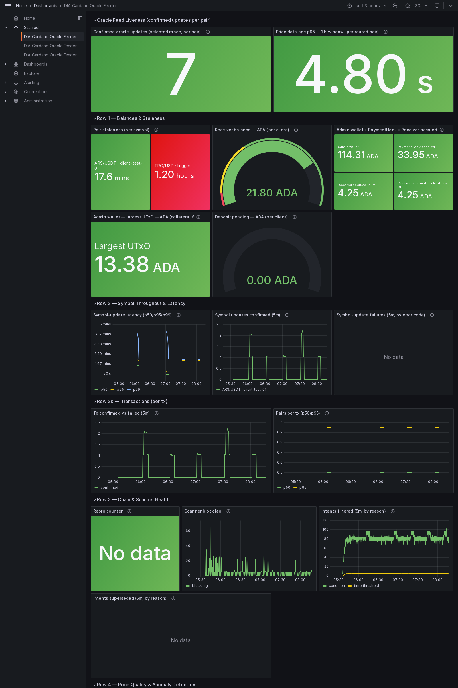

_Each panel is also captured individually below. Every caption names the underlying Prometheus metric and explains what it measures. A batch transaction of N pairs counts as N symbol updates in the per-symbol panels and as ONE transaction in the per-tx panels._

### Overview panels

**Confirmed oracle updates (selected range, per pair)**

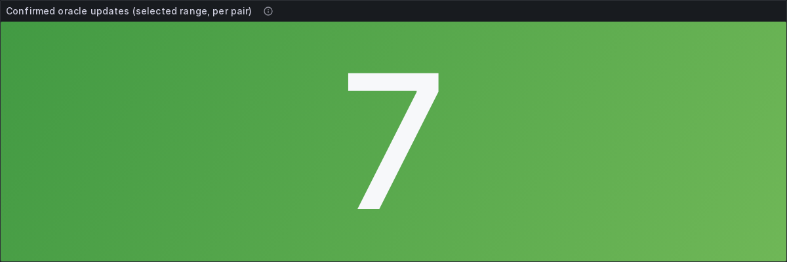

Confirmed Cardano oracle-update transactions per price pair over the selected time range. The liveness proof: every active feed should show a non-zero count.

**Price data age p95 — 1 h window (per routed pair)**

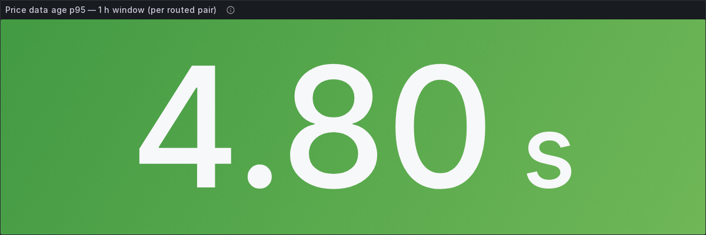

Metric `histogram_quantile(0.95, rate(dia_bridge_price_age_seconds_bucket[1h]))` per `symbol`, in seconds. 95th percentile of how old the DIA source price was at the moment the feeder consumed it — i.e. data freshness, not transaction speed. Recorded ONLY for the pairs this feeder routes (not the hundreds of other symbols the source feed carries). Lower is better; high values feed the `PriceAgeHigh` alert.

**Pair staleness (per symbol)**

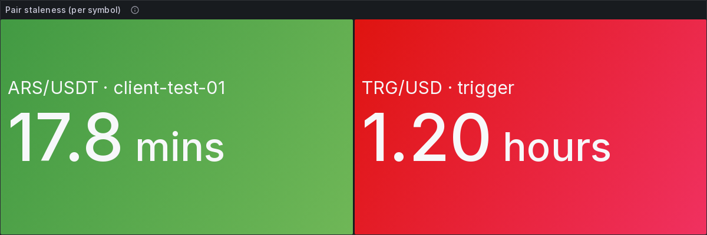

Metric `time() - dia_bridge_cardano_oracle_last_confirmed_timestamp_seconds`, in seconds. Wall-clock age of the most recent confirmed on-chain update for each pair — how stale the value currently living on Cardano is. Drives the `OraclePairStale` alert.

**Receiver balance — ADA (per client)**

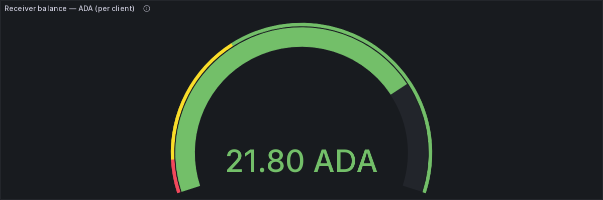

Metric `dia_bridge_cardano_receiver_balance_lovelace / 1000000`, in ADA. Current spendable balance of each Receiver address, converted from lovelace. The metric labels include both `receiver_address` and the client `deposit_address` operators should fund when `ReceiverBalanceLow` fires.

**Admin wallet • PaymentHook • Receiver accrued — ADA**

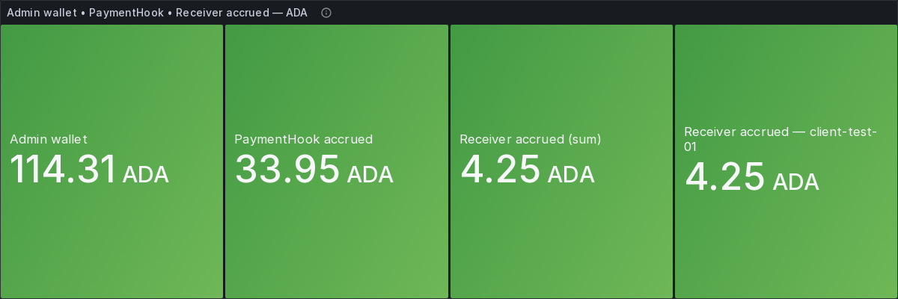

Three ADA series (lovelace ÷ 1e6): `dia_bridge_cardano_admin_wallet_lovelace` (operator admin wallet), `dia_bridge_cardano_payment_hook_accrued_lovelace` (fees accrued inside the PaymentHook awaiting withdraw), and `sum(dia_bridge_cardano_receiver_accrued_lovelace)` (amounts accrued at receivers awaiting settle). Together they track the fee / settlement money flow.

**Admin wallet — largest UTxO — ADA (collateral floor)**

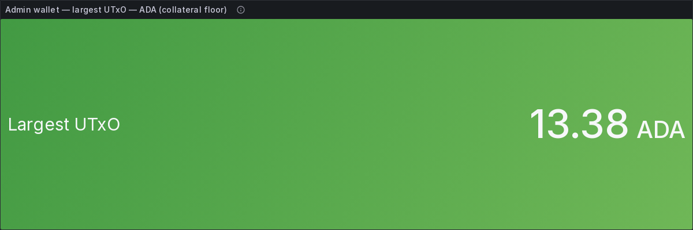

Metric `dia_bridge_cardano_admin_wallet_max_utxo_lovelace / 1000000`, in ADA. The LARGEST single pure-ADA UTxO in the admin/signer wallet. A Cardano script tx needs a collateral UTxO distinct from its fee inputs, so THIS — not the total balance — decides whether the wallet can still build. Below `admin_wallet_min_collateral_lovelace` the wallet is fragmented (`AdminWalletFragmented`, critical) even if the total looks healthy; the daemon auto-consolidates below `auto_consolidate_below_lovelace`.

**Deposit pending — ADA (per client)**


Metric `dia_bridge_cardano_deposit_pending_lovelace / 1000000`, in ADA. Side-deposits a client has sent to its per-client deposit address that the feeder has not yet folded into the Receiver balance. The daemon merges these automatically once the Receiver balance falls below `receiver_balance_low_lovelace` or the pending pile reaches `deposit_pending_merge_lovelace`; a steadily growing value with no merges is worth a look.

**Symbol-update latency (p50/p95/p99)**

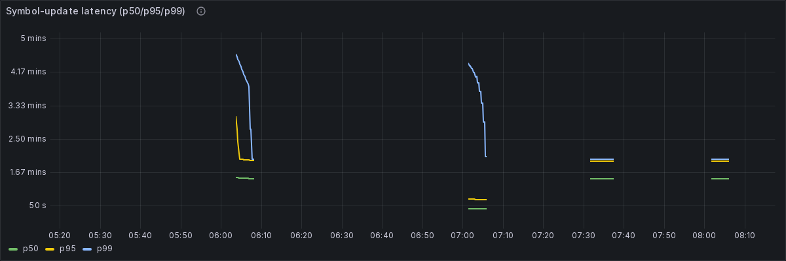

Metric `histogram_quantile(0.50 / 0.95 / 0.99, rate(dia_bridge_end_to_end_latency_seconds_bucket[5m]))`, in seconds, aggregated across all pairs. Per-symbol pipeline latency from feeder processing start to Cardano confirmation, at the median, 95th and 99th percentiles. For per-TRANSACTION stage latency see the Transactions dashboard below.

**Symbol updates confirmed (5m)**


Metric `sum by (symbol) (increase(dia_bridge_transactions_confirmed_total[5m]))` — a 5-minute count (not a rate), per pair. A batch transaction of N pairs adds 1 to each of its N symbols, so this is symbol-update throughput; for pure per-transaction counts see "Tx confirmed vs failed" below.

**Symbol-update failures (5m, by error code)**

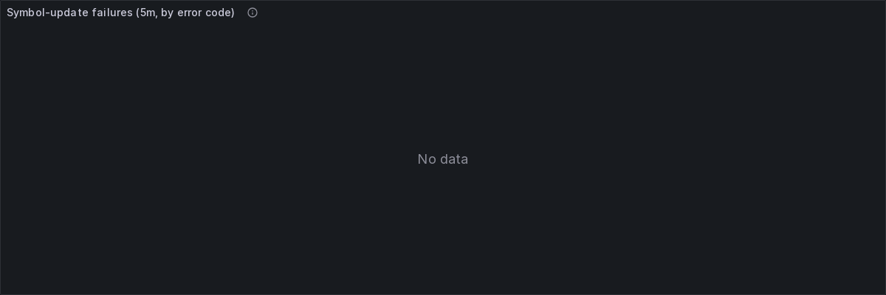

Metric `sum by (error_code) (increase(dia_bridge_transactions_failed_total[5m]))` — a 5-minute count grouped by `error_code`, REAL submission failures only. Superseded intents the feeder declined to submit (`NonMonotonicNonce`, no tx, no fee) are NOT counted here — they go to `dia_bridge_intents_superseded_total{reason}`. Codes are documented in `offchain/feeder/src/errors/codes.ts`.

**Feed sanity verdict (per pair)**

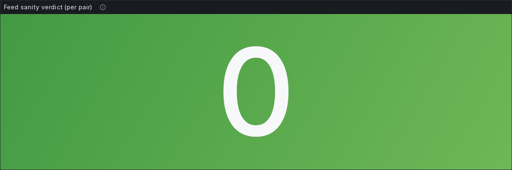

Metric `max by (symbol, client_id) (dia_bridge_feed_sanity_status)` (0 = ok, 1 = suspect, 2 = broken). Per-feed verdict from the periodic feed-sanity check: the live on-chain value vs the latest DIA source value, judged against that feed's push-policy thresholds (price tolerance + freshness ceiling). A sustained 2 triggers the `FeedAccuracyFail` alert.

**Tx confirmed vs failed (5m)**

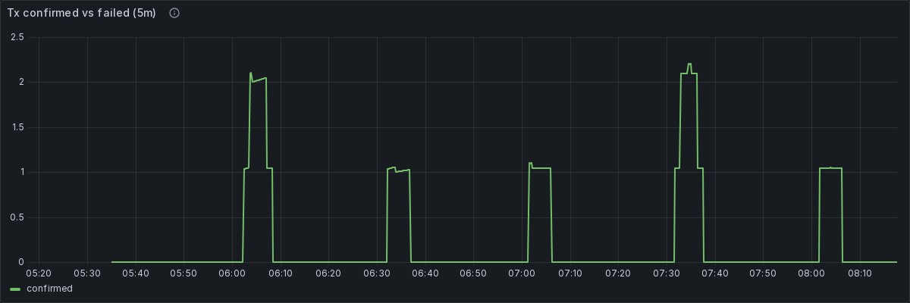

Metric `sum by (outcome) (increase(dia_bridge_transactions_total[5m]))` — Cardano TRANSACTIONS per 5-minute window, counted once per tx (a batch of N pairs is ONE tx), by `outcome`. Condemned no-ops are excluded. This is pure transaction throughput, distinct from the per-symbol counts above.

**Pairs per tx (p50/p95)**

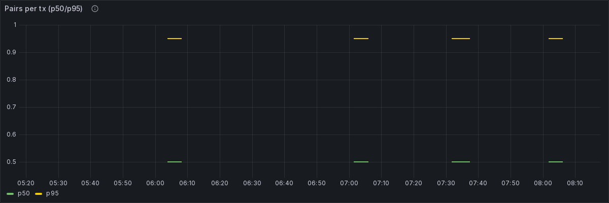

Metric `histogram_quantile(0.50 / 0.95, rate(dia_bridge_transaction_pairs_bucket[5m]))` — batch size: how many pairs travel in each transaction, at the median and 95th percentile.

**Tx involving router (5m, by router & outcome)**

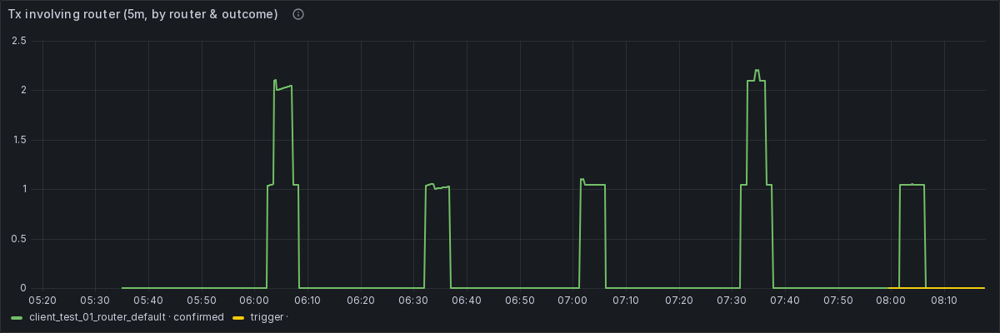

Metric `sum by (router_id, outcome) (increase(dia_bridge_transaction_router_membership_total[5m]))` — transactions that involved each router per 5-minute window, by outcome. A coalesced batch can mix routers on one shared lane, so this is tx↔router membership (one tx can credit several routers), not a pure tx count.

**Reorg counter**


Metric `sum(increase(dia_bridge_transactions_reorg_total[1h]))`. Count of already-confirmed transactions dropped by a chain reorganisation in the last hour. Should sit at 0; a sustained non-zero value triggers `ReorgRateHigh` and points at provider lag.

**Scanner block lag**

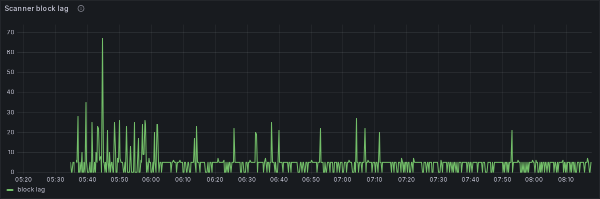

Metric `dia_bridge_scanner_block_lag`, in blocks. How many blocks behind the chain tip the DIA-side scanner currently is. A steadily rising lag means the scanner is falling behind the source chain and updates will be delayed.

**Intents filtered (5m, by reason)**

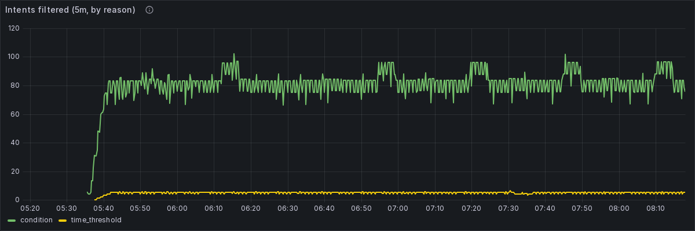

Metric `sum by (reason) (increase(dia_bridge_intents_filtered_total[5m]))` — a 5-minute count grouped by `reason`. Intents the feeder deliberately suppressed before submitting. High counts are normal: the deviation/time-threshold policy suppresses most intents by design.

**Intents superseded (5m, by reason)**

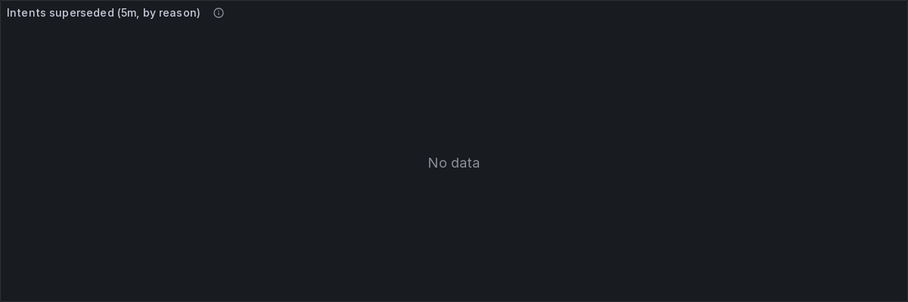

Metric `sum by (reason) (increase(dia_bridge_intents_superseded_total[5m]))` — intents the feeder declined to submit because a newer one already won on-chain (NonMonotonicNonce): no tx, no fee. Correct no-ops, kept out of the failure counters.

**Price deviation p95 — 1 h window (per pair)**

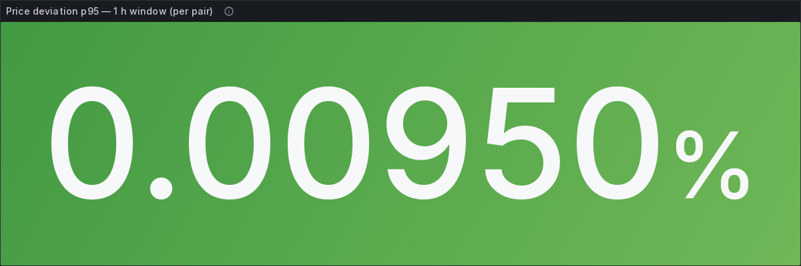

Metric `histogram_quantile(0.95, rate(dia_bridge_price_deviation_percent_bucket[1h]))` per `symbol`, in percent. 95th percentile of the percentage gap between the price the feeder published and the reference price, per pair. A high value suggests a possible misreport and feeds the `PriceDeviationHigh` alert.

**Price deviation distribution (heatmap)**

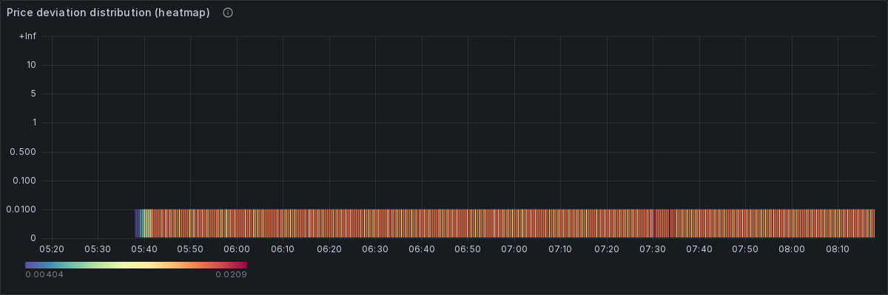

Metric `sum by (le, symbol) (rate(dia_bridge_price_deviation_percent_bucket[5m]))`, percent buckets. Heatmap of the price-deviation distribution over time (histogram `le` buckets, colour = frequency), measured at policy-gating time for every evaluated intent — submitted and gate-suppressed alike. Healthy feeds cluster near 0%; a vertical spread means deviations are growing.

**Tx fee p50 — lovelace (per customer)**

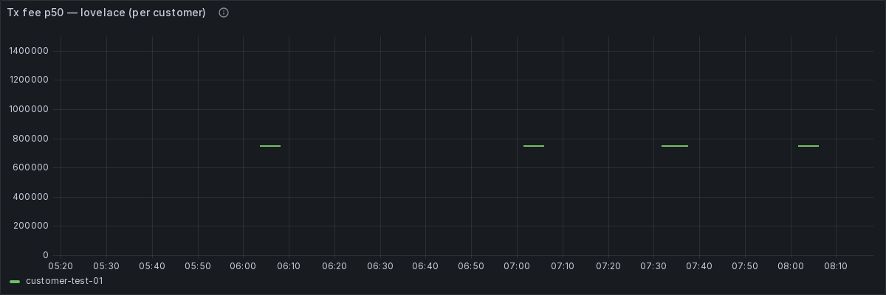

Metric `histogram_quantile(0.50, sum by (le, customer_id) (rate(dia_bridge_transaction_fee_lovelace_bucket[5m])))`, in lovelace (1 ADA = 1,000,000 lovelace). Median Cardano network fee paid per oracle-update transaction, grouped by `customer_id` — the basis for per-customer cost attribution / billing. A batch of N pairs is one tx and one fee observation.

**Cardano provider health — primary vs secondary (1 = up)**


Metric `dia_bridge_component_health{component,role}` (1 = up, 0 = down). Health of the two Cardano API providers by role: PRIMARY is the build/submit provider lucid uses (selected by `CARDANO_PROVIDER`) — if it is down nothing can be built and every pair freezes together (e.g. a Blockfrost 402 quota wall) → `PrimaryProviderDown` (critical); SECONDARY backs confirmation/reorg redundancy → `SecondaryProviderDown` (warning). The down-alerts watch `dia_bridge_provider_last_ok_timestamp_seconds{provider,role}`.

### Transactions dashboard

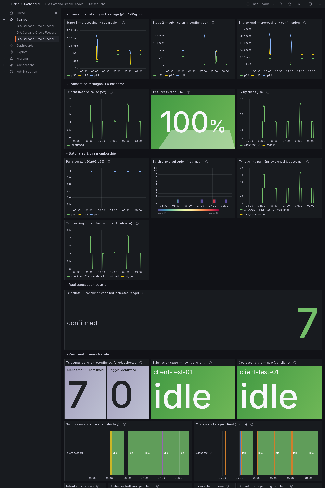

_The per-transaction view: a batch of N pairs is ONE transaction here. Stage latency, confirmed-vs-failed throughput, success ratio and batch size._

### Transactions panels

**Stage 1 — processing → submission**

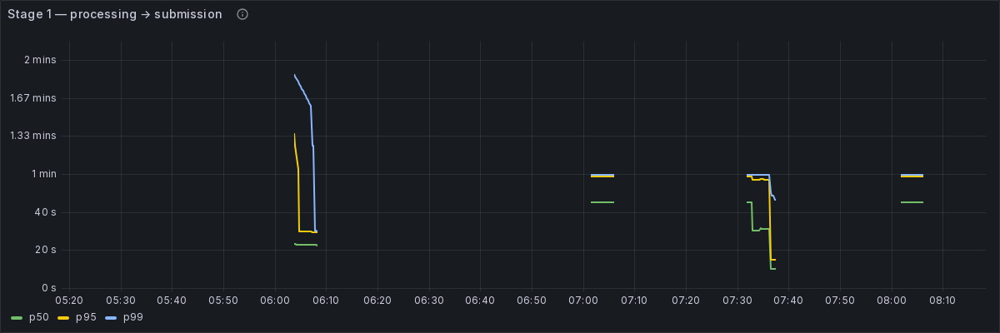

Metric `histogram_quantile(0.50 / 0.95 / 0.99, rate(dia_bridge_tx_processing_to_submission_seconds_bucket[5m]))`, in seconds, one observation per confirmed tx. Time to build, queue and sign a transaction before broadcast.

**Stage 2 — submission → confirmation**

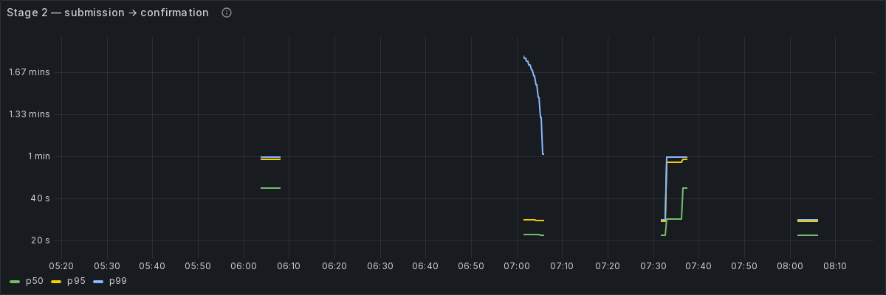

Metric `histogram_quantile(0.50 / 0.95 / 0.99, rate(dia_bridge_tx_submission_to_confirmation_seconds_bucket[5m]))`, in seconds. Pure Cardano settlement time from broadcast to on-chain confirmation, per tx.

**End-to-end — processing → confirmation**

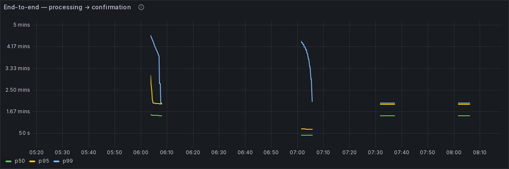

Metric `histogram_quantile(0.50 / 0.95 / 0.99, rate(dia_bridge_tx_end_to_end_seconds_bucket[5m]))`, in seconds. Total per-transaction latency from feeder processing start to confirmation.

**Tx confirmed vs failed (5m)**

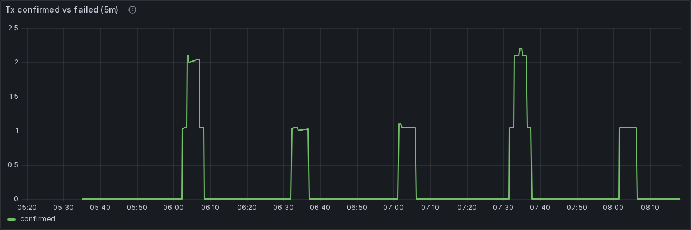

Metric `sum by (outcome) (increase(dia_bridge_transactions_total[5m]))` — transactions per 5-minute window counted once per tx, by outcome. Condemned no-ops excluded.

**Tx success ratio (5m)**

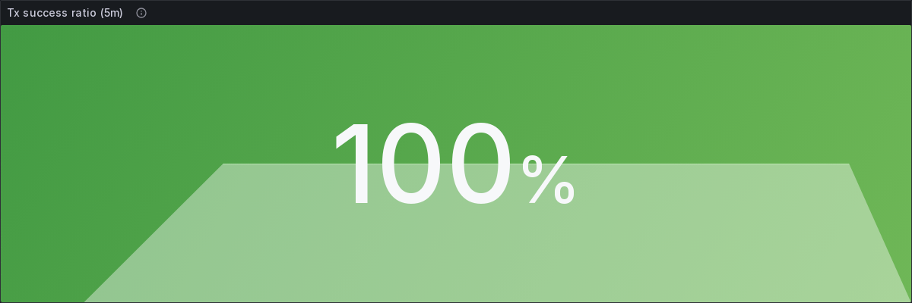

Confirmed transactions as a percentage of all transactions in the last 5 minutes. Shows "No data" when no transactions were sent in that window (rather than 0%).

**Tx by client (5m)**

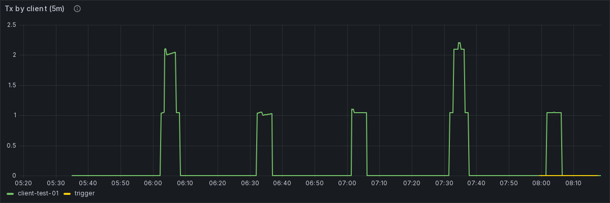

Metric `sum by (client_id) (increase(dia_bridge_transactions_total[5m]))` — transactions per 5-minute window grouped by client (receiver identity), counted once per tx.

**Pairs per tx (p50/p95/p99)**

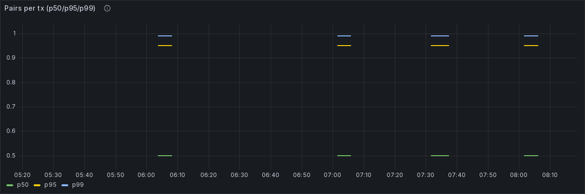

Metric `histogram_quantile(0.50 / 0.95 / 0.99, rate(dia_bridge_transaction_pairs_bucket[5m]))` — batch size distribution: pairs per transaction at the median, 95th and 99th percentiles.

**Batch size distribution (heatmap)**

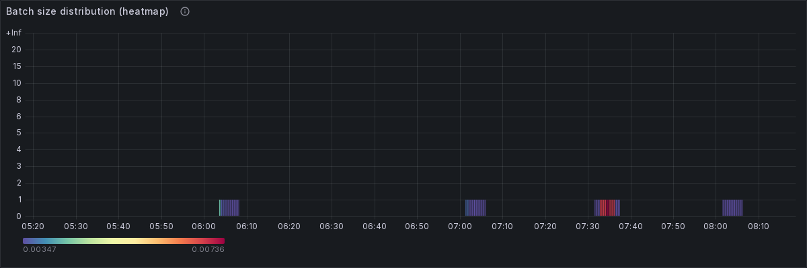

Metric `sum by (le) (rate(dia_bridge_transaction_pairs_bucket[5m]))`, batch-size buckets. Heatmap of pairs-per-transaction over time; bright bands show the typical batch size.

**Tx touching pair (5m, by symbol & outcome)**

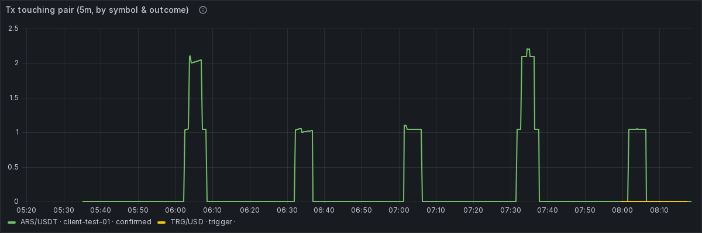

Metric `sum by (symbol, outcome) (increase(dia_bridge_tx_pair_membership_total[5m]))` — one increment per (tx, pair). Filter by `$symbol` to find the transactions that included a given pair (their size is in "Pairs per tx"); carries confirmed vs failed and the customer dimension.

**Tx involving router (5m, by router & outcome)**

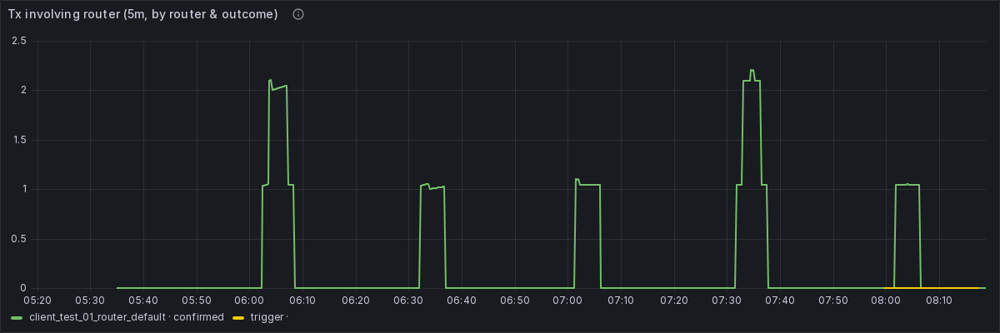

Metric `sum by (router_id, outcome) (increase(dia_bridge_transaction_router_membership_total[5m]))` — transactions that involved each router per 5-minute window, by outcome. A coalesced batch can mix routers on one shared lane, so this counts tx↔router membership (one tx can credit several routers) — not a pure tx count.

**Tx counts — confirmed vs failed (selected range)**

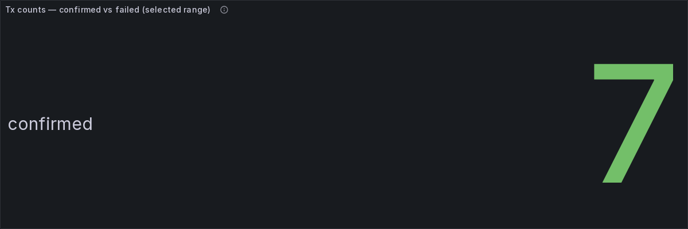

The number of real Cardano oracle transactions over the window — how many confirmed on-chain and how many failed, counted once per transaction (one transaction can carry several price pairs).

**Tx counts per client (confirmed/failed, selected range)**

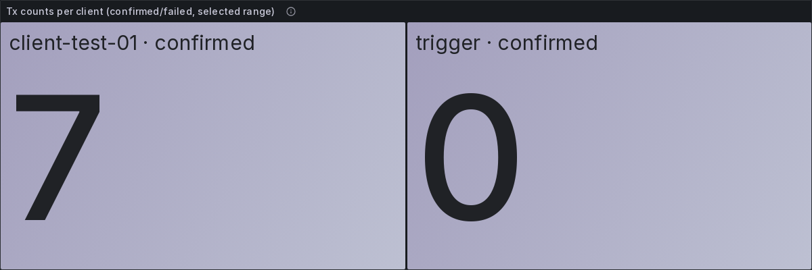

Metric `sum by (client_id, outcome) (increase(dia_bridge_transactions_total[$__range]))` — the real integer count of Cardano transactions per client and outcome over the selected range (not an average). A tx batches one client's pairs, so the clean per-unit count is per client.

**Submission state — now (per client)**


Metric `dia_bridge_submission_state{client_id}` (last value): what each client's submit pipeline is doing now — 0 idle / 1 building / 2 submitting / 3 awaiting-confirmation.

**Coalescer state — now (per client)**


Metric `dia_bridge_coalescer_state{client_id}` (last value): what each client's coalescer is doing now — 0 idle / 1 accumulating / 2 in-flight.

**Submission state per client (history)**

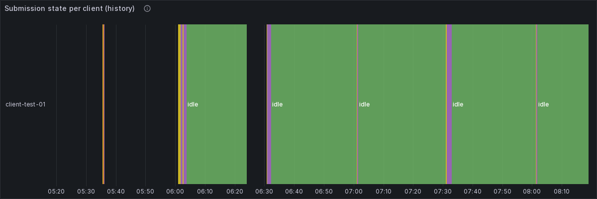

State-timeline of `dia_bridge_submission_state{client_id}` (0 idle / 1 building / 2 submitting / 3 awaiting-confirmation). Serial per batch; shows how long each phase took.

**Coalescer state per client (history)**

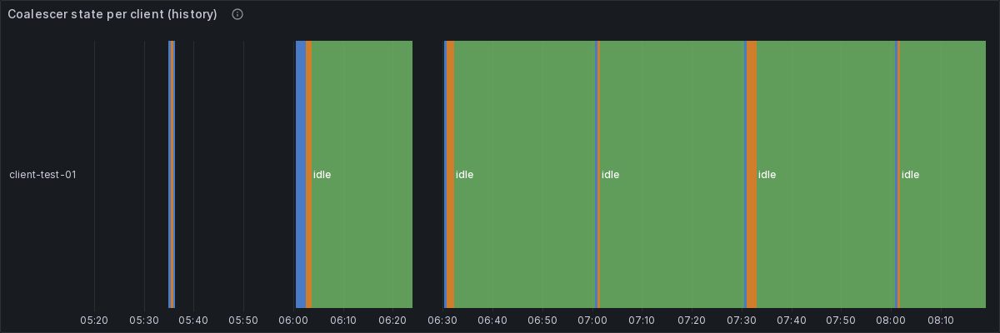

State-timeline of `dia_bridge_coalescer_state{client_id}` (0 idle / 1 accumulating / 2 in-flight). Independent of the submit pipeline — a lane can accumulate the next batch while submitting the current one.

**Intents in coalescer queue — now (per client)**


Metric `sum by (client_id) (dia_bridge_coalescer_buffered)` (last value) — intents buffered for each client, waiting for the flush that batches them into one transaction.

**Coalescer buffered per client**

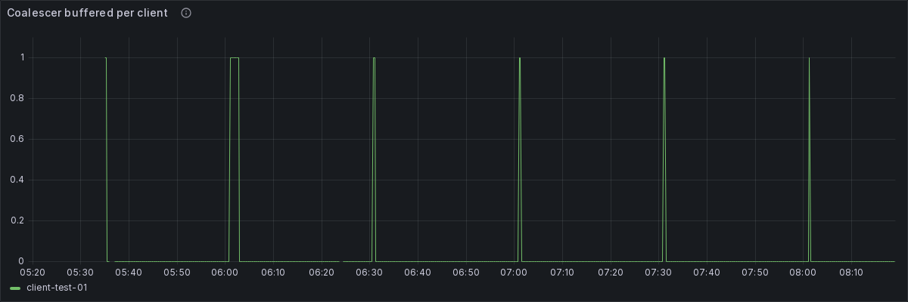

Metric `sum by (client_id) (dia_bridge_coalescer_buffered)` over time — intents buffered in the coalescer; sawtooths, climbing as intents accumulate and dropping to 0 on each flush.

**Tx in submit queue — now (per client)**

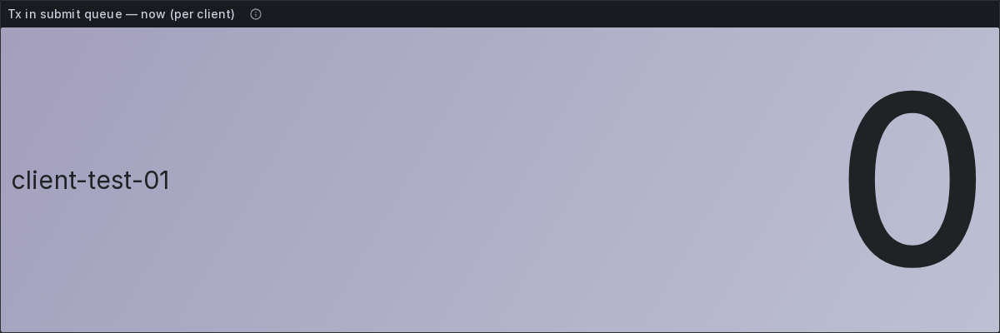

Tasks waiting in each client's serial submit queue. Usually 0; rises when submissions arrive faster than they confirm.

**Submit queue pending per client**

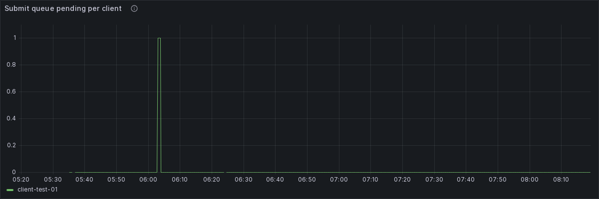

Metric `sum by (client_id) (dia_bridge_submit_queue_pending)` over time — tasks waiting in each client's serial submit queue. Usually 0 (the lane drains each batch immediately).

### Internals dashboard

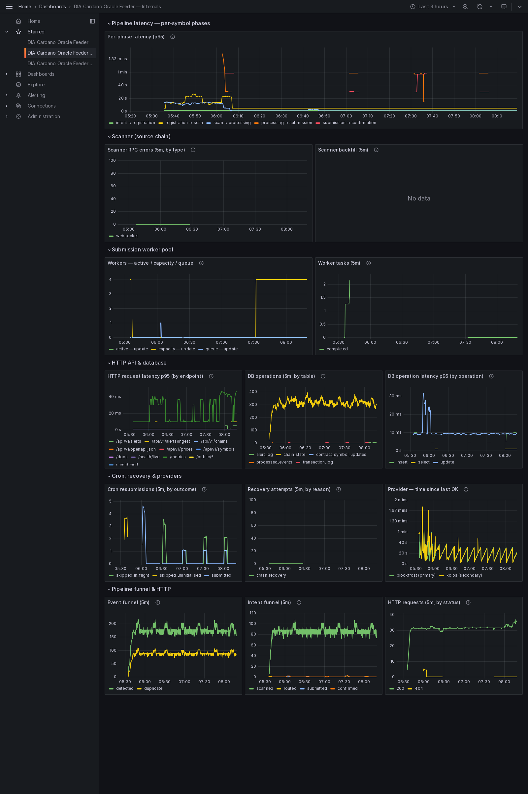

_Feeder-internal observability: per-phase pipeline latency, scanner lag/backfill, worker pools, DB operations, and cron/recovery activity._


To reproduce this dashboard live:

```sh
cd offchain && make up MONITORING=1
# then open http://localhost:3000 (default admin/admin) — dashboard is auto-provisioned.
```

See the [feeder README — Daemon + monitoring section](../../../../offchain/feeder/README.md#daemon--monitoring)
for the canonical operator instructions.

## Alerts active during the window

Source of truth: [`offchain/feeder/monitoring/alerts.yml`](../../../../offchain/feeder/monitoring/alerts.yml).
Canonical thresholds: `infrastructure.<network>.yaml::alerting.*`. Per-alert operator
remediation lives in `alerts.yml` and the [feeder README](../../../../offchain/feeder/README.md).

### Alert catalog (all rules)

| Alert | Severity | For | Threshold | Summary |
| --- | --- | --- | --- | --- |
| OraclePairStale | warning | 5m | 3600 | Oracle pair <symbol> has stopped updating on-chain |
| ReceiverBalanceLow | warning | 5m | 2 | Receiver prepaid balance for client <client_id> is below 2 ADA |
| SettleOverdue | warning | 10m | 10 | Client <client_id> has over 10 ADA of accrued fees waiting to settle |
| PaymentHookWithdrawReady | info | 10m | 50 | PaymentHook holds over 50 ADA of collected fees — ready to withdraw |
| AdminWalletLow | critical | 5m | 5 | Admin (operator) wallet is below 5 ADA — all updates will stall |
| AdminWalletFragmented | critical | 5m | 10 | Admin wallet has no collateral-capable UTxO — builds will trap |
| PriceDeviationHigh | critical | 10m | 5 | Price for <symbol> moved more than 5% — possible bad data |
| PriceAgeHigh | warning | 10m | 600 | DIA source data for <symbol> is going stale (upstream) |
| FeedAccuracyFail | critical | 10m | — | On-chain value for <symbol> disagrees with the DIA source |
| ReorgRateHigh | warning | 5m | 3 | Cardano reorgs are dropping confirmed updates for <symbol> |
| ReceiverDepositsPending | info | 10m | 5 | Client <client_id> has over 5 ADA of un-merged deposits waiting |
| PrimaryProviderDown | critical | 1m | 600 | Primary Cardano provider (<provider>) is down — no transactions can be built |
| SecondaryProviderDown | warning | 1m | 900 | Secondary Cardano provider (<provider>) is down — confirmation/reorg redundancy lost |

### Active at capture time

No alerts were firing or pending at capture time — all feeds healthy. The raw snapshot is in
[`alerts-active.json`](./alerts-active.json). (Pending/firing transitions over the window are
also recorded in the feeder `alert_log` table — see `db/`.)
