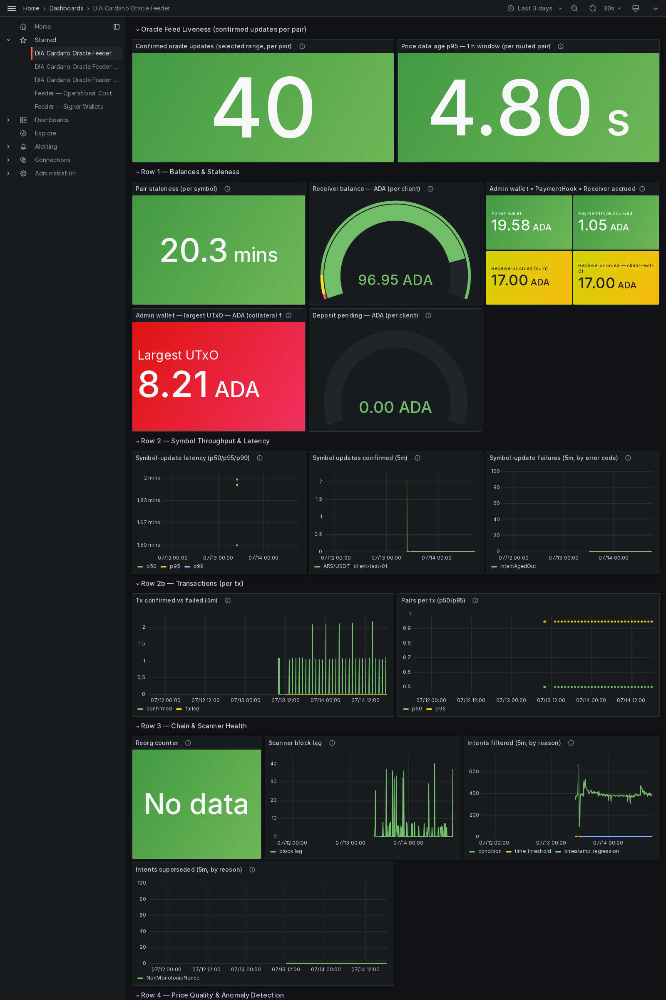
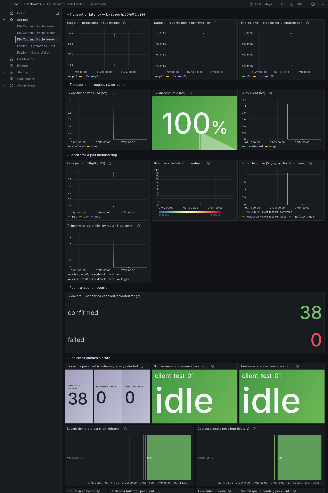
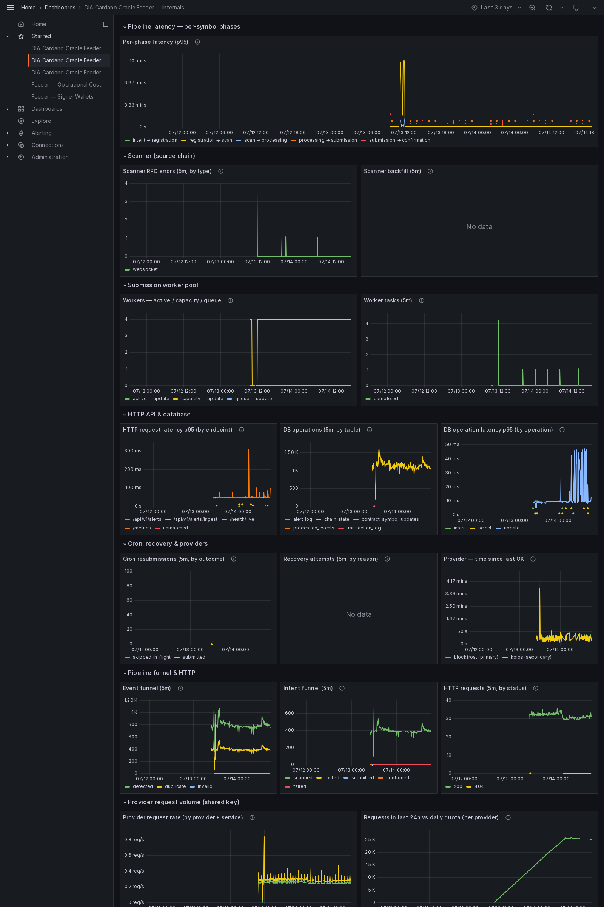
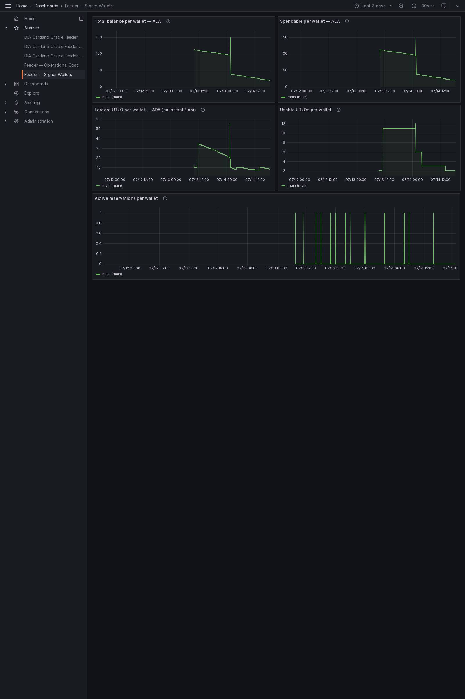
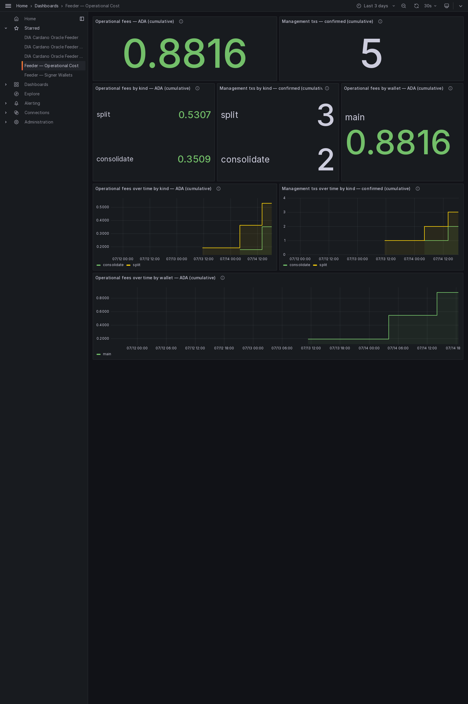

# Milestone 4 evidence — Mainnet

End-to-end integration on Cardano Mainnet ↔ DIA Mainnet: the
sustained-run **reliability** evidence (uptime / accuracy) and the consumer-facing
**indexer** with the example **consumer contract** that reads a feed through it.
Captured from run `mainnet_run_20260616-074413`. Everything here is read-only.

## Contents

- [What this shows](#what-this-shows)
- [Reliability — totals (this window)](#reliability--totals-this-window)
- [Confirmed Cardano tx count per pair](#confirmed-cardano-tx-count-per-pair)
- [Sample Cardano tx hashes (one per pair, first confirmed)](#sample-cardano-tx-hashes-one-per-pair-first-confirmed)
- [Failures (grouped by error code)](#failures-grouped-by-error-code)
- [Per-feed sanity (accuracy)](#per-feed-sanity-accuracy)
- [Test results](#test-results)
- [Indexer — live queries](#indexer--live-queries)
- [A pair in full](#a-pair-in-full)
- [Consuming a feed — end-to-end](#consuming-a-feed--end-to-end)
- [Published feeds — policy ids](#published-feeds--policy-ids)
- [Provider-usage monitoring](#provider-usage-monitoring)
- [Dashboards](#dashboards)
- [How to reproduce](#how-to-reproduce)
- [Files in this pack](#files-in-this-pack)

## What this shows

Two things together. First, that the oracle **runs reliably on Mainnet**:
confirmed on-chain updates over the observed window, real failures and reorgs, and
per-feed accuracy against the DIA source. Second, that a Cardano app can **consume**
a feed: the indexer answers live, and a real contract accepts a fresh price and
rejects one that does not meet its threshold.

- **Confirmed updates:** 40 · **real failures:** 0 · **reorgs:** 0.
- **Window (confirmed):** `2026-07-13T09:45:16.709000Z` → `2026-07-14T18:01:27.595000Z`.
- **Indexer:** reachable; chain tip height 13678207; 1 live pair(s).
- **API reference:** captured (DIA Cardano Oracle Indexer API, 10 paths) — interactive UI at http://localhost:3023/docs.
- **Consumer demo (emulator):** PASSED. **On-chain:** run separately — see below.

Machine-readable totals: [`SUMMARY.json`](SUMMARY.json).

## Reliability — totals (this window)

| Metric | Value |
| --- | ---: |
| Confirmed Cardano oracle update txs | 40 |
| Failed Cardano tx attempts (real, tx broadcast) | 0 |
| Condemned intents (superseded or aged out before submission — no tx, no fee) | 2 |
| Chain reorgs that dropped a tx | 0 |

The run has two distinct reliability measures. **Operational publication
reliability** is measured from broadcast Cardano transactions: all 40 broadcast
updates confirmed, with 0 real on-chain failures and 0 reorgs, for a 100% observed
publication-success rate. The sanity check below also found the live on-chain value
within the feed's accuracy and freshness policy.

Separately, this pack records a deliberately strict **confirmed-freshness
observation** against the router's one-hour heartbeat ceiling
(`ceiling=3600s`, recorded in [`logs/feeder.log`](logs/feeder.log)). It sums every
second after 3600 s between confirmed updates, including normal cron-tick and
Cardano confirmation-depth latency. That conservative accounting reports ~4.3
minutes beyond the exact boundary over the ~32.27 h window, or **99.78% strict
freshness-bound compliance**. It is not a count of feeder downtime: no individual
gap exceeded the boundary by more than ~76 s, and the run had no broadcast
transaction failure or reorg.

## Confirmed Cardano tx count per pair

| Pair | Confirmed txs |
| --- | --- |
| ARS/USDT | 40 |

## Sample Cardano tx hashes (one per pair, first confirmed)

| Pair | Tx hash (first confirmed) |
| --- | --- |
| ARS/USDT | 01315fb64b120a6852722b28f880dfb05f75b78ba9374b16e3771e3c2560fcea |

Verify on [Cardanoscan](https://cardanoscan.io/) or any public Mainnet explorer.

## Failures (grouped by error code)

Real Cardano transaction failures only — a transaction was broadcast and then failed
on-chain. Routine non-failures (an update made obsolete by a newer one before it was
sent, or an update interrupted by a restart) are not counted here. An empty table
means there were no real failures in this run.

| Error code | Count |
| --- | --- |

No real failures in this run. Two intents at the start of the window never reached
the chain — see [`db/transaction_log.csv`](db/transaction_log.csv) rows with
error codes `NonMonotonicNonce` and `IntentAgedOut` (neither broadcast a
transaction or paid a fee).

## Per-feed sanity (accuracy)

Confirms oracle timestamp and price accuracy per price feed: each live on-chain Pair
value is compared against the latest DIA source value and judged against that feed's
own push-policy thresholds (price tolerance + freshness ceiling).

# Feed sanity check — Mainnet

1 feeds: 1 PASS · 0 WARN · 0 FAIL.

| Symbol | Status | Deviation % | Staleness (s) | Reasons |
|--------|--------|-------------|---------------|---------|
| ARS/USDT | PASS | 0 | 1680 | — |

## Test results

All four suites are captured in this evidence pack; full console output is saved
under [`tests/`](tests/).

| Suite | Result | Tests | Output |
| --- | --- | ---: | --- |
| Aiken contracts (`contracts/aiken`, `aiken check`) | **PASS** | 167 / 167 passing (0 failed) | [`tests/aiken-tests.txt`](tests/aiken-tests.txt) |
| Feeder (`offchain/feeder`, `npm test`) | **PASS** | 790 / 790 passing (0 failed) | [`tests/feeder-tests.txt`](tests/feeder-tests.txt) |
| CLI (`offchain/cli`, `npm test`) | **PASS** | — (custom runner; pass/fail by exit code) | [`tests/cli-tests.txt`](tests/cli-tests.txt) |
| Indexer (`offchain/indexer`, `npm test`) | **PASS** | — (custom runner; pass/fail by exit code) | [`tests/indexer-tests.txt`](tests/indexer-tests.txt) |

## Indexer — live queries

Every published pair the indexer reports, with the latest price and the output a
consumer references:

| Symbol | Price | Age (s) | Client | Pair UTxO (TxIn) |
| --- | --- | --- | --- | --- |
| ARS/USDT | 645161290322580 | 1768 | client-test-01 | b958628bc54c2aeccb25401ca841653d643a28dd77dcae08343087b035917f72#0 |

Health response: [`indexer/health.json`](indexer/health.json) ·
all pairs: [`indexer/pairs.json`](indexer/pairs.json).

## A pair in full

One pair as the indexer returns it (`ARS/USDT`) — note the policy id a
consumer uses to verify the feed is genuine, and the output to reference:

```json
{
  "symbol": "ARS/USDT",
  "pairId": "4152532f55534454",
  "pairPolicyId": "b1b933a7b08ebdee6d957b4ae3d027ac4a13f9d319dbd8a2b95e052f",
  "price": "645161290322580",
  "timestamp": "1784051983",
  "nonce": "1784041295981524051",
  "signer": "63c1d82a81aa86ae2421ee82ea0ddf216bb66609",
  "intentHash": "77894df60be6bfd4c50ec9f8c5883da1072517cdbcc9c262f1d66a2fab032212",
  "minUtxoLovelace": "5000000",
  "utxoRef": {
    "txHash": "b958628bc54c2aeccb25401ca841653d643a28dd77dcae08343087b035917f72",
    "outputIndex": 0
  },
  "ageSeconds": 1769,
  "clientId": "client-test-01"
}
```

## Consuming a feed — end-to-end

The example consumer contract reads the referenced price and unlocks only when it
meets the configured minimum. Two runs prove both directions.

**Emulator (offline, deterministic):**

```
==> [1/2] Compiling the example consumer validator (aiken build)…
    Compiling diadata-org/dia-cardano-oracle 0.0.0 (.)
    Compiling aiken-lang/stdlib v3.0.0 (./build/packages/aiken-lang-stdlib)
    Compiling aiken-lang/fuzz v2.2.0 (./build/packages/aiken-lang-fuzz)
   Generating project's blueprint (./plutus.json)
==> [2/2] Running the end-to-end consumer demo (Lucid emulator + indexer)…
1. Publishing the Pair UTxO (mint NFT + inline PairDatum)…
2. Indexer reports BTC/USD: price=65000000000 at f49047f581725d778402be0f96f1523286c487b478890f0bcea9dad70eb77522#0
3. Trying to spend (min_price < feed price)…
3. Trying to spend (min_price > feed price)…
   → rejected: { Complete: "failed script execution Spend[0] the validator crashed / exited prematurely" }

=== RESULT ===
  spend with min_price < feed price → ACCEPTED ✓
  spend with min_price > feed price → REJECTED ✓
DEMO PASSED — the validator consumed our oracle price correctly.
```

**On-chain (Mainnet, real transactions):**

_Run `bash offchain/indexer/src/examples/run-consumer-demo-onchain.sh | tee onchain.txt` against Mainnet (indexer up + funded wallet), then re-run with `EVIDENCE_ONCHAIN_LOG=onchain.txt` to embed it here._

## Published feeds — policy ids

The public identifiers a consumer needs, grouped by client:

| Client | Pair policy id | Symbols |
| --- | --- | --- |
| client-test-01 | b1b933a7b08ebdee6d957b4ae3d027ac4a13f9d319dbd8a2b95e052f | ARS/USDT |

## Provider-usage monitoring

The feeder and the indexer share one chain-provider key. Their combined usage is
tracked on one metric and shown on the Internals dashboard panel **Requests in last
24h vs daily quota (per provider)**, with an alert that fires before the daily quota
is exhausted. The indexer's own usage is in
[`indexer/metrics.txt`](indexer/metrics.txt) (series `dia_bridge_provider_requests_total`).

## Dashboards

The five Grafana dashboards the feeder ships, rendered live over the run window
(`now-3d` → now): **Overview**, **Transactions**, **Internals**, **Signer
Wallets** (the multi-wallet signer pool), and **Operational Cost** (the ADA cost of
the management txs). A full render of each shows every panel; the panel-by-panel
reference is the dashboards guide,
[`docs/architecture/grafana-dashboards.md`](../../../architecture/grafana-dashboards.md).

### Overview dashboard



_Is each price feed alive, fresh, accurate and funded? A batch of N pairs counts as N symbol updates here._

### Transactions dashboard



_The per-transaction view: a batch of N pairs is ONE transaction. Stage latency, confirmed-vs-failed throughput, success ratio, batch size._

### Internals dashboard



_Feeder-internal observability: pipeline-phase latency, scanner, worker pools, DB, cron/recovery, provider health._

### Signer Wallets dashboard



_Per signer-wallet health for the multi-wallet pool: spendable balance, collateral floor (largest UTxO), usable-UTxO count, and active arbiter reservations. With no pool configured this shows the single `main` wallet._

### Operational Cost dashboard



_What it costs to run the system: ADA fees of the management txs (settle, withdraw, main→pool funding, defrag, wallet shaping, standalone deposit merge) by kind and signer wallet. The top row is the cumulative snapshot; the time-series row below shows when each tx ran and how the cost grew._


## How to reproduce

```sh
cd offchain && make up MONITORING=1    # feeder + indexer + Grafana
curl -s localhost:3001/v1/pairs | jq   # the pairs table above
#  open http://localhost:3001/docs     # the API reference

# the consumption demo (offline):
bash offchain/indexer/src/examples/run-consumer-demo-emulator.sh
# and on Mainnet (indexer up + funded wallet in offchain/indexer/.env):
bash offchain/indexer/src/examples/run-consumer-demo-onchain.sh

# rebuild this pack (stack up with monitoring):
make evidence4                          # add EVIDENCE_ONCHAIN_LOG=… to embed the on-chain demo
```

## Files in this pack

| Path | Contents |
| --- | --- |
| `SUMMARY.json`             | Machine-readable totals + test results (top of this document, as JSON). |
| `logs/feeder.log`          | Daemon event stream (mirrors stderr). |
| `logs/transactions.jsonl`  | One JSON line per tx pipeline step. |
| `db/transaction_log.csv`   | Full `transaction_log` table dump from `feeder.sqlite`. |
| `db/*.csv`                 | processed_events, chain_state, contract_symbol_updates dumps. |
| `stats/`                   | Intermediate TSV files + the feeder `/metrics` snapshot this report was built from. |
| `sanity/feed-sanity.{md,json}` | Per-feed accuracy: on-chain value vs latest DIA source, per symbol. |
| `tests/*.txt`              | Full `aiken check` and `npm test` console output for contracts, feeder, CLI and indexer. |
| `indexer/health.json`      | Indexer health: chain tip + live pair count. |
| `indexer/pairs.json`       | Every published pair (latest value + reference output). |
| `indexer/sample-pair.json` | One pair in full (price, policy id, reference output). |
| `indexer/sample-utxo.json` | Just the TxIn a consumer references. |
| `indexer/openapi.json`     | The API schema behind `/docs`. |
| `indexer/metrics.txt`      | The indexer's chain-provider request counts. |
| `consumer-demo/emulator.txt` | The offline end-to-end consumer demo run. |
| `consumer-demo/onchain.txt`  | The on-chain consumer demo run (when embedded). |
| `dashboards/*.png`           | The five Grafana dashboards rendered live over the run window. |
