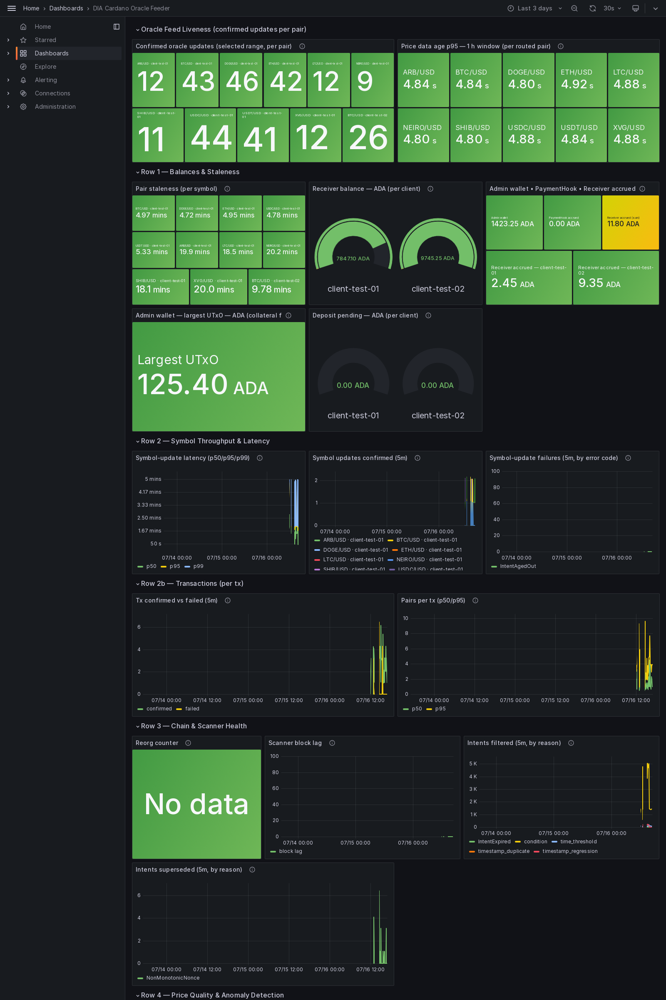
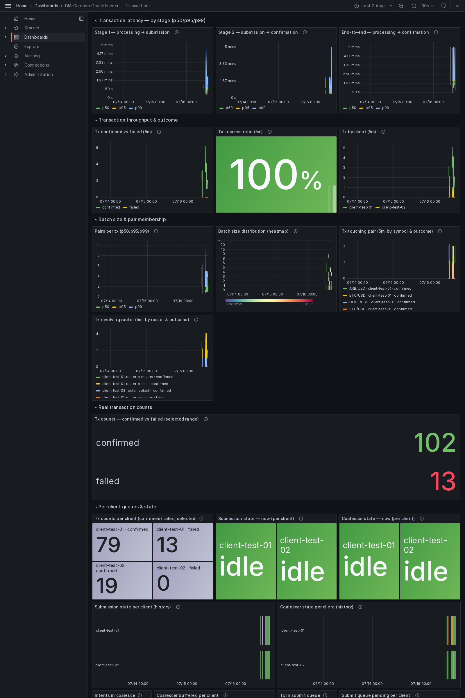
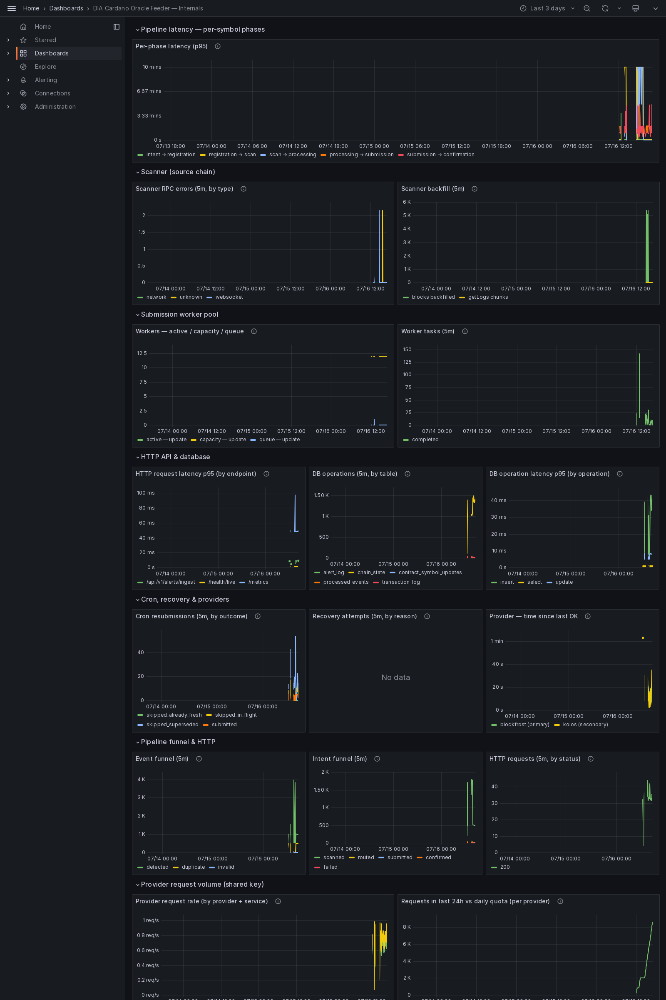
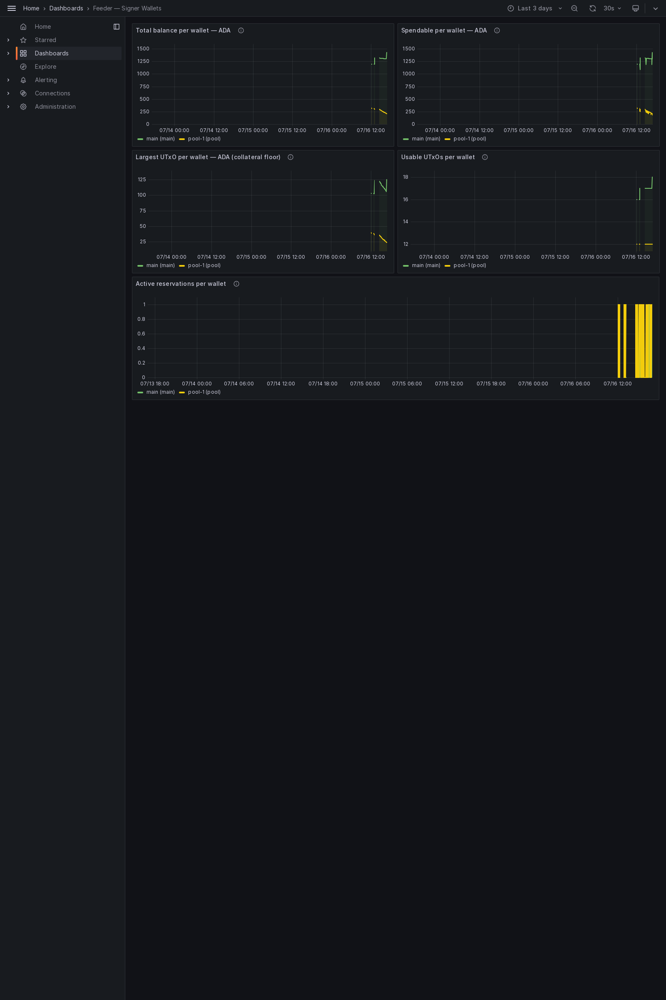
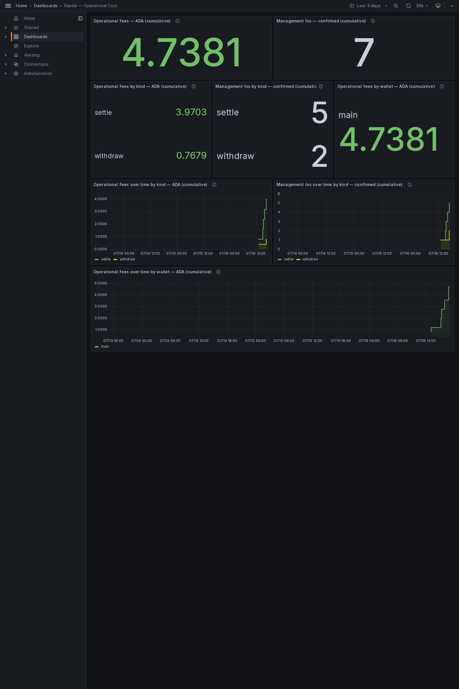

# Milestone 4 evidence — Preview

End-to-end integration on Cardano Preview ↔ DIA Testnet: the
sustained-run **reliability** evidence (uptime / accuracy) and the consumer-facing
**indexer** with the example **consumer contract** that reads a feed through it.
Captured from run `preview_run_20260608-040304`. Everything here is read-only.

## Contents

- [What this shows](#what-this-shows)
- [Reliability — totals (this window)](#reliability--totals-this-window)
- [Confirmed Cardano tx count per pair](#confirmed-cardano-tx-count-per-pair)
- [Sample Cardano tx hashes (one per pair, first confirmed)](#sample-cardano-tx-hashes-one-per-pair-first-confirmed)
- [Failures (grouped by error code)](#failures-grouped-by-error-code)
- [Per-feed sanity (accuracy)](#per-feed-sanity-accuracy)
- [Test results](#test-results)
- [Indexer — live queries](#indexer--live-queries)
- [A pair in full](#a-pair-in-full)
- [Consuming a feed — end-to-end](#consuming-a-feed--end-to-end)
- [Published feeds — policy ids](#published-feeds--policy-ids)
- [Provider-usage monitoring](#provider-usage-monitoring)
- [Dashboards](#dashboards)
- [How to reproduce](#how-to-reproduce)
- [Files in this pack](#files-in-this-pack)

## What this shows

Two things together. First, that the oracle **runs reliably on Preview**:
confirmed on-chain updates over the observed window, real failures and reorgs, and
per-feed accuracy against the DIA source. Second, that a Cardano app can **consume**
a feed: the indexer answers live, and a real contract accepts a fresh price and
rejects one that does not meet its threshold.

- **Confirmed updates:** 283 · **real failures:** 0 · **reorgs:** 0.
- **Window (confirmed):** `2026-07-16T12:03:54.122000Z` → `2026-07-16T16:55:27.372000Z`.
- **Indexer:** reachable; chain tip height 4475642; 17 live pair(s).
- **API reference:** captured (DIA Cardano Oracle Indexer API, 10 paths) — interactive UI at http://localhost:3023/docs.
- **Consumer demo (emulator):** PASSED. **On-chain:** run separately — see below.

Machine-readable totals: [`SUMMARY.json`](SUMMARY.json).

## Reliability — totals (this window)

| Metric | Value |
| --- | ---: |
| Confirmed Cardano oracle update txs | 283 |
| Failed Cardano tx attempts (real, tx broadcast) | 0 |
| Condemned intents (superseded or aged out before submission — no tx, no fee) | 49 |
| Chain reorgs that dropped a tx | 0 |

Operational publication reliability is measured from broadcast Cardano
transactions: 283 confirmed, 0 real
on-chain failure(s), and 0 reorg(s). A strict confirmed-freshness
observation should be reported separately from this operational outcome measure,
because it includes normal scheduling and confirmation latency after a configured
freshness boundary.

## Confirmed Cardano tx count per pair

| Pair | Confirmed txs |
| --- | --- |
| BTC/USD | 51 |
| DOGE/USD | 47 |
| USDC/USD | 45 |
| USDT/USD | 42 |
| ETH/USD | 42 |
| XVG/USD | 12 |
| LTC/USD | 12 |
| ARB/USD | 12 |
| SHIB/USD | 11 |
| NEIRO/USD | 9 |

## Sample Cardano tx hashes (one per pair, first confirmed)

| Pair | Tx hash (first confirmed) |
| --- | --- |
| ARB/USD | 238d5267faf30bac1ed6f700e7eafb8b94d6cd50a6fd8392d6d9ac03ae1be52c |
| BTC/USD | 0669ceea136844ef48b0a9fec31afb67e7ab5b89aeee586519b023a1f5969025 |
| DOGE/USD | 0a663455b6c2e21b5eb3a4e0b2ca0ed15fc822d7d92162003e3ad4b3bcae0423 |
| ETH/USD | 0a663455b6c2e21b5eb3a4e0b2ca0ed15fc822d7d92162003e3ad4b3bcae0423 |
| LTC/USD | 2a4ca5a4fa6fb5139eee2140ea4d5738272a705795390987ada8d04dc152588d |
| NEIRO/USD | 1301d40be58e39a7d372f57889d557007e66084fc2adb52f05eae60647c02083 |
| SHIB/USD | 1301d40be58e39a7d372f57889d557007e66084fc2adb52f05eae60647c02083 |
| USDC/USD | 0a663455b6c2e21b5eb3a4e0b2ca0ed15fc822d7d92162003e3ad4b3bcae0423 |
| USDT/USD | 0a663455b6c2e21b5eb3a4e0b2ca0ed15fc822d7d92162003e3ad4b3bcae0423 |
| XVG/USD | 238d5267faf30bac1ed6f700e7eafb8b94d6cd50a6fd8392d6d9ac03ae1be52c |

Verify on [Cardanoscan Preview](https://preview.cardanoscan.io/) or any public Preview explorer.

## Failures (grouped by error code)

Real Cardano transaction failures only — a transaction was broadcast and then failed
on-chain. Routine non-failures (an update made obsolete by a newer one before it was
sent, or an update interrupted by a restart) are not counted here. An empty table
means there were no real failures in this run.

_(no data)_

## Per-feed sanity (accuracy)

Confirms oracle timestamp and price accuracy per price feed: each live on-chain Pair
value is compared against the latest DIA source value and judged against that feed's
own push-policy thresholds (price tolerance + freshness ceiling).

# Feed sanity check — Preview

5 feeds: 5 PASS · 0 WARN · 0 FAIL.

| Symbol | Status | Deviation % | Staleness (s) | Reasons |
|--------|--------|-------------|---------------|---------|
| BTC/USD | PASS | 0.025469 | 333 | — |
| ETH/USD | PASS | 0.008081 | 333 | — |
| USDC/USD | PASS | 0.000427 | 188 | — |
| USDT/USD | PASS | 0.000864 | 217 | — |
| DOGE/USD | PASS | 0.018727 | 143 | — |

## Test results

All four suites are captured in this evidence pack; full console output is saved
under [`tests/`](tests/).

| Suite | Result | Tests | Output |
| --- | --- | ---: | --- |
| Aiken contracts (`contracts/aiken`, `aiken check`) | **PASS** | 167 / 167 passing (0 failed) | [`tests/aiken-tests.txt`](tests/aiken-tests.txt) |
| Feeder (`offchain/feeder`, `npm test`) | **PASS** | 790 / 790 passing (0 failed) | [`tests/feeder-tests.txt`](tests/feeder-tests.txt) |
| CLI (`offchain/cli`, `npm test`) | **PASS** | — (custom runner; pass/fail by exit code) | [`tests/cli-tests.txt`](tests/cli-tests.txt) |
| Indexer (`offchain/indexer`, `npm test`) | **PASS** | — (custom runner; pass/fail by exit code) | [`tests/indexer-tests.txt`](tests/indexer-tests.txt) |

## Indexer — live queries

Every published pair the indexer reports, with the latest price and the output a
consumer references:

| Symbol | Price | Age (s) | Client | Pair UTxO (TxIn) |
| --- | --- | --- | --- | --- |
| ADA/USD | 751000000 | 3325268 | client-test-01 | 1d5ff45dc5342d31346e62c7e2dd013f93117f0ee6f5de5f4ab78677656a32ee#0 |
| BNB/USD | 61510000000 | 3325259 | client-test-01 | 1d5ff45dc5342d31346e62c7e2dd013f93117f0ee6f5de5f4ab78677656a32ee#1 |
| DAI/USD | 100100345 | 3325259 | client-test-01 | 1d5ff45dc5342d31346e62c7e2dd013f93117f0ee6f5de5f4ab78677656a32ee#2 |
| SOL/USD | 18510000000 | 3325259 | client-test-01 | 1d5ff45dc5342d31346e62c7e2dd013f93117f0ee6f5de5f4ab78677656a32ee#3 |
| XRP/USD | 521000000 | 3325259 | client-test-01 | 1d5ff45dc5342d31346e62c7e2dd013f93117f0ee6f5de5f4ab78677656a32ee#7 |
| MATIC/USD | 981000000 | 3325259 | client-test-01 | 1d5ff45dc5342d31346e62c7e2dd013f93117f0ee6f5de5f4ab78677656a32ee#8 |
| NEIRO/USD | 61857619117550 | 1617 | client-test-01 | cc2740093e4b4f21421db1a0e37c162c6365182d5746033b3e13193d370eb185#0 |
| ARB/USD | 88321751339325736 | 1597 | client-test-01 | cc2740093e4b4f21421db1a0e37c162c6365182d5746033b3e13193d370eb185#1 |
| XVG/USD | 2120849785494557 | 1606 | client-test-01 | cc2740093e4b4f21421db1a0e37c162c6365182d5746033b3e13193d370eb185#2 |
| LTC/USD | 45169309573059977216 | 1511 | client-test-01 | ba4173613eedfff16fc35efed72f9fac7e18a57433723f7bc685777b178d88c6#0 |
| SHIB/USD | 4158241159865 | 1489 | client-test-01 | ba4173613eedfff16fc35efed72f9fac7e18a57433723f7bc685777b178d88c6#2 |
| BTC/USD | 64460277193970953486336 | 407 | client-test-01 | 12ab56f02a7abf5f6a47be314a0892f6dcf02dd271a5e07093c587f6b1cc7f64#3 |
| USDC/USD | 999753149663322944 | 254 | client-test-01 | 9e7501f2f2127532327a67145e7202d60c84edc0cceba905a64a27383e9668d3#0 |
| USDT/USD | 999152500000000000 | 286 | client-test-01 | 9e7501f2f2127532327a67145e7202d60c84edc0cceba905a64a27383e9668d3#2 |
| DOGE/USD | 73430000000000000 | 107 | client-test-01 | 2294bc4797986ad6f6bc14e9de313b3babf90c74d5a202d368a3a25318c1c338#0 |
| ETH/USD | 1876326904072337489920 | 117 | client-test-01 | 2294bc4797986ad6f6bc14e9de313b3babf90c74d5a202d368a3a25318c1c338#1 |
| BTC/USD | 64454275493973335212032 | 261 | client-test-02 | 175c5fe01151c9d8639bbedce220317fbf2e024946915bd19362eb8e261b34ee#0 |

Health response: [`indexer/health.json`](indexer/health.json) ·
all pairs: [`indexer/pairs.json`](indexer/pairs.json).

## A pair in full

One pair as the indexer returns it (`ADA/USD`) — note the policy id a
consumer uses to verify the feed is genuine, and the output to reference:

```json
{
  "symbol": "ADA/USD",
  "pairId": "4144412f555344",
  "pairPolicyId": "def5c14be6bceefb95769110a0c8c7d5362e58bf8f17b6ee1c1bd902",
  "price": "751000000",
  "timestamp": "1780895736",
  "nonce": "1780895736000",
  "signer": "2b1c7eff297766569966b630a6862947a8e5285a",
  "intentHash": "016c2f4a6c1767cbc205729d2f6b702d30a65266643a8372e72ebef277de07a9",
  "minUtxoLovelace": "5000000",
  "utxoRef": {
    "txHash": "1d5ff45dc5342d31346e62c7e2dd013f93117f0ee6f5de5f4ab78677656a32ee",
    "outputIndex": 0
  },
  "ageSeconds": 3325270,
  "clientId": "client-test-01"
}
```

## Consuming a feed — end-to-end

The example consumer contract reads the referenced price and unlocks only when it
meets the configured minimum. Two runs prove both directions.

**Emulator (offline, deterministic):**

```
==> [1/2] Compiling the example consumer validator (aiken build)…
    Compiling diadata-org/dia-cardano-oracle 0.0.0 (.)
    Compiling aiken-lang/stdlib v3.0.0 (./build/packages/aiken-lang-stdlib)
    Compiling aiken-lang/fuzz v2.2.0 (./build/packages/aiken-lang-fuzz)
   Generating project's blueprint (./plutus.json)
==> [2/2] Running the end-to-end consumer demo (Lucid emulator + indexer)…
1. Publishing the Pair UTxO (mint NFT + inline PairDatum)…
2. Indexer reports BTC/USD: price=65000000000 at b5f77f6b206f3de58423e233034dc6b9cc0a47e16db186a62720404ef735cace#0
3. Trying to spend (min_price < feed price)…
3. Trying to spend (min_price > feed price)…
   → rejected: { Complete: "failed script execution Spend[0] the validator crashed / exited prematurely" }

=== RESULT ===
  spend with min_price < feed price → ACCEPTED ✓
  spend with min_price > feed price → REJECTED ✓
DEMO PASSED — the validator consumed our oracle price correctly.
```

**On-chain (Preview, real transactions):**

_Run `bash offchain/indexer/src/examples/run-consumer-demo-onchain.sh | tee onchain.txt` against Preview (indexer up + funded wallet), then re-run with `EVIDENCE_ONCHAIN_LOG=onchain.txt` to embed it here._

## Published feeds — policy ids

The public identifiers a consumer needs, grouped by client:

| Client | Pair policy id | Symbols |
| --- | --- | --- |
| client-test-01 | def5c14be6bceefb95769110a0c8c7d5362e58bf8f17b6ee1c1bd902 | ADA/USD, BNB/USD, DAI/USD, SOL/USD, XRP/USD, MATIC/USD, NEIRO/USD, ARB/USD, XVG/USD, LTC/USD, SHIB/USD, BTC/USD, USDC/USD, USDT/USD, DOGE/USD, ETH/USD |
| client-test-02 | 02435906b5bf2ebac57a72d8d5609aa7f642b5e0e4d79666e0b1a293 | BTC/USD |

## Provider-usage monitoring

The feeder and the indexer share one chain-provider key. Their combined usage is
tracked on one metric and shown on the Internals dashboard panel **Requests in last
24h vs daily quota (per provider)**, with an alert that fires before the daily quota
is exhausted. The indexer's own usage is in
[`indexer/metrics.txt`](indexer/metrics.txt) (series `dia_bridge_provider_requests_total`).

## Dashboards

The five Grafana dashboards the feeder ships, rendered live over the run window
(`now-3d` → now): **Overview**, **Transactions**, **Internals**, **Signer
Wallets** (the multi-wallet signer pool), and **Operational Cost** (the ADA cost of
the management txs). A full render of each shows every panel; the panel-by-panel
reference is the dashboards guide,
[`docs/architecture/grafana-dashboards.md`](../../../architecture/grafana-dashboards.md).

### Overview dashboard



_Is each price feed alive, fresh, accurate and funded? A batch of N pairs counts as N symbol updates here._

### Transactions dashboard



_The per-transaction view: a batch of N pairs is ONE transaction. Stage latency, confirmed-vs-failed throughput, success ratio, batch size._

### Internals dashboard



_Feeder-internal observability: pipeline-phase latency, scanner, worker pools, DB, cron/recovery, provider health._

### Signer Wallets dashboard



_Per signer-wallet health for the multi-wallet pool: spendable balance, collateral floor (largest UTxO), usable-UTxO count, and active arbiter reservations. With no pool configured this shows the single `main` wallet._

### Operational Cost dashboard



_What it costs to run the system: ADA fees of the management txs (settle, withdraw, main→pool funding, defrag, wallet shaping, standalone deposit merge) by kind and signer wallet. The top row is the cumulative snapshot; the time-series row below shows when each tx ran and how the cost grew._


## How to reproduce

```sh
cd offchain && make up MONITORING=1    # feeder + indexer + Grafana
curl -s http://localhost:3023/v1/pairs | jq   # the pairs table above
#  open http://localhost:3023/docs             # the API reference

# the consumption demo (offline):
bash offchain/indexer/src/examples/run-consumer-demo-emulator.sh
# and on Preview (indexer up + funded wallet in offchain/indexer/.env):
bash offchain/indexer/src/examples/run-consumer-demo-onchain.sh

# rebuild this pack (stack up with monitoring):
make evidence4                          # add EVIDENCE_ONCHAIN_LOG=… to embed the on-chain demo
```

## Files in this pack

| Path | Contents |
| --- | --- |
| `SUMMARY.json`             | Machine-readable totals + test results (top of this document, as JSON). |
| `logs/feeder.log`          | Daemon event stream (mirrors stderr). |
| `logs/transactions.jsonl`  | One JSON line per tx pipeline step. |
| `db/transaction_log.csv`   | Full `transaction_log` table dump from `feeder.sqlite`. |
| `db/*.csv`                 | processed_events, chain_state, contract_symbol_updates dumps. |
| `stats/`                   | Intermediate TSV files + the feeder `/metrics` snapshot this report was built from. |
| `sanity/feed-sanity.{md,json}` | Per-feed accuracy: on-chain value vs latest DIA source, per symbol. |
| `tests/*.txt`              | Full `aiken check` and `npm test` console output for contracts, feeder, CLI and indexer. |
| `indexer/health.json`      | Indexer health: chain tip + live pair count. |
| `indexer/pairs.json`       | Every published pair (latest value + reference output). |
| `indexer/sample-pair.json` | One pair in full (price, policy id, reference output). |
| `indexer/sample-utxo.json` | Just the TxIn a consumer references. |
| `indexer/openapi.json`     | The API schema behind `/docs`. |
| `indexer/metrics.txt`      | The indexer's chain-provider request counts. |
| `consumer-demo/emulator.txt` | The offline end-to-end consumer demo run. |
| `consumer-demo/onchain.txt`  | The on-chain consumer demo run (when embedded). |
| `dashboards/*.png`           | The five Grafana dashboards rendered live over the run window. |
