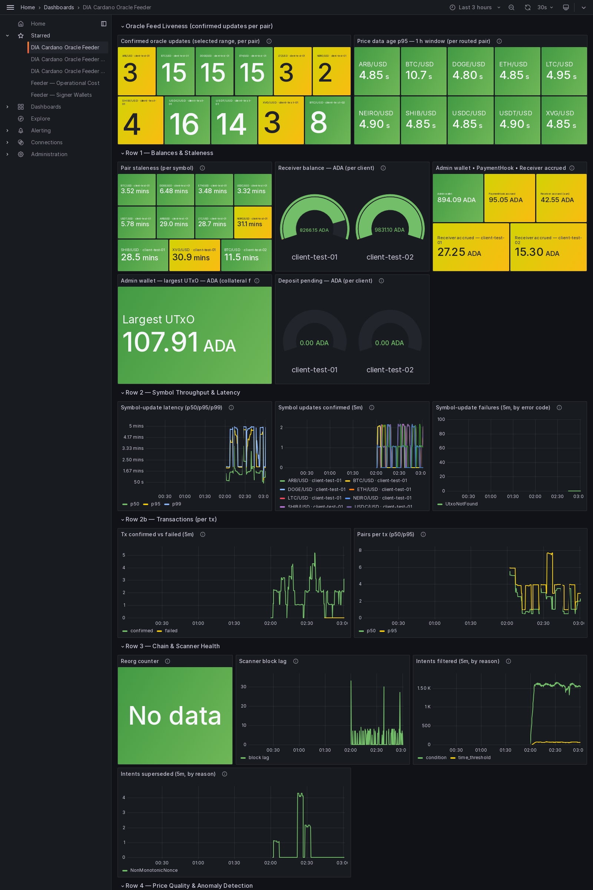
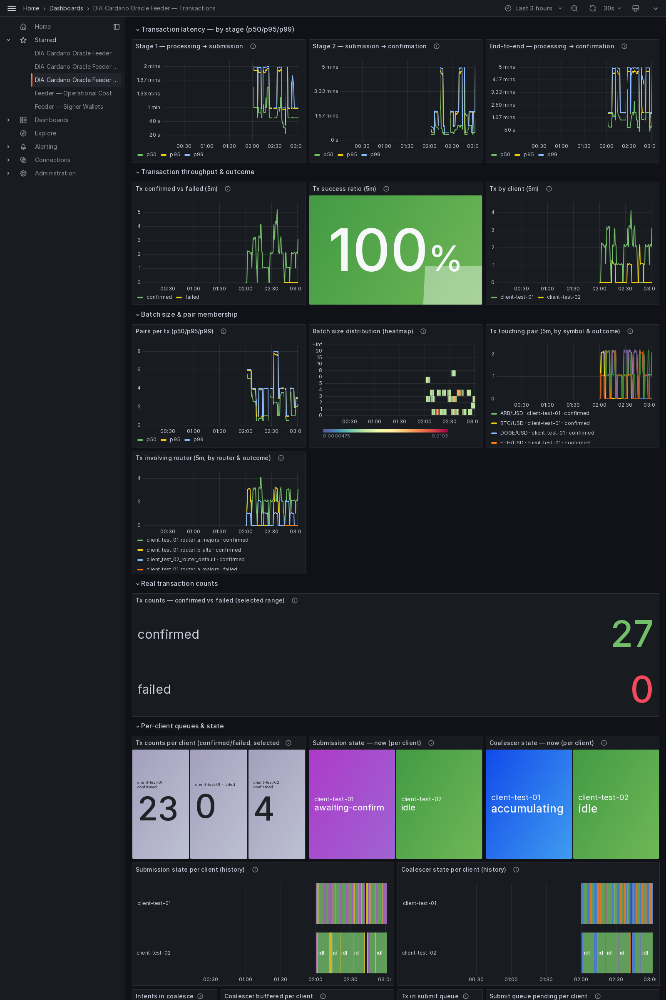
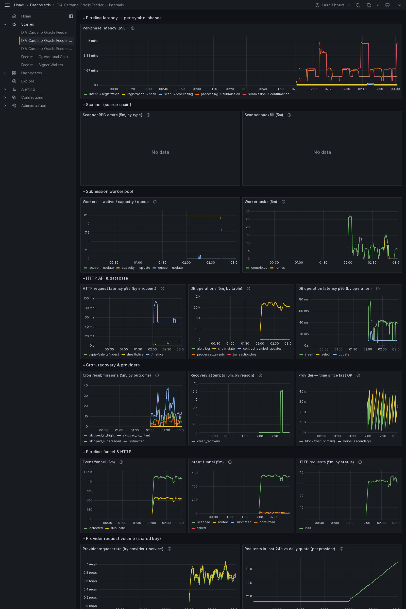
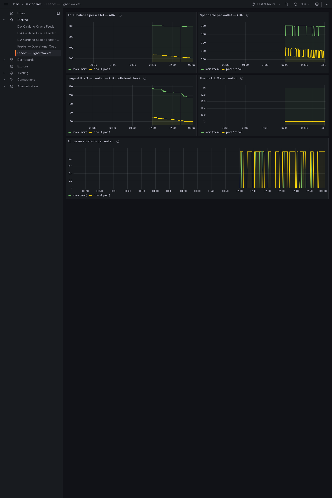
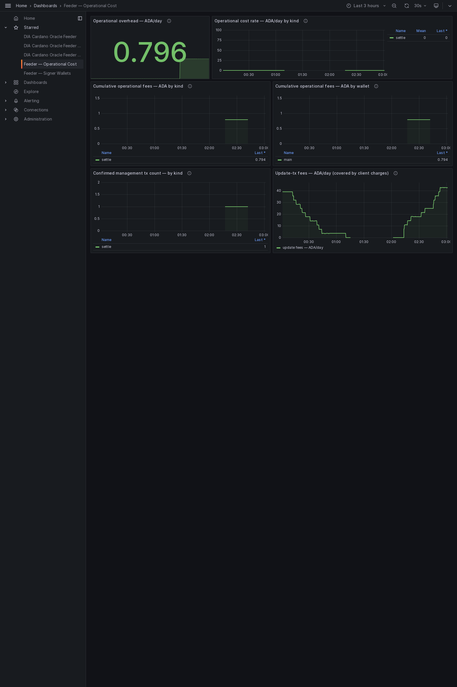

# Milestone 4 evidence — Preview

The consumer-facing **indexer** and the example **consumer contract** that reads
a DIA feed through it. Captured on Preview from run `preview_run_20260608-040304`.
Everything here is read-only: querying the chain and reading published values.

## Contents

- [What this shows](#what-this-shows)
- [Indexer — live queries](#indexer--live-queries)
- [A pair in full](#a-pair-in-full)
- [Consuming a feed — end-to-end](#consuming-a-feed--end-to-end)
- [Published feeds — policy ids](#published-feeds--policy-ids)
- [Provider-usage monitoring](#provider-usage-monitoring)
- [Dashboards](#dashboards)
- [How to reproduce](#how-to-reproduce)
- [Files in this pack](#files-in-this-pack)

## What this shows

A Cardano app reads a DIA price in two steps: ask the indexer for a pair (it
returns the latest value and the exact on-chain output to reference), then build
a transaction that references that output and is allowed or denied based on the
price. This pack shows both: the indexer answering live, and a real contract
accepting a fresh price and rejecting one that does not meet its threshold.

- **Indexer:** reachable; chain tip height 4427595; 17 live pair(s).
- **API reference:** captured (DIA Cardano Oracle Indexer API, 10 paths) — interactive UI at http://localhost:3001/docs.
- **Consumer demo (emulator):** PASSED.
- **Consumer demo (on-chain):** run separately — see below.

## Indexer — live queries

Every published pair the indexer reports, with the latest price and the output a
consumer references:

| Symbol | Price | Age (s) | Client | Pair UTxO (TxIn) |
| --- | --- | --- | --- | --- |
| ADA/USD | 751000000 | 1892715 | client-test-01 | 1d5ff45dc5342d31346e62c7e2dd013f93117f0ee6f5de5f4ab78677656a32ee#0 |
| BNB/USD | 61510000000 | 1892706 | client-test-01 | 1d5ff45dc5342d31346e62c7e2dd013f93117f0ee6f5de5f4ab78677656a32ee#1 |
| DAI/USD | 100100345 | 1892706 | client-test-01 | 1d5ff45dc5342d31346e62c7e2dd013f93117f0ee6f5de5f4ab78677656a32ee#2 |
| SOL/USD | 18510000000 | 1892706 | client-test-01 | 1d5ff45dc5342d31346e62c7e2dd013f93117f0ee6f5de5f4ab78677656a32ee#3 |
| XRP/USD | 521000000 | 1892706 | client-test-01 | 1d5ff45dc5342d31346e62c7e2dd013f93117f0ee6f5de5f4ab78677656a32ee#7 |
| MATIC/USD | 981000000 | 1892706 | client-test-01 | 1d5ff45dc5342d31346e62c7e2dd013f93117f0ee6f5de5f4ab78677656a32ee#8 |
| NEIRO/USD | 63466203772305 | 1855 | client-test-01 | 13c67ee2afd976dc6415462fd6927e305b7740d9876c7c686420e7a8b767acac#1 |
| XVG/USD | 2170804220000000 | 1846 | client-test-01 | 13c67ee2afd976dc6415462fd6927e305b7740d9876c7c686420e7a8b767acac#2 |
| LTC/USD | 42497723259999997952 | 1713 | client-test-01 | ab070f10566c3a04dc7914674c062cc2c55792f47e538b4381befb755520fc36#0 |
| SHIB/USD | 4228323892136 | 1699 | client-test-01 | ab070f10566c3a04dc7914674c062cc2c55792f47e538b4381befb755520fc36#1 |
| ARB/USD | 75893827960157600 | 1729 | client-test-01 | ab070f10566c3a04dc7914674c062cc2c55792f47e538b4381befb755520fc36#2 |
| DOGE/USD | 72415490215114904 | 380 | client-test-01 | 8e5ceac73177d2027daf45fbf0a1f45f09dcd73922f0afcac830454cf6567304#0 |
| USDT/USD | 998520000000000128 | 338 | client-test-01 | 8e5ceac73177d2027daf45fbf0a1f45f09dcd73922f0afcac830454cf6567304#1 |
| USDC/USD | 999623390350000000 | 190 | client-test-01 | d53a69a10e2109bd3b9098066ba0016536812e3baee727b52846b0e1c8fc5781#0 |
| ETH/USD | 1589316530412327010304 | 200 | client-test-01 | d53a69a10e2109bd3b9098066ba0016536812e3baee727b52846b0e1c8fc5781#1 |
| BTC/USD | 59877161187701122138112 | 202 | client-test-01 | d53a69a10e2109bd3b9098066ba0016536812e3baee727b52846b0e1c8fc5781#2 |
| BTC/USD | 59834824139613845585920 | 681 | client-test-02 | 7bd18fffc592a3a3ca61ff9d0aa9bc67fc77af3c88854853c960376d17a0617f#0 |

Health response: [`indexer/health.json`](indexer/health.json) ·
all pairs: [`indexer/pairs.json`](indexer/pairs.json).

## A pair in full

One pair as the indexer returns it (`ADA/USD`) — note the policy id a
consumer uses to verify the feed is genuine, and the output to reference:

```json
{
  "symbol": "ADA/USD",
  "pairId": "4144412f555344",
  "pairPolicyId": "def5c14be6bceefb95769110a0c8c7d5362e58bf8f17b6ee1c1bd902",
  "price": "751000000",
  "timestamp": "1780895736",
  "nonce": "1780895736000",
  "signer": "2b1c7eff297766569966b630a6862947a8e5285a",
  "intentHash": "016c2f4a6c1767cbc205729d2f6b702d30a65266643a8372e72ebef277de07a9",
  "minUtxoLovelace": "5000000",
  "utxoRef": {
    "txHash": "1d5ff45dc5342d31346e62c7e2dd013f93117f0ee6f5de5f4ab78677656a32ee",
    "outputIndex": 0
  },
  "ageSeconds": 1892717,
  "clientId": "client-test-01"
}
```

## Consuming a feed — end-to-end

The example consumer contract reads the referenced price and unlocks only when it
meets the configured minimum. Two runs prove both directions.

**Emulator (offline, deterministic):**

```
==> [1/2] Compiling the example consumer validator (aiken build)…
    Compiling diadata-org/dia-cardano-oracle 0.0.0 (.)
    Compiling aiken-lang/stdlib v3.0.0 (./build/packages/aiken-lang-stdlib)
    Compiling aiken-lang/fuzz v2.2.0 (./build/packages/aiken-lang-fuzz)
   Generating project's blueprint (./plutus.json)
==> [2/2] Running the end-to-end consumer demo (Lucid emulator + indexer)…
1. Publishing the Pair UTxO (mint NFT + inline PairDatum)…
2. Indexer reports BTC/USD: price=65000000000 at e61da76733026f11f68489a47d312afb8318ec91db45784cd40e98cbc5bc385b#0
3. Trying to spend (min_price < feed price)…
3. Trying to spend (min_price > feed price)…
   → rejected: { Complete: "failed script execution Spend[0] the validator crashed / exited prematurely" }

=== RESULT ===
  spend with min_price < feed price → ACCEPTED ✓
  spend with min_price > feed price → REJECTED ✓
DEMO PASSED — the validator consumed our oracle price correctly.
```

**On-chain (Preview, real transactions):**

_Run `bash offchain/indexer/src/examples/run-consumer-demo-onchain.sh | tee onchain.txt` against Preview (indexer up + funded wallet), then re-run with `EVIDENCE_ONCHAIN_LOG=onchain.txt` to embed it here._

## Published feeds — policy ids

The public identifiers a consumer needs, grouped by client:

| Client | Pair policy id | Symbols |
| --- | --- | --- |
| client-test-01 | def5c14be6bceefb95769110a0c8c7d5362e58bf8f17b6ee1c1bd902 | ADA/USD, BNB/USD, DAI/USD, SOL/USD, XRP/USD, MATIC/USD, NEIRO/USD, XVG/USD, LTC/USD, SHIB/USD, ARB/USD, DOGE/USD, USDT/USD, USDC/USD, ETH/USD, BTC/USD |
| client-test-02 | 02435906b5bf2ebac57a72d8d5609aa7f642b5e0e4d79666e0b1a293 | BTC/USD |

## Provider-usage monitoring

The feeder and the indexer share one chain-provider key. Their combined usage is
tracked on one metric and shown on the Internals dashboard panel **Requests in
last 24h vs daily quota (per provider)**, with an alert that fires before the
daily quota is exhausted. The indexer's own usage is in
[`indexer/metrics.txt`](indexer/metrics.txt) (series `dia_bridge_provider_requests_total`).

## Dashboards

The five Grafana dashboards the feeder ships, rendered live: **Overview**,
**Transactions**, **Internals**, **Signer Wallets** (the multi-wallet signer
pool), and **Operational Cost** (the ADA cost of the management txs). A full
render of each shows every panel; the panel-by-panel
reference is the dashboards guide,
[`docs/architecture/grafana-dashboards.md`](../../../architecture/grafana-dashboards.md).

### Overview dashboard



_Is each price feed alive, fresh, accurate and funded? A batch of N pairs counts as N symbol updates here._

### Transactions dashboard



_The per-transaction view: a batch of N pairs is ONE transaction. Stage latency, confirmed-vs-failed throughput, success ratio, batch size._

### Internals dashboard



_Feeder-internal observability: pipeline-phase latency, scanner, worker pools, DB, cron/recovery, provider health._

### Signer Wallets dashboard



_Per signer-wallet health for the multi-wallet pool: spendable balance, collateral floor (largest UTxO), usable-UTxO count, and active arbiter reservations. With no pool configured this shows the single `main` wallet._

### Operational Cost dashboard



_What it costs to run the system: ADA fees of the management txs (settle, withdraw, main→pool funding, defrag, wallet shaping, standalone deposit merge) by kind and signer wallet, with update fees alongside for the net-cost picture. Preview values are illustrative; Mainnet carries the real numbers._


## How to reproduce

```sh
cd offchain && make up                 # feeder + indexer
curl -s localhost:3001/v1/pairs | jq   # the table above
#  open http://localhost:3001/docs     # the API reference

# the consumption demo (offline):
bash offchain/indexer/src/examples/run-consumer-demo-emulator.sh
# and on Preview (indexer up + funded wallet in offchain/indexer/.env):
bash offchain/indexer/src/examples/run-consumer-demo-onchain.sh
```

## Files in this pack

| Path | Contents |
| --- | --- |
| `indexer/health.json`      | Indexer health: chain tip + live pair count. |
| `indexer/pairs.json`       | Every published pair (latest value + reference output). |
| `indexer/sample-pair.json` | One pair in full (price, policy id, reference output). |
| `indexer/sample-utxo.json` | Just the TxIn a consumer references. |
| `indexer/openapi.json`     | The API schema behind `/docs`. |
| `indexer/metrics.txt`      | The indexer's chain-provider request counts. |
| `consumer-demo/emulator.txt` | The offline end-to-end consumer demo run. |
| `consumer-demo/onchain.txt`  | The on-chain consumer demo run (when embedded). |
| `dashboards/*.png`           | The five Grafana dashboards rendered live (Overview, Transactions, Internals, Signer Wallets, Operational Cost). |
