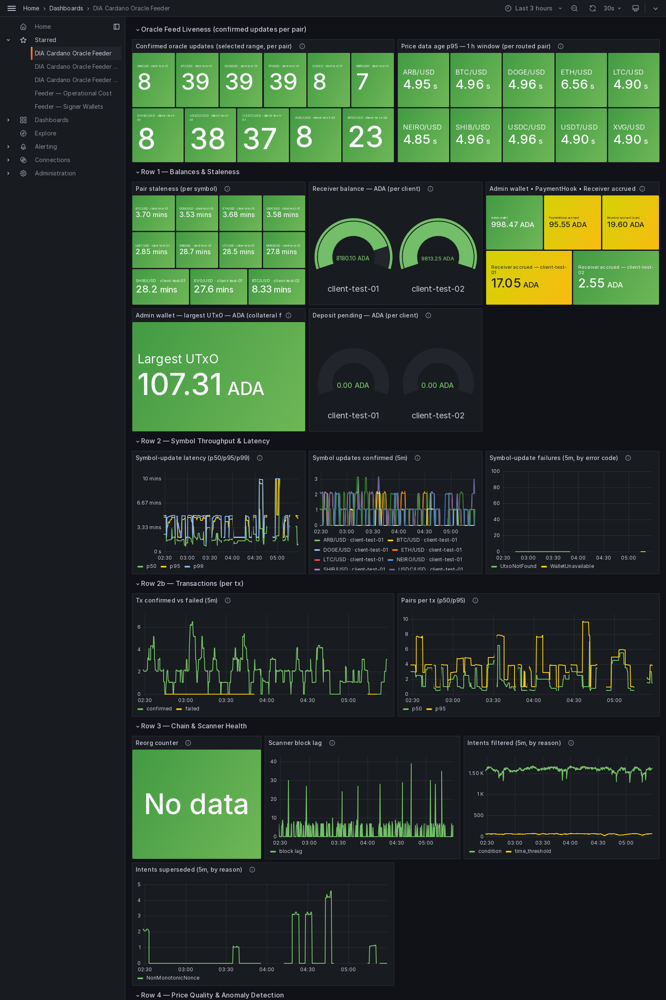
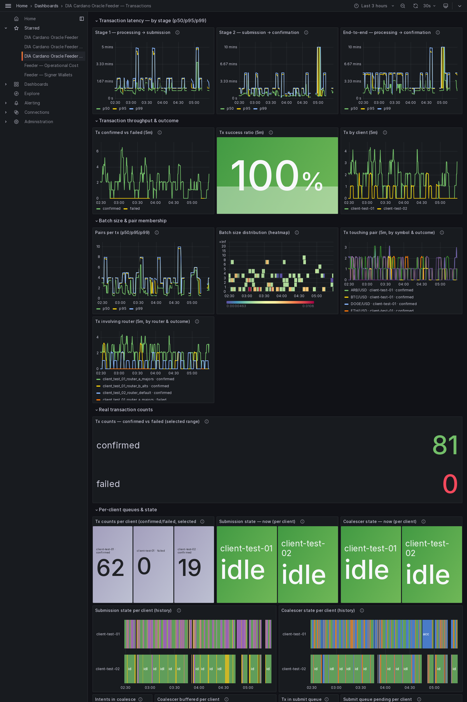
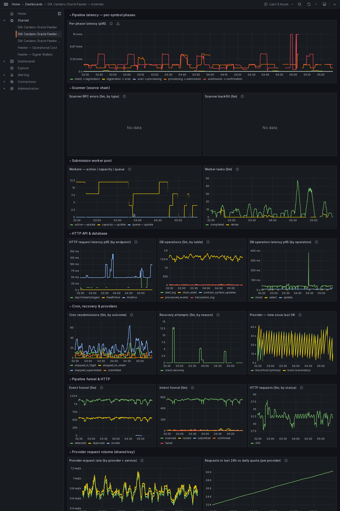
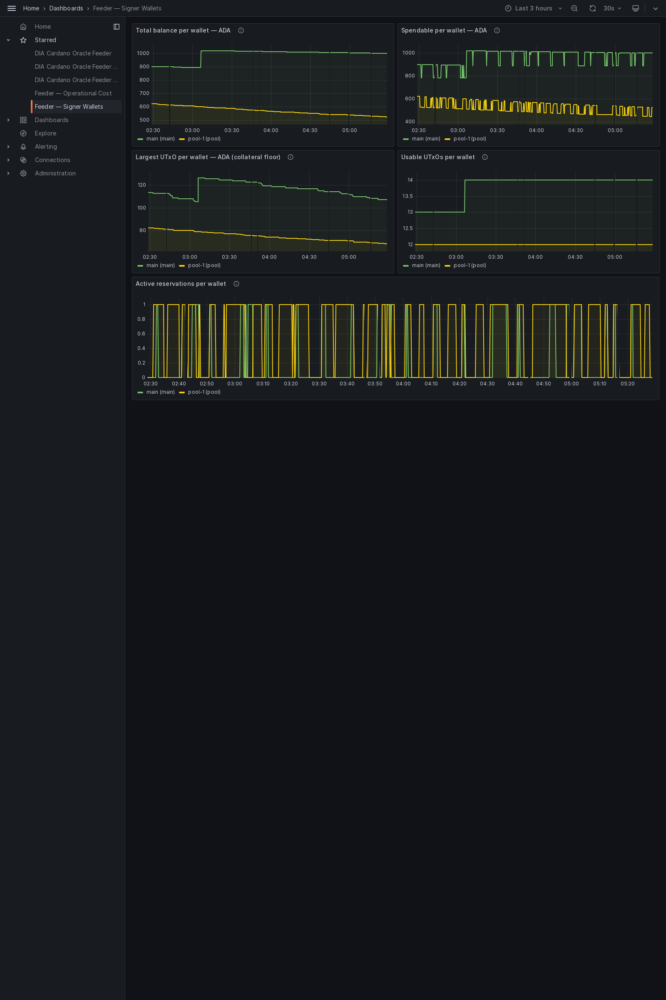
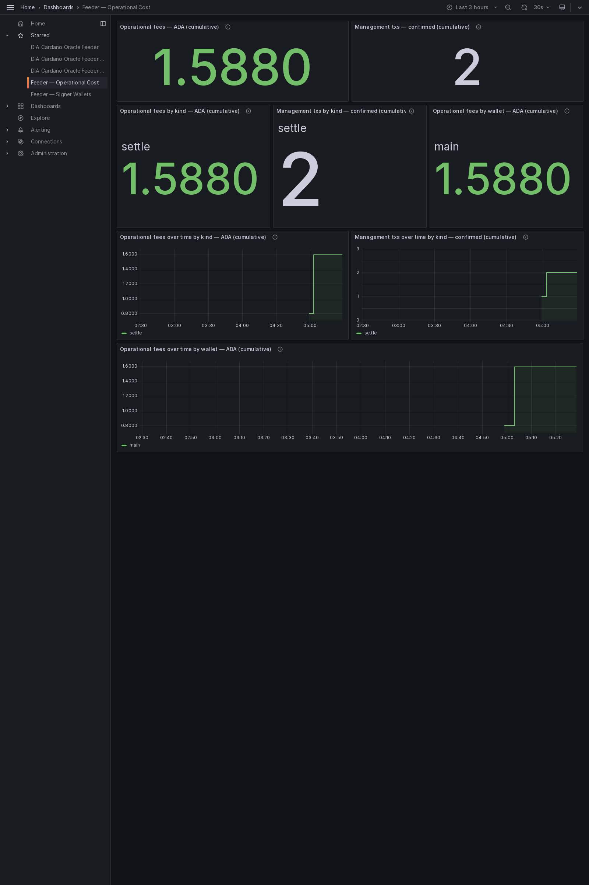

# Milestone 4 evidence — Preview

The consumer-facing **indexer** and the example **consumer contract** that reads
a DIA feed through it. Captured on Preview from run `preview_run_20260608-040304`.
Everything here is read-only: querying the chain and reading published values.

## Contents

- [What this shows](#what-this-shows)
- [Indexer — live queries](#indexer--live-queries)
- [A pair in full](#a-pair-in-full)
- [Consuming a feed — end-to-end](#consuming-a-feed--end-to-end)
- [Published feeds — policy ids](#published-feeds--policy-ids)
- [Provider-usage monitoring](#provider-usage-monitoring)
- [Dashboards](#dashboards)
- [How to reproduce](#how-to-reproduce)
- [Files in this pack](#files-in-this-pack)

## What this shows

A Cardano app reads a DIA price in two steps: ask the indexer for a pair (it
returns the latest value and the exact on-chain output to reference), then build
a transaction that references that output and is allowed or denied based on the
price. This pack shows both: the indexer answering live, and a real contract
accepting a fresh price and rejecting one that does not meet its threshold.

- **Indexer:** reachable; chain tip height 4427833; 17 live pair(s).
- **API reference:** captured (DIA Cardano Oracle Indexer API, 10 paths) — interactive UI at http://localhost:3001/docs.
- **Consumer demo (emulator):** PASSED.
- **Consumer demo (on-chain):** embedded below.

## Indexer — live queries

Every published pair the indexer reports, with the latest price and the output a
consumer references:

| Symbol | Price | Age (s) | Client | Pair UTxO (TxIn) |
| --- | --- | --- | --- | --- |
| ADA/USD | 751000000 | 1901556 | client-test-01 | 1d5ff45dc5342d31346e62c7e2dd013f93117f0ee6f5de5f4ab78677656a32ee#0 |
| BNB/USD | 61510000000 | 1901547 | client-test-01 | 1d5ff45dc5342d31346e62c7e2dd013f93117f0ee6f5de5f4ab78677656a32ee#1 |
| DAI/USD | 100100345 | 1901547 | client-test-01 | 1d5ff45dc5342d31346e62c7e2dd013f93117f0ee6f5de5f4ab78677656a32ee#2 |
| SOL/USD | 18510000000 | 1901547 | client-test-01 | 1d5ff45dc5342d31346e62c7e2dd013f93117f0ee6f5de5f4ab78677656a32ee#3 |
| XRP/USD | 521000000 | 1901547 | client-test-01 | 1d5ff45dc5342d31346e62c7e2dd013f93117f0ee6f5de5f4ab78677656a32ee#7 |
| MATIC/USD | 981000000 | 1901547 | client-test-01 | 1d5ff45dc5342d31346e62c7e2dd013f93117f0ee6f5de5f4ab78677656a32ee#8 |
| LTC/USD | 42478887000000000000 | 1690 | client-test-01 | 9ada311dfab616f1fd85c2ad41e4216a01e5cb3caddf89932293fbbd64e1bd31#0 |
| ARB/USD | 75882113175000008 | 1705 | client-test-01 | 9ada311dfab616f1fd85c2ad41e4216a01e5cb3caddf89932293fbbd64e1bd31#3 |
| SHIB/USD | 4247131503875 | 1676 | client-test-01 | b73d6a0c5ff587e27b6cb0e3022ad36df18d12005a18a2bc2ff30da82c6ee8b0#2 |
| NEIRO/USD | 63058803837500 | 1651 | client-test-01 | b73d6a0c5ff587e27b6cb0e3022ad36df18d12005a18a2bc2ff30da82c6ee8b0#4 |
| XVG/USD | 2189310277500000 | 1640 | client-test-01 | b73d6a0c5ff587e27b6cb0e3022ad36df18d12005a18a2bc2ff30da82c6ee8b0#5 |
| USDC/USD | 999567900000000128 | 197 | client-test-01 | 822f29ec44b7ccab52e70fefc8e8fbe30ec576b94021b1cd712e407faaa39467#0 |
| DOGE/USD | 72327921750000008 | 194 | client-test-01 | 822f29ec44b7ccab52e70fefc8e8fbe30ec576b94021b1cd712e407faaa39467#1 |
| ETH/USD | 1586241776727478239232 | 203 | client-test-01 | 822f29ec44b7ccab52e70fefc8e8fbe30ec576b94021b1cd712e407faaa39467#2 |
| BTC/USD | 59394387518750002774016 | 204 | client-test-01 | 822f29ec44b7ccab52e70fefc8e8fbe30ec576b94021b1cd712e407faaa39467#3 |
| USDT/USD | 998332500000000000 | 153 | client-test-01 | 8e36f05bcf2786f69075cbe5148a022b830f7ac672327608cfb8cc4ec3ae1459#0 |
| BTC/USD | 59414839712959816531968 | 482 | client-test-02 | 1fbce834c9e913856c7dc367baf7f77c2457ac0cf8b9f0701ce9024b791d5e7b#0 |

Health response: [`indexer/health.json`](indexer/health.json) ·
all pairs: [`indexer/pairs.json`](indexer/pairs.json).

## A pair in full

One pair as the indexer returns it (`ADA/USD`) — note the policy id a
consumer uses to verify the feed is genuine, and the output to reference:

```json
{
  "symbol": "ADA/USD",
  "pairId": "4144412f555344",
  "pairPolicyId": "def5c14be6bceefb95769110a0c8c7d5362e58bf8f17b6ee1c1bd902",
  "price": "751000000",
  "timestamp": "1780895736",
  "nonce": "1780895736000",
  "signer": "2b1c7eff297766569966b630a6862947a8e5285a",
  "intentHash": "016c2f4a6c1767cbc205729d2f6b702d30a65266643a8372e72ebef277de07a9",
  "minUtxoLovelace": "5000000",
  "utxoRef": {
    "txHash": "1d5ff45dc5342d31346e62c7e2dd013f93117f0ee6f5de5f4ab78677656a32ee",
    "outputIndex": 0
  },
  "ageSeconds": 1901558,
  "clientId": "client-test-01"
}
```

## Consuming a feed — end-to-end

The example consumer contract reads the referenced price and unlocks only when it
meets the configured minimum. Two runs prove both directions.

**Emulator (offline, deterministic):**

```
==> [1/2] Compiling the example consumer validator (aiken build)…
    Compiling diadata-org/dia-cardano-oracle 0.0.0 (.)
    Compiling aiken-lang/stdlib v3.0.0 (./build/packages/aiken-lang-stdlib)
    Compiling aiken-lang/fuzz v2.2.0 (./build/packages/aiken-lang-fuzz)
   Generating project's blueprint (./plutus.json)
==> [2/2] Running the end-to-end consumer demo (Lucid emulator + indexer)…
1. Publishing the Pair UTxO (mint NFT + inline PairDatum)…
2. Indexer reports BTC/USD: price=65000000000 at 9cc8363dd6d66cedfc7782c08ee7f397dd508b0c801fd129384bcd4b3a9e4683#0
3. Trying to spend (min_price < feed price)…
3. Trying to spend (min_price > feed price)…
   → rejected: { Complete: "failed script execution Spend[0] the validator crashed / exited prematurely" }

=== RESULT ===
  spend with min_price < feed price → ACCEPTED ✓
  spend with min_price > feed price → REJECTED ✓
DEMO PASSED — the validator consumed our oracle price correctly.
```

**On-chain (Preview, real transactions):**

```
==> [1/2] Compiling the example consumer validator (aiken build)…
==> [2/2] Running the on-chain consumer demo (real network + indexer)…
Wallet addr_test1qpgpsm75w7l9u6au7shqzsaulrtxz2gp6xw9zhun70es6tt4t3wsjavx26kmh586erf8xxhqc2y7urq5az32sjv56nyqquxj3j
  balance: 1552995391 lovelace (1552.995391 ADA) across 16 UTxO(s)
Consumer demo on Preview — reading BTC/USD from the indexer (http://localhost:3001)…
Indexer: BTC/USD price=61484881211046076874752 utxo=773c5d9eda4b77f1e9f7f0a81d312a692c8a8e16f682f7142e0005d6acd76b03#2 policy=def5c14be6bceefb95769110a0c8c7d5362e58bf8f17b6ee1c1bd902

1) Expecting REJECT — lock with min_price ABOVE the live price…
   locking 5000000 lovelace (min_price > price)…
   lock: submitted e7645054f056fed063cde820b040155b223c65e4134e6e838b6b5a1b3e4392c2 — awaiting confirmation…
   locked; tx e7645054f056fed063cde820b040155b223c65e4134e6e838b6b5a1b3e4392c2
   spend REJECTED: { Complete: "failed script execution Spend[0] the validator crashed / exited prematurely" }

2) Expecting ACCEPT — lock with min_price BELOW the live price…
   locking 5000000 lovelace (min_price < price)…
   lock: submitted 2ca18fd2c36b4f041367126087f52368e0a561ddc32fd5f06e4293bd08bf5c20 — awaiting confirmation…
   lock: not confirmed — refetching wallet + rebuilding (attempt 2/4)…
   lock: submitted 63bd70e541959ca49c22ba80cabc9126c84beb659b29718ab21f9c569b574450 — awaiting confirmation…
   locked; tx 63bd70e541959ca49c22ba80cabc9126c84beb659b29718ab21f9c569b574450
   spend: submitted 6dafd23764c09562cc2e7b7c2323005fc63c9d84ebe6c82bcc4d2b131e4abbfc — awaiting confirmation…
   spend ACCEPTED; tx 6dafd23764c09562cc2e7b7c2323005fc63c9d84ebe6c82bcc4d2b131e4abbfc

=== RESULT ===
  min_price > live price → REJECTED ✓
  min_price < live price → ACCEPTED ✓
DEMO PASSED — the validator consumed the live oracle price correctly.
```

## Published feeds — policy ids

The public identifiers a consumer needs, grouped by client:

| Client | Pair policy id | Symbols |
| --- | --- | --- |
| client-test-01 | def5c14be6bceefb95769110a0c8c7d5362e58bf8f17b6ee1c1bd902 | ADA/USD, BNB/USD, DAI/USD, SOL/USD, XRP/USD, MATIC/USD, LTC/USD, ARB/USD, SHIB/USD, NEIRO/USD, XVG/USD, USDC/USD, DOGE/USD, ETH/USD, BTC/USD, USDT/USD |
| client-test-02 | 02435906b5bf2ebac57a72d8d5609aa7f642b5e0e4d79666e0b1a293 | BTC/USD |

## Provider-usage monitoring

The feeder and the indexer share one chain-provider key. Their combined usage is
tracked on one metric and shown on the Internals dashboard panel **Requests in
last 24h vs daily quota (per provider)**, with an alert that fires before the
daily quota is exhausted. The indexer's own usage is in
[`indexer/metrics.txt`](indexer/metrics.txt) (series `dia_bridge_provider_requests_total`).

## Dashboards

The five Grafana dashboards the feeder ships, rendered live: **Overview**,
**Transactions**, **Internals**, **Signer Wallets** (the multi-wallet signer
pool), and **Operational Cost** (the ADA cost of the management txs). A full
render of each shows every panel; the panel-by-panel
reference is the dashboards guide,
[`docs/architecture/grafana-dashboards.md`](../../../architecture/grafana-dashboards.md).

### Overview dashboard



_Is each price feed alive, fresh, accurate and funded? A batch of N pairs counts as N symbol updates here._

### Transactions dashboard



_The per-transaction view: a batch of N pairs is ONE transaction. Stage latency, confirmed-vs-failed throughput, success ratio, batch size._

### Internals dashboard



_Feeder-internal observability: pipeline-phase latency, scanner, worker pools, DB, cron/recovery, provider health._

### Signer Wallets dashboard



_Per signer-wallet health for the multi-wallet pool: spendable balance, collateral floor (largest UTxO), usable-UTxO count, and active arbiter reservations. With no pool configured this shows the single `main` wallet._

### Operational Cost dashboard



_What it costs to run the system: ADA fees of the management txs (settle, withdraw, main→pool funding, defrag, wallet shaping, standalone deposit merge) by kind and signer wallet. The top row is the cumulative snapshot; the time-series row below shows when each tx ran and how the cost grew._


## How to reproduce

```sh
cd offchain && make up                 # feeder + indexer
curl -s localhost:3001/v1/pairs | jq   # the table above
#  open http://localhost:3001/docs     # the API reference

# the consumption demo (offline):
bash offchain/indexer/src/examples/run-consumer-demo-emulator.sh
# and on Preview (indexer up + funded wallet in offchain/indexer/.env):
bash offchain/indexer/src/examples/run-consumer-demo-onchain.sh
```

## Files in this pack

| Path | Contents |
| --- | --- |
| `indexer/health.json`      | Indexer health: chain tip + live pair count. |
| `indexer/pairs.json`       | Every published pair (latest value + reference output). |
| `indexer/sample-pair.json` | One pair in full (price, policy id, reference output). |
| `indexer/sample-utxo.json` | Just the TxIn a consumer references. |
| `indexer/openapi.json`     | The API schema behind `/docs`. |
| `indexer/metrics.txt`      | The indexer's chain-provider request counts. |
| `consumer-demo/emulator.txt` | The offline end-to-end consumer demo run. |
| `consumer-demo/onchain.txt`  | The on-chain consumer demo run (when embedded). |
| `dashboards/*.png`           | The five Grafana dashboards rendered live (Overview, Transactions, Internals, Signer Wallets, Operational Cost). |
